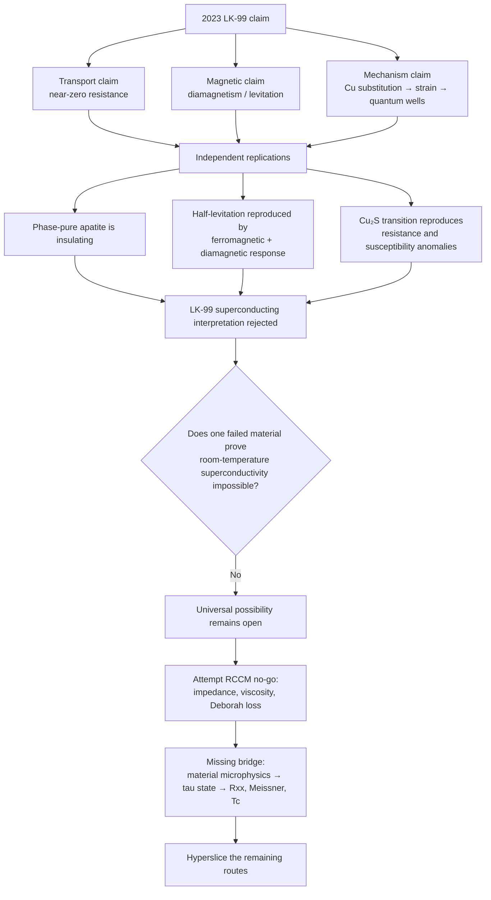

# LK-99, Room-Temperature Superconductivity, and What Tau Fluidics Can Actually Rule Out

**Status:** evidence review and RCCM falsification attempt, 2026-07-30  
**Interpretation:** “the room-temperature superconductor paper that went viral
on Twitter” means the July 2023 LK-99 preprints.

## Verdict first

There are two different targets:

| Target | Verdict | Why |
|---|---|---|
| **The 2023 claim that LK-99 is a room-temperature, ambient-pressure superconductor** | **Strongly invalidated** | Phase-pure and LK-99-like replications found insulating transport, ordinary diamagnetism plus ferromagnetism, no convincing Meissner transition, and no zero-resistance state. Cu₂S impurity behavior reproduces the transition-shaped anomalies. |
| **The possibility that some material could superconduct at room temperature and ambient pressure** | **Not invalidated** | One failed material does not prove a universal impossibility. Current RCCM does not contain a material-specific transport theory or a derived upper bound on \(T_c\). |
| **The claim that RCCM predicts such a superconductor** | **Not established** | RCCM has suggestive ideas—phase lock, persistent circulation, impedance, viscoelastic storage—but no superconducting state equation or prospective material prediction. |

The clean conclusion is:

> **LK-99 is not credible evidence for room-temperature superconductivity. Tau
> fluidics also cannot prove that room-temperature superconductivity is
> impossible.**

“Not impossible” is not evidence that the phenomenon exists. It is simply the
correct boundary of the current argument.

## The terrain



The key boundary is between a **specimen verdict** and a **law-of-nature
verdict**. Experiments can kill the LK-99 interpretation. To kill every possible
room-temperature superconductor requires a universal theorem spanning every
admissible material and pairing mechanism.

## 1. What a superconductor actually is

### The spatial picture

An ordinary conductor is like a road full of moving charge that continually
hands momentum to the lattice, defects, and other excitations. Electrical work
becomes heat.

A superconductor is a different macroscopic state. Its mobile degrees of
freedom share a coherent phase. In a conventional superconductor the relevant
objects are Cooper pairs; unconventional superconductors may obtain the
collective state through a different microscopic interaction. The important
point is not “electrons move very easily.” It is that the material crosses into
a distinct collective state with a protected current response.

### The measurement gates

No single dramatic observation is enough. A strong claim connects several
independent gates on the **same identified material phase**:

1. **Transport:** a four-terminal measurement drives the longitudinal
   resistance below a well-characterized experimental bound.
2. **Magnetism:** the material shows superconducting shielding or Meissner-like
   flux exclusion, with sample geometry and background magnetism accounted for.
3. **Critical surface:** the transition moves coherently with temperature,
   applied field, and current; sufficiently large \(T\), \(H\), or \(J\)
   destroys the state.
4. **Phase and structure:** diffraction and chemical analysis identify which
   material phase carries the response.
5. **Cross-checks where feasible:** heat capacity, AC susceptibility, flux
   quantization, persistent current, or Josephson behavior support the same
   transition.

Experiment never measures the mathematical number \(R=0\) with infinite
precision. It establishes an upper bound and then checks whether the complete
transition behaves like superconductivity rather than an instrumental floor,
metallic shunt, structural phase change, magnetic grain, or percolation path.

Levitation is especially seductive and especially unsafe. Ferromagnets,
ordinary diamagnets, eddy-current systems, and geometrically tilted fragments
can all move or partly lift near a magnet. Type-II superconducting levitation
has a much richer field, hysteresis, shielding, and flux-pinning structure than
“a black flake stands up.” NIST gives a concise official account of
[Meissner expulsion, flux vortices, and pinning](https://www.nist.gov/ncnr/flux-lattice-superconductors-and-melting).

## 2. What the LK-99 papers claimed

### Material and recipe

The authors described copper-substituted lead oxyapatite,

\[
Pb_{10-x}Cu_x(PO_4)_6O,\qquad x\approx0.9\text{–}1.0,
\]

and named it **LK-99**.

The first preprint’s recipe mixed lanarkite and \(Cu_3P\), sealed the mixture
under vacuum, and reacted it at \(925^\circ\mathrm C\) for ten hours. That
relative simplicity helped the claim spread: unlike a diamond-anvil hydride
experiment, the synthesis looked reachable by many solid-state laboratories
and unusually ambitious hobbyists.

### Claimed observations

The first preprint reported:

- \(T_c\ge400\ \mathrm K\), or at least \(127^\circ\mathrm C\);
- bulk resistivities in the range \(10^{-6}\) to \(10^{-9}\ \Omega\cdot
  \mathrm{cm}\);
- a thin-film resistivity around \(10^{-10}\) to
  \(10^{-11}\ \Omega\cdot\mathrm{cm}\);
- negative DC magnetization up to 400 K;
- critical-current and critical-field behavior;
- a Meissner interpretation;
- partial magnetic levitation.

These are claims reported in
[*The First Room-Temperature Ambient-Pressure Superconductor*](https://arxiv.org/abs/2307.12008),
not independently accepted measurements.

The proposed mechanism was:

```text
Cu²⁺ replaces larger Pb²⁺
→ unit-cell volume shrinks by about 0.48%
→ internal structural stress distorts a cylindrical Pb–O region
→ superconducting quantum wells form at interfaces
→ tunneling between wells produces zero resistance
```

The companion preprint described an insulator-to-metal transition and a
one-dimensional BR-BCS mechanism. These were mechanism proposals built on the
claimed observations, not independent demonstrations that the observations
were superconducting.

### Why it went viral

The claim combined four high-energy ingredients:

- the technological “holy grail” of lossless power at ordinary conditions;
- an apparently simple synthesis;
- a levitation video that could be understood without a graph;
- open preprints that let laboratories, theorists, and social media respond in
  real time.

The viral loop was scientifically useful once it turned into replication.
Theorists quickly found interesting flat-band possibilities, but a calculated
band structure only says a mechanism may be worth testing. It cannot determine
what phase was actually in a furnace product or whether that phase
superconducts.

## 3. How the LK-99 interpretation failed

### The impurity occupied the same temperature coordinate

The original X-ray data contained \(Cu_2S\). Copper sulfide undergoes a known
first-order structural/superionic transition close to
\(104^\circ\mathrm C\), almost exactly where the LK-99 resistance anomaly
appeared.

Independent work then made the stronger move: it measured \(Cu_2S\) and
LK-99/\(Cu_2S\) mixtures. The mixtures produced:

- a sharp resistance change near 385–400 K;
- thermal hysteresis characteristic of a first-order transition;
- a susceptibility anomaly;
- **no zero-resistance state**.

Changing the amount of \(Cu_2S\) changed the strength of the effect. This is a
causal handle, not merely a visual resemblance
([Zhu et al., *Matter*](https://doi.org/10.1016/j.matt.2023.11.001)).

### Phase-pure crystals moved the other way

Puphal and collaborators synthesized phase-pure single crystals with
\(x\sim1\). From 2 K to 800 K they found:

- highly insulating, optically transparent crystals;
- ordinary diamagnetic response with a small ferromagnetic component;
- no transition anomaly indicating superconductivity.

The cleaner the target phase became, the less it resembled the viral claim
([Puphal et al., *APL Materials*](https://doi.org/10.1063/5.0172755)).

### Levitation survived while superconductivity disappeared

Wang and collaborators produced LK-99-like fragments that half-levitated at
room temperature. Those fragments were still electrically insulating. Magnetic
measurements showed a ferromagnetic component superposed on a diamagnetic
background, not a superconducting Meissner state
([Wang et al., *Quantum Frontiers*](https://doi.org/10.1007/s44214-023-00035-z)).

This is a particularly strong falsifier of the social-media inference:

```text
half-levitation observed
AND zero resistance absent
AND Meissner signal absent
→ half-levitation is not sufficient evidence
```

### The strongest experimental verdict

Habamahoro and collaborators later reported reproducing the electrical and
magnetic **anomalies** associated with the original claim while tying them to
the \(Cu_2S\) structural transition rather than superconductivity
([*Superconductor Science and Technology*](https://doi.org/10.1088/1361-6668/ad2b78)).

That closes the explanatory loop:

```text
headline anomalies reproduced
+ superconductivity not reproduced
+ impurity mechanism independently manipulated
= LK-99 interpretation strongly invalidated
```

This verdict applies to the 2023 superconducting interpretation of the studied
lead-apatite products. A future, genuinely different phase or composition would
be a new claim requiring a new evidence bundle; it would not retroactively
validate the 2023 papers.

## 4. Why this does not make room-temperature superconductivity impossible

The logical form matters:

\[
\text{LK-99 is not a room-temperature superconductor}
\not\Rightarrow
\text{no room-temperature superconductor can exist}.
\]

Experiments have already pushed superconductivity far above older expectations:

- \(H_3S\) showed
  [superconductivity at 203 K](https://doi.org/10.1038/nature14964) under high
  pressure.
- \(LaH_{10}\) showed
  [superconductivity around 250 K](https://doi.org/10.1038/s41586-019-1201-8)
  at roughly 170 GPa.
- In 2026, pressure-quenched
  \(HgBa_2Ca_2Cu_3O_{8+\delta}\) reached a reported
  [ambient-pressure record of 151 K](https://doi.org/10.1073/pnas.2536178123).

None of these is a practical room-temperature, ambient-pressure
superconductor. They do show that the frontier is set by material structure,
interactions, metastability, and pressure—not by a demonstrated universal law
placing \(T_c\) far below 300 K.

## 5. The tau-fluidic invalidation attempt

The correct target theorem would be:

> For every ambient-pressure material state at \(T\ge300\ \mathrm K\), every
> nonzero longitudinal electrical current has strictly positive
> time-averaged dissipation.

If RCCM derived that statement from independently tested premises, it would
rule out room-temperature superconductivity. Four candidate attacks appear in
the current corpus.

### Attack A: the Deborah loss angle

RCCM defines

\[
De=\alpha\frac{E}{m_ec^2}
\]

and a Maxwell-like complex modulus

\[
G^*=
\mu_s\frac{De^2}{1+De^2}
+i\mu_s\frac{De}{1+De^2},
\qquad
\tan\delta=\frac{G''}{G'}=\frac1{De}.
\]

These equations are in
[`RCCM-Condensed.tex`, lines 1627–1679](RCCM-Condensed.tex#L1627-L1679).

#### The tempting move

Insert thermal energy \(E=k_BT\). At 300 K,

\[
k_BT\approx0.025852\ \mathrm{eV},
\]

so with \(\alpha\approx1/137\) and \(m_ec^2\approx511\,000\ \mathrm{eV}\),

\[
De\approx3.69\times10^{-10},
\qquad
\tan\delta\approx2.71\times10^9.
\]

That looks like an overwhelmingly viscous response. Setting \(De=1\) would
instead require

\[
E\approx70.0\ \mathrm{MeV}
\quad\Longleftrightarrow\quad
T\approx8.13\times10^{11}\ \mathrm K
\]

under the same \(E=k_BT\) substitution.

#### Why the move fails

1. RCCM defines \(E\) as an interaction/kinematic energy in a proposed
   vacuum-rheology construction. It does not derive \(E=k_BT\) for charge
   transport in a crystal.
2. Cooling would make \(De\) smaller and \(1/De\) larger, producing the wrong
   qualitative route if the ratio were read directly as electrical loss.
3. A divergent **ratio** is not divergent absolute loss. As \(De\to0\),

   \[
   G'\sim\mu_sDe^2\to0,
   \qquad
   G''\sim\mu_sDe\to0.
   \]

   The loss term dominates the even smaller storage term, but neither becomes
   an electrical resistivity.
4. \(G^*(\omega)\) describes a harmonic rheological response. A persistent DC
   supercurrent is not automatically classified by a finite-frequency loss
   tangent.

This attack is dimensionally legal but semantically untyped.

### Attack B: positive tau viscosity

RCCM proposes

\[
\mu=\frac12\frac{\rho_\tau\hbar}{m}
=\frac12\rho_\tau cL
\]

in
[`RCCM-Condensed.tex`, lines 2082–2133](RCCM-Condensed.tex#L2082-L2133).

It is tempting to say:

```text
positive viscosity
→ every tau flow loses energy
→ every electrical current has resistance
→ superconductivity is impossible
```

But the actual RCCM momentum equation inserts viscosity through

\[
\alpha_{\circlearrowleft}\nu\nabla^2\mathbf v,
\]

as shown in
[`RCCM-Condensed.tex`, lines 2338–2364](RCCM-Condensed.tex#L2338-L2364).

The coefficient can be positive while the operator vanishes:

\[
\nabla^2\mathbf v=0
\quad\Longrightarrow\quad
\alpha_{\circlearrowleft}\nu\nabla^2\mathbf v=0.
\]

A uniform flow along a periodic route, a harmonic flow, or a specially
protected collective mode can lie in this kernel. Positive viscosity therefore
does not prove strictly positive dissipation for every admissible current.

### Attack C: the quantum resistance \(h/q^2\)

RCCM identifies

\[
Z_{\tau(\perp)}=\frac{h}{q^2}\equiv R_K
\]

as a transverse/topological quantum impedance in
[`RCCM-Condensed.tex`, lines 1877–1889](RCCM-Condensed.tex#L1877-L1889).

The type error is easier to see in TypeScript:

```ts
type Ohm = number & { readonly unit: "ohm" }

type TransverseTopologicalImpedance =
  Ohm & { readonly observable: "R_K" }

type LongitudinalBulkResistance =
  Ohm & { readonly observable: "R_xx" }

interface MaterialState {
  readonly composition: string
  readonly temperatureK: number
  readonly pressurePa: number
}

declare const rK: TransverseTopologicalImpedance

// Missing physical adapter:
declare const toLongitudinalBulkResistance:
  (z: TransverseTopologicalImpedance, material: MaterialState) =>
    LongitudinalBulkResistance
```

Both values use ohms. That does not make them the same observable. RCCM supplies
no material adapter that maps its transverse topological limit to a finite
sample’s four-probe longitudinal resistance.

Type compatibility is not semantic identity.

### Attack D: room-temperature turbulence destroys phase

RCCM calls thermal behavior stochastic longitudinal acoustic buffeting of the
tau medium. One could hypothesize that room-temperature lattice motion shakes
any phase-locked current apart.

That hypothesis is scientifically reasonable to test. It is not yet a result
of RCCM. The corpus does not provide:

- a material lattice displacement field;
- a carrier or condensate order parameter;
- a coupling between that order parameter and thermal tau fluctuations;
- a noise spectrum or statistical ensemble;
- a decoherence/phase-slip rate;
- a condition equating that rate to a derived \(T_c\).

Without those pieces, “thermal buffeting” is a picture, not a bound.

### Internal counterexample: RCCM permits lossless circulation

The no-go attempt finally collides with RCCM’s own text. At a proposed
high-\(De\), zero-admittance boundary, the document says that internal
circulation encounters **zero kinematic resistance**; see
[`RCCM-Condensed.tex`, lines 1851–1861](RCCM-Condensed.tex#L1851-L1861).

That does not prove superconductivity. It does prove that “all tau flow must
dissipate” is not an axiom consistently available to the no-go argument.

## 6. Hyperslice: every open RCCM route found

The universal claim is the hyperblob:

> all RCCM-compatible current-carrying material states at \(T\ge300\ \mathrm K\).

Each razor divides that blob. A universal invalidation must close both halves.

| Razor | Blob A | Blob B | Why the impossibility proof leaks |
|---|---|---|---|
| **Claim scope** | LK-99 | Any possible material | A failed specimen occupies only Blob A. |
| **Response geometry** | Longitudinal \(R_{xx}\) | Transverse/topological impedance | RCCM’s \(h/q^2\) equation lives in Blob B and does not determine Blob A. |
| **Flow texture** | \(\nabla^2\mathbf v\ne0\) | \(\nabla^2\mathbf v=0\) | Positive viscosity acts in Blob A; a kernel remains in Blob B. |
| **Carrier organization** | Independent scattering carriers | Collective phase-locked flow | Single-carrier drag does not cover a condensate-like collective state. |
| **Topology** | Open/relaxing trajectory | Closed/pinned/persistent circulation | RCCM itself places stable zero-resistance circulation in Blob B. |
| **Thermal bridge** | Derived \(T\)-to-response coupling | \(E=k_BT\) inserted by analogy | Current RCCM occupies Blob B. |
| **Frequency** | AC harmonic response | DC persistent current | \(G^*(\omega)\) does not automatically classify the DC branch. |
| **Channel count** | One dissipative channel | Normal plus protected channels | Nonzero loss somewhere does not forbid a zero-resistance eigenchannel. |
| **Spatial support** | Bulk state | Interface, filament, or grain state | Bulk parameters do not close interface matching or percolation. |
| **Magnetism** | Superconducting shielding/Meissner response | Ferro/ordinary-dia motion | LK-99’s levitation mainly landed in Blob B. |
| **Model status** | Closed forward model | Analogy and identity dictionary | RCCM’s materials layer is presently Blob B. |
| **Evidence status** | Prospective holdout prediction | Post-hoc mapping | A no-go gains force only after surviving known superconductors and protected tests. |

### Two important squares

#### Geometry × texture

| | Gradient-bearing flow | Laplacian-free flow |
|---|---|---|
| **Longitudinal** | ordinary dissipative transport can live here | a lossless longitudinal solution remains open |
| **Transverse/topological** | moving vortices can dissipate | pinned or quantized response can persist |

The viscosity and \(h/q^2\) attacks cover cells in this square. Neither covers
the square.

#### Evidence × scope

| | LK-99 | Any room-temperature material |
|---|---|---|
| **Observed failure** | Filled | No universal experiment can fill this cell |
| **Observed success** | Empty on present independent evidence | Empty at ambient pressure near 300 K |

The lower-right cell is an empirical unknown. An empty cell is not proof that
the cell is forbidden.

### Value inversion

- **Finite loss is useful for RCCM:** if derived, it could become a measurable
  decay law.
- **Lossless flow is dangerous for RCCM:** without formation and stability
  equations it can become an escape hatch that explains anything.
- **LK-99’s failure is useful:** it tells the next claimant exactly which
  impurity, magnetic, transport, and phase controls must survive.
- **An open possibility is not positive evidence:** it remains below
  prediction, observation, and replication.

### The unsliceable boundary

The slices terminate at a missing orthogonal space:

> **material microphysics.**

RCCM does not yet map composition, crystal structure, carrier density,
interaction spectrum, defects, pressure, and temperature into a collective
state and its measurable transport.

More fluid metaphor cannot substitute for that forward map.

## 7. What RCCM would need to genuinely test superconductivity

Define a material state:

\[
\mathcal M=
\{\text{composition, lattice, defects, pressure, }T,
\text{carrier density, interactions, boundaries}\}.
\]

RCCM needs a closed route:

\[
\mathcal M
\longrightarrow
\text{tau/material state}
\longrightarrow
\{R_{xx},\chi,\lambda,\xi,J_c,H_c,T_c\}.
\]

A minimum implementation would include:

1. a collective phase field \(\Psi=\sqrt n e^{i\theta}\), or a fully specified
   real/topological replacement;
2. a tau-to-material free-energy/action functional with dimensionally valid,
   independently fixed couplings;
3. temperature and fluctuation terms with a declared statistical ensemble;
4. an electrical-current operator and electromagnetic boundary coupling;
5. explicit dissipation and phase-slip operators;
6. finite-sample and four-probe boundary conditions;
7. derived penetration depth, coherence length, critical field/current, and
   \(T_c\);
8. recovery of established low-\(T_c\), cuprate, and hydride behavior without
   choosing a new rule for each class;
9. a preregistered prediction for a material/temperature holdout.

The decisive falsifier would be:

```text
one parameter protocol
→ predicts a new material's full transport + magnetic transition
→ prediction fixed before measurement
→ independent laboratory reproduces it
```

Until then, RCCM neither predicts nor prohibits room-temperature
superconductivity.

## 8. Final claim ladder

| Statement | Evidence rung |
|---|---|
| LK-99 products can show sharp resistance and magnetic anomalies | Independently reproduced |
| Cu₂S can generate the relevant transition-shaped anomalies | Independently manipulated explanation |
| Half-levitation can occur without superconductivity | Independently reproduced |
| The 2023 LK-99 products are room-temperature superconductors | Strongly invalidated |
| A different room-temperature, ambient-pressure superconductor is possible | Physically open; not observed at that target condition |
| RCCM can describe superconductivity with fluid words | Analogy |
| RCCM derives a superconducting phase | Not yet |
| RCCM proves a universal \(T_c<300\ \mathrm K\) bound | Not derived |

## Primary sources

### Original LK-99 reports

- S. Lee, J.-H. Kim, and Y.-W. Kwon,
  [*The First Room-Temperature Ambient-Pressure Superconductor*](https://arxiv.org/abs/2307.12008),
  arXiv:2307.12008 (2023).
- S. Lee et al.,
  [*Superconductor \(Pb_{10-x}Cu_x(PO_4)_6O\) showing levitation at room temperature and atmospheric pressure and mechanism*](https://arxiv.org/abs/2307.12037),
  arXiv:2307.12037 (2023).

### Experimental and theoretical checks

- P. Puphal et al.,
  [*Single crystal synthesis, structure, and magnetism of \(Pb_{10-x}Cu_x(PO_4)_6O\)*](https://doi.org/10.1063/5.0172755),
  *APL Materials* 11, 101128 (2023).
- P. Wang et al.,
  [*Ferromagnetic and insulating behavior in both half magnetic levitation and non-levitation LK-99 like samples*](https://doi.org/10.1007/s44214-023-00035-z),
  *Quantum Frontiers* 2, 10 (2023).
- S. Zhu et al.,
  [*First-order transition in LK-99 containing Cu₂S*](https://doi.org/10.1016/j.matt.2023.11.001),
  *Matter* 6 (2023).
- T. Habamahoro et al.,
  [*Replication and study of anomalies in LK-99—the alleged ambient-pressure, room-temperature superconductor*](https://doi.org/10.1088/1361-6668/ad2b78),
  *Superconductor Science and Technology* 37, 035006 (2024).
- K. Kumar, N. K. Karn, and V. P. S. Awana,
  [*Absence of Superconductivity in LK-99 at Ambient Conditions*](https://doi.org/10.1021/acsomega.3c06096),
  *ACS Omega* 8 (2023).
- Y. Jiang et al.,
  [*\(Pb_9Cu(PO_4)_6(OH)_2\): Phonon bands, localized flat-band magnetism, models, and chemical analysis*](https://doi.org/10.1103/PhysRevB.108.235127),
  *Physical Review B* 108, 235127 (2023).

### High-\(T_c\) frontier

- A. P. Drozdov et al.,
  [*Conventional superconductivity at 203 kelvin at high pressures in the sulfur hydride system*](https://doi.org/10.1038/nature14964),
  *Nature* 525, 73–76 (2015).
- A. P. Drozdov et al.,
  [*Superconductivity at 250 K in lanthanum hydride under high pressures*](https://doi.org/10.1038/s41586-019-1201-8),
  *Nature* 569, 528–531 (2019).
- L. Deng et al.,
  [*Ambient-pressure 151-K superconductivity in \(HgBa_2Ca_2Cu_3O_{8+\delta}\) via pressure quench*](https://doi.org/10.1073/pnas.2536178123),
  *PNAS* 123, e2536178123 (2026).

## Adversarial record

The Quads-PREP and full Hyperslice artifacts behind this document are in
[`PREP/lk99-tau-fluidics/`](PREP/lk99-tau-fluidics/).
