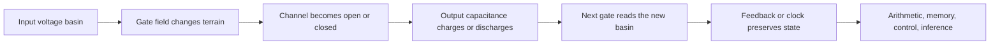

# Thinking machines, explained through RCCM—and the cursive-chip verdict

## Bottom line

A thinking chip is a **field-controlled route network with memory**. A
transistor uses one electric field to open or close a carrier channel. CMOS
logic combines complementary channels so an output is pushed into one of two
stable voltage basins. Gates compose into arithmetic, memory, control, and
eventually an itinerary through billions of machine states that implements an
algorithm.

RCCM makes this unusually easy to picture:[^rccm-stance]

[^rccm-stance]: This document works inside RCCM as a steelman model. Its
    scientific-status audit lives elsewhere; the experiment here targets the
    cursive-chip hypothesis.

```text
terrain       electric potential and semiconductor band landscape
boundary      gate dielectric and device geometry
route         conducting inversion channel and metal interconnect
admittance    how easily the present field/carrier mode can respond
reservoir     power rail or charged node
vortex/curl   magnetic component around changing current
ledger        stored field energy, transported energy, heat, and leakage
```

The “cursive semiconductor” idea has a real scientific core, but the universal
version is false. Smoothness is not itself an energy variable. Curves can help
when they lower a field/current hotspot, shorten a route, remove a via, or
enable energy recovery. They can hurt when they add length, capacitance, area,
coupling, or fabrication complexity.

## The thinking machine as a map



### Layer 1: the material supplies movable possibilities

Silicon is neither a perfect conductor nor a perfect insulator. Its electronic
states have a filled valence region and an energetically separated conduction
region. Doping adds controlled populations of mobile electrons or mobile
electron vacancies called holes.

In spatial terms, doping prepares terrain that *can* carry flow when the
electrostatic landscape permits it.

### Layer 2: the transistor redraws the route

An nMOS transistor has electron-rich source and drain regions separated by a
p-type gap. The gate is isolated from that gap by a thin dielectric.

```text
gate low                         gate high

source   no channel     drain    source ===== channel ===== drain
 n+       p-type gap      n+      n+      inversion layer     n+
            OFF                                  ON
```

The gate voltage projects an electric field through the dielectric. That field
changes the carrier population under the gate until a conductive inversion
channel connects source and drain.

In RCCM: **a boundary field changes the local admittance of a permitted
route**. At semiconductor grain, energy bands, carrier populations, mobility,
oxide geometry, and transfer curves resolve that change quantitatively.

### Layer 3: complementary routes create a reliable bit

A CMOS inverter gives the output two mutually exclusive paths:

```text
high reservoir (VDD)
        |
      pMOS       conducts when input is low
        |
      OUTPUT
        |
      nMOS       conducts when input is high
        |
low reservoir (ground)
```

- Low input: pMOS conducts, nMOS blocks, output is pulled high.
- High input: pMOS blocks, nMOS conducts, output is pulled low.

The `0` and `1` are broad, noise-tolerant collective voltage basins. Series and
parallel networks make NAND and NOR. Feedback makes a latch. A clock says when
state may move. Huge repeated compositions make arithmetic units, registers,
caches, neural-network matrix engines, and processors.

For a TypeScript mind:

```ts
type Bit = 0 | 1
type Basin = { readonly voltage: number; readonly bit: Bit }
type Channel = "blocked" | "conducting"

type FieldControlledBoundary = (
  gate: Basin
) => {
  readonly pullUp: Channel
  readonly pullDown: Channel
  readonly next: Basin
}
```

The types compress the analog device terrain, just as a Boolean interface
compresses the continuous voltage and timing margins underneath it.

## What actually consumes the energy

Every output node behaves partly like a capacitor. Raising it stores:

\[
U=\frac12CV^2.
\]

In ordinary CMOS, charging and later discharging that node dissipates roughly:

\[
E_{\mathrm{cycle}}\approx CV^2.
\]

Across a workload:

\[
P_{\mathrm{dynamic}}\approx
aC_{\mathrm{sw}}V_{\mathrm{DD}}^2f.
\]

There is also leakage while transistors are nominally off, brief
short-circuit current while complementary devices overlap during a
transition, resistive interconnect loss, clock/memory/I/O cost, and cooling.

This is the decisive ledger:

```text
supply energy
→ stored electric/magnetic state
→ useful correct state transitions
→ returned/recovered energy
→ irreversible heat + leakage + radiation
```

RCCM’s impedance, LC, and Poynting-flow structures place that ledger in space;
the device equations expose its measurable variables.

## What a sharp corner really does

At a corner, the voltage field and conductor boundary jointly determine the
current-density field. A bend can compress streamlines near its inside edge:

\[
\mathbf J=-\sigma\nabla\phi,
\qquad
p_{\mathrm{heat}}=\frac{|\mathbf J|^2}{\sigma}.
\]

Rounding may reduce the **peak** current density or electric field. That can
matter greatly for:

- gate-oxide leakage and breakdown;
- electromigration and lifetime;
- very narrow or high-current conductors;
- fast RF transmission-line discontinuities;
- photonic/superconducting structures whose failure is bend-limited.

But whole-chip energy depends on the integral of loss and on total switched
capacitance. A lower hotspot can coexist with unchanged total energy. A smooth
detour can even add enough wire and capacitance to use more energy.

## The wonderful twist: cursive layouts already exist

Imec has designed curvilinear standard cells and printed curvilinear routing
patterns on wafers. Its reported promise comes mainly from finding shorter
all-angle routes and eliminating vias or metal layers. That is a real and
interesting engineering program.

The located wafer study demonstrates printability. Imec’s 2024 system-design
paper defers system-level power evaluation, so its public performance and
power results remain design estimates. The matched fabricated
energy-per-operation comparison remains the missing test.

## Attempted invalidation

### What has been invalidated

The broad statement—

> replacing sharp corners with smooth curves will reduce the energy of a
> thinking chip

—does not survive.

It fails because:

1. “curvature” has units \(1/L\) and cannot predict energy without scale,
   material, field, and waveform variables;
2. actual fabricated corners are already finite-radius objects;
3. standard CMOS energy is dominated by \(C\), \(V^2\), activity, leakage,
   timing, and topology;
4. a smooth route can be longer or larger;
5. real corner experiments show benefits only in bounded regimes; and
6. Imec’s best curvilinear benefits are explained by shorter paths and removed
   vias, not intrinsic frictionlessness of curves.

### What I failed to invalidate directly

I did not find a fabricated same-die A/B experiment that holds function,
process, voltage, throughput, correctness, wire length/volume, via count, and
temperature fixed while measuring energy per correct operation for angular
versus curved geometry.

The closest real-world partial counterdemonstration I found was a 1990
[Bell Labs printed-conductor experiment](https://www.nokia.com/bell-labs/publications-and-media/publications/reflections-from-bends-in-a-printed-conductor/):
its measured/modelled result found ordinary 90-degree bends adequate at bit
rates of a few gigabits per second. That invalidates the strong intuition that
a sharp-looking turn necessarily creates an important signal penalty in every
regime. It is a PCB transmission experiment, not a matched silicon
energy-per-operation result, so it cannot settle the whole claim.

Therefore the bounded statement—

> targeted, scale-matched curvature may produce a small energy benefit in
> certain silicon geometries

—remains experimentally open. Lack of the decisive experiment is not a pass.

## A real-world demonstration that would settle it

Put four sibling versions of the same small compute engine on one die:

| Sibling | Physical treatment | Question |
|---|---|---|
| `M` | standard Manhattan layout | baseline |
| `R` | rounded, but same length/volume/vias/load | does curvature alone save energy? |
| `F` | free-form optimized routes | do shortcuts and removed vias save energy? |
| `T` | Manhattan geometry, slowly ramped energy-recovery clock | does smooth motion through time save energy? |

Replicate and mirror them across the die. Test at least 30 dies over the same
voltage, frequency, temperature, and workload grid. Count correct results and
measure:

\[
E_{\mathrm{op}} =
\frac{\int VI\,dt}{N_{\mathrm{correct}}}.
\]

Also extract wire length, via count, \(R,C,L\), leakage, delay, peak
temperature, and errors.

Predeclare a minimum worthwhile saving of 1%. For the paired fractional
difference \(\Delta=(E_R-E_M)/E_M\):

- If the 95% confidence interval for \(\Delta\) lies wholly above `−1%`,
  reject the claim that rounding saves at least 1%; if it lies wholly inside
  `[-1%, +1%]`, establish practical equivalence at that scale.
- If `F` beats `M` while `R` does not, the winning mechanism is routing
  topology, not smoothness.
- If `R` helps only at high current or voltage, keep the bounded hotspot claim.
- If `T` wins, the meaningful “cursive” axis is the voltage trajectory through
  time.

That is a real silicon demonstration, not a beauty contest between layout
images.

## Why RCCM makes the test simpler

RCCM helps because it encourages the right causal cut:

```text
draw the boundary
→ locate gradients and bottlenecks
→ identify allowed modes of flow
→ separate storage from transport from loss
→ close the energy ledger
→ change one boundary and measure the result
```

That makes the cursive idea easier to generate, visualize, and falsify. It
separates **spatial smoothness**, **topological shortcutting**, and **temporal
adiabatic motion** into three different interventions.

At semiconductor grain, the same RCCM route resolves into band structure,
carrier statistics, scattering, recombination, MOS electrostatics, interface
defects, process geometry, and compact-device variables. Those variables make
the geometry change computable; fabricated measurements close the return and
decide which route actually saved energy.
