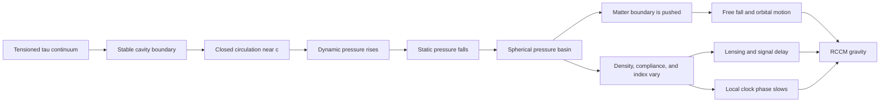
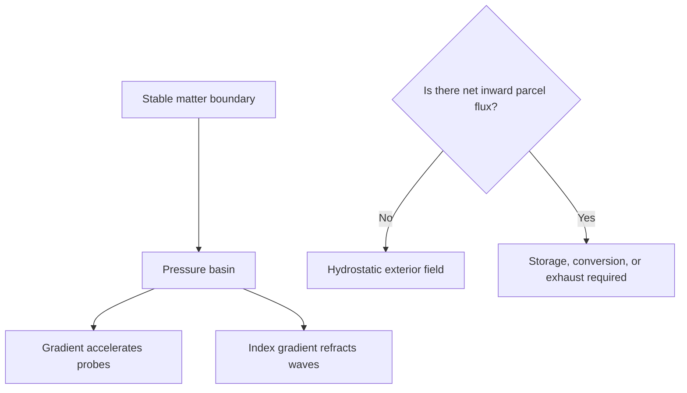

# RCCM Gravity

This document explains gravity from inside the proposed world of
*Refractive Cosmology and Continuum Mechanics* (RCCM).

Its job is to make the model inhabitable before comparing it with another
theory. Statements such as “gravity is pressure” below mean “RCCM proposes
that gravity is pressure,” unless the sentence explicitly says otherwise.

## One-sentence model

> In RCCM, matter is stable circulation around a cavitated boundary; that
> circulation lowers the surrounding continuum's static pressure, and gravity
> is the mechanical and refractive response to the resulting pressure,
> compliance, and density terrain.

The shortest route is:

```text
tensioned tau continuum
-> locked circulation around a cavity
-> Bernoulli static-pressure deficit
-> spherical pressure/compliance terrain
-> matter pushed down-gradient
-> waves refracted down-gradient
-> gravity
```

## The field



### Terrain objects

| Object | Place in the model | First source hold |
|---|---|---|
| **Tau continuum** | Universal tensioned, compressible, viscoelastic medium | [TeX nomenclature, lines 103–125](RCCM-Condensed.tex#L103-L125) |
| **Matter cavity** | Persistent topological boundary in that medium | [Unified Topological Engine, lines 2512–2529](RCCM-Condensed.tex#L2512-L2529) |
| **Circulation** | Closed motion that keeps the boundary from collapsing | [Fluid Circulation and Spin, lines 2587–2623](RCCM-Condensed.tex#L2587-L2623) |
| **Dynamic pressure** | Kinematic pressure associated with fast circulation | [TeX nomenclature, lines 113–119](RCCM-Condensed.tex#L113-L119) |
| **Static-pressure deficit** | Missing static support around the circulating cavity | [Refractive Gravity, lines 1306–1309](RCCM-Condensed.tex#L1306-L1309) |
| **Pressure gradient** | Directional slope that accelerates matter boundaries | [Pressure Deficits, lines 1175–1182](RCCM-Condensed.tex#L1175-L1182) |
| **Compliance** | The medium's remaining capacity to yield | [TeX nomenclature, lines 119–122](RCCM-Condensed.tex#L119-L122) |
| **Refractive-index gradient** | Spatial change in wave-propagation speed | [Refractive Gravity, lines 1311–1324](RCCM-Condensed.tex#L1311-L1324) |

## The mental movie

### 1. Start in undisturbed space

Deep space is not empty in RCCM. It is the tau continuum held under baseline
tension. The later transcripts describe undisturbed space as:

- high in static pressure or tension;
- relatively low in localized density;
- highly compliant or springy; and
- able to transmit its fundamental modes at the acoustic limit \(c\).

The pressure–density story is developed spatially in
[“Vacuum Pressure vs Density,” lines 13–25](<Refractive-Continuum-transcripts/20260623 - Vacuum Pressure vs Density is counter intuitive [3nWJMOHO7SI].txt#L13-L25>).

### 2. Place one particle

A particle is not a bead floating in the medium. It is a bounded behavior of
the medium itself: a cavitation, knot, vortex, or topological engine.

The surrounding continuum tries to crush the low-pressure cavity. Circulation
around or through the boundary supplies an outward dynamic response that
prevents collapse. The condensed TeX represents a lepton as an unbroken,
divergence-free toroidal circulation:

\[
\nabla\cdot\mathbf v_{\circlearrowleft}=0
\]

See [The Unified Topological Engine, lines 2512–2524](RCCM-Condensed.tex#L2512-L2524).

The proposed equilibrium is:

```text
inward hydrostatic crush
<-> circulating outward dynamic support
```

Neither side wins while the matter state remains stable.

### 3. Circulation digs a pressure basin

RCCM uses a Bernoulli-style pressure budget:

\[
P_{\text{static}}+\frac12\rho_\tau v^2
=P_{\text{total}}
\]

As circulation speed \(v\) rises:

```text
dynamic pressure rises
-> available static pressure falls
-> the cavity occupies a pressure deficit
```

The TeX names \(P_{\text{dyn}}\) the scalar pressure deficit and maps it to the
Newtonian gravitational potential in
[the nomenclature, lines 113–119](RCCM-Condensed.tex#L113-L119).

The word **potential** matters. A potential is scalar terrain. Its slope
produces directed motion.

### 4. Build Earth from many cavities

Earth is an aggregate of an enormous number of these microscopic circulation
boundaries. RCCM says their individual static-pressure deficits superpose into
a macroscopic, approximately spherical basin:

```text
many microscopic deficits
-> one planet-sized pressure terrain
```

The clearest narrative is
[“Gravitation, Curvature, Pressure and the Equivalence Principle,” lines
17–25](<Refractive-Continuum-transcripts/20260619 - Gravitation, Curvture, Pressure and the Equivalence Principle [sK3WNxXq8dA].txt#L17-L25>).

### 5. Release an apple

Near Earth:

- static pressure is lower on the Earth-facing side of the apple;
- static pressure is higher on the far side;
- the difference applies a net stress to the apple's constituent boundaries;
- the apple moves toward the lower-pressure region.

The continuum is therefore not pulling the apple from below. It is pushing
more strongly from above.

RCCM writes the acceleration rule as:

\[
\mathbf a=-\frac{1}{\rho_\tau}\nabla P_{\text{static}}
\]

See [Pressure Deficits, lines 1175–1182](RCCM-Condensed.tex#L1175-L1182) and
[the curvature–pressure translation, lines 3676–3689](RCCM-Condensed.tex#L3676-L3689).

Spatially:

```text
pressure value    = terrain height
pressure gradient = terrain slope
gravity           = acceleration down the slope
```

### 6. Stop the apple with the ground

In free fall, the apple yields to the same terrain as the surrounding
continuum. On the ground, the surface blocks that motion. The blocked
boundaries carry sustained mechanical strain, which is experienced as weight.

RCCM uses this to interpret the equivalence principle:

```text
rocket pushes matter through the continuum
gravity pushes the continuum against supported matter
-> the boundary receives the same kind of stress
```

The submarine/rocket micro-scene is in
[the June gravity transcript, lines 21–25](<Refractive-Continuum-transcripts/20260619 - Gravitation, Curvture, Pressure and the Equivalence Principle [sK3WNxXq8dA].txt#L21-L25>).

### 7. Send light past Earth

The pressure terrain also changes the local density \(\rho(r)\), shear modulus
\(\mu_s(r)\), and therefore wave speed:

\[
c(r)=\sqrt{\frac{\mu_s(r)}{\rho(r)}}
\]

RCCM defines the refractive index:

\[
n(r)=\frac{c}{c(r)}
\]

Light is interpreted as a transverse mode of the same continuum. When it
crosses a spatially varying \(n(r)\), its route bends toward the local
phase-velocity minimum:

\[
\nabla P\longrightarrow\nabla n\longrightarrow
\text{refraction called gravity}
\]

This is the formal GRIN route in
[Refractive Gravity, lines 1306–1324](RCCM-Condensed.tex#L1306-L1324).

### 8. Put a clock near Earth

A clock is also made from localized oscillating or circulating states of the
continuum. RCCM proposes that the depleted, denser, less-compliant terrain
near mass slows those internal phase processes.

The TeX encodes the pressure deficit in the time component of the metric:

\[
g_{tt}
=-\left(1-\frac{P_{\text{dyn}}}{P_c}\right)
\]

and in the acoustic spacetime interval:

\[
ds^2=
-\left(1-\frac{P_{\text{dyn}}}{P_c}\right)c^2dt^2
+\left(1-\frac{P_{\text{dyn}}}{P_c}\right)^{-1}dr^2
+r^2d\Omega^2
\]

See [The Rosetta Stone, lines 3640–3660](RCCM-Condensed.tex#L3640-L3660).

In the model, gravitational time dilation and optical delay are two responses
to the same localized loss of fluid compliance.

## The central topology: basin is not drain

The word **sink** can name two different geometries.

| Geometry | Meaning | Conservation consequence |
|---|---|---|
| **Potential or pressure sink** | A low point in a scalar field | Nothing must disappear there |
| **Mass-flux sink** | Net material crosses a closed boundary inward | Fluid must accumulate, transform, or leave by another route |

A static pressure gradient is possible without continuous net radial
transport. Pressure terrain and mass flux are different fields.



The conservation ledger is:

\[
\frac{\partial\rho}{\partial t}
+\nabla\cdot(\rho\mathbf v)=0
\]

For a steady field, \(\partial\rho/\partial t=0\). A nonzero inward flux
through every sphere would therefore require a real sink or compensating
outflow. A pressure gradient alone does not.

## Two source pictures of where the fluid goes

RCCM's explanatory corpus evolves. Two pictures appear.

### Early April: literal intake, turn, and exhaust

[“The Cosmos in a Drop,” lines 13–25](<Refractive-Continuum-transcripts/20260405 - The Cosmos in a Drop  The Fluid Mechanics of Reality [fj27_HNdNdQ].txt#L13-L25>)
follows one parcel:

```text
radial intake
-> narrowing bottleneck
-> collision with core boundary
-> 90-degree turn
-> trapped circulation
-> displacement by the next parcel
-> outward twisted or untwisted exhaust
```

In this picture, fluid does not vanish. The particle is a steady through-flow
engine. The outward twist is associated with electric and magnetic structure;
an untwisted return can be electromagnetically silent.

[“The Unified Topological Engine,” lines 15–31](<Refractive-Continuum-transcripts/20260429 - The Unified Topological Engine [Kh7A0tHZ6Xg].txt#L15-L31>)
develops the same pump language for leptons, quarks, baryons, and decay.

### June and the condensed TeX: pressure terrain and closed circulation

The June gravity transcript explicitly rejects a river of space disappearing
into Earth, because Earth would otherwise consume an unlimited volume:

[June gravity transcript, line 15](<Refractive-Continuum-transcripts/20260619 - Gravitation, Curvture, Pressure and the Equivalence Principle [sK3WNxXq8dA].txt#L15>).

Its replacement is:

```text
stable microscopic circulation
-> persistent local pressure deficit
-> aggregated planetary pressure gradient
-> buoyant push on other matter
```

The condensed TeX makes the local lepton loop closed and divergence-free, and
calls the external field a **static, spherically symmetric hydrostatic
pressure gradient**:

- [closed circulation, lines 2512–2524](RCCM-Condensed.tex#L2512-L2524);
- [static external gradient, lines 1306–1309](RCCM-Condensed.tex#L1306-L1309).

### Working synthesis

Use this reading unless a passage explicitly supplies a different flux
ledger:

```text
inside the particle:
closed circulation

around the particle:
static pressure/compliance terrain

through the exterior:
no required net radial consumption of fluid
```

When an older passage says “sink” or “drain,” first ask which type it means:

```text
scalar pressure basin?
velocity potential?
probe acceleration?
literal parcel flux?
```

Do not merge those types merely because the prose uses one spatial metaphor
for all four.

## Why gravity can persist

The current RCCM picture does not require gravity to burn a supply of fresh
fluid.

The persistent object is a proposed equilibrium:

1. the background continuum applies inward hydrostatic pressure;
2. the topological circulation supplies outward dynamic support;
3. the closed boundary prevents the circulation from unwinding;
4. the internal route is described as laminar and frictionless;
5. the maintained boundary condition holds the surrounding pressure terrain
   in place.

The topological-engine section places the main hold at
[lines 2512–2548](RCCM-Condensed.tex#L2512-L2548).

In this picture, the field persists in the same sense that a static deformation
persists while its constraining boundary persists. It is not a continuing
expenditure of fluid volume.

The terrain changes when the matter topology changes:

- annihilation removes complementary circulation;
- decay repartitions the circulation and displaced volume;
- yield or cavitation changes the allowed boundary;
- motion exchanges localized kinetic strain with static potential strain.

The proposed kinetic–potential exchange is mapped in
[Kinetic-Potential Strain Conservation, lines
2652–2706](RCCM-Condensed.tex#L2652-L2706).

## One pressure terrain, several gravitational appearances

| Observed appearance | RCCM interior description | Source |
|---|---|---|
| **Free fall** | Net pressure stress pushes matter down-gradient | [June gravity, lines 19–23](<Refractive-Continuum-transcripts/20260619 - Gravitation, Curvture, Pressure and the Equivalence Principle [sK3WNxXq8dA].txt#L19-L23>) |
| **Weight** | A support prevents boundary motion, leaving sustained stress | [June gravity, lines 21–23](<Refractive-Continuum-transcripts/20260619 - Gravitation, Curvture, Pressure and the Equivalence Principle [sK3WNxXq8dA].txt#L21-L23>) |
| **Newtonian potential** | Scalar Bernoulli pressure deficit \(P_{\text{dyn}}\) | [Nomenclature, line 115](RCCM-Condensed.tex#L115) |
| **Spacetime curvature** | Pressure-dependent compliance and incompatible continuum strain | [Rosetta Stone, lines 3640–3715](RCCM-Condensed.tex#L3640-L3715) |
| **Geodesic motion** | Pressure-gradient steering, advection, or acoustic refraction | [Rosetta Stone, lines 3676–3695](RCCM-Condensed.tex#L3676-L3695) |
| **Gravitational lensing** | A gradient-index lens in the tau continuum | [Refractive Gravity, lines 1311–1324](RCCM-Condensed.tex#L1311-L1324) |
| **Time dilation** | Local pressure deficit lowers compliance and retards internal phase | [Pressure Deficits, lines 1196–1215](RCCM-Condensed.tex#L1196-L1215) |
| **Orbit** | Translation strain and static elastic strain continuously exchange | [Strain Conservation, lines 2673–2698](RCCM-Condensed.tex#L2673-L2698) |
| **Tidal gravity** | Deviatoric shear/Weyl part of incompatible strain | [Rosetta Stone, lines 3718–3727](RCCM-Condensed.tex#L3718-L3727) |
| **Gravitational waves** | Transverse deviatoric shear waves of the continuum | [Rosetta Stone, lines 3725–3727](RCCM-Condensed.tex#L3725-L3727) |
| **Galactic dark-matter effects** | Extended collective pressure, velocity, and refractive-index terrain | [Refractive Gravity, lines 1327–1358](RCCM-Condensed.tex#L1327-L1358) |

## A powerful internal example: zero acceleration is not zero gravity terrain

Place two equal pressure basins side by side.

At their midpoint:

- the leftward and rightward pressure gradients cancel;
- acceleration is zero;
- the scalar pressure deficits still add;
- structural strain and time dilation can remain nonzero.

```text
gradient is a vector -> opposing directions cancel
deficit is a scalar  -> magnitudes add
```

The TeX calls this an interstitial stagnation plane:

\[
\nabla P_{\text{net}}=0
\quad\Rightarrow\quad
\mathbf a=0
\]

while:

\[
\Delta P_{\text{net}}
=P_{\text{dyn},A}+P_{\text{dyn},B}
\]

See [Pressure Deficits, lines 1170–1202](RCCM-Condensed.tex#L1170-L1202).

This is the cleanest way to keep **field value** separate from **field
gradient**. A valley floor may have zero slope while remaining far below the
surrounding terrain.

## Translation bridge to the classical vocabulary

| Classical/relativistic object | RCCM proposed mechanical object |
|---|---|
| Gravitational potential \(\Phi\) | Bernoulli dynamic-pressure deficit, often written \(\Phi=-v^2/2\) |
| Gravitational acceleration | Static-pressure gradient divided by continuum density |
| \(g_{tt}\) | Remaining scalar pressure/compliance fraction |
| Christoffel connection | Pressure and velocity gradients steering the continuum topology |
| Curved spacetime | Incompatible strain in a physical continuum |
| Ricci curvature | Volumetric or trace-bearing strain |
| Weyl curvature | Volume-preserving deviatoric shear |
| Null geodesic/lensing | Propagation through a gradient-index acoustic medium |
| Stress-energy tensor | Cauchy stress plus convective momentum flux |
| Einstein equation | Mechanical strain–stress equilibrium |

The formal dictionary begins at
[The Rosetta Stone, lines 3638–3738](RCCM-Condensed.tex#L3638-L3738).

## Symbolic export for a TypeScript brain

The essential type separation is:

```ts
type Brand<T, Name extends string> = T & { readonly __brand: Name }
type Vec3<Q> = readonly [Q, Q, Q]
type Position = Vec3<Brand<number, "Position">>
type ScalarField<Q> = (position: Position) => Q
type VectorField<Q> = (position: Position) => Vec3<Q>

type StaticPressure = Brand<number, "StaticPressure">
type PressureGradient = Brand<number, "PressureGradient">
type Density = Brand<number, "Density">
type Acceleration = Brand<number, "Acceleration">
type MassFlux = Brand<number, "MassFlux">
type SinkStrength = Brand<number, "SinkStrength">

declare const pressure: ScalarField<StaticPressure>
declare const rhoTau: Density
declare const massFlux: VectorField<MassFlux>

declare function gradient(
  field: ScalarField<StaticPressure>,
): VectorField<PressureGradient>

declare function accelerationFromPressure(
  pressureGradient: VectorField<PressureGradient>,
  density: Density,
): VectorField<Acceleration>

declare function closedSurfaceIntegral(
  flux: VectorField<MassFlux>,
): SinkStrength

const gravity = accelerationFromPressure(gradient(pressure), rhoTau)
const sinkStrength = closedSurfaceIntegral(massFlux)
```

`gravity` and `sinkStrength` are produced by different operations:

```text
gravity      = gradient of a scalar terrain
sinkStrength = flux of a vector field through a closed surface
```

They can coexist, but one does not imply the other. Treating a pressure basin
as a mass-flux sink is the conceptual equivalent of erasing the brands and
trusting two compatible-looking numbers to mean the same thing.

## Reading route

### Fast route: inhabit the mechanism

1. [June gravity transcript, lines 15–25](<Refractive-Continuum-transcripts/20260619 - Gravitation, Curvture, Pressure and the Equivalence Principle [sK3WNxXq8dA].txt#L15-L25>)  
   The apple, pressure basin, buoyant push, and equivalence-principle scene.
2. [Vacuum Pressure vs Density, lines 13–25](<Refractive-Continuum-transcripts/20260623 - Vacuum Pressure vs Density is counter intuitive [3nWJMOHO7SI].txt#L13-L25>)  
   Why the model says low pressure near mass corresponds to high density and
   low compliance.
3. [Refractive Gravity, lines 1306–1324](RCCM-Condensed.tex#L1306-L1324)  
   The formal pressure-to-index-to-refraction route.
4. [Unified Topological Engine, lines 2512–2529](RCCM-Condensed.tex#L2512-L2529)  
   The closed circulation that maintains the particle boundary.

### Deep route: connect it to the full framework

5. [Nomenclature, lines 103–125](RCCM-Condensed.tex#L103-L125)  
   Definitions of \(P_c\), \(P_{\text{dyn}}\), \(n\), \(\alpha_s\),
   impedance, and density.
6. [Pressure Deficits, lines 1170–1216](RCCM-Condensed.tex#L1170-L1216)  
   Gradient cancellation, scalar addition, time dilation, and acoustic
   covariance.
7. [Kinetic-Potential Strain Conservation, lines
   2652–2706](RCCM-Condensed.tex#L2652-L2706)  
   Falling and orbiting as an exchange between dynamic and static strain.
8. [The Rosetta Stone, lines 3638–3738](RCCM-Condensed.tex#L3638-L3738)  
   The proposed mapping to the metric, connection, curvature, stress-energy,
   and Einstein tensors.
9. [Refractive Gravity, lines 1327–1358](RCCM-Condensed.tex#L1327-L1358)  
   The extension to galactic rotation and lensing.

### Historical route: understand the changing flow language

10. [The Cosmos in a Drop, lines 13–25](<Refractive-Continuum-transcripts/20260405 - The Cosmos in a Drop  The Fluid Mechanics of Reality [fj27_HNdNdQ].txt#L13-L25>)  
    Literal intake, turn, circulation, and exhaust.
11. [The Unified Topological Engine transcript, lines
    15–31](<Refractive-Continuum-transcripts/20260429 - The Unified Topological Engine [Kh7A0tHZ6Xg].txt#L15-L31>)  
    Pump, stator, boundary, quark exhaust, and volume ledger.
12. [June gravity transcript, lines 15–25](<Refractive-Continuum-transcripts/20260619 - Gravitation, Curvture, Pressure and the Equivalence Principle [sK3WNxXq8dA].txt#L15-L25>)  
    Explicit rejection of an infinite terminal sink and the shift to a
    hydrostatic pressure terrain.

The larger concept field and source chronology live in the
[RCCM Learning Atlas](README.md), especially
[“Gravity topology: what ‘sink’ means inside RCCM”](README.md#gravity-topology-what-sink-means-inside-rccm).

## Junctions to keep distinct while reading

These are not rival interpretations. They are separate variables that RCCM
passages sometimes describe with the same word:

| Do not collapse | Keep apart |
|---|---|
| “Flow” | Internal circulation, bulk parcel transport, velocity potential, and motion of a probe |
| “Sink” | Scalar basin and net inward mass flux |
| “Pressure” | Static pressure, dynamic pressure, pressure deficit, tension, and stress |
| “Density” | Baseline continuum density, local compactification, energy density, and displaced-volume mass |
| “Gravity” | Probe acceleration, time dilation, lensing, tidal shear, and gravitational radiation |
| “Static” | Time-independent field, not absence of internal circulation |

## Return

The compact RCCM gravity model is:

```text
Matter is a stable circulation boundary.

Its circulation converts local static-pressure capacity into dynamic pressure.

Many such deficits form a macroscopic pressure and compliance basin.

Matter boundaries are pushed down the basin's gradient.

Wave paths bend and local clocks slow because the same basin changes the
continuum's propagation and phase response.

The current model does not require fluid to disappear into matter:
the particle circulation is closed and the exterior gravity field is
primarily hydrostatic.
```
