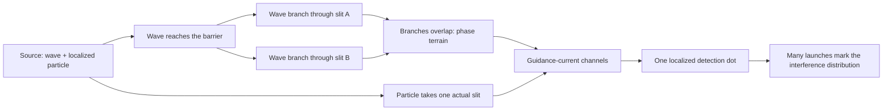

# De Broglie–Bohm Pilot Waves, RCCM, and the Double Slit

> General companion:
> [`RCCM × Bohmian Mechanics`](./RCCM-and-Bohmian-Mechanics.md). This document
> remains the focused double-slit crossing.

## Core answer

De Broglie–Bohm theory and RCCM occupy neighboring terrain:

- both allow a real, localized object to have a continuous route;
- both place wave-like structure in the surrounding field;
- both are comfortable with deterministic motion beneath quantum statistics.

The resemblance is meaningful, but it is not yet an equivalence. In
de Broglie–Bohm theory, a wavefunction obeys the Schrödinger equation and an
exact guidance law moves the particle. RCCM instead proposes a continuous
metric medium, propagating strain modes, and localized vortical defects. The
current RCCM TeX does **not** derive a Bohmian guidance law, the Born
probability rule, a many-particle configuration-space field, or the loss of
interference under a which-path interaction.

So the present relation is:

```text
shared terrain -> strong mechanical analogy -> partial kinematic contact
               -> missing dynamical bridge -> no demonstrated identity
```

The RCCM double-slit story below is therefore split into two layers:

1. **Held layer:** what the double-slit experiment and Bohmian mechanics
   already establish.
2. **Candidate layer:** how RCCM could house that route if its missing laws
   are supplied and tested.

## Field map

| Region | What occupies it | What moves | Hold | Gap |
|---|---|---|---|---|
| Ordinary quantum mechanics | Wavefunction \(\psi\) | Amplitudes evolve | Predicts the detection distribution | Does not assign a standard pre-measurement particle path |
| De Broglie–Bohm theory | Wavefunction \(\psi\) plus actual configuration \(Q(t)\) | The wave evolves and guides the configuration | Exact evolution and guidance equations | Ontological interpretation remains experimentally equivalent in quantum equilibrium |
| RCCM | Continuous \(\boldsymbol{\tau}\)-medium plus proposed localized vortical defects | Longitudinal, transverse, and rotational continuum modes | The TeX supplies real-valued wave modes and a topological particle picture | No double-slit calculation, guidance law, Born rule, or measurement model |
| RCCM–Bohm bridge | RCCM phase/strain field plus one localized defect | Field crosses both openings; defect crosses one | Clear candidate geometry | Must be derived, not installed by resemblance |

## 1. What de Broglie–Bohm theory actually places in the field

For one nonrelativistic, spinless particle, the theory places two coupled
objects:

1. a wavefunction \(\psi(\mathbf{x},t)\), and
2. an actual particle position \(\mathbf{X}(t)\).

The wavefunction evolves by the Schrödinger equation:

$$
i\hbar\frac{\partial\psi}{\partial t}
=
\left(
-\frac{\hbar^2}{2m}\nabla^2+V
\right)\psi.
$$

The particle does not choose an arbitrary path. Its velocity is fixed by the
local phase-current of the whole wave:

$$
\frac{d\mathbf{X}}{dt}
=
\left.
\frac{\hbar}{m}
\operatorname{Im}\!\left(\frac{\nabla\psi}{\psi}\right)
\right|_{\mathbf{x}=\mathbf{X}(t)}.
$$

Writing \(\psi=R e^{iS/\hbar}\) makes the same route easier to see:

$$
\frac{d\mathbf{X}}{dt}
=
\left.\frac{\nabla S}{m}\right|_{\mathbf{X}(t)}.
$$

The amplitude \(R\) shapes the available current; the phase \(S\) gives its
direction. An alternative Hamilton–Jacobi rewriting contains the Bohm quantum
potential

$$
Q_B=-\frac{\hbar^2}{2m}\frac{\nabla^2R}{R}.
$$

This \(Q_B\) is a functional of the wavefunction's shape. It is **not**
automatically a material pressure, Bernoulli pressure, or RCCM scalar
admittance merely because all of them can steer motion.

### The probability hold

If an ensemble of initial particle configurations is distributed as
\(\rho=|\psi|^2\), the Schrödinger continuity equation and the guidance law
carry that distribution forward as \(\rho(t)=|\psi(t)|^2\). This preservation
is called **equivariance**. It is the bridge from deterministic individual
routes to the familiar Born-rule statistics.

For many particles, the wavefunction normally lives on configuration space:

$$
\psi(\mathbf{x}_1,\ldots,\mathbf{x}_N,t),
$$

not as an ordinary scalar ripple at one point in three-dimensional space.
That is a major edge for any literal fluid interpretation. A real 3D medium
does not reproduce Bohmian many-particle dynamics until it supplies an
equivalent structure, including its nonlocal correlations.

## 2. Where RCCM touches the pilot-wave terrain

The broad RCCM reference places three real-valued continuum modes:

$$
\begin{aligned}
\mathbf{v}_{\parallel} &=
c\cos\theta\cos(\mathbf{k}\!\cdot\!\mathbf{r}-\omega t),\\
\mathbf{v}_{\perp} &=
c\sin\theta\cos\phi\cos(\mathbf{k}\!\cdot\!\mathbf{r}-\omega t),\\
\mathbf{v}_{\circlearrowleft} &=
c\sin\theta\sin\phi\cos(\mathbf{k}\!\cdot\!\mathbf{r}-\omega t).
\end{aligned}
$$

It labels these, respectively, as longitudinal propagation, transverse
propagation, and localized rotational structure. The same section classifies
an electron as a transverse vortex. Elsewhere the condensed TeX proposes
circulation \(\Gamma=h/m\), while the focused asymmetric-tensor branch invokes
the free-particle de Broglie relation

$$
v_pv_g=c^2.
$$

The focused branch also maps a \(2\times2\) symmetric-plus-antisymmetric block
to \(a+ib\), presenting its antisymmetric generator as a real rotation behind
complex \(U(1)\) phase.

These are genuine points of contact:

| Pilot-wave object | Closest RCCM object | Strength of relation |
|---|---|---|
| Actual particle position \(Q(t)\) | Localized vortical/topological defect | Ontological analogy |
| Wave phase \(S\) | Continuum phase and rotational generator | Structural analogy |
| Matter wavelength \(\lambda=h/p\) | RCCM circulation and phase/group kinematics | Partial kinematic contact |
| Guidance velocity \(\nabla S/m\) | Motion under RCCM pressure/strain terrain | Candidate bridge only |
| \(|\psi|^2\) equilibrium density | No current RCCM counterpart | Missing |
| Configuration-space wave \(\psi(q,t)\) | 3D continuum fields in the current TeX | Missing bridge |
| Measurement entanglement | No current RCCM detector model | Missing |

The safest statement is therefore:

> RCCM gives a possible physical substrate for a pilot-wave-shaped ontology:
> a localized defect could be the carried object, while a wider continuum
> phase field could shape its route. RCCM has not yet shown that this substrate
> reproduces de Broglie–Bohm mechanics.

Determinism alone does not close the gap. The route must recover quantum
statistics, interference, entanglement correlations, contextuality, and
no-signalling with one explicit dynamics.

## 3. The double slit as placed terrain

### Micro-scene

You stand above a channel facing a wall with two narrow gates.

A broad current can enter both gates. A single carried knot occupies one
continuous route. Beyond the wall, the two current branches overlap. Their
phase relation lays down alternating channels and ridges. The knot follows one
channel and leaves one dot on the far bank.

Repeat the launch. The dots arrive one by one, but together they mark the
channel map.

That is the Bohmian double-slit shape. The field divides; the particle does
not.



### What the apparatus marks

With slit \(A\) open alone, the screen samples \(|\psi_A|^2\). With slit \(B\)
open alone, it samples \(|\psi_B|^2\). With both open coherently, the field is

$$
\psi=\psi_A+\psi_B,
$$

so the detection density is

$$
\begin{aligned}
|\psi|^2
&=|\psi_A+\psi_B|^2\\
&=|\psi_A|^2+|\psi_B|^2
+2\operatorname{Re}(\psi_A^*\psi_B).
\end{aligned}
$$

The last term is the bite that prevents us from treating the experiment as
ordinary particles independently choosing two holes. Where the branches
reinforce, detections are common. Where they cancel, detections are absent or
rare. Electron experiments record localized events building this distribution
one event at a time.

For narrow slits separated by \(d\), a distant screen at range \(L\), and
matter wavelength \(\lambda=h/p\), the small-angle bright-band spacing is
approximately

$$
\Delta y\approx\frac{\lambda L}{d}.
$$

That relation is a clean proof stone: any RCCM calculation must obtain the
observed dependence on momentum, slit spacing, and screen distance from its
own dynamics.

### The de Broglie–Bohm route

For each launch:

1. The wavefunction passes through both open slits.
2. The actual electron passes through one slit.
3. Both wave branches contribute to the post-slit phase field.
4. The guidance equation carries the electron along one noncrossing
   trajectory through that field.
5. The screen records one dot.
6. Unknown initial positions produce different routes; a
   \(|\psi|^2\)-distributed ensemble builds the interference pattern.

The unused wave branch is sometimes called an **empty wave** because it
contains no actual particle configuration on that launch. “Empty” does not
mean unreal or dynamically irrelevant: before decoherence removes the
overlap, that branch still helps shape the guidance field.

## 4. The RCCM candidate route through the same apparatus

This is the smallest RCCM-shaped account consistent with its present
ontology. It is a **specification target**, not a derivation already found in
the TeX.

| Crossing | RCCM/Topolect reading | Current status |
|---|---|---|
| Launch | Source creates a localized transverse vortex together with extended phase-bearing continuum strain | Candidate |
| Barrier | The solid wall changes the continuum boundary conditions | Ordinary wave-mechanics hold; RCCM-specific law needed |
| Two openings | The extended strain field enters both gaps | Candidate |
| One particle route | The localized vortex remains one connected topology and crosses one gap | Consistent with RCCM ontology, not calculated |
| Recombination | Two field branches overlap with a relative phase | Candidate |
| Steering | Phase/strain gradients form allowed channels and forbidden ridges for the vortex | Missing RCCM guidance law |
| Detection | Vortex transfers localized energy/momentum to one screen site | Missing RCCM detector interaction |
| Repetition | Initial-state variation fills bright channels and avoids dark ridges | Missing RCCM equilibrium measure |

In compact Topolect:

```text
continuum field -> both gaps -> phase overlap -> route terrain
localized vortex -> one gap  -> one continuous crossing -> one mark
many crossings  -> many marks -> visible interference bands
```

The tempting RCCM move is to say that continuum pressure gradients simply
push the vortex into the bright bands. That picture is not yet load-bearing.
To make it physics, RCCM must specify:

$$
\text{continuum state}
\longrightarrow
\text{evolution PDE}
\longrightarrow
\text{vortex velocity}
\longrightarrow
\text{screen distribution}.
$$

The resulting distribution must equal the measured interference pattern
without inserting that target by hand.

## 5. What changes when the slit route is measured?

“A conscious observer collapses the wave” is not the required explanation.
The physical issue is whether path information becomes correlated with a
detector or environment.

If detector states \(|D_A\rangle\) and \(|D_B\rangle\) record the two routes,
the combined state has the form

$$
\Psi
=
\psi_A|D_A\rangle+\psi_B|D_B\rangle.
$$

The interference term is weighted by the overlap
\(\langle D_A|D_B\rangle\). Perfectly distinguishable path records make this
overlap zero, so the screen no longer receives the original cross term.

Topolect reading:

```text
no path mark:
two branches return to shared phase terrain -> interference has bite

durable path mark:
each branch becomes tied to different detector terrain
-> the branches no longer overlap in the required state space
-> the interference hold releases
```

In Bohmian mechanics, the total wavefunction still evolves; the actual
particle-plus-detector configuration occupies one effective branch.

For RCCM, this is another missing bridge. A complete account must show how a
which-path device couples to the continuum and localized defect, where the
path record is stored, and why that coupling suppresses the cross term by the
observed amount. Saying “the detector disturbed the fluid” is a hypothesis,
not yet a calculation.

## 6. The evidence ladder

| Claim | Evidence class | Present rung |
|---|---|---|
| Individual electron detections build an interference distribution | Experimental source evidence | Held |
| Bohmian dynamics supplies continuous particle trajectories guided by \(\psi\) | Formal theory | Held as a formulation of quantum mechanics |
| RCCM proposes real continuum waves and localized vortex-like matter | Repo-local source evidence | Held as a claim of RCCM |
| RCCM resembles a physical pilot-wave ontology | Inference | Strong analogy |
| An RCCM vortex crosses one slit while its phase field crosses both | Speculation / model target | Plausible but unimplemented |
| RCCM reproduces the Born distribution and which-path loss of interference | Unknown | Not established |
| RCCM and de Broglie–Bohm theory are physically identical | Unsupported | Do not claim |

## 7. Proof stones RCCM would need

An RCCM double-slit model becomes load-bearing only when it leaves these
marks:

1. **State mark:** define the 3D continuum variables and the localized-defect
   state without borrowing \(\psi\) as an unexplained alias.
2. **Evolution mark:** give the field PDE, dispersion relation, slit boundary
   conditions, and conserved energy/momentum ledger.
3. **Guidance mark:** derive the defect velocity from the RCCM state and show
   when it reduces to \(\mathbf{v}=\nabla S/m\).
4. **Wavelength mark:** recover \(\lambda=h/p\) across a stated domain, not
   only \(v_pv_g=c^2\) at one limit.
5. **Probability mark:** derive an equivariant ensemble measure that yields
   \(|\psi|^2\), or predict a quantified deviation.
6. **Interference mark:** reproduce the fringe spacing and full intensity
   profile for fixed electron energy and slit geometry.
7. **Detector mark:** model partial and complete which-path coupling and
   recover the visibility–distinguishability tradeoff.
8. **Many-body mark:** reproduce entanglement correlations, contextuality,
   and no-signalling without hiding configuration-space structure.
9. **Falsifier mark:** identify at least one result that differs from ordinary
   quantum mechanics before looking at the data.

Until those stones hold weight, the RCCM picture is useful explanatory
terrain, not a completed quantum theory.

## Symbolic export

```ts
type EvidenceRung =
  | "source-evidence"
  | "formal-correspondence"
  | "analogy"
  | "candidate-bridge"
  | "independent-prediction";

interface BohmianModel {
  evolveWavefunction(): "Schrodinger evolution";
  guideActualConfiguration(): "dQ/dt from wavefunction current";
  equilibriumMeasure(): "|psi|^2";
}

interface RCCMPilotWaveCandidate {
  continuumState: "specified";
  defectState: "specified";
  slitBoundaryConditions: "specified";
  guidanceLaw: "missing";
  equilibriumMeasure: "missing";
  detectorCoupling: "missing";
  manyBodyMap: "missing";
}
```

Type compatibility is not semantic identity:

```text
hasWave<RCCM> && hasLocalizedObject<RCCM>
  does not imply
implements<BohmianMechanics, RCCM>
```

## Return

When a new RCCM quantum derivation appears, return to four checks:

1. Does the algebra follow from its stated premises?
2. Are the quantities and dimensions consistent?
3. Does it reproduce the complete double-slit distribution and detector
   behavior?
4. Does it predict anything independently that standard quantum mechanics
   does not?

## Sources

### RCCM formal sources

- [`RCCM-Condensed.tex`](./RCCM-Condensed.tex), especially **Fluid
  Circulation & The Topological Origin of Spin** and **Continuous Wave
  Mechanics & Topological Phase States**.
- [`RCCM-GfX-2.tex`](./RCCM-GfX-2.tex), especially §§9.6–9.7 on the
  rotational phase generator and the claimed de Broglie phase/group-velocity
  relation.
- [`README.md`](./README.md), especially the claim ladder and the minimum gate
  for a deterministic quantum model.

### Primary conventional sources

- David Bohm, [“A Suggested Interpretation of the Quantum Theory in Terms of
  ‘Hidden’ Variables. I”](https://doi.org/10.1103/PhysRev.85.166),
  *Physical Review* **85** (1952), 166–179.
- David Bohm, [“A Suggested Interpretation of the Quantum Theory in Terms of
  ‘Hidden’ Variables. II”](https://doi.org/10.1103/PhysRev.85.180),
  *Physical Review* **85** (1952), 180–193.
- Akira Tonomura et al., [“Demonstration of single-electron buildup of an
  interference pattern”](https://doi.org/10.1119/1.16104), *American Journal
  of Physics* **57** (1989), 117–120.
- Roger Bach et al., [“Controlled double-slit electron
  diffraction”](https://doi.org/10.1088/1367-2630/15/3/033018), *New Journal
  of Physics* **15** (2013), 033018.
