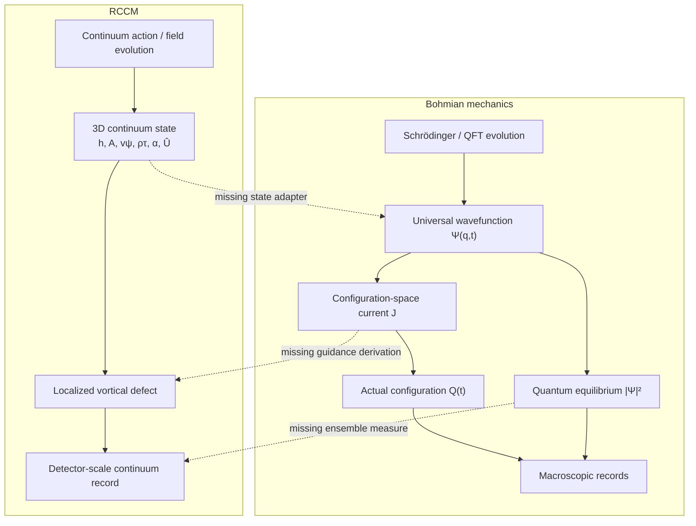

# RCCM × Bohmian Mechanics: General Field Map

## Core verdict

RCCM and Bohmian mechanics share a useful world-shape:

```text
extended order-bearing field + localized actual object + continuous route
```

But Bohmian mechanics is not merely that picture. It is a precise law package:

```text
wave evolution + configuration-space current + actual configuration
+ guidance law + quantum-equilibrium measure + subsystem/measurement rule
```

RCCM currently supplies proposed continuum fields, localized vortical defects,
phase relations, an action, and an asymmetric strain tensor. It does **not**
currently supply the Bohmian guidance current, the \(|\Psi|^2\) equilibrium
measure, the many-body configuration-space structure, effective collapse,
Bell-nonlocal correlations, or a worked extension through quantum field
theory.

Therefore:

> RCCM is **Bohmian-shaped at the ontology level**, touches de Broglie
> kinematics in several formulas, and could use Bohmian mechanics as a
> quantitative target. It is not presently a Bohmian theory or a demonstrated
> physical completion of one.

The focused double-slit crossing lives in
[`RCCM-Pilot-Wave-and-Double-Slit.md`](./RCCM-Pilot-Wave-and-Double-Slit.md).
This document maps the wider terrain.

## Terrain

| Region | Objects | Law/current | Hold | Gap or bite |
|---|---|---|---|---|
| Nonrelativistic Bohmian mechanics | Wavefunction \(\Psi\) and actual particle configuration \(Q(t)\) | Schrödinger evolution and \(\dot Q=J/|\Psi|^2\) | Precise quantum-equivalent model in equilibrium | Explicitly nonlocal for entangled systems |
| Bohmian measurement theory | Universal configuration, apparatus, environment, and effective subsystem wavefunction | Branching plus the actual apparatus configuration | Outcomes require no fundamental collapse postulate | “Observable” values are generally contextual |
| Relativistic and QFT extensions | Particle or field primitive ontologies; sometimes spacetime foliation; sometimes stochastic jumps | Model-dependent guidance or jump laws | Serious extensions exist | “Bohmian mechanics” is a family beyond the basic model |
| RCCM | \(\boldsymbol{\tau}\)-continuum, phase/velocity fields, admittance, asymmetric strain, and localized defects | Proposed continuum action and stress/pressure evolution | Rich mechanical substrate proposal | Quantum probability, nonlocality, measurement, and QFT closure are absent |
| RCCM × Bohmian candidate | RCCM state produces an effective \(\Psi\), current, and defect configuration | Derived adapter from RCCM dynamics to Bohmian dynamics | Clear research program | No adapter has yet been derived or validated |

## Architecture map



The dotted crossings are the work. The solid boxes inside each field are the
objects that field itself claims.

## 1. The minimum Bohmian contract

### Universal state and evolution

For \(N\) nonrelativistic particles, the actual configuration is

$$
Q(t)=\bigl(\mathbf{Q}_1(t),\ldots,\mathbf{Q}_N(t)\bigr)
\in \mathbb{R}^{3N}.
$$

The wavefunction lives on that configuration space:

$$
\Psi(q,t)
=
\Psi(\mathbf{x}_1,\ldots,\mathbf{x}_N,t),
$$

and evolves by

$$
i\hbar\frac{\partial\Psi}{\partial t}
=
\hat H\Psi.
$$

The wavefunction is not merely a probability list. In Bohmian mechanics it
enters the law that moves the actual configuration.

### Guidance by current

Let

$$
\rho_\Psi(q,t)=\Psi^\dagger(q,t)\Psi(q,t)
$$

and let \(\mathbf{J}_k^\Psi\) be the configuration-space probability current
associated with particle \(k\). The general guidance shape is

$$
\frac{d\mathbf{Q}_k}{dt}
=
\left.
\frac{\mathbf{J}_k^\Psi}{\rho_\Psi}
\right|_{q=Q(t)}.
$$

For a spinless particle without a vector potential,

$$
\frac{d\mathbf{Q}_k}{dt}
=
\left.
\frac{\hbar}{m_k}
\operatorname{Im}
\left(
\frac{\nabla_k\Psi}{\Psi}
\right)
\right|_{q=Q(t)}.
$$

The current obeys the configuration-space continuity equation:

$$
\frac{\partial\rho_\Psi}{\partial t}
+\sum_{k=1}^{N}\nabla_k\cdot\mathbf{J}_k^\Psi=0.
$$

This is the central hold. A candidate theory that supplies waves and particles
but no current-to-velocity rule has not yet implemented Bohmian mechanics.

### Phase and quantum-potential views

For a spinless state \(\Psi=R e^{iS/\hbar}\),

$$
\frac{d\mathbf{Q}_k}{dt}
=
\left.\frac{\nabla_k S}{m_k}\right|_{Q(t)}.
$$

Rewriting the Schrödinger equation as a Hamilton–Jacobi equation produces

$$
Q_B
=
-\sum_{k=1}^{N}
\frac{\hbar^2}{2m_k}
\frac{\nabla_k^2R}{R}.
$$

The first-order guidance law is normally the cleaner foundation. The
second-order “classical force plus quantum potential” view is equivalent in
the appropriate spinless domain, but it can tempt a false identification
between \(Q_B\) and an ordinary 3D material pressure.

### Quantum equilibrium

If the configuration distribution is

$$
\rho(q,t_0)=|\Psi(q,t_0)|^2,
$$

the shared continuity equation preserves

$$
\rho(q,t)=|\Psi(q,t)|^2.
$$

This property is **equivariance**. It is the statistical bridge from exact
individual trajectories to ordinary quantum predictions. Determinism without
an equivariant measure does not recover the Born rule.

### What kind of thing is \(\Psi\)?

The Bohmian equations fix what \(\Psi\) does, but Bohmian authors do not all
assign it the same metaphysical status. It may be discussed as a physical
field on configuration space, a multi-field relating points in physical
space, or a law-like/nomological object. RCCM would make a stronger substrate
claim: its physical continuum would have to generate the functional role of
\(\Psi\). Choosing a vivid 3D picture does not by itself settle the mapping.

## 2. What “measurement” means in the Bohmian field

The apparatus is not outside the theory. Its pointer is made from particles
with actual positions.

Suppose an interaction produces

$$
\Psi(q,y)
=
\sum_a c_a\,\psi_a(q)\Phi_a(y),
$$

where \(q\) is the subsystem configuration, \(y\) is the apparatus/environment
configuration, and the pointer packets \(\Phi_a\) have macroscopically
disjoint supports.

The actual pointer configuration \(Y\) lies in one support. Conditional on
that actual location, the subsystem has an **effective wavefunction**
proportional to the corresponding \(\psi_a\). The universal wavefunction did
not fundamentally collapse; the other branches no longer guide the occupied
subsystem branch in the ordinary measurement situation.

Topolect reading:

```text
universal field branches
-> pointer branches separate into disjoint terrain
-> actual apparatus occupies one terrain
-> one branch retains the effective guidance hold
-> one durable record appears
```

This is more demanding than saying “interaction disturbs the medium.” RCCM
would need explicit detector degrees of freedom, branch separation, and a rule
showing why the actual continuum record selects an effective subsystem state.

## 3. Bohmian mechanics beyond the simple particle picture

| Topic | Bohmian placement | RCCM-facing edge |
|---|---|---|
| Spin | Standard particle ontology need not add a tiny spinning vector; a spinor wavefunction shapes the configuration current and apparatus trajectory | RCCM circulation and \(4\pi\) topology must recover the spinor current, Stern–Gerlach statistics, and correlations—not only \(\hbar/2\) |
| Operators/observables | Operators summarize experiment statistics; the outcome is a contextual apparatus configuration | RCCM must model the apparatus interaction producing each claimed observable |
| Identical particles | Symmetric or antisymmetric wavefunctions shape motion on particle configuration space; permutation structure matters | “Vortex-like fermion” does not yet yield antisymmetry, exclusion, or exchange effects |
| Electromagnetism | Minimal coupling changes both Hamiltonian and current; potentials can affect phase and trajectories | RCCM's \(U(1)\), slip/vorticity, and Aharonov–Bohm mappings must recover the gauge-covariant current |
| Entanglement | One \(\Psi(q)\) can couple distant particle coordinates; each velocity can depend on the whole actual configuration | A local 3D pressure story needs an explicit nonlocal or equivalent global structure |
| Bell correlations | Bohmian mechanics accepts nonlocal guidance while preserving ordinary no-signalling statistics in equilibrium | A hidden local medium cannot reproduce all quantum correlations merely by being deterministic |
| Relativity | Hypersurface Bohm–Dirac models use spacelike foliations and equivariant currents; other approaches also exist | RCCM must declare whether its continuum defines a preferred foliation, a covariant law, or a different tested structure |
| Quantum field theory | Bell-type QFTs can use particle worldlines with stochastic creation/annihilation jumps; Bohmian field ontologies also exist | RCCM topological creation/annihilation needs rates, equivariance, scattering observables, and a relativistic state space |

Two cautions follow.

First, Bohmian mechanics is deterministic in its standard fixed-particle
nonrelativistic form, but “Bohmian QFT” is not one unique deterministic model.
Some serious extensions use stochastic configuration jumps.

Second, **nonlocal** does not mean “usable faster-than-light telephone.”
For an entangled \(\Psi\), the guidance velocity of one particle can depend on
distant actual coordinates. In quantum equilibrium, the observable statistics
still obey the ordinary no-signalling constraints. RCCM must recover both
sides of that boundary.

## 4. What RCCM presently places

The broad TeX proposes a 3D continuum state split into longitudinal,
transverse, and localized rotational motion:

$$
v_{\mathrm{tot}}^2
=
(\nabla h)^2
+(\nabla\times\mathbf A)^2
+(\nabla\times\mathbf v_\psi)^2
\le c^2.
$$

It assigns modal admittances to those components and proposes a continuum
Lagrangian density:

$$
\mathcal L_{\mathrm{dynamic}}
=
\frac{\rho_\tau}{2}
\left[
\alpha_\parallel(\nabla h)^2
+\alpha_\perp(\nabla\times\mathbf A)^2
+\alpha_{\circlearrowleft}
(\nabla\times\mathbf v_\psi)^2
\right]
-\frac{\rho_\tau c^2}{2}.
$$

It further proposes:

- localized matter as stable vortical/topological defects;
- \(\Gamma=h/m\) as a circulation limit;
- \(\hbar/2\) from a claimed \(4\pi\) topological return;
- \(p=\hbar k\) in its phase-momentum treatment;
- three real continuum wave modes;
- a fluid reinterpretation of Dirac/spinor objects.

The focused asymmetric-tensor TeX adds:

- \(\hat U_{\mu\nu}=S_{\mu\nu}+A_{\mu\nu}\);
- a \(2\times2\) block isomorphic to \(a+ib\), with antisymmetric rotation
  acting as a proposed real carrier of complex phase;
- a claimed \(U(1)\) mapping through Clebsch gauge shifts;
- a proposed Aharonov–Bohm contour-phase mapping;
- the free-particle kinematic relation \(v_pv_g=c^2\) at a stated defect
  limit;
- spin/torsion and Dirac-state correspondences.

These are relevant RCCM source claims. They do not silently supply the missing
Bohmian law package.

## 5. Crosswalk: nearest object is not yet the same object

| Bohmian component | Nearest RCCM component | Present rung | Required adapter |
|---|---|---|---|
| Actual configuration \(Q(t)\) | Position/configuration of localized defects | Strong ontology analogy | Define defect centers and prove persistent trajectories |
| Universal \(\Psi(q,t)\) | Full continuum phase/strain state | Weak-to-moderate analogy | Construct \(\Psi=\mathcal C[\text{RCCM state}]\) |
| Complex phase \(e^{iS/\hbar}\) | Real symmetric-plus-rotational generator | Structural isomorphism candidate | Preserve products, superposition, inner product, and unitary evolution |
| Hamiltonian \(\hat H\) | RCCM action/Hamiltonian proposals | Shared formal role | Derive the same state evolution in a declared domain |
| Autonomous wave evolution | Defect and surrounding RCCM medium are parts of one continuum | Possible dynamical conflict | Show that defect back-reaction reproduces, renormalizes to, or intentionally modifies Schrödinger evolution |
| Current \(\mathbf J^\Psi\) | Material flux, stress divergence, pressure/phase gradients | Analogy | Derive the exact configuration-space current |
| Guidance \(\dot Q=J/|\Psi|^2\) | Advection/refraction/Magnus/pressure-force stories | Missing unification | Produce one defect velocity law |
| \(|\Psi|^2\) | No defined RCCM quantum ensemble density | Missing | Derive an equivariant measure |
| Effective wavefunction | No defined RCCM conditional subsystem state | Missing | Model apparatus/environment branching |
| Entanglement | One globally connected continuum | Ontology analogy only | Recover tensor-product correlations and Bell violations |
| Spinor current | Vorticity, \(4\pi\) topology, asymmetric tensor eigenvectors | Structural analogy | Reproduce Pauli/Dirac guidance and spin experiments |
| Fermionic antisymmetry | Persistent vortex topology | Missing | Recover exchange, exclusion, and statistics |
| QFT creation/annihilation | Cavitation, yield, and topological rupture | Mechanism analogy | Derive rates, amplitudes, conservation, and scattering |

## 6. False holds to avoid

### “The Bohm quantum potential is RCCM pressure”

The units do not match without an adapter:

$$
[Q_B]=\mathrm{energy},
\qquad
[P]=\frac{\mathrm{energy}}{\mathrm{volume}}.
$$

A dimensionally possible comparison is between specific energies:

$$
\frac{Q_B}{m}
\quad\leftrightarrow\quad
\frac{P_{\mathrm{eff}}}{\rho_{\mathrm{mass}}},
$$

because both have dimensions \(L^2T^{-2}\). Passing this type-check does not
establish identity. RCCM would still need to derive the distinctive amplitude
curvature

$$
\frac{\nabla_q^2R}{R}
$$

on configuration space.

### “A real 3D wave is automatically the Bohmian wavefunction”

For one spinless particle, a 3D complex field and \(\psi(\mathbf x)\) share a
domain. For \(N\) particles, \(\Psi\) lives on a \(3N\)-dimensional
configuration space and can be entangled. A local 3D continuum needs a
nonlocal functional, multi-field construction, multi-field-on-3-space
representation, or other explicit adapter. Naming the continuum “holistic”
does not build that adapter.

Standard Bohmian particle mechanics also has an asymmetric coupling:
\(\Psi\) guides \(Q\), while \(Q\) does not appear as a source in the
Schrödinger equation. An RCCM defect made from the same continuum may naturally
back-react on its surrounding field. That could be new physics, but it must
either reduce to the Bohmian one-way law in the tested regime or predict a
quantified deviation. Ordinary mechanical intuition cannot silently change
the coupling.

### “Spin is a circulating bead”

In standard Bohmian particle mechanics, spin is handled by a spinor-valued
wavefunction and its current; it need not be an additional classical vector
carried by the particle. RCCM's circulation picture may be a proposed deeper
substrate, but it must reproduce spinor transformation, measurement
contextuality, statistics, and entangled correlations.

### “Deterministic means local classical mechanics”

Bell's result blocks local hidden-variable reproduction of all quantum
statistics. Bohmian mechanics keeps determinism by accepting nonlocal
configuration guidance. An RCCM theory that insists on strictly local
continuum causes must either show an equivalent nonlocal/global structure,
reject some quantum predictions with a quantified deviation, or fail the
Bell-correlation gate.

### “\(v_pv_g=c^2\) is the guidance equation”

The phase/group-velocity relation is free-particle kinematics in its stated
domain. Bohmian guidance is a current law for arbitrary wavefunctions,
potentials, spinors, entangled states, and apparatus interactions. One does
not derive the latter from the former by renaming \(v_g\).

## 7. Three possible RCCM × Bohmian products

| Product | Terrain shape | What would count as success | Empirical status |
|---|---|---|---|
| Exact reformulation | RCCM fields encode \(\Psi\) and defects encode \(Q\) | Invertible or solution-preserving map reproducing Bohmian trajectories and equilibrium statistics | Same predictions in validated domain |
| Emergent completion | RCCM microdynamics coarse-grain to an effective Bohmian model | Controlled approximation with errors and scale limits | Same predictions only in the emergent regime |
| Deviating successor | RCCM changes guidance, equilibrium, collapse, or QFT behavior | Predeclared quantitative predictions differing from quantum theory | New theory requiring experimental tests |

A fourth option—simply adding an unexplained \(\Psi\) and Bohmian guidance law
on top of RCCM—is a **hybrid implementation**. It may be useful for simulation,
but it does not show that RCCM derived quantum mechanics.

## 8. Minimal formal bridge

Let an RCCM state on physical space be

$$
\mathcal R(t)
=
\{\rho_\tau,h,\mathbf A,\mathbf v_\psi,
\alpha_i,\hat U_{\mu\nu},\ldots\}.
$$

A Bohmian completion needs at least four maps or laws:

### State compiler

$$
\mathcal C_N:
\mathcal R(t)
\longrightarrow
\Psi_{\mathcal R}(q,t),
\qquad
q\in\mathbb R^{3N}.
$$

This is the configuration-space bridge. It must preserve normalization,
phase, entanglement, permutation symmetry, and the relevant evolution.

### Defect extractor

$$
\mathcal D_N:
\mathcal R(t)
\longrightarrow
Q(t).
$$

This must define where the actual localized objects are, including creation,
annihilation, overlap, and identical-particle cases.

### Guidance theorem

$$
\frac{d\mathbf Q_k}{dt}
\overset{?}{=}
\left.
\frac{\mathbf J_k^{\Psi_{\mathcal R}}}
{|\Psi_{\mathcal R}|^2}
\right|_{q=Q(t)}.
$$

The equality must follow from RCCM evolution and boundary conditions, not be
inserted as a label on a pressure force.

### Equilibrium theorem

$$
\mu_{\mathcal R}(dq)
\overset{?}{=}
|\Psi_{\mathcal R}(q,t)|^2\,dq,
$$

with equivariance under the coupled dynamics.

If these hold, measurement and ordinary quantum statistics can be attacked.
If they do not, RCCM must state its alternative probability and measurement
rules.

## 9. Proof-stone route

The smallest useful progression is:

| Stage | Terrain test | Required mark |
|---:|---|---|
| 0 | One free spinless particle | Derived \(\Psi\), current, defect center, conserved normalization |
| 1 | Free Gaussian packet | RCCM trajectory field matches Bohmian packet spreading without target fitting |
| 2 | Stationary bound state | Real stationary \(\Psi\) gives a stationary center while internal RCCM circulation remains clearly distinguished |
| 3 | Double slit | Full fringe profile and trajectory distribution; use the focused companion guide |
| 4 | Aharonov–Bohm ring | Correct gauge-invariant phase shift where local field strength vanishes along the paths |
| 5 | Stern–Gerlach apparatus | Two output packets, contextual outcome, and Born frequencies from one detector model |
| 6 | Two identical particles | Exchange symmetry, exclusion/bunching behavior, and unlabeled configuration handling |
| 7 | Entangled Bell pair | Quantum correlation curve, Bell violation, and no operational signalling |
| 8 | Relativistic particles | Declared spacetime/foliation structure, equivariant current, and frame-consistent observables |
| 9 | Particle creation | Explicit worldline beginning/ending or field ontology with rates and conservation |

Each stage must reuse the same declared primitives or record a versioned theory
change. A successful earlier stage does not license later labels.

## 10. Evidence ladder

| Claim | Evidence class | Current status |
|---|---|---|
| Bohmian mechanics defines actual configurations guided by a wavefunction current | Formal source evidence | Held |
| Quantum equilibrium yields ordinary nonrelativistic quantum statistics | Formal source evidence | Held within the model's stated domain |
| Bell-compatible Bohmian dynamics is nonlocal | Formal theorem/model consequence | Held |
| Bohmian relativistic and QFT extensions exist | Formal source evidence | Held; multiple model families |
| RCCM proposes continuum waves, localized vortices, phase/action structures, and tensor mappings | Repo-local source evidence | Held as RCCM claims |
| RCCM has a Bohmian-shaped primitive ontology | Inference | Strong |
| RCCM's continuum phase is the universal wavefunction | Speculation | Unproved |
| RCCM pressure produces the Bohmian guidance current | Speculation | Unproved |
| RCCM derives quantum equilibrium, measurement, spin statistics, or Bell correlations | Unknown / absent derivation | Not established |
| RCCM is the physical substrate of Bohmian mechanics | Physical identity claim | Unsupported |

## Symbolic export

```ts
type Evidence<Claim extends string> = {
  readonly claim: Claim;
  readonly status: "proved";
};

type Configuration<N extends number> = {
  readonly particleCount: N;
  readonly positions: readonly [x: number, y: number, z: number][];
};

interface BohmianContract<N extends number, Wave> {
  evolve(wave: Wave, dt: number): Wave;
  density(wave: Wave, q: Configuration<N>): number;
  current(
    wave: Wave,
    q: Configuration<N>,
  ): readonly [vx: number, vy: number, vz: number][];
  guideVelocity(
    wave: Wave,
    q: Configuration<N>,
  ): readonly [vx: number, vy: number, vz: number][];
  proveEquivariance(): Evidence<"|Psi|^2 is preserved">;
}

interface RCCMBohmianAdapter<N extends number, RCCMState, Wave> {
  compileWave(state: RCCMState): Wave;
  extractConfiguration(state: RCCMState): Configuration<N>;
  proveEvolutionCommutation(): Evidence<
    "compile(evolveRCCM(state)) = evolveWave(compile(state))"
  >;
  proveGuidanceRecovery(): Evidence<"RCCM defect velocity = J/rho">;
  proveEquilibriumRecovery(): Evidence<"RCCM ensemble = |Psi|^2">;
}

type CurrentStatus = {
  ontologyAnalogy: "strong";
  kinematicContact: "partial";
  stateCompiler: "missing";
  guidanceRecovery: "missing";
  equilibriumRecovery: "missing";
  measurementRecovery: "missing";
  manyBodyRecovery: "missing";
};
```

The decisive invariant is:

```text
same nouns != same interfaces
same interfaces != same dynamics
same dynamics != same physical ontology
```

## Return

For any future RCCM–Bohmian claim, return through these questions:

1. What is the primitive ontology: defect positions, fields, or both?
2. What exact state evolves, on what space, under what equation?
3. What law maps that state to the actual configuration velocity?
4. What measure produces quantum statistics, and is it equivariant?
5. How do apparatus and environment create an effective subsystem branch?
6. Where does many-body nonlocality live?
7. How are spin, identical particles, relativity, and creation/annihilation
   represented?
8. Is RCCM reproducing Bohmian mechanics, approximating it, or predicting a
   measurable deviation?

## Sources

### RCCM formal sources

- [`RCCM-Condensed.tex`](./RCCM-Condensed.tex), especially **The Kinematic
  Impedance Tensor**, **Fluid Circulation & The Topological Origin of Spin**,
  **The Unified Fluid Lagrangian & Modal Admittance**, **Topological Vorticity
  Equilibrium**, and **Continuous Wave Mechanics & Topological Phase States**.
- [`RCCM-GfX-2.tex`](./RCCM-GfX-2.tex), especially §§9.6–9.7 and §§12–13 on
  phase rotation, de Broglie kinematics, gauge mapping, spin, and affine
  transport.
- [`README.md`](./README.md), especially the translation dictionary,
  epistemic razors, and deterministic-quantum validation gate.

### Primary and foundational Bohmian sources

- David Bohm, [“A Suggested Interpretation of the Quantum Theory in Terms of
  ‘Hidden’ Variables. I”](https://doi.org/10.1103/PhysRev.85.166),
  *Physical Review* **85** (1952), 166–179.
- David Bohm, [“A Suggested Interpretation of the Quantum Theory in Terms of
  ‘Hidden’ Variables. II”](https://doi.org/10.1103/PhysRev.85.180),
  *Physical Review* **85** (1952), 180–193.
- Detlef Dürr, Sheldon Goldstein, and Nino Zanghì,
  [“Quantum Equilibrium and the Origin of Absolute
  Uncertainty”](https://arxiv.org/abs/quant-ph/0308039), *Journal of
  Statistical Physics* **67** (1992), 843–907.
- Martin Daumer et al.,
  [“Naive Realism about Operators”](https://arxiv.org/abs/quant-ph/9601013),
  *Erkenntnis* **45** (1996), 379–397.
- John S. Bell, [“On the Einstein Podolsky Rosen
  Paradox”](https://cds.cern.ch/record/111654), *Physics* **1** (1964),
  195–200.
- Detlef Dürr et al.,
  [“Hypersurface Bohm–Dirac
  Models”](https://arxiv.org/abs/quant-ph/9801070), *Physical Review A*
  **60** (1999), 2729–2736.
- Detlef Dürr et al.,
  [“Bell-Type Quantum Field
  Theories”](https://arxiv.org/abs/quant-ph/0407116), *Journal of Physics A*
  **38** (2005), R1–R43.
