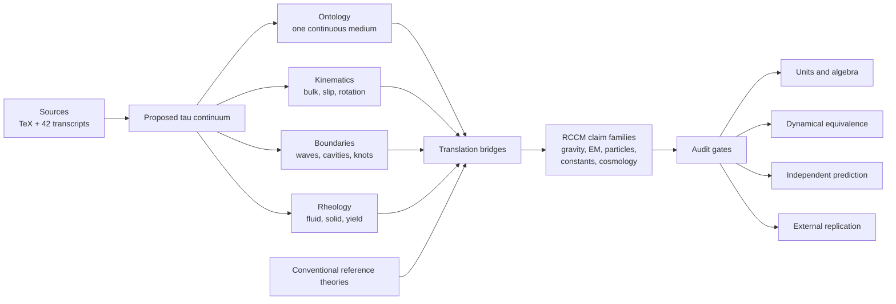
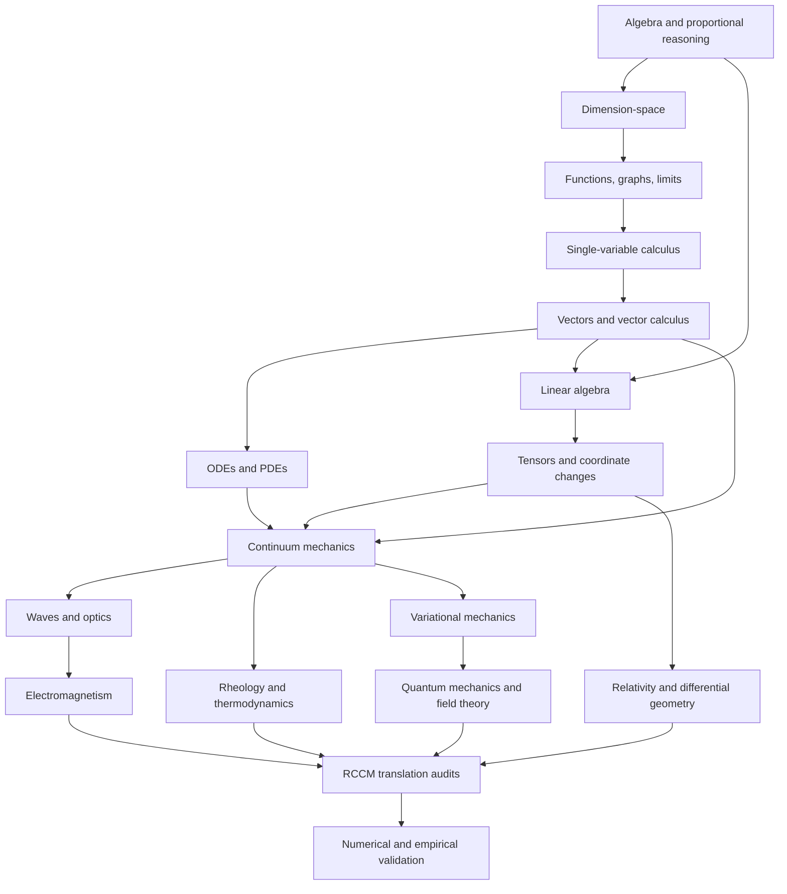

# RCCM Learning Atlas

This repository is a long-term project for understanding and auditing
*Refractive Cosmology and Continuum Mechanics* (RCCM).

## Run the executable experiment

On macOS with CMake 3.25 or newer and a C++23 compiler:

```bash
make demo
```

That one command builds a small RCCM-v0 universe, measures a propagating
pressure-density wave, repeats the experiment at three resolutions, proves an
exact deterministic replay, creates a ledgered time branch, and—when visible
to the process—cross-examines the Apple Metal result against the
double-precision CPU oracle.

The demo is deliberately more demanding than a visual toy and more modest than
a declaration of physical truth. Its final card says exactly what the run
demonstrates and what remains unproven.

The destination is not merely being able to repeat the document. It is being
able to:

1. reconstruct every important derivation;
2. see the proposed physical world in spatial and mechanical terms;
3. translate that world into conventional mathematics and physics;
4. distinguish definitions, analogies, derivations, and evidence;
5. locate errors or missing premises without losing the intended model; and
6. decide which claims survive independent mathematical and empirical tests.

This atlas is built from the complete 4,052-line
[`RCCM-Condensed.tex`](RCCM-Condensed.tex) and all 42 unique `.txt`
transcripts in
[`Refractive-Continuum-transcripts/`](Refractive-Continuum-transcripts/).
The transcript folder has its own
[dependency-aware reading map](Refractive-Continuum-transcripts/README.md).

This README is the root learning map. It is deliberately not a declaration
that RCCM is correct or incorrect.

## Focused Guides

- [TauLab scientific engine](taulab/README.md) — the executable RCCM-v0
  hypothesis bundle, scientific governance boundary, deterministic CPU oracle,
  initial Apple Metal parity kernel, validation commands, and stateless resume
  route.
- [RCCM Gravity](RCCM-Gravity.md) — the pressure terrain, matter cavities,
  closed circulation, free fall, lensing, time dilation, and the distinction
  between a potential basin and a mass-flux sink.
- [RCCM Magnets](rccm-magnets.md) — microscopic locked vortices, magnetic
  domains, attraction and repulsion, torque versus force, and magnetism's
  location in the antisymmetric sector of RCCM's unified tensor.

## Current Position

There are two foundational spines.

### Mathematical spine

Begin with **dimensional analysis as dimension-space**.

- Base dimensions such as length, mass, and time are axes.
- A physical quantity occupies a coordinate given by its dimension exponents.
- Multiplication adds dimension vectors.
- Division subtracts them.
- Exponentiation scales them.
- Both sides of an equation must occupy the same coordinate.

This unlocks useful contact with nearly every equation before calculus or
advanced physics is available.

### Epistemic spine

In parallel, learn **model-layer separation**:

```text
same units
    != same quantity
same equation shape
    != same mechanism
useful analogy
    != mathematical isomorphism
mathematical isomorphism
    != physical identity
fit to known data
    != independent prediction
```

This second spine is essential because the RCCM source repeatedly moves across
these edges.

For a TypeScript-native analogy, dimensional compatibility is structural
assignability; physical meaning is a domain brand:

```ts
type Quantity<D> = { readonly value: number; readonly dimension: D }
type Brand<Name extends string> = { readonly __brand: Name }

type Pressure = Quantity<"energy/volume"> & Brand<"pressure">
type LagrangianDensity =
  Quantity<"energy/volume"> & Brand<"lagrangian-density">
```

`Pressure` and `LagrangianDensity` occupy the same dimension-space coordinate.
That permits comparison or a proposed adapter. It does not prove that they are
the same physical object.

## Map Object

| Field | Answer |
|---|---|
| Terrain | The concepts, mathematics, physics, translations, and tests needed to deeply understand RCCM |
| Source object | `RCCM-Condensed.tex` plus 42 Refractive Continuum transcripts |
| Scope edge | Understanding and critically evaluating the framework, not merely summarizing it |
| Non-goal | Accepting or rejecting the entire framework by vibe, reputation, or one isolated error |
| Decision supported | What to learn next and what mark will prove that the learning holds |
| Current smallest move | Type-check and audit the proposed identity between Lagrangian density and pressure |

## Evidence Legend

| Evidence class | Meaning here |
|---|---|
| **Source evidence** | Directly present in the TeX or transcript corpus |
| **User-provided claim** | A preference or fact stated by the learner |
| **Experimentally tested finding** | A calculation, trace, simulation, or experiment actually run and inspected in this project |
| **Operator heuristic** | A practical learning or auditing rule |
| **Inference** | A reasoned bridge from available evidence |
| **Speculation** | A plausible idea without enough support |
| **Unknown** | A missing hold requiring a probe |

“RCCM claims X” is source evidence about the document. It is not evidence that
X is physically true.

## The Field in One View



The transcripts make the proposed world easier to see. The TeX is the formal
source needed to determine whether that world is mathematically specified.
Conventional physics is a required reference terrain, not an enemy territory.

## The Hyperblob

The RCCM hyperblob contains at least four different objects that must not be
flattened together:

1. **The proposed world:** a continuous, compressible, viscoelastic tau medium.
2. **The mathematical machinery:** fields, tensors, PDEs, topology, rheology,
   variational mechanics, relativity, electromagnetism, and particle physics.
3. **The translation dictionary:** claims that familiar physical objects are
   fluid-mechanical objects viewed from another angle.
4. **The validation program:** numerical derivations, cosmological fits, and
   proposed laboratory or engineering tests.

The transcripts often move through all four in a few sentences. Deep
understanding requires being able to stop the motion and identify the current
layer.

## Cardinal Hyperslices

### Physical-state razors

These axes survived the first adversarial pass because they repeatedly separate
non-redundant parts of the framework.

| Razor | Blob A | Blob B | RCCM target or movement | Attack / redraw condition |
|---|---|---|---|---|
| **Scale** | Localized particle boundary | Macroscopic causal horizon | Claims a conformal duality between the two | Redraw if the mapping changes equations or boundary conditions without an explicit scale transform |
| **Field topology** | Divergence-carrying / potential flow | Divergence-free / solenoidal flow | Uses the split to place gravity versus transverse modes | Redraw if a claimed mode has both nonzero divergence and curl or if boundary terms are omitted |
| **Solenoidal motion** | Translational slip / shear | Rotation / vorticity | Latest tensor places electric and magnetic behavior in these two modes | Redraw if “shear” and rigid rotation are treated as the same tensor component |
| **Deformation content** | Volumetric / trace-bearing | Isochoric / deviatoric | Gravity is placed in bulk compression; other forces in shape change | Redraw if incompressibility, zero divergence, and global volume conservation are interchanged |
| **Gradient symmetry** | Symmetric strain-rate sector | Antisymmetric rotation sector | Latest work combines them in an asymmetric tensor | Redraw if a standard symmetric metric, Cauchy strain, or Cauchy stress is silently replaced by a nonsymmetric object |
| **Boundary condition** | Closed / Dirichlet-like | Open / Neumann-like | Leptons are described as closed cavities and quarks as open flux boundaries | Redraw if the mathematical boundary data do not match those names |
| **Temporal behavior** | Propagating / transient mode | Localized / persistent mode | Boson-like waves versus fermion-like defects | Redraw if lifetime, localization, or dispersion does not follow from the proposed PDE |
| **Rheological phase** | Relaxing / fluid-like, `De < 1` | Storing / solid-like, `De > 1` | `De = 1` is proposed as a universal glass/yield boundary | Redraw if one relaxation law cannot span the claimed energy and length scales |
| **Energy response** | Loss / viscous dissipation | Storage / elastic response | Strong and electromagnetic couplings are placed on orthogonal rheological legs | Redraw if the complex modulus mapping lacks frequency dependence, causal response, or correct limits |
| **Pressure budget** | Remaining static/ambient capacity | Consumed dynamic/shear capacity | Relativity becomes depletion of a finite pressure budget | Redraw if the equation of state or conservation law does not close |
| **Observer description** | Eulerian field at fixed coordinates | Lagrangian/material parcel following motion | The framework is explicitly Eulerian but often narrates individual parcels | Redraw whenever derivatives or conserved quantities switch viewpoints without notice |
| **Clock** | Global or “absolute” tau time | Local proper/observed time | Chronological duality subtracts acoustic transit delay from a global coordinate | Redraw if the transformation fails covariance, causality, or observational timing tests |
| **Measurement scale** | Native dimensionless ratios | Human dimensionful unit standards | Constants such as `G` are described as translation artifacts | Redraw if normalization is presented as derivation without reconstructing the measured value from independent inputs |
| **Equilibrium** | Stable pressure-balanced state | Yield, fracture, or cavitation | Matter is stable boundary strain; interactions can cross structural limits | Redraw if the proposed equilibrium is not a solution of the stated field equations |

### Epistemic razors

These slices determine what kind of support a derivation actually supplies.

| Razor | Blob A | Blob B | Why it matters | Falsifier |
|---|---|---|---|---|
| **Representation** | Intuitive mechanical picture | Quantitatively specified model | A vivid animation may teach without yet defining a theory | Promote only when variables, equations, domains, and boundary conditions are explicit |
| **Map strength** | Analogy or shared form | Structure-preserving isomorphism | Similar-looking equations can describe different systems | Require an invertible mapping and preservation of relevant operations and solutions |
| **Identity strength** | Mathematical correspondence | Physical identity | An adapter is not proof that two domains contain the same entity | Require independently justified ontology or discriminating observation |
| **Dimensional status** | Unit-compatible | Dimensionally inconsistent | Dimensional consistency is a necessary gate | Passing the gate never promotes a claim beyond compatibility |
| **Derivation source** | Independent primitives | Re-expression of measured targets | A numerical output is weaker if the target entered through constants or chosen boundaries | Build a full input-dependency graph and remove target leakage |
| **Prediction status** | Retrodiction / fit to known data | Prospective holdout prediction | Both can be useful, but they carry different evidential weight | Specify parameters and uncertainty before revealing holdout data |
| **Validation scope** | Internal consistency | External empirical adequacy | A coherent model may still describe nature incorrectly | Compare one parameter set against all relevant observations |
| **Source fidelity** | Transcript paraphrase | Formal TeX statement | Captions contain mistranscriptions and omitted equations | Use the VTT for words and the TeX for symbols before auditing |
| **Conventional target** | Accurate standard-theory account | Simplified rhetorical foil | Several transcripts describe standard physics as an empty void or black box | Compare against primary textbooks, papers, and equations on their own terms |
| **Error locality** | Repairable local error | Load-bearing structural failure | One bad coefficient need not invalidate the ontology; one broken premise may | Trace downstream dependencies before judging scope |

## Slices That Broke and the Hallways They Revealed

| Broken slice | Why it failed | Better hallway |
|---|---|---|
| Empty void vs real fluid | Relativity and quantum field theory are not captured by the phrase “passive nothing,” while RCCM sometimes says “material, metric, or field” is semantic | Ask whether RCCM is an empirically equivalent reformulation, a preferred-frame medium, or a genuinely different theory |
| Fluid vs solid | Viscoelastic materials occupy both descriptions depending on forcing timescale | Use the dimensionless ratio of relaxation time to interaction time |
| Wave vs particle | Localized standing modes and propagating modes can occur in one field | Slice by localization, persistence, boundary condition, and dispersion |
| Longitudinal vs transverse | Rotation is an additional degree of freedom, and general flows can contain both divergence and curl | Use a divergence/curl square, then separate symmetric shear from antisymmetric rotation |
| Symmetric vs antisymmetric = gravity vs electromagnetism | Symmetric traceless shear and antisymmetric rotation are not the same object | Cross tensor symmetry with trace/deviatoric content and specify whether the continuum is classical or Cosserat/micropolar |
| Compressible vs divergence-free | Global conservation, material incompressibility, and a divergence-free mode are different claims | Label the domain, field, and scale for every use of “volume conservation” |
| Derived vs fitted | A derivation can contain empirically chosen constants, boundaries, or target-aware corrections | Trace every output back to independent inputs |
| Deterministic vs quantum | Determinism alone does not reproduce quantum statistics | Ask for the probability rule, measurement model, contextuality behavior, and correlation predictions |
| Correct math vs correct world | Algebra can be valid under false premises | Audit syntax, dimensions, derivation, mapping, and empirical adequacy separately |

### Gravity topology: what “sink” means inside RCCM

The corpus contains two successive spatial pictures of gravity. They can be
made compatible only if their flow words are kept precise.

| Picture | What moves | Where the fluid goes | What persists |
|---|---|---|---|
| **Early through-flow engine** | Tau-fluid parcels move radially inward toward a particle core | The core turns the inflow into circulation and then vents it outward as twisted or untwisted exhaust | A steady intake–turn–return loop; the cavity is not a terminal drain |
| **Later hydrostatic/refractive basin** | A probe boundary falls down a pressure gradient; waves refract through a compliance/index gradient | No background parcel needs to be continuously swallowed by the mass | A stable vortex maintains a low-pressure cavity and its surrounding static stress terrain |
| **Condensed TeX synthesis** | Closed, divergence-free internal circulation generates a Bernoulli deficit and a spherical hydrostatic gradient | The local engine is a closed circulation loop; the external gravitational terrain is presented primarily as static pressure and refractive structure | Topological circulation, pressure balance, and the boundary condition |

The June gravity transcript explicitly rejects the “river of space disappearing
into Earth” picture because Earth would otherwise require an infinite sink.
Its replacement is a pressure terrain: ambient pressure is higher above a
falling object and lower nearer the aggregated cavities of Earth, so the
continuum pushes the object down-gradient. The TeX gives the same later route
as:

```text
stable circulation
-> Bernoulli pressure deficit
-> static hydrostatic pressure gradient
-> density/compliance/refractive-index gradient
-> acceleration and refraction called gravity
```

Use these terms while learning the framework:

| Term | Precise local meaning |
|---|---|
| **Cavity** | A low-pressure topological defect, not automatically a hole through which conserved fluid vanishes |
| **Circulation** | Closed internal motion around or through the defect |
| **Pressure basin** | A scalar terrain whose gradient can accelerate a probe even when the background has no net radial mass flux |
| **Potential sink** | A low point in the scalar terrain; not necessarily a mass sink |
| **Mass-flux sink** | A boundary with nonzero net inward flux; it requires storage, conversion, or a return/exhaust route |
| **Fall** | The probe boundary being pushed or refracted down the maintained pressure/compliance gradient |

The conservation mark is the continuity equation:

```math
\frac{\partial \rho}{\partial t}+\nabla\cdot(\rho\mathbf v)=0
```

For a steady exterior field around a body, a literal nonzero inward flux
through every enclosing sphere requires a sink or an equal return path. The
early transcripts provide an outward exhaust. The later gravity account avoids
the need by making the exterior gravitational field primarily hydrostatic:
pressure may vary spatially while net radial transport is zero. Until a given
RCCM passage writes an explicit flux ledger, read “sink” as **pressure or
potential basin**, not as deletion of fluid.

Within RCCM's own point of view, gravity therefore does not need fuel to “keep
flowing forever.” The proposed persistent object is an equilibrium field held
by topologically locked, nominally frictionless circulation. If that
circulation dissipates, the framework owes an energy source and decay law; if
it is nondissipative, the static gradient can persist without continuously
consuming fluid.

Representative sources:
[The Cosmos in a Drop](<Refractive-Continuum-transcripts/20260405 - The Cosmos in a Drop  The Fluid Mechanics of Reality [fj27_HNdNdQ].txt>),
[The Unified Topological Engine](<Refractive-Continuum-transcripts/20260429 - The Unified Topological Engine [Kh7A0tHZ6Xg].txt>),
[Gravitation, Curvature, Pressure and the Equivalence Principle](<Refractive-Continuum-transcripts/20260619 - Gravitation, Curvture, Pressure and the Equivalence Principle [sK3WNxXq8dA].txt>),
and the TeX sections “Refractive Gravity & Dark Matter (Macroscopic GRIN)” and
“The Unified Topological Engine.”

## Three High-Value Squares

### Divergence × curl

|  | Curl-free | Curl-carrying |
|---|---|---|
| **Divergence-carrying** | Potential/compressional flow | General mixed flow |
| **Divergence-free** | Harmonic, constant, or boundary-governed sector | Solenoidal/vortical flow |

This square prevents the Helmholtz decomposition from becoming a slogan.
Boundary conditions and harmonic components still matter.

### Tensor symmetry × trace

|  | Trace-bearing | Traceless |
|---|---|---|
| **Symmetric** | Volumetric dilation/compression plus possible normal strain | Deviatoric strain and symmetric shear |
| **Antisymmetric** | Empty cell: an antisymmetric matrix has zero trace | Rotation/spin sector; a micropolar theory may add independent microrotation |

This is a priority audit square. In
[`RCCM-Condensed.tex`](RCCM-Condensed.tex), the final `SU(3)` derivation says a
`3 × 3` **symmetric, traceless** matrix has eight independent generators.
A symmetric traceless `3 × 3` matrix has five degrees of freedom. Eight arises
only after adding the three antisymmetric/imaginary rotation generators, or by
considering the full traceless Hermitian space. The subsequent basis list
contains that larger space, so the prose and the constructed object currently
disagree.

### Formal mapping × empirical novelty

|  | No discriminating prediction yet | Discriminating prediction |
|---|---|---|
| **Weak or partial mapping** | Metaphor, visualization, or heuristic | Speculative hypothesis needing a completed mechanism |
| **Strong structure-preserving mapping** | Reformulation or mathematical equivalence | Candidate competing theory |

The target is not to force every useful picture into the bottom-right cell.
The target is to know which cell we are in.

## Concept Atlas

### 1. Proposed substrate and state variables

| Object | RCCM source claim | What must be learned | First audit question |
|---|---|---|---|
| **Tau metric / tau fluid** | Vacuum is one continuous, compressible, elastic, refractive, viscoelastic medium | Continuum state variables and constitutive laws | What fields fully specify its state, and what is its equation of state? |
| **Global tau time** | An absolute continuum coordinate distinct from observed proper time | Coordinate time, proper time, covariance, synchronization | Is tau observable, gauge-like, or a preferred-frame variable? |
| **Proper/observed time** | Global time minus acoustic transit or local phase delay | Relativistic clocks and signal propagation | Does the rule reproduce standard timing in arbitrary geometries? |
| **Causal horizon `R_h`** | Expands at `c` and supplies the macroscopic boundary | Cosmological horizons and scale factors | Which horizon is meant, and does `R_h = ct` follow or enter as an axiom? |
| **Baseline density `ρ₀`** | Inertial density of the quiescent continuum | Mass density, energy density, vacuum stress | How is it independently measured or derived? |
| **Critical pressure/tension `P_c`** | Finite structural capacity of the vacuum | Pressure, tension signs, stress tensors, stability | What constitutive equation connects it to density and moduli? |
| **Macroscopic advection `V₀(r)`** | Background flow/potential driving curvature and refraction | Velocity potentials and material derivatives | Is it a physical velocity, coordinate velocity, or potential surrogate? |
| **Localized phase velocity** | Convergent motion near a topological defect | Phase/group/material velocities | Which velocity is bounded by `c`, and in which frame? |
| **Refractive index `n(r)`** | Kinematic impedance of the metric | Geometric optics and optical metrics | Is `n(r)` derived independently from a metric or defined to reproduce it? |
| **Displaced volume `V_τ`** | Mechanical substrate of mass-energy | Control volumes, added mass, topology | How is this volume defined for a noncompact field? |
| **Admittance `α_s`** | Remaining longitudinal/volumetric phase capacity | Compliance, dimensionless response, coupling | Is the same symbol consistently used for fluid admittance and strong coupling? |
| **Transverse ratio `α`** | Elastic leakage or modulus ratio associated with fine structure | Couplings, response functions, renormalization | Is the empirical `α` an input, an output, or both in different derivations? |
| **Deborah number `De`** | Rheological phase controller and proposed cross-scale yield variable | Relaxation spectra and nondimensionalization | What are the exact interaction and relaxation times in every application? |

Representative orientation sources:
[Ontological Bypass](<Refractive-Continuum-transcripts/20260401 - The Ontological Bypass  Is the Aether Real？ [LNdt0jwwyI8].txt>),
[Deconstructing the Vacuum](<Refractive-Continuum-transcripts/20260424 - Deconstructing the Vacuum - Continuum Behavior, Deborah Number [7s7iFsetc8A].txt>),
and
[Action as Pressure](<Refractive-Continuum-transcripts/20260729 - Action as Pressure  - Deriving the Unified Fluid Lagrangian [yAFxOI8q2HA].txt>).

### 2. Continuum-mechanics machinery

| Concept | Spatial picture | Formal hold needed | RCCM use |
|---|---|---|---|
| Scalar field | Terrain assigning one number to each point | Functions of several variables | Pressure, density, potential, refractive index |
| Vector field | Arrow at every point | Components, bases, coordinate changes | Velocity, displacement, flux |
| Gradient | Steepest local arrow from scalar terrain | Partial derivatives | Pressure force, refractive bending |
| Divergence | Local source/sink strength | Flux and divergence theorem | Compression, volume change, continuity |
| Curl | Local spin axis and rate | Circulation and Stokes’ theorem | Vorticity, magnetic interpretation |
| Material derivative | Change seen by a moving parcel | `∂/∂t + v·∇` | Eulerian transport and acceleration |
| Continuity equation | Flux ledger through a boundary | Local and integral conservation | Mass/volume conservation and decay bookkeeping |
| Bernoulli relation | Exchange between speed and pressure along a route | Assumptions behind Bernoulli | Gravity, attraction, cavity pressure |
| Helmholtz decomposition | Split a field into potential and solenoidal parts | Boundary/decay conditions and harmonic remainder | Gravity/EM and modal decomposition |
| Stress tensor | Oriented force crossing oriented surfaces | Traction, Cauchy stress, symmetry conditions | Pressure/shear/force unification |
| Strain tensor | Local shape and volume deformation | Displacement gradient and linearization | Curvature and particle boundaries |
| Trace/deviatoric split | Volume change versus shape change | Matrix trace and projection | Gravity versus transverse modes |
| Symmetric/antisymmetric split | Deformation rate versus local rotation | Tensor decomposition | Unified asymmetric tensor |
| Saint-Venant compatibility | Whether local strains assemble into one global body | Second derivatives and integrability | Proposed curvature dictionary |
| Cosserat/micropolar continuum | Points can translate and internally rotate | Couple stress and microrotation | Latest light and unified-tensor model |
| Cavitation | Boundary creation after pressure failure | Stability, nucleation, surface energy | Particle formation, Higgs, collider events |
| Maxwell viscoelasticity | Spring-and-dashpot response over time | Complex modulus and causal response | `De`, `α`, `α_s`, phase transitions |
| Acoustic/elastic waves | Compression and shear disturbances | PDE derivation and dispersion | Light, radiation, CMB, particle modes |
| Impedance/admittance | Resistance versus capacity to move | Units, boundary matching, frequency response | Mass, resistance, spin, refraction |
| Boundary conditions | What is fixed or allowed to flow at an edge | Dirichlet, Neumann, mixed conditions | Leptons, quarks, cavities, confinement |

### 3. Variational and thermodynamic machinery

| Concept | Conventional mathematical role | RCCM translation | Audit edge |
|---|---|---|---|
| Energy density | Energy per volume | Mechanical pressure/stress capacity | Same units are not yet same observable |
| Action | Time-integrated Lagrangian | Pressure gradients negotiated over time | Derive the equations of motion from the proposed action |
| Lagrangian | Kinetic minus potential structure | Unified fluid pressure budget | Verify variables, signs, symmetries, and constraints |
| Conjugate momentum | Derivative of Lagrangian with respect to velocity | Fluid momentum density | Check that the Legendre map is invertible |
| Legendre transform | Change from velocity to momentum description | Motion becoming static topological energy/mass | A coordinate transform does not by itself cause a phase transition |
| Hamiltonian | Energy expressed in canonical variables | Stationary observable fluid state | Verify conservation and boundedness |
| Enthalpy / `PV` work | Boundary work and thermodynamic state | Proposed resolution of the `4/3` mass issue | State the system, pressure, and equation of state |
| Ginzburg–Landau potential | Effective free-energy expansion | Cavitation stress-strain / Mexican hat | Identify order parameter and derive coefficients |
| Equation of state | Relation among pressure, density, energy, entropy | Vacuum tension and density evolution | Test stability, causality, and sign conventions |
| Entropy and temperature | Thermodynamic state and statistical accounting | Vacuum/particle entropy and Unruh-like temperature | Define microstates and check units before interpretation |

### 4. Proposed translation dictionary

| Familiar object | RCCM proposed object | Required conventional anchor | Central question |
|---|---|---|---|
| Space/vacuum | Tau continuum | GR spacetime and QFT vacuum | Reformulation, additional medium, or different theory? |
| Speed of light `c` | Acoustic/shear phase limit | Relativistic invariance and wave propagation | Does one constitutive law produce the invariant speed in every frame? |
| Time dilation | Slowed local phase through depleted/dense metric | Proper time and clock hypotheses | Does the mechanism reproduce all relativistic clock comparisons? |
| Length contraction | Physical cavity deformation under headwind | Lorentz transformations | Can a preferred medium remain compatible with precision invariance tests? |
| Mass | Displaced volume / hydrodynamic added mass / stable cavity strain | Relativistic and quantum mass | What conserved quantity and field configuration yield the measured mass? |
| Energy | Work required to displace or strain the continuum | Noether energy and thermodynamics | Is the proposed energy positive, conserved, and frame-correct? |
| Gravity | Pressure deficit, advection, density gradient, refraction | Einstein field equations and equivalence principle | Are these one mechanism or several partially overlapping stories? |
| Curvature | Strain incompatibility | Differential geometry and elasticity compatibility | Is the tensor dictionary exact, covariant, and invertible? |
| Electric field | Transverse slip / strain velocity | Maxwell theory and gauge potential | Does the mapping reproduce sources, gauge freedom, and forces? |
| Magnetic field | Vorticity / rotation | Maxwell theory and spin magnetism | Does one vorticity definition cover classical and quantum cases? |
| Light | Self-propagating slip–vorticity shear wave | Electrodynamics and photon phenomena | Recover wave behavior, polarization, quanta, and interactions |
| Charge | Winding number / transverse phase flux | Gauge charge and conservation | Derive sign, magnitude, quantization, and universality |
| Spin | Locked circulation / rotational impedance | Quantum angular momentum and spinors | Recover spin representations, statistics, and measured correlations |
| Strong interaction | Longitudinal fluid confinement / deviatoric deformation | QCD and running coupling | Recover non-Abelian dynamics, spectra, and scattering |
| Weak interaction | Yield/cavitation boundary transition | Electroweak theory and decay | Predict rates, chirality, flavor, and cross sections |
| Higgs mechanism | Stable cavitation equilibrium and longitudinal breathing mode | Standard Model symmetry breaking | Separate the `246 GeV` vacuum expectation scale from the `125 GeV` boson mass and predict both |
| Fermions | Persistent localized vortices/defects | Quantum fields and statistics | Explain antisymmetry and exclusion, not only localization |
| Bosons | Propagating or transient continuum modes | Quantum fields and statistics | Explain quantization and occupation rules |
| Antimatter | Opposite winding that uncurls on contact | Charge conjugation and annihilation | Recover all conserved quantum numbers and products |
| Beta decay | Topological crossing plus volume/circulation ledger | Weak decay and neutrino kinematics | Predict lifetime, spectrum, helicity, and branching behavior |
| `SU(3)` | Eight traceless cavity-deformation generators | Lie algebras and QCD color | Is there a representation-preserving dynamical map, not only dimension eight? |
| Fine structure `α` | Transverse leakage/modulus ratio | QED coupling and running | Derive the measured value and energy dependence without target leakage |
| Strong coupling `α_s` | Volumetric strain/fluid admittance | QCD running coupling | Reproduce scale dependence quantitatively |
| `G` | Unit conversion from continuum yield limits | Dimensional constants and gravitation | Setting `G = 1` is normalization; what independently reconstructs its SI value? |
| `ħ` | Rotational/topological impedance or action quantum | Quantum phase and units | What mechanism produces universal quantization? |
| Fundamental forces | Boundary projections of one pressure law | Field equations and observed couplings | Does one equation reproduce vector structure, symmetries, and scale dependence? |

Representative translation sources:
[Continuum Mechanics—Tensors](<Refractive-Continuum-transcripts/20260427 - Continuum Mechanics - Tensors [vAyZHcbAj_E].txt>),
[Unified Spacetime Tensor](<Refractive-Continuum-transcripts/20260728 - The Unified Spacetime Tensor [XGbbxJh6vL8].txt>),
and
[Light as Metric Shear](<Refractive-Continuum-transcripts/20260728 - Visualizing Light as Metric Shear [w9htgUhYO2g].txt>).

### 5. Cosmology, origin, and observation

| Claim family | RCCM proposal | Knowledge needed | Same-model validation gate |
|---|---|---|---|
| Cosmic expansion | Horizon expands at `c`; continuum “uncurls” with null action | FLRW cosmology, horizons, distance measures | Expansion history, ages, BAO, supernovae, and CMB with one parameter set |
| Genesis | Globally tensioned solid fractures into inward and outward shockwaves | Early-universe cosmology, phase transitions | Quantified initial conditions and observable consequences |
| CMB | Redshifted acoustic echo of a vacuum glass fracture at a claimed epoch | Blackbody radiation, perturbations, acoustic peaks | Spectrum, anisotropy peaks, polarization, and nucleosynthesis together |
| Dark energy | Longitudinal refractive delay lengthens optical paths | Cosmological distance ladder and lensing | Predeclared refractive profile fitting SN plus other distance probes |
| Dark matter | Galactic pressure/advection and gradient-index refraction | Rotation curves, lensing, structure formation | Rotation, lensing, clusters, CMB, and growth using the same field |
| MOND-like scale `a₀` | Cosmic horizon supplies a background acceleration floor | Galactic dynamics and scaling relations | Derive redshift/environment behavior before fitting galaxies |
| Gravitational lensing | Light refracts through metric impedance gradients | Null geodesics, Gordon metrics, geometric optics | Exact equivalence or measurable deviation across lens systems |
| Black holes | Yield/cavitation or `De = 1` prevents singular behavior | Horizons, collapse, thermodynamics | Metric solution, causal structure, ringdown, imaging, and thermodynamics |
| Temporal mass amplification | Fundamental mass changes with cosmic epoch | Cosmological conservation and particle constraints | Compatibility with spectra, nucleosynthesis, clocks, and local bounds |
| Measurement axiom | Constants arise from continuous reality hitting discrete observers | Metrology, operational definitions, inference | Identify an observer-independent prediction that differs from unit choice |

Representative sources:
[Genesis and the Dual Shockwave](<Refractive-Continuum-transcripts/20260411 - Genesis and The Dual Shockwave [EiNd526YkrE].txt>),
[CMB Echo](<Refractive-Continuum-transcripts/20260517 - The Cosmic Microwave Background (CMB) - Reverse Engineering the Echo [97c86kar1X0].txt>),
[Dark Matter Unification](<Refractive-Continuum-transcripts/20260607 - Dark Matter Unification [pwe9ysXya4g].txt>),
and
[Death of the Dark Sector](<Refractive-Continuum-transcripts/20260329 - The Death of the Dark Sector [SU9Xe-jCrLg].txt>).

### 6. Proposed engineering and metrology

| Region | Corpus proposal | Required mark |
|---|---|---|
| Mechanical metric test | High-voltage asymmetric capacitor on a shielded torsion pendulum in vacuum | Preregistered force prediction, calibrated artifacts, polarity controls, blind analysis, replication |
| Optical metric test | Interferometer measuring phase shift across a high-voltage gradient | Full thermal, atmospheric, electro-optic, vibration, and electromagnetic control budget |
| Geometric computing | Logic through acoustic or optical interference in structured media | A working device with measured energy, error, bandwidth, and comparison baseline |
| Vacuum motor | Metamaterial converts metric shear into torque | Closed energy ledger and independent replication |
| Cooling | Solid-state routing of strain or waves | Measured coefficient of performance and heat accounting |
| Propulsion | Controlled metric strain produces thrust | Momentum accounting, null rigs, orientation reversals, vacuum tests, independent labs |
| Decay-rate control | Pressure/field modulation changes nuclear decay | Isotope-specific preregistration, shielding, dosimetry, and replicated statistics |

The
[Metric Engineering transcript](<Refractive-Continuum-transcripts/20260419 - Metric Engineering - Translating the Tau Fluid into Empirical [4hfR463xluo].txt>)
does identify important false-positive routes such as ion wind and chamber
coupling. That is a useful beginning, not yet an experimental result.

## The Claim Ladder

Every major RCCM bridge should be placed on this ladder.

| Level | Mark required |
|---:|---|
| 0. Vocabulary | Every symbol and noun has one stable definition |
| 1. Dimensional compatibility | Units work on every term and through every operator |
| 2. Algebraic validity | Each transformation follows from stated premises |
| 3. Structural mapping | Objects and operations map consistently in both directions |
| 4. Dynamical equivalence | The mapped equations have corresponding solutions, constraints, and boundary behavior |
| 5. Known-data adequacy | One explicit parameter set reproduces relevant observations with uncertainty |
| 6. Independent prediction | A result not used as an input is predicted before comparison |
| 7. External replication | Independent people reproduce the derivation, code, or experiment |

Do not jump from Level 1 to Level 4 because two expressions “look identical.”
Do not jump from Level 5 to Level 6 because a numerical match is impressive.

## Dependency Terrain



The document presents a theory-order narrative. This graph is the learning
order.

## Skill Terrain and Proof of Ownership

| Skill region | Why RCCM needs it | Mark proving a hold |
|---|---|---|
| Algebra | Rearrangement, ratios, powers, substitutions | Reproduce a derivation without hidden steps |
| Dimension-space | Every physical equation and cross-domain bridge | Type-check ten equations and explain every failure |
| Functions and graphs | Scaling, exponentials, logarithms, redshift | Predict how a curve changes before plotting |
| Calculus | Gradients, rates, work, local approximations | Derive and interpret one derivative and one integral from the source |
| Vector calculus | `∇`, divergence, curl, circulation, flux | Manipulate a field and predict gradient/divergence/curl geometrically |
| Differential equations | Wave, flow, relaxation, and field evolution | Verify a proposed solution and its boundary/initial conditions |
| Linear algebra | Bases, matrices, eigenmodes, generators | Decompose and reconstruct a matrix |
| Tensor calculus | Coordinate-independent field relationships | Track indices, symmetry, trace, and contraction through one derivation |
| Continuum mechanics | The proposed substrate itself | Derive continuity and momentum balance from a control volume |
| Elasticity and Cosserat mechanics | Strain, stress, defects, microrotation | Separate displacement, strain, rotation, stress, and couple stress |
| Waves and optics | Light, refraction, CMB, acoustic analogies | Derive wave speed and ray bending from specified medium properties |
| Rheology | `De`, storage/loss modulus, glass transition | Plot response over frequency from a stated constitutive model |
| Thermodynamics | Pressure, energy, temperature, entropy, phase | Close a state ledger without sign or unit ambiguity |
| Variational mechanics | Lagrangian, action, Hamiltonian, Legendre map | Derive Euler–Lagrange equations and canonical momentum |
| Relativity | Metrics, proper time, curvature, equivalence | Compare one RCCM metric claim to the corresponding relativistic result |
| Electromagnetism | Maxwell equations, potentials, gauge freedom | Recover a complete Maxwell relation from a proposed fluid mapping |
| Quantum mechanics | Amplitudes, operators, spin, measurement | Calculate a simple state and distinguish amplitude from probability |
| Quantum field theory / Standard Model | Fields, gauge groups, Higgs, particle reactions | Read one conventional Lagrangian term-by-term before translating it |
| Topology and Lie theory | Knots, winding, `SU(3)`, spinors | State the invariant and show what transformation preserves it |
| Cosmology | Redshift, horizons, CMB, distances, structure | Reproduce one standard observable before applying the RCCM correction |
| Statistics and experimental design | Fits, predictions, controls, replication | Build a preregistered test with uncertainty and a falsifier |

## Chipping Route

Each expedition should be short enough to finish and leave a durable mark.

### Expedition 0 — Baseline probes

- Probe algebraic rearrangement, ratios, exponents, graph reading, vectors, and
  units using actual RCCM equations.
- Do not infer a missing skill from unfamiliar notation alone.
- **Mark:** an evidence-labeled learner map replacing the current unknowns.

### Expedition 1 — Dimension-space

- Build axes for mass `M`, length `L`, time `T`, temperature `Θ`, and charge or
  current only when needed.
- Place velocity, acceleration, force, pressure, energy, density, viscosity,
  `G`, `c`, and `ħ`.
- Walk multiplication, division, derivatives, and integrals as vector motion.
- Audit representative RCCM equations.
- **Mark:** a TypeScript dimensional checker plus a ten-equation audit table.

### Expedition 2 — Scalar and vector fields

- Place scalar terrain and arrow fields.
- Manipulate gradient, divergence, curl, flux, and circulation.
- Build the divergence/curl square from concrete flows.
- **Mark:** an interactive or sketched field atlas with predicted operator
  outputs.

### Expedition 3 — Conservation and control volumes

- Derive local continuity from a moving ledger boundary.
- Separate conservation of mass, volume, momentum, energy, angular momentum,
  circulation, and topology.
- Audit every RCCM use of “nothing is created or destroyed.”
- **Mark:** one beta-decay or cavity ledger whose terms are all defined and
  dimensionally closed.

### Expedition 4 — Stress, strain, and tensors

- Separate displacement gradient, symmetric strain, antisymmetric rotation,
  trace, deviatoric part, stress, and traction.
- Add Cosserat microrotation only after the classical split holds.
- Revisit the `SU(3)` degree count and the unified asymmetric tensor.
- **Mark:** a tensor decomposer and a corrected basis/degree table.

### Expedition 5 — Waves, optics, and rheology

- Derive longitudinal and transverse wave equations.
- Learn phase/group speed, impedance, refraction, dispersion, and boundary
  matching.
- Build a Maxwell viscoelastic response and vary `De`.
- **Mark:** a simulation showing fluid-like and solid-like response across
  frequency.

### Expedition 6 — Action and thermodynamics

- Separate pressure, energy density, Lagrangian density, action, Hamiltonian,
  and thermodynamic potentials.
- Derive Euler–Lagrange equations and a Legendre transform in a mechanical
  example.
- Audit “action is pressure.”
- **Mark:** a claim card locating that bridge on every rung of the claim
  ladder.

### Expedition 7 — Conventional reference theories

- Learn relativity, electromagnetism, quantum mechanics, the Standard Model,
  and cosmology first on their own terms.
- Replace transcript caricatures with their strongest formal versions.
- **Mark:** paired steelman summaries with exact equations and source
  references.

### Expedition 8 — Reconstruct RCCM

- Rebuild one claim family from primitives to observable.
- Make definitions, assumptions, boundary conditions, approximations, and
  empirical inputs explicit.
- **Mark:** executable derivation notebook or TypeScript model with a dependency
  graph.

### Expedition 9 — Adversarial validation

- Generate counterexamples and parameter-sensitivity tests.
- Separate target-aware calibration from holdout predictions.
- Compare one parameter set against all relevant phenomena.
- **Mark:** a preregistered numerical or laboratory test with a redraw
  condition.

## Claim-Family Validation Gates

| Claim family | Minimum serious gate |
|---|---|
| Vacuum as physical continuum | Specify state variables and constitutive law; identify either exact equivalence or a unique observable |
| Acoustic origin of `c` | Derive the relevant wave speed, polarization, invariance, and frame behavior |
| Gravity as pressure/advection/refraction | Produce one covariant field solution matching force, clocks, and lensing without switching mechanisms |
| Electromagnetism as slip/vorticity | Recover Maxwell equations, sources, gauge structure, Lorentz force, and radiation |
| Mass as displaced volume | Produce stable finite-energy solutions with correct inertial and gravitational behavior |
| Spin as circulation | Recover spin representations, half-integer behavior, statistics, and correlations |
| Constants as artifacts | Publish an acyclic input graph and predict unused constants with uncertainties |
| `α` derivation | Explain the difference between `1/137.466` and the measured value without an unconstrained after-the-fact correction |
| Proton/electron mass ratio | Explain the reported bare `1825.95` versus observed `1836.15` using a pre-specified calculation |
| Universal `De = 1` yield | Use one constitutive model to derive every claimed pion, atomic, stellar, and horizon threshold |
| Higgs reinterpretation | Distinguish the vacuum expectation scale from boson mass and reproduce couplings and decay observables |
| `SU(3)` as cavity deformation | Repair the degree count and give a dynamics-preserving representation map |
| Deterministic quantum model | Reproduce probabilities, interference, entanglement correlations, contextuality constraints, and no-signalling |
| Dark energy as optical delay | Fit supernovae with a predeclared refractive field and jointly satisfy BAO, CMB, chronometers, and structure |
| Dark matter as refractive/pressure effect | Jointly fit dynamics, lensing, clusters, CMB, and structure formation |
| Genesis/CMB fracture | Predict the blackbody spectrum, acoustic peak structure, polarization, abundances, and expansion history |
| Metric engineering | Quantitative preregistration, complete artifact budget, blind analysis, and independent replication |

## Corpus Evolution

The transcripts show an evolving framework rather than 42 independent topics.

| Period | Main movement |
|---|---|
| 2026-03 to early 2026-04 | Dark-sector optical proposal and intuitive fluid ontology |
| Early 2026-04 | Particles, mass, electromagnetism, forces, and genesis as fluid/topological stories |
| Mid 2026-04 | Measurement artifacts, constants, beta decay, and proposed metrology |
| Late 2026-04 | Acoustic dictionary, relativity critique, tensor translation, energy, topology, `G`, and engineering |
| 2026-05 | Deborah-number rheology, `α/α_s`, yield limits, CMB, QCD, and Higgs reinterpretation |
| 2026-06 | Dark-matter unification, gravity as pressure, universal impedance, pressure–density inversion |
| 2026-07 | Lie-symmetry argument, asymmetric/Cosserat tensor, action-pressure budget, and explicit light-wave derivation |

Later transcripts usually present the most mature vocabulary, but “later” does
not automatically mean “more correct.” When formulations conflict, record the
version boundary rather than silently merging them.

## Source Route

Use sources in this order:

1. **Root atlas:** this file for terrain, routes, and open gaps.
2. **Transcript map:** the
   [42-video reading map](Refractive-Continuum-transcripts/README.md) for
   conceptual orientation and chronology.
3. **Transcript `.txt`:** the speaker’s explanatory claim.
4. **Caption `.vtt`:** confirmation when a transcript term is suspicious.
5. **Formal TeX:** [`RCCM-Condensed.tex`](RCCM-Condensed.tex) for exact symbols
   and derivations.
6. **Conventional primary/reference source:** the target theory or experiment
   on its own terms.
7. **Executable mark:** our reproduction, simulation, or test.

Caption errors visible in the corpus include names and terms such as
“Debra/deer number,” “towmetric,” “Calegarinas theorem,” and “club
vorticity.” Never build a technical conclusion on the caption spelling alone.

## Claim Card Template

Use one card per important bridge:

```md
### Claim

- RCCM statement:
- Source and version:
- Evidence class:
- Symbols and definitions:
- Domain and boundary conditions:
- Independent inputs:
- Target output:

#### Gates

- [ ] Units are consistent.
- [ ] Algebra follows from stated premises.
- [ ] Approximations are explicit.
- [ ] Mapping preserves the required structures.
- [ ] Equations of motion and solutions correspond.
- [ ] Known data are reproduced with uncertainty.
- [ ] A holdout prediction exists.
- [ ] An external reproduction exists.

#### Redraw condition

If ..., then redraw ...
```

## Current Holds, Drag, and Gaps

| Territory | Holds | Drag | Bite | Route | Mark |
|---|---|---|---|---|---|
| Spatial representation | User reports spatial thinking; repo notes show maps, worlds, and dynamic slicing | Dense notation can flatten the geometry | A compelling picture can feel proven before it is tested | Place the field, then manipulate it, then attach symbols | Diagram or simulation with a falsifiable rule |
| TypeScript/formal systems | Types, interfaces, transformations, tests, and dependency graphs are reported strengths | Physics quantities carry semantic context beyond structural types | Structural compatibility can be mistaken for identity | Use branded physical quantities and explicit adapters | Executable dimensional checker |
| RCCM conceptual world | All 42 transcripts have now been read and clustered | The same word sometimes serves several mathematical roles | Silent vocabulary drift makes derivations appear connected | Stable glossary plus versioned claim cards | Cross-source concept ledger |
| Mathematical prerequisites | Full dependency terrain is mapped | Actual current ownership remains mostly unprobed | A long curriculum could waste time on already-owned skills | Short RCCM-native probes | Evidence-based learner map |
| Scientific status | Major validation gates and internal audit points are visible | External primary-source comparison has not yet been performed | Premature endorsement or dismissal | Steelman both sides, reproduce calculations, test holdouts | Independent derivation or experiment |

## Open Gaps

These are the present highest-value unknowns:

1. What is the minimal complete state definition of the tau continuum?
2. What constitutive equation links its density, pressure, bulk modulus, shear
   modulus, relaxation time, and temperature?
3. When does “volume conservation” mean global conservation, local
   incompressibility, zero divergence, or isochoric boundary deformation?
4. What prevents a persistent particle sink from consuming an unbounded
   amount of continuum?
5. How do the several gravity stories—pressure deficit, inward advection,
   density increase, strain incompatibility, and refraction—form one set of
   equations?
6. Is the latest unified tensor a metric, a deformation tensor, a field
   strength, or a combined Cosserat object?
7. Which tensor sectors are symmetric strain, symmetric shear, antisymmetric
   rotation, and independent microrotation?
8. Which RCCM quantities are genuinely derived without empirical targets
   entering through Planck units, particle masses, radii, or chosen boundary
   scales?
9. Which of the claimed numerical outputs were fixed before comparison, and
   what are their uncertainties?
10. Does the model preserve Lorentz covariance, break it, or reproduce its
    observations through a hidden preferred medium?
11. What is the exact quantum measurement and probability rule?
12. How are fermionic statistics, contextuality, and entanglement correlations
    represented?
13. What observations distinguish RCCM from GR, QFT, or an analog-gravity
    reformulation?
14. Which proposed laboratory devices have raw data, calibration records, and
    independent replication?
15. Which transcript claims are later corrections of earlier claims?

## Falsifiers and Redraw Conditions

| Current map claim | What would redraw it |
|---|---|
| Dimension-space is the highest-leverage mathematical entrance | The first probe shows fluent unit reasoning but a more basic algebra or notation bottleneck |
| Model-layer separation is the highest-leverage audit skill | The learner consistently distinguishes compatibility, equivalence, and evidence without prompting |
| Vector-field intuition should come before a conventional calculus sequence | Spatial operator probes add drag instead of reducing it |
| The latest asymmetric tensor is the corpus’s current architectural center | A later or formal source explicitly supersedes it |
| `De` is a cardinal organizing axis | Its definitions across applications cannot be made dimensionally and constitutively consistent |
| The transcript corpus is one evolving model | Explicitly incompatible branches emerge that cannot share state variables or equations |
| RCCM is currently an unvalidated source claim in this project | Independent reproduction or strong external evidence warrants promotion |

## Next Smallest Probe

Start with the latest transcript’s statement:

> Lagrangian density is dimensionally equivalent to mechanical pressure.

The first exercise is not “believe or disbelieve it.” It is:

1. Place pressure and energy density in dimension-space.
2. Prove `J/m³ = N/m²`.
3. Place Lagrangian density at the same coordinate.
4. Explain why dimensional compatibility permits the proposed bridge.
5. Explain why it does not yet prove physical identity.
6. List the additional marks required: definitions, action, variation,
   equations of motion, boundary conditions, solution correspondence, and an
   empirical discriminator.

This one crossing trains both foundational spines at once.

## Learning Session Route

Every lesson should normally follow:

```text
field
-> concrete examples
-> forces and allowed movement
-> manipulation
-> invariant, edge, or gap
-> conventional equation
-> dimensional audit
-> TypeScript/symbolic export
-> visible mark
-> return
```

Session outcomes and material map changes belong in
[`log/yyyy-mm/yyyy-mm-dd-log.md`](log/), while durable collaboration rules live
in [`AGENTS.md`](AGENTS.md).
