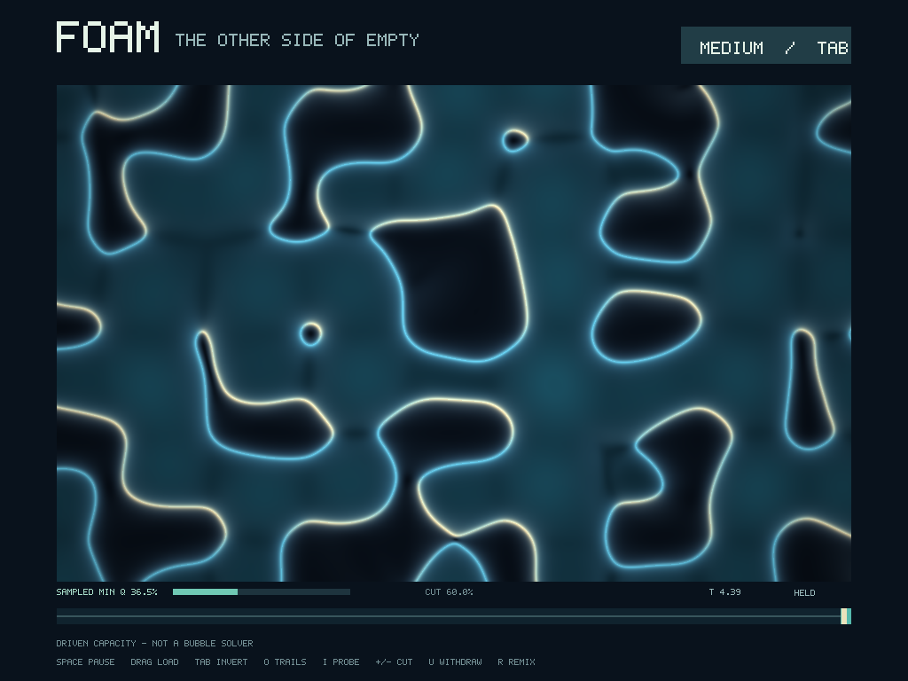
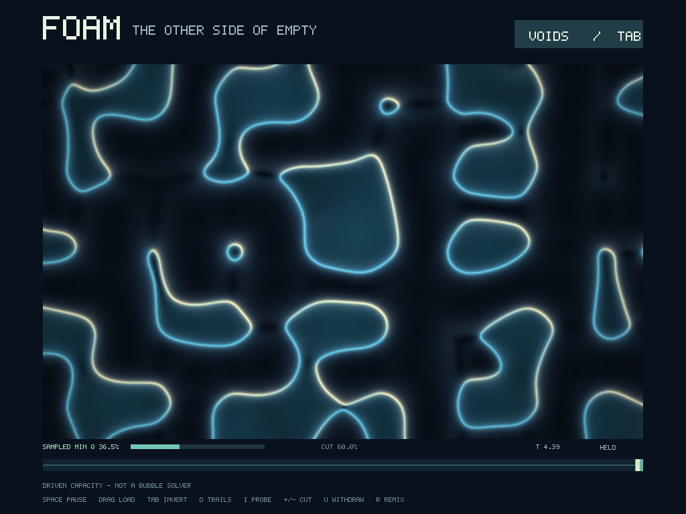
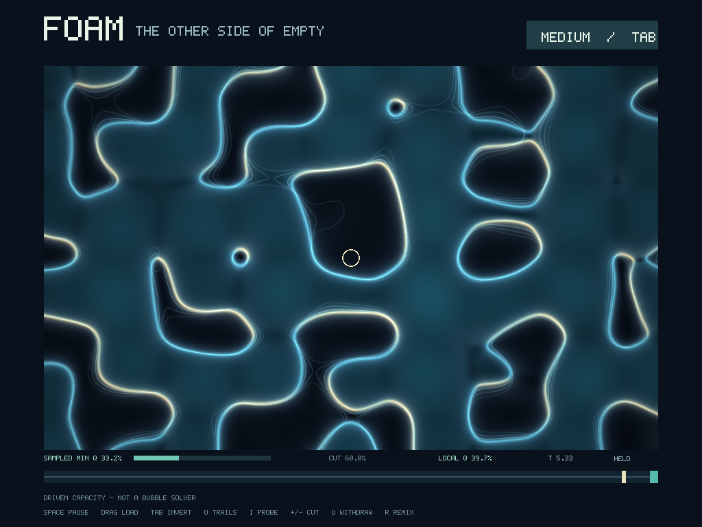
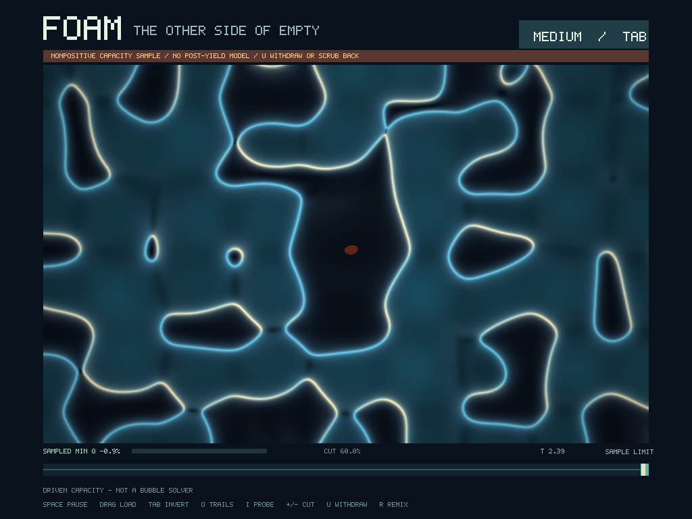

# Foam — the other side of empty

A native Bend toy for Tom: press into a changing field, invert which side
looks solid, hold time, and lay its recorded past over its present.

**This first slice is a driven pressure-capacity instrument, not a fluid or
cavitation solver.** Its pockets are actual computed level sets, but not
physical bubbles or matter particles. A sampled nonpositive capacity stops
the live branch; no invented post-yield physics takes over.



## Play

From the repository root:

```sh
make -C bend/foam-lab run
```

Requires native Bend (tested with **2.0.21**) and its native graphics toolchain.
The checked machine is an Apple M1 with Metal. JavaScript is not the graphical
delivery path. The build disables Bend telemetry. No assets or packages are
downloaded.

| Control | What happens |
|---|---|
| Hold the mouse inside the field | Gradually increase an external load |
| Drag while holding | Move that load through the field |
| Release | Withdraw the actuator load at a declared rate, while the branch is valid |
| **Tab** or **M**, or click the top-right pill | Invert medium/void figure-ground; the field state stays identical |
| **Space** | Pause/resume; resuming from the past starts a new branch |
| Drag the bottom timeline | Scrub actual recorded snapshots |
| **[ / ]** | Move one recorded snapshot older/newer |
| **O** | Overlay up to three genuinely recorded past contours |
| **I** | Show the local capacity under the pointer, inside the field only |
| **+ / −** | Change the display contour; this does not change pressure or load |
| **U** | Explicitly withdraw the hand load, including after a failed branch |
| **R** | Remix the seeded external drive and reset its history |
| **Esc** | Close the window |

Try holding a load until the sample-limit strip appears. Space will not
continue that failed branch. Withdraw the load with **U**, or scrub backward
and branch from a valid frame.

`T` is the recorded drive clock, advanced by `1/30` per live step. It is not a
wall-clock performance or physical time-dilation measurement. At most 180
frames are retained. Onion skins use recorded offsets 24, 48 and 72 behind
the selected frame; missing history is omitted, never fabricated.

## What is real here?

The [focused pressure ledger](../../RCCM-GfX-2.tex#L49-L85) supplies

$$
q = \alpha_s^2 = \frac{P_{\mathrm{static}}}{P_c}
  = 1-\frac{P_{\mathrm{load}}}{P_c}.
$$

The [Condensed pressure ratio](../../RCCM-Condensed.tex#L915-L932)
provides the corresponding broad-reference route.

This instrument explicitly chooses the external ledger load:

- seeded, moving, smooth compact-support stamps;
- one independently operated compact-support hand stamp;
- additive nonnegative load fractions, a declared driver convention—not
  a derivation of velocity, gravity or electromagnetic superposition.

The [field implementation](field.bend#L1) calculates capacity and its analytic
spatial gradient. The display selects opposite sides of the **same**
`q < cutoff` level set. Light, glow and depth shading are presentation, not
computed refraction, surface tension or material properties.

At positive capacity, the ledger reading is regular. The
[focused zero-capacity boundary](../../RCCM-GfX-2.tex#L552-L559) motivates the
stop. The detector samples a **64×64 grid plus the brush center**; it is not
a certified continuous global minimum or an exact first-contact locator.
The UI says **SAMPLED MIN Q** and **NONPOSITIVE CAPACITY SAMPLE**.
An overdrawn attempted frame remains inspectable; it is not a physical
post-yield state, and subsequent time stepping is disabled.

This is not a wave equation, Navier–Stokes solution, cavity free-boundary
solver, stochastic nucleation model, mass-generation mechanism or full
asymmetric-tensor simulation. The corpus does not yet supply the missing
interface dynamics. In particular, this code never evaluates `1/q` through
zero, hides failure with a pressure floor, or turns a contour into a particle.
The full [graphical destination](../../docs/asymmetric-tensor-graphics.md#L1)
remains larger than this first instrument.

## Seeing the other side and seeing time

| The same state, inverted | Recorded past contours |
|---|---|
|  |  |



The interface takes inspiration from Bret Victor's
[Learnable Programming](https://worrydream.com/LearnableProgramming/):
make time tangible, see state in context, and create by reacting. Inversion
does not load a different world. Scrubbing does not substitute an animation.
All views ask different questions of the same stored input state.

## Verify, capture, and experiment with parallelism

```sh
make -C bend/foam-lab test
make -C bend/foam-lab smoke
make -C bend/foam-lab screenshots
make -C bend/foam-lab benchmark

# The same app without GPU execution:
make -C bend/foam-lab run ARGS="--gpu off --threads 4"
```

- **Exact control gate:** 19 independent Bend-checked laws cover inversion,
  complementary masks and frozen boundary playback. AI-drafted contracts
  still require human review; they do not prove F32 arithmetic or physics.
- **Numerical field gate:** 260,176 baseline/replay samples, 720 analytic
  gradient checks, compact support, brush loading/overdraw, a wider-neighborhood
  oracle, and CPU thread-count repeats.
- **Session gate:** stored-frame replay, bounded history, actual branching,
  display-only controls, input and the no-post-yield transition.
- **Renderer gate:** image/capture sample positions, inspector bounds and
  complete 1,048,576-pixel image-tree comparisons in separate processes.
  CPU one/four-thread outputs must be identical. GPU/default output permits
  at most 2/255 per channel; it is not claimed bit-identical.
- **Native smoke:** opens a real window, presents four frames and exits.
  This is not a substitute for Tom's judgment of how the toy feels.

Field samples and balanced image tiles can run independently. The current
renderer forks seven levels, then renders unrolled 8×8 tiles. The history and
input order stay sequential. `benchmark` compares the same frozen picture on
one CPU thread, four CPU threads and the default `!` backend. It reports
**render plus complete image checksum**, not a pure kernel time, solver
throughput or end-to-end FPS. Startup and warm measurements differ.

### Screenshot provenance

The four committed PNGs are deterministic **offscreen screenshots**. The native
Bend capture executable replays the real session and evaluates the exact same
pixel function and pixel-center convention as the GUI. Python only encodes
PNG and records [source hashes and provenance](screenshots/manifest.json).
They are not hand-drawn mockups or screenshots of unrelated desktop windows.
macOS window capture was unavailable; no permission or system setting was changed.

`make screenshots` regenerates all four views and rejects accidentally
identical mode captures. Captures use the CPU path; the real GPU window is
checked separately with an explicit rounding tolerance. Build output remains
under ignored `.build/`; screenshots are deliberately tracked.

## Implementation map

| File | Responsibility |
|---|---|
| [field.bend](field.bend#L1) | Prescribed load field and analytic capacity gradient |
| [control.bend](control.bend#L1), [LAWS.bend](LAWS.bend#L1), [PROOF.bend](PROOF.bend#L1) | Exact presentation/playback rules |
| [timeline.bend](timeline.bend#L1), [session.bend](session.bend#L1) | Stored history, input, branching and sampled failure |
| [render.bend](render.bend#L1), [ink.bend](ink.bend#L1) | Canonical pixels, balanced image tree and bitmap typography |
| [view.bend](view.bend#L1), [main.bend](main.bend#L1) | Native application and actual stored onion skins |
| [fixtures.bend](fixtures.bend#L1), [capture.bend](capture.bend#L1) | Repeatable live-input replays and pixel export |
| [backend-frame.bend](backend-frame.bend#L1), [parity.py](parity.py#L1) | Separate-process backend image comparison |
