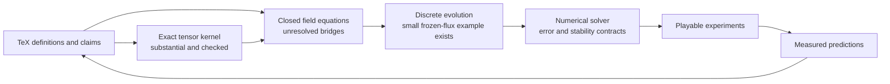

# From the asymmetric tensor to a proof-backed laboratory

Assessment and proposal · 2026-09-21 · **Proposal, not an implemented roadmap.**

The destination is a world you can manipulate: a field changes, neighboring
regions respond, and you can follow every movement back to an equation and
every equation back to an explicit assumption. Bend can carry much of the
algebra and proof work while you learn by building and playing.[^scope]

**We have a substantial exact reference kernel and teaching laboratory. We do
not yet have a closed, coupled RCCM field simulator.** The next useful move is
to close and prove one small dynamical sector, then make it playable. Completing
all the advanced mathematics before making the first simulation would delay
the very feedback that can make the mathematics understandable.

[^scope]: This proposal adopts RCCM as the working physical hypothesis. A
    proof establishes a consequence of specified premises, subject to the
    proof system; a numerical calculation approximates a specified model;
    an experiment tests its predictions. Assumptions, mathematical results,
    approximation error and measurements remain separately inspectable.

## Where we are



The missing central arrow is **state → next state**. A tensor assembled from
capacity, slip and twist describes the current sample. It does not determine
how capacity, slip and twist change together. The existing two-cell update
advances momentum using supplied, frozen face fluxes; those fluxes are not
recomputed from the evolving state through a closed RCCM law.

| Terrain | What exists | What that earns; next boundary |
|---|---|---|
| Exact arithmetic and local tensor | Signed natural representations, noncanonical rational values, positive capacity, all sixteen entries, symmetric/skew split, recovery and bilinear probes | Strong universal algebra over the implemented domains. Seven effective inputs make the displayed matrix; physical realizability of arbitrary combinations is separate. |
| Pressure and units | Nested ledger, positive-capacity witness, pressure-scaled stress, slip/twist normalization | Useful typed APIs. Units are nominal tags, not general dimensional algebra; the nested-product identity currently has a closed fixture rather than its general theorem. |
| Coordinates and contractions | Passive spatial three-cycle, flat Minkowski index raising, actual sixteen-term contraction | The signs are inspectable. General basis changes, boosts, covariant assembly equivalence and full contraction identities remain. |
| Fields and calculus | Polynomial expression language, differentiation rules, Clebsch operators, transport residuals, planar compatibility, fourth-order and wave operators | Exact small field programs and revealing counterexamples. Many later laws specify syntax or a fixture; general derivative semantics and continuum analysis are still absent. |
| Evolution | Two-cell shared-face cancellation; universal single-step momentum/boundary identity; finite recurrence | A real conservation foothold. No arbitrary-mesh/all-step conservation theorem, feedback closure, stability theorem or convergence study for RCCM dynamics. |
| Playable interface | Native [Foam](../bend/foam-lab/README.md) with manipulation, pause, recorded history and capacity inspection | Reusable interaction design. Its moving loads are prescribed drivers; its contours do not constitute a fluid, EM or cavitation solution. |
| Physical experiments and chemistry | Source claims and existing equation audits | No end-to-end measured validation of this Bend tensor implementation, and no implemented microscopic-to-chemical bridge. |

The [course](../bend/asymmetric-metric-tensor/README.md) contains **180 law
declarations**: 137 have an explicit `for`, 43 do not. This is an inventory,
not a percentage of RCCM proved. A quantified constructor contract, a general
algebraic theorem and a closed calculation cover different territory.

Examples of the distinction:

- [Tensor probes](../bend/asymmetric-metric-tensor/probes-laws.bend) prove
  same-vector antisymmetric cancellation over their declared rational domain.
- [Field laws](../bend/asymmetric-metric-tensor/fields-laws.bend) require the
  product-rule expression to contain both terms. They do not yet prove a
  general theorem connecting the differentiator to an independent mathematical
  interpretation of polynomials.
- [Ledger laws](../bend/asymmetric-metric-tensor/ledger-laws.bend) give a
  general regular-capacity witness, but `nested_fixture` checks the product of
  the two capacity fractions at one budget.
- [Evolution laws](../bend/asymmetric-metric-tensor/evolution-laws.bend)
  establish one-step boundary impulse and recurrence separately; a general
  accumulated boundary-impulse theorem has not yet been written.

The field AST only has constants, coordinates, addition and multiplication.
It cannot currently represent a variable reciprocal `1/q(x,t)`, roots,
trigonometric/exponential functions, singular fields or topology changes.
This matters because the tensor is rational in capacity even before the
downstream physics becomes complicated.

## Fresh verification and the Bend boundary

The full course was rerun at repository base
`97ff1ae123e19512e8b5a36dfebc58c898af6882`, using **Bend 2.0.21**:

```sh
python3 -u bend/asymmetric-metric-tensor/verify-course.py --mutations
cd bend/asymmetric-metric-tensor
bend PROOF.bend
```

Both suites passed: 20 native lesson demos, 20 intended false-claim failures,
284 + 751 independent rational API readings on native CPU thread counts 1
and 2, 12 + 21 well-typed implementation mutations rejected by the unchanged
proof gate, missing-proof rejection, the weak-law example, and the pressure
regressions. One additional timed proof-gate run took **0.508 seconds** on this
arm64 machine. That is a local observation, not a bound on future proof sizes
or native compilation time. The course already records a large closed
normalization that overflowed the checker's stack.

The [official Bend site](https://bend-lang.com/) makes the fast-checker claim
you quoted. The installed guide supports genuine dependent proofs, equality
rewriting and structural induction. The local official source checkout is
`6018e28ecc67cf1fffc0c20c64b11023474c2df8`; it is reference evidence, not proof
that the installed binary was reproducibly built from that commit.

The upstream [limitations](https://github.com/bendlang/bend#limitations)
also matter to this goal: F32 operations are axiomatic, the compiler is not
fully audited, and the Lean formalization and implementation have known
mismatches. The runtime discussion explicitly stops its verification short
of the C implementation. Compiled `Nat` has a `2^48−1` limit with fail-stop
checks, so mathematical natural-number proofs do not grant unbounded native
arithmetic. These observations come from the local upstream README, compiler
and runtime sources inspected for this assessment.

**Recommendation: keep Bend as the primary language.** Its present strengths
fit exact algebra, finite structures and explicit invariants well. Preserve
the current safe proof core, pin the toolchain, and separate these claims:

| Claim | Required evidence |
|---|---|
| The specified exact transformation satisfies a law | A checked proof with visible premises and dependency closure |
| The law expresses the intended RCCM equation | Independent source/contract review and discriminating counterexamples |
| The compiled exact program implements the proved function in its operating range | Backend comparison, overflow bounds or checked failure, and compiler/runtime trust accounting |
| A fast numerical calculation approximates that model | A defined numerical method, error budget, refinement checks and, where implemented, proved error bounds |
| The model predicts an observation | An independently specified experiment, units, uncertainty and comparison criteria |

If formal numerical error guarantees become essential, implement a bounded
fixed-point/rational or interval reference with proved rounding and range
behavior. Connecting it to native F32 needs a separate justified refinement
argument; testing a few matching values does not supply one. A second mature
proof checker can later audit selected foundational results, but transferring
a theorem to Bend also needs an explicit correspondence. No language switch
is required to make useful progress now.

## Source obligations that determine the route

The existing [equation-contract audit](openfoam-rccm/04-equation-contract-and-gaps.md)
already records F1–F11. The present assessment confirms these are still
relevant to the Bend destination. They are specifications to resolve, not
missing lines of routine implementation.

| Obligation | Concrete consequence | Treatment |
|---|---|---|
| Positive load versus signed invariant | GfX §8.3's shear expression becomes negative for pure slip, while §2 uses shear as consumed pressure capacity | Separate stored energy, action invariant and pressure load. Supply or derive their relation before capacity feedback. |
| Motion derivation | GfX §5 changes `rho_dyn` to `rho_eff`; normalization also drops an ambient `alpha_a` factor | Give each proposed equation a distinct contract and derive any equivalence under stated premises. |
| Frames and geometry | The local diagonal rest form is not the full moving-frame matrix; `alpha_s = gamma^-1` is restricted by the broader pressure ledger | Define background, frame, index conventions and admissible state before proving the covariant/component bridge. |
| First-order EM signs | The printed matrix and §14.1 curl pair have opposite signs under the stated flat conventions; both pairs yield the same second-order wave equation | Derive component equations directly and check propagation orientation and energy flux, not only wave speed. |
| Curvature and action | `Lambda(S−eta)` is algebraic; curvature depends on derivatives. A constant nonbaseline metric exposes the distinction. §6 also needs variation/source-sign and boundary assumptions | Treat the claimed identifications as proof obligations. Preserve counterexamples rather than accepting both sides as axioms. |
| Antisymmetric stress | Linear momentum balance alone does not conserve total angular momentum | Add internal spin/couple-stress state and its exchange law before general coupled motion. |
| Yield | `q=0` makes `1/q` undefined | A regular-state solver must stop at its domain boundary until a post-yield state and conservation-preserving transition are specified. |
| Document versions | The two TeX files differ on density normalization, inertia, geometry and modal descriptions | Use named source branches and explicit adapters. Their shared vocabulary does not authorize merging equations. |

For example, the density normalizations differ by a factor of **4.5**; this
is consequential for experimental predictions. The broad Condensed document
already includes sourced Maxwell equations. The missing EM work is connecting
their state, units and sources to the focused tensor consistently, not merely
copying four familiar equations into Bend.

Accepting RCCM as a working premise is compatible with all this. It does not
make conflicting algebra simultaneously true. An inconsistent assumption set
can trivialize a proof system. For each restricted model, we should therefore
also exhibit nontrivial admissible states; a theorem whose premises admit no
states is not a useful simulator contract.

## Proposal status

The staged implementation route follows in the next checkpoint of this
document. No TeX, Bend implementation or law was changed by the assessment.
