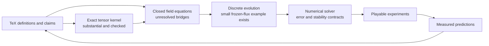

# From the asymmetric tensor to a proof-backed laboratory

Assessment and proposal · 2026-09-21 · **Proposal, not an implemented roadmap.**

The destination is a world you can manipulate: a field changes, neighboring
regions respond, and you can follow every movement back to an equation and
every equation back to an explicit assumption. Bend can carry much of the
algebra and proof work while you learn by building and playing.[^scope]

**We have a substantial exact reference kernel and teaching laboratory. We do
not yet have a closed, coupled RCCM field simulator.** The next useful move is
to close and prove one small dynamical sector, then make it playable. Completing
all the advanced mathematics before making the first simulation would delay
the very feedback that can make the mathematics understandable.

[^scope]: This proposal adopts RCCM as the working physical hypothesis. A
    proof establishes a consequence of specified premises, subject to the
    proof system; a numerical calculation approximates a specified model;
    an experiment tests its predictions. Assumptions, mathematical results,
    approximation error and measurements remain separately inspectable.

## Where we are



The missing central arrow is **state → next state**. A tensor assembled from
capacity, slip and twist describes the current sample. It does not determine
how capacity, slip and twist change together. The existing two-cell update
advances momentum using supplied, frozen face fluxes; those fluxes are not
recomputed from the evolving state through a closed RCCM law.

| Terrain | What exists | What that earns; next boundary |
|---|---|---|
| Exact arithmetic and local tensor | Signed natural representations, noncanonical rational values, positive capacity, all sixteen entries, symmetric/skew split, recovery and bilinear probes | Strong universal algebra over the implemented domains. Seven effective inputs make the displayed matrix; physical realizability of arbitrary combinations is separate. |
| Pressure and units | Nested ledger, positive-capacity witness, pressure-scaled stress, slip/twist normalization | Useful typed APIs. Units are nominal tags, not general dimensional algebra; the nested-product identity currently has a closed fixture rather than its general theorem. |
| Coordinates and contractions | Passive spatial three-cycle, flat Minkowski index raising, actual sixteen-term contraction | The signs are inspectable. General basis changes, boosts, covariant assembly equivalence and full contraction identities remain. |
| Fields and calculus | Polynomial expression language, differentiation rules, Clebsch operators, transport residuals, planar compatibility, fourth-order and wave operators | Exact small field programs and revealing counterexamples. Many later laws specify syntax or a fixture; general derivative semantics and continuum analysis are still absent. |
| Evolution | Two-cell shared-face cancellation; universal single-step momentum/boundary identity; finite recurrence | A real conservation foothold. No arbitrary-mesh/all-step conservation theorem, feedback closure, stability theorem or convergence study for RCCM dynamics. |
| Playable interface | Native [Foam](../bend/foam-lab/README.md) with manipulation, pause, recorded history and capacity inspection | Reusable interaction design. Its moving loads are prescribed drivers; its contours do not constitute a fluid, EM or cavitation solution. |
| Physical experiments and chemistry | Source claims and existing equation audits | No end-to-end measured validation of this Bend tensor implementation, and no implemented microscopic-to-chemical bridge. |

The [course](../bend/asymmetric-metric-tensor/README.md) contains **180 law
declarations**: 137 have an explicit `for`, 43 do not. This is an inventory,
not a percentage of RCCM proved. A quantified constructor contract, a general
algebraic theorem and a closed calculation cover different territory.

Examples of the distinction:

- [Tensor probes](../bend/asymmetric-metric-tensor/probes-laws.bend) prove
  same-vector antisymmetric cancellation over their declared rational domain.
- [Field laws](../bend/asymmetric-metric-tensor/fields-laws.bend) require the
  product-rule expression to contain both terms. They do not yet prove a
  general theorem connecting the differentiator to an independent mathematical
  interpretation of polynomials.
- [Ledger laws](../bend/asymmetric-metric-tensor/ledger-laws.bend) give a
  general regular-capacity witness, but `nested_fixture` checks the product of
  the two capacity fractions at one budget.
- [Evolution laws](../bend/asymmetric-metric-tensor/evolution-laws.bend)
  establish one-step boundary impulse and recurrence separately; a general
  accumulated boundary-impulse theorem has not yet been written.

The field AST only has constants, coordinates, addition and multiplication.
It cannot currently represent a variable reciprocal `1/q(x,t)`, roots,
trigonometric/exponential functions, singular fields or topology changes.
This matters because the tensor is rational in capacity even before the
downstream physics becomes complicated.

## Fresh verification and the Bend boundary

The full course was rerun at repository base
`97ff1ae123e19512e8b5a36dfebc58c898af6882`, using **Bend 2.0.21**:

```sh
python3 -u bend/asymmetric-metric-tensor/verify-course.py --mutations
cd bend/asymmetric-metric-tensor
bend PROOF.bend
```

Both suites passed: 20 native lesson demos, 20 intended false-claim failures,
284 + 751 independent rational API readings on native CPU thread counts 1
and 2, 12 + 21 well-typed implementation mutations rejected by the unchanged
proof gate, missing-proof rejection, the weak-law example, and the pressure
regressions. One additional timed proof-gate run took **0.508 seconds** on this
arm64 machine. That is a local observation, not a bound on future proof sizes
or native compilation time. The course already records a large closed
normalization that overflowed the checker's stack.

The [official Bend site](https://bend-lang.com/) makes the fast-checker claim
you quoted. The installed guide supports genuine dependent proofs, equality
rewriting and structural induction. The local official source checkout is
`6018e28ecc67cf1fffc0c20c64b11023474c2df8`; it is reference evidence, not proof
that the installed binary was reproducibly built from that commit.

The upstream [limitations](https://github.com/bendlang/bend#limitations)
also matter to this goal: F32 operations are axiomatic, the compiler is not
fully audited, and the Lean formalization and implementation have known
mismatches. The runtime discussion explicitly stops its verification short
of the C implementation. Compiled `Nat` has a `2^48−1` limit with fail-stop
checks, so mathematical natural-number proofs do not grant unbounded native
arithmetic. These observations come from the local upstream README, compiler
and runtime sources inspected for this assessment.

`All terms check.` can still depend on Base's unproved native F32 primitives.
Passing the safe-code gate does not make those arithmetic assumptions proved.

**Recommendation: keep Bend as the primary language.** Its present strengths
fit exact algebra, finite structures and explicit invariants well. Preserve
the current safe proof core, pin the toolchain, and separate these claims:

| Claim | Required evidence |
|---|---|
| The specified exact transformation satisfies a law | A checked proof with visible premises and dependency closure |
| The law expresses the intended RCCM equation | Independent source/contract review and discriminating counterexamples |
| The compiled exact program implements the proved function in its operating range | Backend comparison, overflow bounds or checked failure, and compiler/runtime trust accounting |
| A fast numerical calculation approximates that model | A defined numerical method, error budget, refinement checks and, where implemented, proved error bounds |
| The model predicts an observation | An independently specified experiment, units, uncertainty and comparison criteria |

If formal numerical error guarantees become essential, implement a bounded
fixed-point/rational or interval reference with proved rounding and range
behavior. Connecting it to native F32 needs a separate justified refinement
argument; testing a few matching values does not supply one. A second mature
proof checker can later audit selected foundational results, but transferring
a theorem to Bend also needs an explicit correspondence. No language switch
is required to make useful progress now.

## Source obligations that determine the route

The existing [equation-contract audit](openfoam-rccm/04-equation-contract-and-gaps.md)
already records F1–F11. The present assessment confirms these are still
relevant to the Bend destination. They are specifications to resolve, not
missing lines of routine implementation.

| Obligation | Concrete consequence | Treatment |
|---|---|---|
| Positive load versus signed invariant | GfX §8.3's shear expression becomes negative for pure slip, while §2 uses shear as consumed pressure capacity | Separate stored energy, action invariant and pressure load. Supply or derive their relation before capacity feedback. |
| Motion derivation | GfX §5 changes `rho_dyn` to `rho_eff`; normalization also drops an ambient `alpha_a` factor | Give each proposed equation a distinct contract and derive any equivalence under stated premises. |
| Frames and geometry | The local diagonal rest form is not the full moving-frame matrix; `alpha_s = gamma^-1` is restricted by the broader pressure ledger | Define background, frame, index conventions and admissible state before proving the covariant/component bridge. |
| First-order EM signs | The printed matrix and §14.1 curl pair have opposite signs under the stated flat conventions; both pairs yield the same second-order wave equation | Derive component equations directly and check propagation orientation and energy flux, not only wave speed. |
| Curvature and action | `Lambda(S−eta)` is algebraic; curvature depends on derivatives. A constant nonbaseline metric exposes the distinction. §6 also needs variation/source-sign and boundary assumptions | Treat the claimed identifications as proof obligations. Preserve counterexamples rather than accepting both sides as axioms. |
| Antisymmetric stress | Linear momentum balance alone does not conserve total angular momentum | Add internal spin/couple-stress state and its exchange law before general coupled motion. |
| Yield | `q=0` makes `1/q` undefined | A regular-state solver must stop at its domain boundary until a post-yield state and conservation-preserving transition are specified. |
| Document versions | The two TeX files differ on density normalization, inertia, geometry and modal descriptions | Use named source branches and explicit adapters. Their shared vocabulary does not authorize merging equations. |

For example, the density normalizations differ by a factor of **4.5**; this
is consequential for experimental predictions. The broad Condensed document
already includes sourced Maxwell equations. The missing EM work is connecting
their state, units and sources to the focused tensor consistently, not merely
copying four familiar equations into Bend.

Accepting RCCM as a working premise is compatible with all this. It does not
make conflicting algebra simultaneously true. An inconsistent assumption set
can trivialize a proof system. For each restricted model, we should therefore
also exhibit nontrivial admissible states; a theorem whose premises admit no
states is not a useful simulator contract.

## Architecture: five explicit interfaces

Keep the existing package as the shared foundation. Lessons, proofs and toys
should consume the same definitions. Add modules when an interface is clear;
do not duplicate the tensor into a new engine or build a general-purpose
computer algebra system before it is needed.

```text
ModelSpec          which world, fields, premises, units and boundaries?
ExactModel         what transformations and identities follow exactly?
DiscreteModel      how are space, time and boundary exchanges represented?
NumericBackend     what range and approximation error does execution have?
Experiment         what intervention and observable test the result?
```

Every published result should name all five. The display can show a simple
model badge and expandable provenance; the main play surface should show
the field, action and consequence.

Add a machine-readable **claim manifest**, linked from `LAWS.bend`, with one
record per source claim or necessary bridge:

```text
id, source file/hash/equation, model branch, statement, domain,
units/frame/index convention, premises and dependencies,
status, law/proof path, counterexample/fixture, observable
```

Use statuses such as `definition`, `assumed`, `proved`, `fixture-only`,
`open`, and `refuted-as-stated`. Record whether an assumption is a source
postulate, a chosen closure, a boundary condition or an approximation.
An assumed physical law should be an explicit premise of conditional
theorems, not a fabricated proof body. Publish each result's transitive
assumption list and at least one nontrivial state satisfying its premises.

For example, `gfx.wave.matrix_divergence` should depend on the printed matrix,
`x0=ct`, flat raising and constant coefficients. Its status becomes proved
only when the component expansion checks. A separate record tracks its
disagreement with the printed curl equation. Revising a premise creates a
named model revision and identifies affected downstream proofs and experiments.

## Staged route and completion gates

### 0. Make the current footing reproducible

**Deliver:** source/claim manifest, explicit convention record and toolchain
lock; an automated invocation of the existing proof and verification gates.
Pin binary hash, Base inputs, source snapshots and backend/compiler versions.
Preserve existing laws; additions and changes remain independently reviewable
specifications. Audit the dependency closure for open project laws, unsafe
code and unaccounted external assumptions.

**Done when:** a clean checkout reproduces the current results, and a reader
can select a law and see its source, scope, proof status and assumptions.
Do not infer trust merely from a green badge or count all 180 laws as
source-level derivations.

### 1. Strengthen the mathematics already in use

**Deliver:** reusable semantic rational equality and arithmetic lemmas;
dimension exponents with separate semantic quantity tags; polynomial
coefficient semantics and a proved correspondence for differentiation.
Pressure and energy density may share dimensions while retaining distinct
roles. Keep conversions explicit.

Promote useful fixtures into quantified theorems: nested ledger product,
mixed-partial commutation, curl of a gradient, divergence of a curl,
the Clebsch identity, full symmetric/skew contraction orthogonality,
polynomial compatibility, wave linearity and accumulated boundary impulse.
The existing independent coefficient-based Python oracle is a useful
reference for the polynomial representation, not a substitute for its proof.

Add domain-restricted rational fields before nonlinear capacity is needed:
division must carry a nonzero-denominator condition on the relevant domain.
A handful of positive samples cannot prove that a denominator stays positive
everywhere. Introduce roots, exponentials and trigonometry only as later
models require them, with explicit semantics and approximation contracts.

**Done when:** the specific identities needed by the first wave sector work
for arbitrary represented polynomial inputs, and deliberate sign/product-rule
changes fail. Start the wave work once its dependencies pass; completing
every generalization above is not a prerequisite for a toy.

### 2. Close the first dynamical sector: transverse waves

**Recommended first vertical slice:** a small-amplitude transverse-wave
laboratory on a declared fixed background. It directly serves the user's EM
interest and has a source-provided PDE seed in GfX §14.1.

Start with the printed matrix, constant positive `c,alpha,tp`,
`x0=ct`, right-handed axes and Minkowski raising. Write the normalized fields
as `e=alpha*v_perp/c` and `b=alpha*tp*Omega`. The component expansion gives
the following candidate branch:

```text
dt(e) = -c curl(b)       dt(b) = +c curl(e)
div(e) = 0              div(b) = 0
w = (dot(e,e) + dot(b,b))/2
j = -c cross(e,b)
dt(w) + div(j) = 0
```

Here `w` and `j` are a normalized energy and its flux; a physical energy scale
still needs a justified mapping. The closure condition `dA=0` is an explicit
field constraint. Antisymmetry by itself does not imply it.

For the first whole-domain problem choose a periodic strip: `x` modulo a
specified length `L>0`, no dependence on `y,z`, and transverse fields.
Supply smooth periodic initial profiles `e0,b0` of small declared amplitude,
with both divergence constraints, periodic boundary traces, a fixed
background and a finite observation interval. Apply no source after
initialization. These data complete the restricted evolution problem;
Stage 3 discretizes this same domain.

In this restriction, `e,b` are the evolved effective fields. Reconstructing
their full Clebsch potentials and proving that this evolution preserves the
chosen potential representation is a separate bridge before claiming a
complete evolution of the underlying fluid variables.

Prove the component expansion, propagation of both divergence constraints,
the wave equation and the energy identity. Begin with polynomial semantics;
state extra regularity premises for a subsequent smooth-field interpretation.
Do not claim a global PDE existence theorem from these local identities.

The decisive orientation fixture is

```text
e_y = f(x-ct),  b_z = -f(x-ct),  other components = 0.
```

First prove this locally for a nonconstant, nonzero represented polynomial
`f`. It travels toward `+x`, with flux toward `+x` wherever its amplitude is
nonzero. Reversing only `b_z` violates that right-moving solution. This local
polynomial fixture is not periodic initial data. A nonconstant smooth periodic
profile serves the whole-strip experiment, with a separately stated smooth
interpretation; nonconstant polynomials are not globally periodic or uniformly
small on all space. The simultaneous-sign disagreement with the
printed §14.1 equations must have a recorded convention/branch decision
before this becomes the source-faithful implementation. No TeX edit is
implicitly approved by this proposal.

This is a **linearized fixed-background restriction**: finite slip consumes
dynamic pressure in the full ledger, so setting `q=1` while retaining finite
wave amplitudes is not an exact coupled state. Track the omitted order in
amplitude. This first sector does not resolve the positive shear-load law.

**Done when:** a nontrivial admissible wave exists, both first-order equations
and constraints check, the energy/flux identity is proved in the represented
domain, and the wrong orientation is rejected. This is the first genuinely
closed evolution contract, before building its large numerical version.

### 3. Turn that sector into a trustworthy playable experiment

**Deliver:** a finite periodic strip, then a small 2D patch, with a declared
discrete derivative, timestep rule and field placement. Choose the scheme
for its balance properties. A staggered wave scheme is a candidate; derive
its actual conserved or controlled discrete energy before claiming it
preserves the simple continuum energy sum. Make boundary wrap explicit.

Prove exact discrete identities and conservation across arbitrary finite
meshes and allowed step counts where feasible. Initial-data constraints,
stability conditions and solve tolerances belong in the contract. Keeping a
loop finite does not establish stability; conserving a quantity does not by
itself establish convergence to the desired PDE.

Use small exact runs as a reference. Add the fast backend with a declared
range and error budget. Independently check propagation speed, phase,
polarization, dispersion, divergence residuals and boundary/energy balance.
Run at least three successively refined grids and timestep refinements;
compare against an analytic traveling-wave case and against the exact small
discrete reference. Specify expected convergence order and tolerances before
examining the results. Distinguish truncation, time-integration, solver and
rounding errors; document tests that are evidence rather than formal bounds.
Compare CPU/GPU results under those tolerances before performance claims.

Reuse Foam's successful interaction primitives: pause, scrub, branch, probe
and inspect actual saved state. A pulse gesture must either define initial
data or act as a source with accounted energy input. After release, the
selected equations must determine subsequent motion. Show slip, twist and
travel direction distinctly; let a click reveal their tensor slots.

**Done when:** the wave persists and interacts through the declared equations,
the refinement and balance gates pass, and manipulating it makes the relation
between the two fields legible. User enjoyment and intuitive transfer require
user feedback; passing automated checks cannot establish either.

### 4. Add sources, matter response and capacity feedback

**Deliver in separate model revisions:** the map from normalized `e,b` to
measured EM quantities; charge/current and continuity; force on specified
matter; boundary/source work; internal spin and angular-momentum exchange;
then positive stored energy and its pressure-capacity coupling.

Use the Condensed sourced-Maxwell branch as an explicit comparison contract.
Derive or specify every adapter to GfX. An imposed current is a legitimate
external drive when its power and momentum are accounted; it is not yet a
derived electron or conducting material. Progress through a charge/source
field, driven radiation or induction, and a coupled matter response with
declared constitutive assumptions.

The general frame/covariant-assembly bridge belongs here before arbitrary
moving-observer claims. Full action, nonlinear geometry and gravity can
advance as separate research branches; EM learning need not wait for their
completion. General nonlinear motion requires resolving the density,
ambient-force and constitutive gaps already identified.

**Done when:** changes in sources, field energy, mechanical motion and spin
have one consistent exchange ledger, and the simulated observables converge.
Initially work inside a specified `q >= q_min > 0` validity region, with
`q_min` a declared limit of the experiment, not a replacement formula or
pressure floor. A proposed step outside the region produces an explicit
out-of-domain result.

### 5. Turn experiments into tests of the model

For each target, record apparatus geometry, initial/boundary conditions,
material properties, drive, measured observable, instrument response,
uncertainty and the model's validity region. Fix calibration data and fitted
parameters; reserve other conditions or measurements for prediction. Store
the raw data and exact source/model/toolchain versions.

Compare predictions with observations using numerical and measurement
uncertainties. Choose rejection criteria before fitting. When a result fails,
first distinguish implementation error, insufficient resolution, incorrect
apparatus assumptions and a failed physical model. Preserve the failed run
and the model revision it tested. A published reference result can be the
first empirical target; reproducing an analytic solution is numerical
verification rather than independent experimental evidence.

**Done for one experiment when:** a held-out observable agrees within the
predeclared criterion or yields a reproducible failure with its cause/open
questions recorded. Either outcome advances the research. One agreement
does not validate every RCCM branch or parameter regime.

### 6. Build the quantum-to-chemistry bridge as a separate research program

The sources contain proposed spin, phase and operator identifications. They
do not yet provide a complete molecular solver. A Jones polarization vector
or a complex eigenvalue is not sufficient to obtain a quantum state space,
its evolution, measurement statistics and many-electron behavior.

The dependency route is:

```text
stable charged defects or explicit effective particles
  -> mass, charge, spin and interaction observables
  -> quantum state/evolution/measurement correspondence
  -> one-centre bound states and spectra
  -> occupation and exchange behavior
  -> two-centre binding and molecular observables
```

For an emergent derivation, require an explicit projection from fluid state
to effective quantum state, a regime of validity and a statement such as

```text
project(advance_fluid(state, time))
    approximately_equals
advance_quantum(project(state), time)
```

The approximation needs a norm, error bound and time/domain conditions.
Spin transformation, interference, probability normalization and measurement
statistics need their own contracts. Stable defects also require the
post-yield/interface dynamics currently absent from the regular tensor.
Scale separation will likely require effective models rather than resolving
every proposed microscopic scale throughout a molecule.

An optional **effective quantum benchmark branch** can teach spectra and
bonding much earlier: supply conventional effective quantum equations, label
them as supplied, and compare them with the RCCM projection when available.
It supports the learning goal while leaving the desired fluid derivation
explicitly open. It is not completion of that derivation.

**Done for the first chemistry slice when:** a specified one-centre spectrum
and then a chosen two-centre binding observable are reproducibly predicted,
with model/approximation provenance and independent comparison data. This
stage has open research risk; no delivery date or successful emergence can
be inferred from the current proof count.

## What “fully formalized” should mean

Make completeness relative to a **named model and regime**, not an unlimited
claim that all reality has been proved. For a selected branch require:

1. Every state variable, equation, boundary condition and physical mapping
   has a claim-manifest entry; no unexplained gaps in `state -> next state`.
2. Every promised theorem has a checked proof with its domain and premises,
   including nontrivial admissibility. Assumptions and unresolved claims
   remain visible even when all proved obligations are green.
3. Source-to-model and exact-to-discrete translations are explicit. A formal
   discrete model alone does not establish a continuum limit.
4. The numerical method has a documented operating envelope and measured or
   proved error claims, clearly distinguished. Strict end-to-end numerical
   formalization additionally requires verified machine-arithmetic refinement
   and compilation/runtime correspondence, or an explicitly retained trusted
   execution backend.
5. The selected experimental observables have reproducible validation or
   falsification records. They are not theorems about physical reality.

Full real analysis, integration, distributions, nonlinear connections,
topology, existence/uniqueness and continuum convergence are substantial
library/research work. Build them where an important claim demands them.
Calling a smooth-field property an assumption is useful conditional
formalization, but it must not be counted as proving that property.

## First implementation batch

The recommended next authorization-sized unit is **the exact wave contract**,
followed by its numerical toy. This proposal does not start either build.
Suggested small checkpoints:

| Checkpoint | Reviewable output | Gate |
|---|---|---|
| 1 | Toolchain/source snapshot and convention/claim manifest | Current 180-law gate and full course verification still pass |
| 2 | Semantic equality/field lemmas required by the wave derivation | Universal polynomial derivative and vector identities; meaningful negative cases |
| 3 | Matrix-to-first-order-wave derivation | Recorded sign decision; both divergence constraints and right-moving orientation fixture |
| 4 | Normalized energy/flux theorem and explicit linearization scope | Nontrivial solution and closed energy ledger on the restricted domain |
| 5 | One-dimensional discrete wave reference | Boundary policy, stability domain and discrete balance; exact small runs |
| 6 | Fast interactive pulse experiment | Refinement/backend comparison, repeatable input/history and user feedback |

Use independent agents for source/contract review, implementation/proofs,
and adversarial examples where their tasks do not depend on unfinished work.
Keep implementation changes subordinate to the intended law. If a proof
fails, diagnose the implementation, specification or premise; do not weaken
the law until the failure disappears. Commit each meaningful slice and run
the relevant accumulated proof gate before committing.

The bounded algebra and linear-wave work is engineering with visible gates.
Nonlinear closure and quantum emergence are research with uncertain outcomes.
Estimate the first batch after the convention and required lemma set are
fixed; do not attach a confident calendar to the full destination.

## Learning through the artifact

Your role can be **model author and experiment designer** while the agent
constructs detailed proofs. The useful minimum to master is how to read a
law's inputs, domain, assumptions and observable consequence—and how to
notice that it proves the wrong thing. You do not need to personally invent
every tensor-calculus manipulation before building with it.

Keep the field visible. For each slice: change one input, predict one effect,
run it, inspect the difference, and open the equation/proof only as far as
needed. A proof assistant carries symbolic bookkeeping; your predictions
and debugging choices build understanding. Completed lessons and green gates
are not evidence that you have already mastered their content.

**First return probe for the proposed toy:** pause a right-moving wave with
slip pointing `+y` and twist pointing `−z`. Reverse only the twist. Predict
which direction the normalized energy flux now points, then unpause the
equations and inspect what moves.

## Snapshot provenance

No TeX, existing law or implementation was modified for this proposal.
Assessment source hashes:

```text
RCCM-GfX-2.tex
  ba0cca347206c974ddf2d987215a304f3550c6e0ee13feee90f34da6b927d919
RCCM-Condensed.tex
  af261c2dcadd047f60dd738b9f69a50db4d1e72d2dfbeecd56cfe3af57bc0ede
Bend 2.0.21 installed binary
  b4fae4ed28c5ca1549270ebd9dad00c54a70a24d6cc193c8d2a5b0f022740fb2
```

Primary routes: [GfX](../RCCM-GfX-2.tex),
[Condensed](../RCCM-Condensed.tex),
[course implementation and scope](../bend/asymmetric-metric-tensor/README.md),
[existing source findings](openfoam-rccm/04-equation-contract-and-gaps.md),
[graphical destination](asymmetric-tensor-graphics.md), and
[upstream Bend guide](https://github.com/bendlang/bend/blob/main/guide/GUIDE.md).
The audited local Bend sources are its README limitations,
`bend2/base.bend`, `bend2/comp.ts`, `bend2/bend.lean`, and
`bend2/docs/BendTT/main.typ` / `BendRT/main.typ` at the reference commit above.
