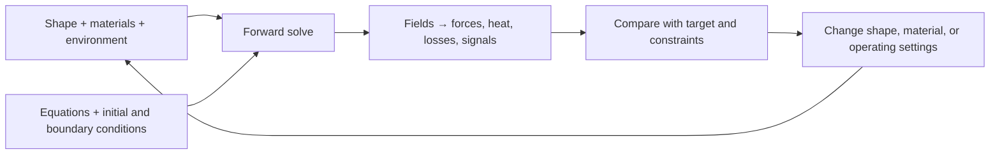

# OpenFOAM jobs and the cuts that organize them

[Atlas](README.md) · [People using it](02-real-world-use.md) · [RCCM possibilities](03-rccm-possibilities.md) · [Code evidence](07-openfoam-code-map.md)

OpenFOAM is a programmable numerical workshop for fields distributed through space. Its main territory is computational fluid dynamics (CFD): divide a region into cells, account for what crosses their faces, and solve equations for pressure, velocity, temperature, species, and other fields. You supply the geometry, physical model, initial conditions, boundary conditions, and numerical choices. The result is a calculated field and measurements extracted from it.

Imagine a wind tunnel. The tunnel walls and inlet enclose the field; a car occupies part of it; air crosses the remaining space. OpenFOAM solves in that surrounding air and measures the forces on the car. In a nozzle, the important fluid occupies the inside of the shape. In a heat exchanger, adjacent solid and fluid regions exchange heat. The same numerical infrastructure can also carry other equations; its included legacy examples even reach molecular dynamics and a financial PDE. The [Foundation solver guide](https://doc.cfd.direct/openfoam/user-guide-v13/standard-solvers) describes those examples; the [local code map](07-openfoam-code-map.md) is the authority for this checkout.

## Two directions through the workshop

**Forward:** given this nozzle, inlet state, and back pressure, where do shocks form and what thrust results?

**Inverse design:** given desired thrust, mass flow, available length, permitted temperature, and operating range, which nozzle shapes score best? A search loop proposes shapes, runs forward cases, and compares measurements. Several shapes may satisfy the target; some targets are physically unreachable. An optimizer finds candidates within the chosen model, parameterization, and constraints, without guaranteeing a globally ideal design.

**Inverse inference** is a third direction: given pressure or temperature measurements, infer an unknown leak, boundary condition, or material parameter. Here the unknown is what already exists. Design chooses what to build. Control chooses how an existing system should operate over time.

The Foundation checkout has a narrow legacy duct-blockage adjoint example. The more elaborate `adjointOptimisationFoam` documented by OpenCFD belongs to a separate distribution. A compressible rocket-nozzle design loop is additional work; the presence of the duct example does not supply it. See the [code audit](07-openfoam-code-map.md).

## Capability labels

The unit of classification is a **particular task under specified assumptions**, not a whole industry.

| Label | Meaning |
|---|---|
| **S — stock family** | A relevant solver/module exists in the inspected Foundation tree; a suitable case and validation are still required |
| **W — workflow** | Existing solvers can be orchestrated, but objectives, search, data assimilation, or reporting must be supplied |
| **M — model development** | Additional equations, closures, boundary conditions, or coupling must be implemented |
| **E — ecosystem** | A separate project/distribution has relevant capability; installation and compatibility are separate questions |
| **R — RCCM research** | The proposed interpretation or predictive contract still needs work; see the [formal gaps](04-equation-contract-and-gaps.md) |

Evidence that somebody used a tool is recorded separately in the [use ledger](02-real-world-use.md). A plausible job below is not itself evidence of a deployment. This is a broad coverage map and a recipe for extending it, rather than an exhaustive census of every user or every possible equation.

## Jobs independent of industry

These 18 verbs cross the physical domains in the next table.

| Job | What the person wants to decide | Necessary output | Usual route |
|---|---|---|---|
| J01 Predict | What happens to this system under these conditions? | Fields, integral quantities, time histories | S |
| J02 Compare | Which of these designs performs better? | Same metrics under matched conditions | S + W |
| J03 Size | How large must a passage, pump, heat sink, or chamber be? | Performance against a requirement | W |
| J04 Diagnose | Where does pressure, heat, material, or performance get lost? | Local budgets and causal interventions | S + W |
| J05 Find limits | Where do separation, boiling, choking, or instability begin? | Operating envelope and transition markers | S/M + W |
| J06 Optimize shape | Which geometry best meets a target? | Candidate geometry, objective, constraint margins | W; adjoint where applicable |
| J07 Optimize materials | Which porosity, conductivity, rheology, or phase distribution helps? | Material layout and sensitivity | W/M |
| J08 Tune operation | Which inlet settings, timing, or actuator schedule should we use? | Operating settings and robust performance | W/M |
| J09 Infer hidden state | Which leak, coefficient, or source explains observations? | Estimate, uncertainty, identifiability check | W/M |
| J10 Design an experiment | Which sensor or intervention distinguishes explanations? | Locations, sampling schedule, predicted separations | W |
| J11 Quantify uncertainty | Does the decision survive uncertain inputs and model choices? | Distributions, sensitivity, alternative-model comparison | W |
| J12 Prevent failure | Which conditions create damaging loads or inadequate cooling? | Exposure and failure indicators tied to a material model | S/M + W |
| J13 Scale up or down | Will a lab process behave similarly at factory scale? | Dimensionless groups and scale-dependent departures | S/M + W |
| J14 Couple domains | How do flow, solids, chemistry, circuits, and controllers interact? | Conservative exchange across interfaces | S where included; otherwise M/E |
| J15 Reduce computation | Can a smaller model answer repeated questions quickly? | Surrogate/reduced model and measured error envelope | W/E |
| J16 Understand and teach | Which mechanism produces the observed structure? | Controlled examples, slices, budgets, animations | S + W |
| J17 Develop physics | Does this proposed constitutive law produce consistent behavior? | Verification cases and discriminating predictions | M; R for RCCM |
| J18 Reproduce and communicate | Can another person obtain and assess this result? | Pinned case, inputs, solver version, logs, plots | W |

A digital twin combines J01, J09, and J15 with live measurements and a synchronization policy. A compelling animation can serve J16, but cannot replace J18. OpenFOAM alone does not automatically provide either complete workflow.

## Physical territory and concrete jobs

This table inventories distinct engineering outcomes; related jobs share rows to keep the map navigable. Routes refer to relevant numerical building blocks, not a promise that every detailed product scenario is ready to run. Exact Foundation modules and limitations are in [the code map](07-openfoam-code-map.md); the [module guide](https://doc.cfd.direct/openfoam/user-guide-v13/solvers-modules) provides a second reference.

| Territory | Concrete jobs people can pose | Measurements / decisions | Route and boundary |
|---|---|---|---|
| External aerodynamics | Compare wings, car bodies, fairings, drones; locate separation and wakes | Lift, drag, moments, unsteady loads | S; transition, turbulence, compressibility and mesh resolution matter |
| Internal passages | Size ducts, bends, manifolds and valves; remove dead zones; balance branches | Pressure loss, flow split, residence time | S; geometry search W |
| Rocket and high-speed nozzles | Compare expansion shapes, choking, shocks and back-pressure response | Mass flow, thrust, wall pressure | S compressible/shock families; reacting plume, cooling, ablation add selected models/couplings |
| Turbomachinery | Compare fans, pumps, turbines, propellers and mixers | Head, torque, efficiency, blade loading | S with rotating/moving regions; specialized physics M |
| Marine hydrodynamics | Compare hulls, wave loading, sloshing, free-surface motion | Resistance, motions, loads, overtopping | S multiphase/motion building blocks; specialist toolchains E |
| Wind energy | Examine terrain flow, rotor wakes and farm arrangements | Power, wake deficit, fatigue-relevant loads | S foundations; atmospheric/rotor/control coupling often E/M |
| Buildings and HVAC | Place vents, remove hot spots, assess comfort and ventilation | Temperature, draft, air age, contaminant concentration | S; comfort/exposure interpretation W |
| Urban/environmental dispersion | Follow pollution, smoke, releases and pedestrian-level winds | Concentration maps, dilution, pressure loads | S transport foundations; atmospheric/source models M/E |
| Rivers, coasts and floods | Model channels, free-surface fronts, structures and inundation | Depth, velocity, impact force, flood extent | S including shallow-water legacy; sediment/terrain workflows M/E |
| Thermal management | Compare electronics heat sinks, cold plates and battery coolant passages | Peak temperature, uniformity, pressure penalty | S fluid/solid heat transfer; electrochemistry and runaway generation M/E |
| Heat exchangers | Compare baffles, channels and conjugate conduction | Heat duty, effectiveness, pumping cost | S + W |
| Combustion and engines | Study mixing, ignition, flame behavior, engine cycles and emissions | Heat release, species, pressure, pollutant proxies | S reacting families with supplied chemistry/turbulence models |
| Fire and suppression | Model flame spread environments, heat exposure, sprays | Heat flux, smoke, temperature, suppression response | S components; validated fire-specific configurations M/E |
| Chemical reactors | Compare mixing, residence-time distributions, reacting flows and mass transfer | Conversion, selectivity, hot spots, throughput | S components + chosen kinetic/transfer laws |
| Bubble columns and aeration | Improve gas-liquid contact and phase distribution | Gas holdup, transfer, bubble-size distribution | S Eulerian multiphase/population balance with closures |
| Sprays and atomization | Change injector conditions, droplets, evaporation and deposition | Size distribution, penetration, cooling, coverage | S particle/multiphase components; breakup models determine scope |
| Separation and filtration | Compare cyclones, settling tanks, filters and porous media | Capture, carryover, pressure loss | S components; fouling/capture laws often M |
| Powders and granular process | Study fluidized beds, pneumatic transport, segregation and wear exposure | Solids distribution, pressure, particle impacts | S dense-particle/multiphase components; contact/erosion models scoped |
| Coatings, films and printing | Study wall films, wetting, drying and deposition | Film thickness, defects, coverage | S film/VoF components; surface chemistry M |
| Phase change and manufacturing | Compare boiling/condensation, melting/freezing, casting or melt pools | Interfaces, cooling rate, thermal gradients | S/M depending on closure and material; microstructure requires more physics |
| Porous geology and resources | Model passage through porous structures and thermal transport | Permeability response, pressure, heat | S porous foundations; multiphase geochemistry/geomechanics M/E |
| Biomedical transport | Explore blood/device flow, airway airflow, particles or microfluidics | Shear exposure, pressure, deposition, mixing | S foundations with suitable rheology; tissue response and clinical conclusions separate |
| Acoustics and waves | Propagate resolved pressure waves; estimate flow-induced noise | Wave speed, spectra, acoustic loading | S/M; turbulence resolution and acoustic propagation method must match the question |
| Elastic solids | Calculate small-strain displacement and thermal stress | Deformation and stress | S narrow linear-elastic module; broad nonlinear FSI/material failure M/E |
| Electrostatics | Solve charge/potential configurations | Potential and electric field | S narrow legacy solver; device material response additional |
| Permanent magnets | Calculate a prescribed magnet arrangement's field | Magnetic potential and flux pattern | S narrow legacy solver; hysteresis/dynamic magnetization additional |
| Conducting-fluid MHD | Explore magnetic influence on a conducting flow | Velocity, magnetic field, pressure | S narrow legacy laminar incompressible formulation |
| Induction and electrothermal process | Explore field-driven heating, reactors and melt stirring | Power deposition, temperature, flow | M/E; stock MHD is not the full induction-heating toolchain |
| Rarefied gases | Study dilute molecular transport outside ordinary continuum assumptions | Molecular statistics, fluxes, stress | S legacy DSMC with scoped collision/species models |
| Classical molecular fluid models | Explore particles interacting through prescribed potentials | Trajectories and statistical observables | S legacy MD examples; electronic structure/bond discovery separate |
| Superconductor systems | Improve coolant delivery and thermal uniformity around coils | Pressure drop, coolant state, heat-removal margin | S thermal/hydraulic work now; superconducting response needs a separate model |
| New continuum theories | Encode additional field equations and constitutive relations | Controlled predictions and comparison tests | M; R for the RCCM tensor theory |

Meshing, dimensional units, linear algebra, parallel decomposition, field sampling, restart files, and post-processing cut across every row. They lower implementation cost. They do not choose the appropriate physical model or establish its adequacy for a particular material or regime.

## Sixteen hyperslices

Method: Hyperslice exploration with independent research/code/formal audits. These are operational razors, not a statistically validated classification instrument. Each cut asks about one declared job, variable, or run. A project can include jobs on both halves; that is evidence to decompose the project, not force its label.

| Razor | Half A / half B | Placement and counterexample | Verdict |
|---|---|---|---|
| 1. Which quantity is unknown? | Response / configuration | Wind tunnel predicts response; nozzle design seeks configuration. Inference may seek a source, requiring the broader word configuration. | Strong at job level |
| 2. What is changed? | Geometry fixed / geometry varied | Tuning a fan speed is design with fixed geometry. A moving blade has changing geometry without design search. Specify design variation versus physical motion. | Strong after separating the two meanings |
| 3. Where is a field obtained? | Prescribed input / solved state | Imposed gravity versus self-consistent gravitational field. A solved field can become a prescribed input to a later stage. | Strong per field and stage |
| 4. Is there feedback? | One-way coupling / two-way coupling | Read heat from a flow versus temperature altering viscosity and flow. Unidirectional coupling can be sufficient in a weak-feedback regime. | Strong per interface |
| 5. What does the observable require? | One state / an ordered history | Pressure snapshot versus fatigue or spectral response. A steady-state field can contain mean quantities derived from unsteady physics. | Strong per observable |
| 6. How are scales represented? | Target scales resolved / effects closed below resolution | Resolved droplets versus averaged phase fractions. LES resolves some turbulence and models the rest. | Strong only after naming the scale |
| 7. Is the material law supplied? | Established for the intended regime / under investigation | Known coolant rheology versus RCCM shear law. A familiar law extrapolated beyond validation belongs on the research side. | Strong with a declared validity domain |
| 8. Does the task change topology? | Fixed connectivity / connectivity changes | Flow through a duct versus breakup, reconnection, or phase-boundary nucleation. Mesh topology and physical topology are different objects. | Strong when the object is named |
| 9. What is optimized? | Performance of a device / information from an experiment | Maximum cooling versus sensor placement that discriminates models. More variation may hurt the device but help the experiment. | Useful inversion |
| 10. What is represented? | Continuum field / discrete entities | Eulerian fluid versus particles. Coupled particle-fluid work lives on both sides. | Strong per state variable |
| 11. Is the interaction local? | Local constitutive response / spatial or temporal nonlocal response | Newtonian stress versus memory-dependent rheology or integral interaction. A PDE can communicate globally through local updates. | Useful, with precise response definition |
| 12. Which evidence is being tested? | Numerical implementation / physical model | Manufactured-solution convergence versus independent measurement. One experiment can contain separate checks of both. | Strong; retain two records |
| 13. Was the target already used? | Calibration data / withheld prediction data | Fitting a drag coefficient is distinct from predicting a new geometry's drag. Split by dataset provenance, not confidence. | Strong |
| 14. Where does capability reside? | Inspected checkout / external component | Foundation modules versus SOWFA, DAFoam, OpenCFD tools or a new RCCM library. Installed locally does not automatically mean stock. | Strong with commit provenance |
| 15. Which resource is scarce? | Compute time / missing information | A huge mesh may need HPC; an unspecified shear-pressure law cannot be cured by more cores. Many projects have both bottlenecks. | Useful diagnostic, not an exclusive project label |
| 16. What would success prove? | Meets a model-defined target / meets a measured physical target | A simulated levitator can pass its own objective while failing a bench test. Pin the observation operator on both sides. | Strong |

The failed cuts reveal extra axes. “Steady versus moving” confuses time dependence with geometry. “Fluid versus solid” breaks at viscoelasticity and fluid-solid interfaces. “Real versus sci-fi” confuses maturity with the type of job. “Tensor supported versus unsupported” confuses storing components with supplying correct transformation and evolution laws.

## Four squares that expose overlooked jobs

### Forward versus inverse × conventional versus RCCM physics

| | Forward response | Inverse configuration |
|---|---|---|
| Conventional model | Wind tunnel, cooling loop, MHD duct | Nozzle contour, heat-sink channels, magnet layout |
| Declared RCCM model | Slip/vorticity waves, pressure terrain, field-coupled specimen | Search for a boundary or drive pattern producing a specified tensor response |

The lower-right cell needs both an adequate RCCM forward model and an optimization workflow. A matrix constructor supplies neither on its own.

### Shape × drive

| | Fixed drive | Varied drive |
|---|---|---|
| Fixed shape | Characterization and baseline | Control, waveform design, active flow control |
| Varied shape | Passive design | Joint design of geometry and operating policy |

This square expands “find the ideal shape”: sometimes the useful change is timing, frequency, material orientation, or feedback rather than geometry.

### Device value × knowledge value

| | Low model discrimination | High model discrimination |
|---|---|---|
| Low immediate performance | Baseline/null case | A deliberately simple falsification fixture |
| High immediate performance | Optimization of a known mechanism | A useful prototype that also distinguishes competing laws |

Invert the usual value label: a design with negligible force can be the most valuable result if two theories predicted different forces there.

### Supplied field × supplied material response

| | Material response supplied | Material response unknown |
|---|---|---|
| External field supplied | Test a specimen or coolant fixture | Identify a constitutive relation |
| Field solved self-consistently | Coupled device simulation | Joint theory/material development, with identifiability hazards |

The superconductor ambition spans all four cells. Keeping the cells separate prevents coolant simulations from being mistaken for material discovery, and allows useful engineering to start before microscopic theory is complete.

## How to find another job

Choose a physical territory, a job verb, an unknown, a controllable boundary, and an observable. Cross two razors. Look for an empty cell. Then try to invalidate the proposed job: is its target feasible, are the required fields defined, does the observation distinguish alternatives, and does a solver for the required regime actually exist?

Example: **magnetic specimen × experiment design × unknown coupling × driven boundary × interferometer phase** generates a proposed RCCM discrimination experiment. It has a useful place on the map even before its constitutive law exists. Its next step is the [equation contract](04-equation-contract-and-gaps.md), followed by the [implementation gates](06-implementation-roadmap.md).
