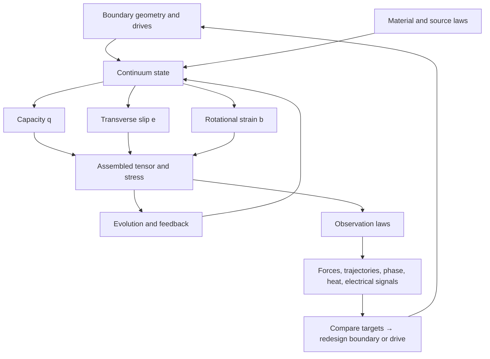

# What a complete RCCM field simulator would unlock

[Atlas](README.md) · [Jobs and hyperslices](01-jobs-and-hyperslices.md) · [Equation gaps](04-equation-contract-and-gaps.md) · [Roadmap](06-implementation-roadmap.md)

Imagine placing a device inside a volume of continuum. Each cell carries remaining pressure capacity, slip, and rotational strain. A boundary can drive the field; a material can redirect or store its motion; instruments can read forces, phase delays, heat, and flux. Change a boundary, replay the same initial state, and compare the response. That is the useful destination of an RCCM extension.[^status]

[^status]: This page explores conditional capabilities inside the two RCCM TeX models. Their physical identifications remain claims of those documents. The proposed tools below are design possibilities, not established physical effects or existing OpenFOAM features. Formal contradictions and validation requirements are collected in the [equation audit](04-equation-contract-and-gaps.md), [prototype audit](05-prototype-audit.md), and [roadmap](06-implementation-roadmap.md).

## Place the fields before the applications

In the focused source's local Cartesian construction, define three convenient storage quantities:

\[
q=\alpha_s^2=P_{static}/P_c,\qquad
\mathbf e=\alpha\mathbf v_\perp/c,\qquad
\mathbf b=\alpha t_p\boldsymbol\Omega.
\]

The scalar `q` occupies the capacity channel. The vector `e` occupies the time-space antisymmetric channel. The vector `b` occupies the spatial rotational channel. These seven values reconstruct the declared Section 3.3 matrix. They are normalized mechanical coordinates; conversion to measured volts, tesla, charge, and material response is another operation. A general transformed tensor need not retain this seven-parameter local form.

The pressure ledger also contains hidden structure: identical `q` values can result from different ambient and local loads. A saved matrix alone does not specify how those loads evolve. See [RCCM Data](../../rccm-data.md#seven-numbers-sixteen-slots) and [GfX Sections 1–3](../../RCCM-GfX-2.tex).

There are useful tools at several stopping points along this graph. A tensor inspector needs assembly rules. A ray tracer needs a prescribed field and a propagation law. A self-consistent world needs evolution and feedback. A materials-discovery tool additionally needs a way to generate the correct response from composition and structure.

## Five levels of possible tool

| Level | What the tool receives | What it can do | What unlocks the next level |
|---|---|---|---|
| P0 Inspect | Declared state or field recipe | Assemble, slice, transform and compare tensors; show pressure capacity | Spatial operators and observation definitions |
| P1 Probe | Prescribed field + test object/instrument | Trace waves/rays or calculate a specified response without backreaction | A closed evolution system |
| P2 Evolve | Complete state + equations + initial/boundary conditions | Propagate disturbances and measure conservation/stability | Consistent source/material feedback |
| P3 Couple | Evolving continuum + material/source models | Predict a device and its surroundings together | Searchable controls, objectives and gradients/sensitivities |
| P4 Design/discover | Forward model verified numerically and validated within a declared regime + target + constraints | Search geometries, drives, materials or experiments | Independent tests of the resulting candidates; additional validation when entering a new regime |

These are dependency levels, not implementation estimates. P0 and selected P1 tools can be built before the complete P2 contract is settled. Some P3 tools can use conventional material laws while a more ambitious microscopic theory remains under development.

## Thirty-four possibilities

Each row is a job: an intervention, a readout, and the added contract needed to make it answerable. The intent is to cover the space from learning tools to speculative engineering without collapsing their dependencies.

| ID | Possible tool / job | Change this | Read this | Minimum level and added contract |
|---|---|---|---|---|
| R01 | Tensor field workbench | Ambient load, slip, vorticity | Components, eigenstructure under a named operator, capacity budget | P0; basis/index conventions |
| R02 | Pressure-terrain lens | Prescribed pressure or index profile | Ray bending, travel time, caustics | P1; consistent propagation/index law |
| R03 | Frame comparison laboratory | Observer velocity/orientation | Transformed fields and invariant checks | P0/P1; transformation and measurement rules |
| R04 | Wave and polarization tunnel | Pulse shape, polarization, background state | Speed, dispersion, conversion and attenuation | P2; selected consistent wave sector |
| R05 | Rheology spectroscopy | Drive frequency/amplitude | Phase lag, stored and dissipated energy | P2; relaxation law and energy ledger |
| R06 | Vortex and topological-defect laboratory | Initial winding, spacing and geometry | Stability, interaction, conserved circulation, reconnection events | P2/P3; defect dynamics and topology rules |
| R07 | Cavitation/yield microscope | Local load toward a threshold | Boundary formation, radius, energy released or absorbed | P2/P3; phase transition/free-boundary law |
| R08 | Unified force accounting | Device geometry and imposed fields | Surface traction, torque, momentum carried out of the domain | P3; stress and source accounting |
| R09 | Gravity-response bench | Source distribution and test-body placement | Acceleration, tidal response, time/phase differences | P3; sourced gravitational closure and observables |
| R10 | Rotating-source lens bench | Rotation and source profile | Direction-dependent propagation and lensing | P1 for prescribed profile; P3 for self-consistent source |
| R11 | Clock/interferometer landscape | Paths through varying capacity | Differential phase/time signals | P1/P3; clock and detector coupling |
| R12 | Field-guide or resonator design | Boundary shape, impedance, drive frequency | Mode profiles, transmission, confinement, quality factor | P3/P4; material interface and loss laws |
| R13 | Antenna/transducer design | Geometry and drive waveform | Radiation pattern, mode conversion, efficiency | P3/P4; sourced EM mapping and radiation boundary |
| R14 | Metamaterial unit-cell search | Repeated geometry and orientation | Effective anisotropy, band gaps, dispersion | P3/P4; periodic response and homogenization |
| R15 | Magnetic-domain laboratory | Orientation, defects, temperature and drive | Domains, hysteresis, switching and losses | P3; magnetization dynamics/material law |
| R16 | Superconducting response bench | Field, temperature, current and specimen geometry | Flux penetration, current persistence, critical boundaries | P3; superconducting constitutive/phase dynamics |
| R17 | Flux-pinning design | Defect placement and geometry | Trapped flux, transport limit, AC losses | P3/P4; vortex/material pinning response |
| R18 | Junction or SQUID design | Barrier, loop and drive | Current-phase and interference response | P3/P4; phase coherence and junction law |
| R19 | Superconducting coil system | Conductor arrangement, cooling and ramp schedule | Thermal margin, force, flux and quench propagation | P3/P4; electrical/thermal/mechanical coupling |
| R20 | Chemistry reaction cell | Species configuration, environment and drive | Stable states, reaction energies and rates | P3; atom/species identity and interaction law |
| R21 | Catalyst or pathway search | Surface structure and applied field | Barrier changes, selectivity and turnover | P4; validated reaction/material model |
| R22 | Crystal/defect/material search | Composition, lattice, strain and defects | Stability, transport, elastic and phase response | P4; composition-to-response prediction |
| R23 | Coupled transport design | Temperature, concentration and electric/magnetic gradients | Heat, mass and charge fluxes | P3/P4; reciprocal couplings and dissipative closure |
| R24 | New propulsion concept bench | Geometry, internal circulation and drive | Net impulse with complete reaction/flux accounting | P3/P4; sources, boundary exchange and momentum conservation |
| R25 | Levitation or force-shaping search | Source/field layout and support geometry | Stable equilibria, stiffness, load capacity and power | P3/P4; measured force law and source cost |
| R26 | Inertia/clock/field-coupling experiment | Controlled EM or strain loading | Predicted differential mechanical/clock signal | P3/P4; a specified cross-sector prediction |
| R27 | Energy converter or storage geometry | Drive cycle and boundary arrangement | Recoverable energy, losses, work in/out | P3/P4; complete thermodynamic cycle and reservoirs |
| R28 | Theory-discrimination optimizer | Sensor locations and excitation waveform | Separation of competing models after noise/uncertainty | P1–P4 depending on models; observation likelihood |
| R29 | Hidden-source tomography | Sensor arrangement and assumed source family | Reconstructed field/source and ambiguity | P1–P4; inverse model and identifiability |
| R30 | Multiscale material library | Microscopic cell and averaging scale | Effective coefficients for device-scale solvers | P3; tested coarse-graining map |
| R31 | Interactive world/game sandbox | Objects, boundaries and fields | Immediate behavior with an error-controlled approximation | P2/P3; reduced model and reference cases |
| R32 | Reproducible counterfactual laboratory | One intervention per saved state | What changed, where energy/momentum went, model comparison | P0–P4; complete state/provenance/replay contract |
| R33 | Cosmological virtual observatory | Source distribution, background history and viewing geometry | Lensing, distance–redshift relations, time delays and high-redshift chronometers | P1/P3; current Condensed cosmology, consistent light/clock observables and observational likelihood |
| R34 | Particle and composite-state laboratory | Defect geometry, winding, spacing and incident disturbances | Stable masses, spectra, scattering and bound-state behavior | P3; stable defect/material dynamics, state identity, interaction and detector rules |

Rows R09–R11 follow the gravity and geometric-propagation territory of [GfX Sections 4, 10–11 and 13](../../RCCM-GfX-2.tex), compared with the current condensed GRIN and Rosetta-stone sections. R04–R08 and R12–R18 follow the pressure, vorticity, wave and eigenstate territory in GfX Sections 2–9 and 14. R20–R23 require substantial material-level development beyond the presently supplied equations. R24–R27 are experimentally testable design questions whose outcome may be a null effect or a useful bound. No beneficial answer is assumed by naming the job.

R33 uses the current [Condensed cosmology](../../RCCM-Condensed.tex), including its direct chronometer; the older [reproduction package](../../README.md#refractive-cosmology-version-boundary-and-reading-route) is a separately versioned comparison. R34 follows the focused source's mass, eigenstate and force claims in Sections 8–9, 12 and 15. Recovering a named eigenvalue or coupling constant does not yet specify a scattering simulation.

## Superconductors: four separate rooms

**Room 1: engineering around a known superconductor.** Put a known conductor in a coil, add cooling passages, and compute heat removal, pressure drop and mechanical loading. The [ITER cooling example](02-real-world-use.md) already belongs here. OpenFOAM can provide relevant conventional thermal/hydraulic pieces now; a coupled electrical or quench model supplies the heat-generation feedback.

**Room 2: simulating the superconducting response.** Represent the specimen's state, temperature dependence, currents, flux, losses, boundaries and defects. A conventional continuum approach might use a Ginzburg–Landau-type order parameter or an application-specific measured constitutive law, within its own validity range. That model must distinguish superconducting response from merely assigning very high conductivity. Numerical work on [Ginzburg–Landau flux-line distributions](https://journals.aps.org/prb/abstract/10.1103/PhysRevB.64.064517) illustrates the additional field structure.

**Room 3: explaining that response through RCCM.** Identify which RCCM state corresponds to the material's coherent state, which evolution law preserves or destroys it, how external field and temperature couple to it, and how its normalized variables become measured current and magnetic flux. Then recover a known specimen's response with fixed parameters.

**Room 4: discovering a new material.** Start with composition, crystal arrangement, defects and processing conditions, and calculate stability and response. This requires a composition-to-material model. A general continuum simulator cannot infer it from a material's name. Conventional electronic-structure packages occupy part of this territory; [Quantum ESPRESSO's authors](https://arxiv.org/abs/0906.2569) describe their DFT-based materials framework. RCCM would need its own predictive bridge or a declared coupling to such a model.

The key observables should include resistance versus temperature, magnetic response, and current/field limits, under specified sample and measurement conditions. The [NIST rhenium-film experiment](https://www.nist.gov/publications/enhanced-superconducting-transition-temperature-electroplated-rhenium) is a concrete example of measuring several of these together. Geometry and defects matter for flux behavior, so the virtual experiment must reproduce the physical protocol, not just display a field-free interior. The existing [room-temperature-superconductivity guide](../../LK-99-Room-Temperature-Superconductivity-and-Tau-Fluidics.md) maintains the broader claim and evidence map.

## Turn a wacky idea into a runnable question

Consider “can this toroidal structure produce an unusual external force?” Put the device, supports, power leads, source fields and outer boundary inside the accounting region. Specify the drive, the quantity measured by a force sensor, and a comparison configuration with one changed feature. Record impulse on the device, reaction on supports/sources, and momentum crossing the outer boundary. Search geometry or waveform only after this forward measurement is defined.

The same form works for a lens, resonator, levitator, superconducting specimen or energy converter:

| Slot | Concrete content |
|---|---|
| Intended job | The decision the result changes |
| Domain | Specimen, surrounding field, sources, supports and reservoirs |
| Knobs | Geometry, composition, temperature, drive and operating schedule |
| Declared model | Exact equations, constitutive laws, normalization and version |
| Target measurement | Force, phase, resistance, flux, heat or another observable with units |
| Constraints | Available power, material state, size, temperature and allowed boundary exchange |
| Comparison | Known limit, alternative model, null arrangement, or independent measurement |
| Exit rule | A quantitative result that advances, rejects or narrows the idea |

This is the inverse-design cell of the hyperslice map applied to a new forward model. The worthwhile early output can be a proposed experiment, an impossible target under the declared conservation laws, or a field profile worth investigating—not only a finished device.

## High-value empty cells

Crossing the slices produces possibilities beyond a universal physics sandbox:

- **Inverse design × model uncertainty:** search for a geometry that works across several plausible closures, or exposes where those closures disagree.
- **Fixed geometry × varied drive:** design a waveform that excites one tensor sector while suppressing another; measure conversion instead of rebuilding the object.
- **Prescribed field × inverse inference:** reconstruct the simplest field compatible with measured phase delays before attempting a full cosmological or material model.
- **Microscopic structure × effective device response:** generate a material-response table from a small periodic cell, then carry that table into a much larger nozzle, coil or resonator case.
- **Interactive preview × rigorous replay:** manipulate a fast approximation, then export the exact selected experiment to a slower solver with error and conservation checks.
- **Low device performance × high scientific value:** optimize a null experiment that separates RCCM from a conventional prediction with minimal confounding response.

The shortest current route is an inspector and a prescribed-field experiment, followed by a carefully selected closed wave/continuum sector. The gates for extending this into coupled matter and design are in [the implementation roadmap](06-implementation-roadmap.md).
