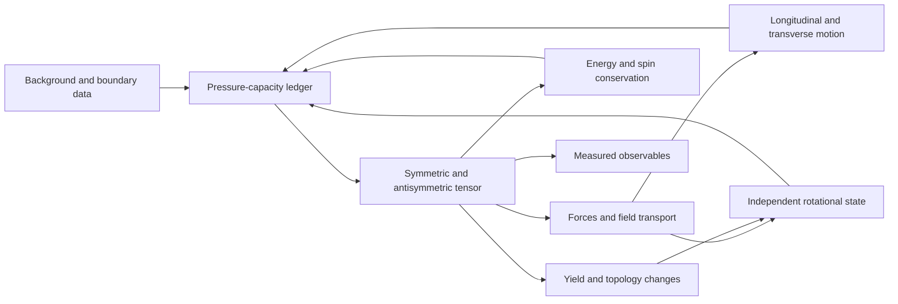

# The equation contract required for an RCCM simulator

Navigation: [atlas](README.md) · [conditional possibilities](03-rccm-possibilities.md) · [prototype audit](05-prototype-audit.md) · [implementation roadmap](06-implementation-roadmap.md).

The largest gap is a single, closed mathematical contract: which fields exist, which equations advance them, which constraints they obey, and how their outputs become measured quantities. OpenFOAM can provide much of the numerical machinery once that contract exists. A matrix assembled from fields is a useful observable; it does not by itself determine the fields' next state.

This audit read all 15 sections of [RCCM-GfX-2.tex](../../RCCM-GfX-2.tex), compared the matching sections of [RCCM-Condensed.tex](../../RCCM-Condensed.tex), and inspected the [prototype](../../binyamin-sim/asymmetricTensorFoam.c). The TeX files are canonical; no TeX equations were changed. Line references identify the inspected snapshot. Findings distinguish algebraic definitions, missing evolution/closure, internal inconsistencies, and physical identifications that need independent validation.

## Place the model in a computational field

At every mesh cell, the focused document proposes a pressure-capacity ledger, motion in several modes, and a local matrix. Neighboring cells exchange momentum, energy, shear and rotation. Defects and material interfaces introduce additional boundaries. A simulator must say what crosses each boundary and what is conserved when a boundary moves, forms or disappears.

Several arrows above are proposals in the text, rather than implemented update rules. In TypeScript terms, the documents provide many types and transformations, but the shared `step(state, boundary, dt)` contract remains incomplete.

## What is explicitly available

| Layer | Focused definition or equation | What remains to make it executable |
|---|---|---|
| Motion decomposition | `v = ∇h + v_perp + λΩ∇βΩ`; `Ω = ∇λΩ × ∇βΩ`. [§1, lines 31–45](</Users/tom/Library/Mobile Documents/com~apple~CloudDocs/RCCM/RCCM-GfX-2.tex:31>) | Evolution and boundary conditions for the potentials/slip, their gauge freedom, and rules enforcing the asserted orthogonality. General vector fields do not automatically split into pointwise orthogonal modes. |
| Capacity ledger | `Pc = ρτ c²/2`; `Pambient = Pc − ΔPmacro`; `Pstatic = Pambient − Pdyn − Pshear`; `αs² = αg² αa² = Pstatic/Pc`. [§2, lines 49–85](</Users/tom/Library/Mobile Documents/com~apple~CloudDocs/RCCM/RCCM-GfX-2.tex:49>) | A consistent shear-load law, background-source evolution, admissible states, and a rule at/exceeding zero capacity. A steady incompressible streamline Bernoulli integral alone does not close arbitrary unsteady, dissipative, rotating fields. |
| Matrix | Covariant `S + A` construction and explicit local Cartesian `4 × 4` matrix. [§3, lines 88–143](</Users/tom/Library/Mobile Documents/com~apple~CloudDocs/RCCM/RCCM-GfX-2.tex:88>) | Frame/basis and index-raising convention, independent state count, and reconciliation of the local matrix with moving-frame components. |
| Stress map | `T̂ = Pc(Û − η)`; local `T̂00 = ΔPmacro + Pdyn + Pshear`. [§4, lines 147–170](</Users/tom/Library/Mobile Documents/com~apple~CloudDocs/RCCM/RCCM-GfX-2.tex:147>) | Constitutive energy versus momentum-flux interpretation, consistent spin balance, and an energy transport equation. |
| Motion | Admittance-modified momentum equation. [§5.1, lines 322–383](</Users/tom/Library/Mobile Documents/com~apple~CloudDocs/RCCM/RCCM-GfX-2.tex:322>) | Density/source normalization repairs listed below; constitutive `T_perp` and viscosity; compatible continuity law. |
| Weak static gravity | `∇²Φ − rc²∇⁴Φ = 4πGρ`. [§6.4, lines 591–617](</Users/tom/Library/Mobile Documents/com~apple~CloudDocs/RCCM/RCCM-GfX-2.tex:591>) | Source sign/convention, meaning of `ρ`, fixed versus evolving `rc`, two sets of elliptic boundary data, and coupling back to moving matter. |
| Vacuum transverse waves | A curl pair and resulting `∂tt v_perp = c²∇²v_perp`. [§14.1, lines 1462–1488](</Users/tom/Library/Mobile Documents/com~apple~CloudDocs/RCCM/RCCM-GfX-2.tex:1462>) | Consistent component signs, divergence constraints, source/material terms and normalization to measured EM fields. This is an actual PDE seed, not merely an eigenvalue analogy. |
| Nonlinear geometry | Connection decomposition, torsion map and proposed action. [§13, lines 1397–1449](</Users/tom/Library/Mobile Documents/com~apple~CloudDocs/RCCM/RCCM-GfX-2.tex:1397>) | Full variational equations, dimensional normalization, independent connection variables and compatibility constraints. |
| Yield and defects | Capacity-zero, determinant-zero, Compton and Schwarzschild boundaries. [§8](</Users/tom/Library/Mobile Documents/com~apple~CloudDocs/RCCM/RCCM-GfX-2.tex:812>), [§9.7–9.9](</Users/tom/Library/Mobile Documents/com~apple~CloudDocs/RCCM/RCCM-GfX-2.tex:1001>) | Nucleation, topology change, interface motion, energy/spin exchange, post-yield constitutive law, and a demonstrated nonsingular continuation. |

The condensed document also supplies **sourced** electromagnetic equations: Gauss's law, Ampère-Maxwell, a current projection, Poynting flux and electrical conversion constants. See [lines 3141–3162](</Users/tom/Library/Mobile Documents/com~apple~CloudDocs/RCCM/RCCM-Condensed.tex:3141>), [3195–3213](</Users/tom/Library/Mobile Documents/com~apple~CloudDocs/RCCM/RCCM-Condensed.tex:3195>), and [3226–3237](</Users/tom/Library/Mobile Documents/com~apple~CloudDocs/RCCM/RCCM-Condensed.tex:3226>). Therefore “RCCM has no Maxwell equations” would be an inaccurate diagnosis. The missing bridge is between these fields, units and sources and the focused tensor's normalized slip/vorticity state, followed by evolution laws for actual charged material.

## Required field and unit registry

Choose this registry before discretization. Dimensions below follow the focused definitions; `L`, `T`, `M` mean length, time and mass.

| Quantity | Dimensions | Required decision |
|---|---|---|
| `x`, `t`, `c` | `L`, `T`, `L/T` | Use `x⁰ = ct` consistently or explicitly nondimensionalize all coordinates. |
| `h` | `L²/T` | Its gradient is a velocity. |
| `v`, `v_perp`, `λΩ∇βΩ` | `L/T` | Define which velocity transports which field. |
| `λΩ`, `βΩ` | Product `[λΩ][βΩ] = L²/T` | Individual dimensions and gauge are unspecified. |
| `Ω`, `ωμν`, `tp` | `1/T`, `1/T`, `T` | Establish exact curl/axial-tensor sign and factor conventions. |
| `Pc`, pressure, physical stress | `M/(L T²)` | Separate positive energy density, signed stress and action density. |
| `ρτ`, `ρdyn`, `ρeff`, source `ρ` | `M/L³` | These are distinct roles; dimensions do not make them interchangeable. |
| `α`, `αs`, `αg`, `αa`, `De` | Dimensionless | Preserve powers and subscripts; identify constants versus evolving fields. |
| `μ`, `ν` | `M/(L T)`, `L²/T` | Dynamic versus kinematic viscosity; determine state/frequency dependence. |
| `Û`, `S`, `A` in an orthonormal Cartesian basis | Dimensionless | Coordinate-basis spherical components acquire basis scale factors. |
| `Φ`, `rc`, `Λ` | `L²/T²`, `L`, `1/L²` | Fix source signs, physical branch and coupling constants. |
| EM observables, charge/current, material temperature | Additional measured-unit registry | Define the conversion and source contracts rather than inserting SI `E` and `B` directly into dimensionless slots. |

## Internal findings that block faithful implementation

### F1. The pressure ledger needs a positive-load definition distinct from the action invariant

Section 2 treats shear as a load consuming capacity. Section 8.3 identifies `Pshear = Pc AμνA^μν/4`, while its own contraction gives

`AμνA^μν = −2α²|v_perp|²/c² + α²tp² ωμν ω^μν`.

For pure transverse slip with zero rotational field, this makes `Pshear < 0`. It cannot simultaneously be an always-positive consumed energy budget. See [lines 875–895](</Users/tom/Library/Mobile Documents/com~apple~CloudDocs/RCCM/RCCM-GfX-2.tex:875>). A signed Lorentzian action invariant and positive stored energy can both be useful, but they require different names, formulas and conservation roles. The same slip already contributes to `Pdyn`, so double counting also needs an explicit decision.

**Acceptance probe:** pure slip, pure rotation and equal electric/magnetic normalized amplitudes must each have a specified energy, stress and capacity change, with a closed exchange ledger.

### F2. The momentum derivation changes inertial density without deriving the replacement

The covariant weak-field calculation yields `ρdyn = ρτ v²/c²` and uses its continuity equation to cancel the product-rule term. It then writes `ρeff Dv/Dt` and defines `ρeff = ρτ/αa`. These densities differ even at zero velocity: one vanishes, the other tends to `ρτ` in full ambient capacity. See [lines 295–351](</Users/tom/Library/Mobile Documents/com~apple~CloudDocs/RCCM/RCCM-GfX-2.tex:295>).

The expansion also says the fourth-order velocity term is dropped while retaining precisely that term as the convective flux; the order bookkeeping must be made consistent ([lines 307–319](</Users/tom/Library/Mobile Documents/com~apple~CloudDocs/RCCM/RCCM-GfX-2.tex:307>)).

If `ρdyn ∝ |v|²` and incompressibility are both imposed, its continuity equation requires `D|v|²/Dt = 0`. Generic forced or dissipative motion need not obey that. Define a source, use a different conserved density, or restrict the model's domain explicitly.

**Acceptance probe:** derive the conservative and material-derivative forms from one state definition and recover the same momentum residual for an accelerating, spatially varying field.

### F3. Normalizing the focused force equation drops a factor

From [line 363](</Users/tom/Library/Mobile Documents/com~apple~CloudDocs/RCCM/RCCM-GfX-2.tex:363>), multiplying by `αa/ρτ` gives an ambient term `−αa ∇Pambient/ρτ`. The final equation instead contains `−∇Pambient/ρτ` ([lines 367–380](</Users/tom/Library/Mobile Documents/com~apple~CloudDocs/RCCM/RCCM-GfX-2.tex:367>)). That does not follow from the preceding equation.

The condensed branch explicitly starts with a gravitational body force proportional to effective density, allowing that factor to cancel ([lines 2306–2326](</Users/tom/Library/Mobile Documents/com~apple~CloudDocs/RCCM/RCCM-Condensed.tex:2306>)). This may explain the intended result, but adopting it changes the focused premise. Record the selected equation and derivation; do not silently patch the algebra in code.

### F4. Capacity, boost and frame definitions need separation

`αs² = Pstatic/Pc` includes background and shear loads. Identifying `αs = γ⁻¹` for the three-velocity in `uμ` requires additional restrictions; it is not generally true with independent background/shear loads ([§§2–3](</Users/tom/Library/Mobile Documents/com~apple~CloudDocs/RCCM/RCCM-GfX-2.tex:49>)). The simple diagonal symmetric matrix is a local rest-frame form. The same covariant expression has nonzero symmetric `S0i` in a moving frame, as §5 itself computes.

**Acceptance probe:** assemble in a named rest frame, transform, and compare with direct covariant assembly. Keep passive coordinate changes separate from physical changes in the capacity ledger. Specify whether indices are raised with `η`, `S` or another object; [§12.3](</Users/tom/Library/Mobile Documents/com~apple~CloudDocs/RCCM/RCCM-GfX-2.tex:1393>) switches to the inverse symmetric metric for running-coupling claims.

### F5. An antisymmetric stress requires an explicit spin and couple-stress balance

Section 7.4 introduces a spin current but does not close its dynamics ([lines 784–807](</Users/tom/Library/Mobile Documents/com~apple~CloudDocs/RCCM/RCCM-GfX-2.tex:784>)). For orbital angular momentum `L^{μαβ} = xα T^{μβ} − xβ T^{μα}`, linear-momentum conservation gives

`∂μ L^{μαβ} = T^{αβ} − T^{βα}`.

Therefore conservation of total angular momentum needs `∂μ Σ^{μαβ} = T^{βα} − T^{αβ}` plus a constitutive/evolution law for `Σ`. Naming `skew(grad(v))` “spin” does not supply that missing field or balance.

**Acceptance probe:** an isolated rotating domain must exchange orbital and internal angular momentum while conserving their total, including boundary torques.

### F6. A metric is not determined by matching the dimensions of curvature

The identification `Gμν ≡ Λ(Sμν − ημν)` has curvature units, but does not establish equality to curvature computed from derivatives of the metric ([§4.3, lines 268–287](</Users/tom/Library/Mobile Documents/com~apple~CloudDocs/RCCM/RCCM-GfX-2.tex:268>)). A simple counterexample is a spatially constant nonbaseline `S`: its Levi-Civita connection and curvature vanish in Cartesian coordinates, whereas the proposed algebraic expression is nonzero.

Section 13 states a connection/torsion construction, but does not vary a complete matter-plus-geometry action to produce nonlinear evolution and constraints. The proposed relation `Torsion = ∇A` is itself an extra constitutive identification; metric compatibility alone does not derive it ([lines 1414–1447](</Users/tom/Library/Mobile Documents/com~apple~CloudDocs/RCCM/RCCM-GfX-2.tex:1414>)).

**Acceptance probe:** compute both claimed Einstein tensors for the same nonuniform field, check the appropriate contracted Bianchi identities, and identify the restricted domain in which equality holds. Since `Aμν dxμ dxν = 0`, the antisymmetric field also needs its stated force/connection coupling to affect trajectories; adding it to a line element alone has no effect.

### F7. The proposed action has unresolved signs, normalization and variable choices

For the displayed scalar Lagrangian

`L = ½ S □S − ½ rc²(□S)² + κρS`,

variation with fixed `rc`, fixed source and vanishing boundary terms gives

`□S − rc²□²S = −κρ`.

This has the opposite source sign to the positive-coupling Poisson equation subsequently displayed. See [§6.4, lines 597–614](</Users/tom/Library/Mobile Documents/com~apple~CloudDocs/RCCM/RCCM-GfX-2.tex:597>). Sign conventions or the coupling must be reconciled explicitly.

The earlier action carries unspecified proportionality constants; the later [§13 action](</Users/tom/Library/Mobile Documents/com~apple~CloudDocs/RCCM/RCCM-GfX-2.tex:1441>) multiplies curvature by `Pc`. Since curvature has `1/L²`, `Pc R` has pressure divided by length squared, rather than energy density, unless a missing length normalization or a different action-unit convention is supplied. Its “spin angular momentum density” coefficient in [line 1432](</Users/tom/Library/Mobile Documents/com~apple~CloudDocs/RCCM/RCCM-GfX-2.tex:1432>) likewise needs an explicit SI versus `x⁰=ct` conversion.

Choose whether `S`, capacity/potentials, and connection are independent variables. If `rc` is mass/state dependent, its derivatives and variations cannot be discarded as if it were a fixed constant. A fourth-order spatial PDE requires more boundary information than an ordinary pressure Poisson solve; a fourth-order temporal action also needs an initial-data and mode-selection analysis.

### F8. The vacuum wave pair is a useful seed, with a component-sign mismatch to settle

The two equations in [§14.1](</Users/tom/Library/Mobile Documents/com~apple~CloudDocs/RCCM/RCCM-GfX-2.tex:1468>) combine algebraically into the stated wave equation. But with the explicit matrix `A0i = −αv_i/c`, `Aij = −αtp εijk Ωk`, Minkowski raising and `x⁰=ct`, direct expansion of `∂μ A^{μi}=0` gives `∂t v/c² = −tp curl Ω`; the cyclic identity gives `tp ∂t Ω = +curl v`. The displayed pair has both signs reversed. Both pairs produce the same second-order wave speed, so a wave-speed test alone would miss this inconsistency.

Also impose both divergence constraints on initial data and maintain them numerically. A closed two-form/Bianchi condition is an additional constraint on independently parameterized fields, not a consequence of antisymmetry alone. Variable `α` or `tp` adds product-rule terms to equations that pull them outside derivatives.

**Acceptance probe:** a traveling wave's field orientation, propagation direction and energy flux must agree between the matrix divergence, curl pair and output observables.

### F9. Saturated-wave and screening formulas need mathematical repair

The chiral equation [§14.2, line 1513](</Users/tom/Library/Mobile Documents/com~apple~CloudDocs/RCCM/RCCM-GfX-2.tex:1513>) is `∂tt v = C Ω0 × ∇²v`, with positive scalar `C`. For a spatial Fourier mode along nonzero constant `Ω0`, the transverse cross-product operator has eigenvalues `±i|Ω0|`. Thus its temporal exponents satisfy `s² = ∓i C|Ω0|k²`, giving both growing and decaying modes. Circular eigenvectors alone do not establish stable propagating Faraday rotation. Determine whether terms, derivatives or constitutive dynamics are missing before implementing it as a physical wave law.

The screening equation `∇²A − αs⁻²A = 0` adds terms with different dimensions, and its purported attenuation length `λD = αs` is dimensionless ([§14.4, lines 1536–1543](</Users/tom/Library/Mobile Documents/com~apple~CloudDocs/RCCM/RCCM-GfX-2.tex:1536>)). An explicit reference length, nondimensional coordinate and material/source dependence are needed before predicting a measured screening distance.

### F10. Trace-free algebra does not impose incompressibility or finite-volume preservation

An antisymmetric matrix has zero trace for any velocity field. That does not imply `div(v)=0`, contrary to the inference used in [§15, lines 1566–1585](</Users/tom/Library/Mobile Documents/com~apple~CloudDocs/RCCM/RCCM-GfX-2.tex:1566>). For example, a uniformly expanding velocity field has zero skew gradient and nonzero divergence. Likewise a trace-free perturbation preserves determinant only to first order; `det(I+A)` need not equal one. The determinant constraint in [§9.4](</Users/tom/Library/Mobile Documents/com~apple~CloudDocs/RCCM/RCCM-GfX-2.tex:964>) must be imposed or derived separately.

The radial `v∝r⁻²`, `Pdyn∝r⁻⁴` branch in §15 and the harmonic-pressure `Pdyn∝r⁻¹` branch in [§5.2](</Users/tom/Library/Mobile Documents/com~apple~CloudDocs/RCCM/RCCM-GfX-2.tex:414>) require distinct regimes/source conditions. They cannot be one identical radial field without a stated bridge. Integrating uniform scalar pressure over a sphere as `P × area` computes a scalar loading magnitude; the **vector** resultant `∮P n dA` vanishes. Keep this distinction in the force derivations and in force postprocessing.

### F11. Zero capacity is an event requiring a continuation law

The tensor's spatial diagonals and several stated stresses/vorticities diverge as `αs→0`; see [§4.1](</Users/tom/Library/Mobile Documents/com~apple~CloudDocs/RCCM/RCCM-GfX-2.tex:166>), [§8.1](</Users/tom/Library/Mobile Documents/com~apple~CloudDocs/RCCM/RCCM-GfX-2.tex:828>) and [§9.9](</Users/tom/Library/Mobile Documents/com~apple~CloudDocs/RCCM/RCCM-GfX-2.tex:1075>). Calling this a phase transition does not specify the resulting finite state. A numerical floor avoids a pole but removes the exact event the model wants to study.

For defects, horizons, reconnection or pair production, specify event detection, new degrees of freedom, interface jump conditions, and energy/momentum/spin transfer. Demonstrate dependence on cutoff, mesh and timestep. The statements that strain remains finite and infinite compression is resolved need to be reconciled with the explicitly divergent formulas.

## Version boundaries between the two formal documents

| Topic | Focused GfX branch | Condensed branch | Implementation consequence |
|---|---|---|---|
| Baseline density | `ρτ = ρPlanck/(2π)`. [197–201](</Users/tom/Library/Mobile Documents/com~apple~CloudDocs/RCCM/RCCM-GfX-2.tex:197>) | `ρτ = 9ρPlanck/(4π)`. [3285–3289](</Users/tom/Library/Mobile Documents/com~apple~CloudDocs/RCCM/RCCM-Condensed.tex:3285>) | Factor **4.5** difference; choose a named parameter set and trace all dependent constants. |
| Inertia/admittance | `ρeff = ρτ/αa`; scalar nested ledger. [346–380](</Users/tom/Library/Mobile Documents/com~apple~CloudDocs/RCCM/RCCM-GfX-2.tex:346>) | Scalar `ρτ/αs` and tensor `ρτ[α]⁻¹`; three modal factors. [2153–2155](</Users/tom/Library/Mobile Documents/com~apple~CloudDocs/RCCM/RCCM-Condensed.tex:2153>), [2278–2287](</Users/tom/Library/Mobile Documents/com~apple~CloudDocs/RCCM/RCCM-Condensed.tex:2278>), [2738–2743](</Users/tom/Library/Mobile Documents/com~apple~CloudDocs/RCCM/RCCM-Condensed.tex:2738>) | Different state and force contracts; no spelling-based substitutions. |
| Ambient-force sign/meaning | Negative gradient of positive ambient pressure. [369–380](</Users/tom/Library/Mobile Documents/com~apple~CloudDocs/RCCM/RCCM-GfX-2.tex:369>) | Positive gradient of a quantity identified with ambient tension. [2343–2366](</Users/tom/Library/Mobile Documents/com~apple~CloudDocs/RCCM/RCCM-Condensed.tex:2343>) | Record physical pressure versus tension definitions before comparing signs. |
| Rotational representation | Clebsch curl has units `1/T`, normalized by `tp`. [31–43](</Users/tom/Library/Mobile Documents/com~apple~CloudDocs/RCCM/RCCM-GfX-2.tex:31>), [121–122](</Users/tom/Library/Mobile Documents/com~apple~CloudDocs/RCCM/RCCM-GfX-2.tex:121>) | `curl(v_ψ)` enters a squared-velocity sum and potential construction. [2729–2734](</Users/tom/Library/Mobile Documents/com~apple~CloudDocs/RCCM/RCCM-Condensed.tex:2729>) | Define the units of `v_ψ` and the map to the focused rotational velocity/vorticity. |
| Gravitational wave mode | Described as longitudinal volumetric strain. [625–644](</Users/tom/Library/Mobile Documents/com~apple~CloudDocs/RCCM/RCCM-GfX-2.tex:625>) | Described as transverse deviatoric shear. [3725–3727](</Users/tom/Library/Mobile Documents/com~apple~CloudDocs/RCCM/RCCM-Condensed.tex:3725>) | Polarization benchmark depends on which equation is selected. |
| Spherical geometry | Local Cartesian all-spatial `αs⁻²`; galactic ansatz changes angular terms. [125–133](</Users/tom/Library/Mobile Documents/com~apple~CloudDocs/RCCM/RCCM-GfX-2.tex:125>), [1230–1237](</Users/tom/Library/Mobile Documents/com~apple~CloudDocs/RCCM/RCCM-GfX-2.tex:1230>) | Radial `αs⁻²`, angular `r²`, `r² sin²θ`. [3647–3659](</Users/tom/Library/Mobile Documents/com~apple~CloudDocs/RCCM/RCCM-Condensed.tex:3647>) | A plain coordinate transform of isotropic spatial scaling would also scale angular terms; specify different ansatz or radial-coordinate redefinition. |
| Field action | Contraction, gradient/higher-derivative action, and connection action. [§6](</Users/tom/Library/Mobile Documents/com~apple~CloudDocs/RCCM/RCCM-GfX-2.tex:478>), [§13](</Users/tom/Library/Mobile Documents/com~apple~CloudDocs/RCCM/RCCM-GfX-2.tex:1397>) | Modal velocity-dependent action. [2767–2790](</Users/tom/Library/Mobile Documents/com~apple~CloudDocs/RCCM/RCCM-Condensed.tex:2767>) | Derive one executable action/equation system, or publish separately named experimental branches. |
| `SU(3)` state count | Five symmetric traceless plus three antisymmetric components. [1386](</Users/tom/Library/Mobile Documents/com~apple~CloudDocs/RCCM/RCCM-GfX-2.tex:1386>) | Calls a symmetric traceless matrix eight-dimensional, then adds imaginary antisymmetric generators. [3991–4026](</Users/tom/Library/Mobile Documents/com~apple~CloudDocs/RCCM/RCCM-Condensed.tex:3991>) | Real symmetric traceless `3 × 3` matrices have five independent entries. Eight real traceless entries alone do not establish the claimed gauge algebra or particle dynamics. |

For cosmology, the [root source-precedence route](../../AGENTS.md#refractive-cosmology-source-precedence) remains in force: current condensed cosmology precedes the historical `Refractive_Cosmology` reproduction package. A fit from the old package cannot choose the missing equation/parameter bridges here.

## What chemistry and superconductors additionally require

Neither TeX provides a superconducting material model or a chemical-species/bonding simulator. Targeted text inspection found no specification of Cooper pairing, Meissner response, Josephson dynamics or chemical reaction/material closures. The relevant existing material is the field/charge/force/topology construction, particularly [GfX §§8–9](</Users/tom/Library/Mobile Documents/com~apple~CloudDocs/RCCM/RCCM-GfX-2.tex:812>) and [Condensed EM/charge sections](</Users/tom/Library/Mobile Documents/com~apple~CloudDocs/RCCM/RCCM-Condensed.tex:3135>).

| Intended experiment | Extra contract needed beyond continuum field motion | First discriminating observable |
|---|---|---|
| Current-carrying sample in a magnetic field | Charge carriers, constitutive current response, thermal transport, measured field/unit mapping, sample interfaces and external circuit coupling | Current/field distribution and energy balance under a specified drive |
| Superconducting candidate | An order-parameter/coherence description or a demonstrated emergent equivalent; material composition, temperature dependence, defect/pinning response and dissipation mechanism | Flux exclusion/penetration, persistent-current decay, critical temperature/current/field and comparison with a specified sample |
| Molecular structure/bonding | Stable nuclei/electrons or calibrated effective degrees of freedom; electronic state/occupation rules, interactions and energy functional; many-body approximation and material parameters | A held-out bond length, binding energy or spectrum |
| Reaction or synthesis process | Species/stoichiometry, reaction pathways/rates, transport coefficients, heat release and interface rules, either supplied or derived | Species concentrations and heat release versus time |
| New field-coupled propulsion/material idea | A complete apparatus including power supply, anchors, exhaust/radiation and environmental interactions, plus the proposed cross-coupling | Net force/torque with closed system momentum and power ledgers |

Two different research products are possible: an RCCM field solver coupled to existing effective material models, or a solver that derives those models from its own defect dynamics. The second requires demonstrating the microscopic-to-material bridge. Merely adding a familiar field label or a `4 × 4` matrix cannot supply it.

## Smallest useful scientific deliverables

1. A pure tensor/ledger evaluator with dimensional and analytic checks, named parameter versions, no dynamics claim.
2. A vacuum transverse-wave case using one reconciled curl convention, with measured dispersion, both divergence residuals and an energy-flux ledger.
3. A fixed-source weak-gravity elliptic case, including both boundary-condition sets and an analytic/source-sign comparison.
4. An explicit spin/translation exchange case, followed by coupled capacity feedback in a bounded regime away from yield.
5. A specified yield event and a material-response benchmark only after the preceding contracts pass.

These steps lead to [the roadmap](06-implementation-roadmap.md). They allow useful learning and falsifiable software progress without treating a stable animation as validation of every downstream physical identification.

## Exact verification record

On 2026-09-09, the five discriminating algebraic probes below were executed with Python and **SymPy 1.14.0**, using exact symbolic expressions and assertions. All assertions passed. They verify the audit's algebra; they are not OpenFOAM runs or empirical physics tests.

| Finding | Explicit assumptions and symbolic operation | Exact result |
|---|---|---|
| F1 | Construct the displayed `4 × 4` antisymmetric matrix with slip along `x`, rotation along `z`, positive constants, and raise both indices using `η=diag(−1,1,1,1)`. Sum all 16 products. | `AμνA^μν = 2α²tp²Ω² − 2α²v²/c²`; setting `Ω=0` is negative for every nonzero slip. |
| F7 | Apply SymPy's higher-derivative Euler-Lagrange operator to the static one-coordinate restriction `L=S S''/2 − rc²(S'')²/2 + κρS`; hold `rc`, `κ`, `ρ` fixed and assume boundary variations vanish. | `S'' − rc² S'''' + κρ = 0`; hence the source on the right is negative. This restriction is enough to test the displayed source sign. |
| F8 | Construct all six independent `A` components using the explicit matrix, `x⁰=ct`, constant `α,tp,c` and `ε123=+1`. Expand all three spatial divergence and all three time-space cyclic components for arbitrary smooth fields. | Divergence is `α(∂t v/c² + tp curl Ω)`; the corresponding cyclic components are `α/c(curl v − tp ∂t Ω)`. Both signs differ from the displayed first-order pair. |
| F9 | Choose constant nonzero `Ω0` along the Fourier wavevector, positive `C`, and scale `C|Ω0|k²=1`. With transverse rotation matrix `J=[[0,−1],[1,0]]`, convert `v̈=−Jv` to a four-dimensional first-order system. | Its characteristic polynomial is `s⁴+1`. The exact root `(1+i)/sqrt(2)` has positive real part `1/sqrt(2)`, proving a growing mode. |
| F10 | Take `v=a(x,y,z)` and separately `W=[[0,−b,0],[b,0,0],[0,0,0]]`. Compute gradient trace, skew part and determinant. | `skew(grad v)=0` but `div(v)=3a`; `tr(W)=0` but `det(I+W)=1+b²`. Neither proposed general implication follows. |

The [prototype coefficient sweep](05-prototype-audit.md#the-coefficients-simplify-to-a-different-model) was also evaluated directly. Its scalar values and the formal branches' density ratio of `4.5` were checked independently of any solver execution.
