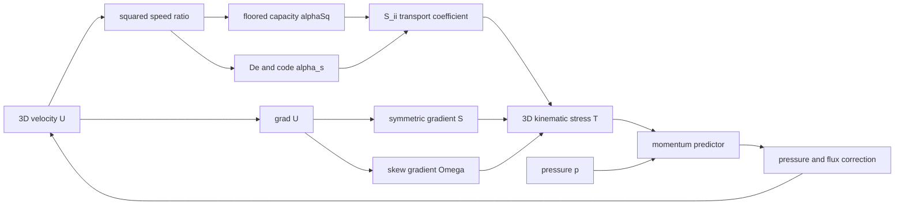

# What the existing asymmetricTensorFoam prototype implements

Navigation: [atlas](README.md) · [formal equation gaps](04-equation-contract-and-gaps.md) · [conditional possibilities](03-rccm-possibilities.md) · [implementation roadmap](06-implementation-roadmap.md).

The existing [asymmetricTensorFoam.c](../../binyamin-sim/asymmetricTensorFoam.c) is a **118-line OpenFOAM C++ solver sketch**. It builds symmetric and skew parts of a three-dimensional velocity gradient, defines speed-dependent transport coefficients, and places their stress divergence inside a transient PISO velocity/pressure loop. It does not assemble or evolve the focused TeX's four-dimensional asymmetric tensor.

The `.c` suffix does not describe its language: `volTensorField`, overloaded matrix operators and OpenFOAM headers are C++. Source inspection is the evidence here. No successful compilation, run or scientific validation is asserted.

## The file's actual dependency graph

The graph contains no independent Clebsch potentials, background capacity, transverse-slip field, spin state, energy equation, gravity source or material state. Its `Omega` is calculated from the same `U` on every timestep; it cannot represent an independently evolving internal rotation.

## Exact symbol translation

| Code and source | Actual operation / dimensions | Relationship to the focused TeX |
|---|---|---|
| `gradU = fvc::grad(U)`, [45](</Users/tom/Library/Mobile Documents/com~apple~CloudDocs/RCCM/binyamin-sim/asymmetricTensorFoam.c:45>) | Spatial velocity gradient, `1/s` when `U` is `m/s` | A derivative of velocity; not dimensionless `Ûμν`. |
| `S = symm(gradU)`, [46](</Users/tom/Library/Mobile Documents/com~apple~CloudDocs/RCCM/binyamin-sim/asymmetricTensorFoam.c:46>) | Symmetric `3 × 3` velocity-gradient tensor, `1/s` | Not TeX `Sμν = −αs²uμuν + αs⁻²hμν`. It includes both volumetric and symmetric deviatoric strain rate. |
| `Omega = skew(gradU)`, [47](</Users/tom/Library/Mobile Documents/com~apple~CloudDocs/RCCM/binyamin-sim/asymmetricTensorFoam.c:47>) | Skew `3 × 3` tensor, `1/s` | Its axial representation is related to half the ordinary velocity curl with a convention-dependent sign. TeX uses the curl of the independent Clebsch rotational phase; define the factor, sign and field map explicitly. |
| `cLimit(..., dimVelocity, 1.0)`, [49](</Users/tom/Library/Mobile Documents/com~apple~CloudDocs/RCCM/binyamin-sim/asymmetricTensorFoam.c:49>) | A dimensioned speed of **1 m/s** in standard OpenFOAM SI case units | It can be a scaled model speed only with a documented reference-scale conversion. There is no such case/scaling manifest. |
| `alphaSq`, [52–57](</Users/tom/Library/Mobile Documents/com~apple~CloudDocs/RCCM/binyamin-sim/asymmetricTensorFoam.c:52>) | `max(1−|U|²/cLimit², 0.01)` | Closest to a restricted TeX `αs²` with background/shear loads omitted. It is artificially positive at and beyond the nominal limit. |
| `alpha_bare`, [59](</Users/tom/Library/Mobile Documents/com~apple~CloudDocs/RCCM/binyamin-sim/asymmetricTensorFoam.c:59>) | Dimensionless constant `1/137.036` | Intended connection to the TeX transverse coupling must be stated. It cancels from the stress law below. |
| `alpha_visc`, [60](</Users/tom/Library/Mobile Documents/com~apple~CloudDocs/RCCM/binyamin-sim/asymmetricTensorFoam.c:60>) | `dimViscosity`, value `10⁻⁵`, a **kinematic** viscosity in OpenFOAM's usual convention | Neither TeX dimensionless `α` nor dynamic viscosity `μ`. |
| `E_ratio`, `De`, [61–62](</Users/tom/Library/Mobile Documents/com~apple~CloudDocs/RCCM/binyamin-sim/asymmetricTensorFoam.c:61>) | `q=max(|U|²/cLimit²,10⁻¹²)`; `De=alpha_bare q` | The file equates an energy ratio to squared speed ratio. The TeX's macroscopic `De=αγ` and local `De=1/(αs²αtpΩ)` are different functions ([GfX 1043–1092](</Users/tom/Library/Mobile Documents/com~apple~CloudDocs/RCCM/RCCM-GfX-2.tex:1043>)). |
| `alpha_s`, [63](</Users/tom/Library/Mobile Documents/com~apple~CloudDocs/RCCM/binyamin-sim/asymmetricTensorFoam.c:63>) | `alpha_bare/De = 1/q` | Not TeX `αs = sqrt(Pstatic/Pc)`. Near rest the code value is `10¹²`, rather than one. |
| `S_ii`, [65](</Users/tom/Library/Mobile Documents/com~apple~CloudDocs/RCCM/binyamin-sim/asymmetricTensorFoam.c:65>) | `alpha_visc q/alphaSq`, units `m²/s` | A diffusion coefficient, not the dimensionless TeX spatial diagonal `1/αs²`. |
| `T`, [66](</Users/tom/Library/Mobile Documents/com~apple~CloudDocs/RCCM/binyamin-sim/asymmetricTensorFoam.c:66>) | `S_ii S + alpha_visc Omega`, expected units `m²/s²` | A kinematic `3 × 3` stress-like field. Not `T̂μν=Pc(Ûμν−ημν)`, which has physical pressure/energy-density units and temporal components. |
| `p`, `phi`, [79–110](</Users/tom/Library/Mobile Documents/com~apple~CloudDocs/RCCM/binyamin-sim/asymmetricTensorFoam.c:79>) | Pressure correction and face flux | Expected kinematic pressure and volumetric flux for this incompressible-style loop; declarations are missing. There is no implemented identity relating `p` to `Pstatic`, `Pambient` or `Pdyn`. |

The distinct names are scientifically consequential. Changing a familiar symbol in a diagram cannot repair a field that has different units, independent degrees of freedom and limiting behavior.

## The coefficients simplify to a different model

Write `b=|U|²/cLimit²`, `q=max(b,10⁻¹²)`, `a=max(1−b,0.01)` and `ν0=10⁻⁵ m²/s`. The implemented chain simplifies algebraically to

`De = alpha_bare q`,

`code_alpha_s = 1/q`,

`S_ii = ν0 q/a`,

`T = (ν0 q/a) symm(grad U) + ν0 skew(grad U)`.

**`alpha_bare` cancels completely from the stress and velocity update**, apart from floating-point effects, for any nonzero value. Thus changing the nominal `1/137.036` cannot tune an electromagnetic coupling in the implemented PDE.

A direct coefficient evaluation on 2026-09-09, using the expressions above, gives:

| `|U|/cLimit` | `alphaSq` | `De` | Code `alpha_s` | `S_ii` in `m²/s` |
|---:|---:|---:|---:|---:|
| 0 | 1 | `7.29735×10⁻¹⁵` | `10¹²` | `10⁻¹⁷` |
| 0.5 | 0.75 | 0.00182434 | 4 | `3.33333×10⁻⁶` |
| 0.9 | 0.19 | 0.00591086 | 1.23457 | `4.26316×10⁻⁵` |
| 1 | 0.01 | 0.00729735 | 1 | 0.001 |
| 2 | 0.01 | 0.0291894 | 0.25 | 0.004 |

At the nominal phase limit, code `De` is finite, `alpha_s` is one, and the capacity floor is active. The code also admits speeds above `cLimit`; the floor does not constrain velocity. These are different limiting behaviors from the focused tensor's zero-capacity yield and divergent Deborah number.

The comment says the floor preserves matrix invertibility, but the file does not construct or invert `Û`. It prevents division by zero in its transport coefficient. That can be a numerical regularization choice, but its effect must be measured as a model change.

## What momentum equation it approximates

The expression at [lines 68–75](</Users/tom/Library/Mobile Documents/com~apple~CloudDocs/RCCM/binyamin-sim/asymmetricTensorFoam.c:68>) combines implicit diffusion with an explicit correction:

`ddt(U) + div(phi,U) − laplacian_implicit(S_ii,U) + laplacian_explicit(S_ii,U) − div(T)`.

At a converged fixed point with matching discrete operators, the subtracted and added Laplacians cancel. The intended continuum structure is approximately

`∂t U + advection(U) = −∇p + div(T)`.

The timestep actually evaluates `T` and `S_ii` once before the momentum predictor and PISO corrections. It does not iterate the full nonlinear constitutive relation to convergence within an outer loop. Therefore the implicit/explicit pair is a lagged numerical treatment, not evidence of a new physical force term.

The pressure equation at [lines 96–110](</Users/tom/Library/Mobile Documents/com~apple~CloudDocs/RCCM/binyamin-sim/asymmetricTensorFoam.c:96>) corrects flux divergence in the usual incompressible-style pressure/velocity pattern. It is not a gravitational Poisson equation: it contains neither mass source `4πGρ` nor the proposed `rc²∇⁴Φ` operator. The `p` reference value fixes a gauge; the file never derives pressure from the thermodynamic capacity ledger.

## Packaging and execution gaps

The inspected `binyamin-sim` directory contains this translation unit and a macOS `.DS_Store` file. It has no supplied build target, `createFields.H`, input case, test case or run output. The repository's [source-routing rule](../../AGENTS.md#formal-source-router-and-implementation-boundary) records the same implementation boundary.

| Missing item | Why it matters |
|---|---|
| OpenFOAM distribution/version/commit pin | The banner references both Foundation and OpenCFD histories. Headers and solver-control APIs must be matched to the selected checkout; similarity to an older PISO solver is not a compatibility test. |
| Build files and language/target definition | A reproducible executable needs its source list, include/library settings and output target. |
| `createFields.H` | `U`, `p`, `phi`, `T`, `pRefCell` and `pRefValue` need declarations, dimensions, I/O and boundary conditions. |
| Mesh and physical domain | No nozzle, tunnel, cavity, periodic box or specimen geometry is provided. |
| Initial and boundary data | No velocity/pressure values, inlet/outlet/wall choice or spin/field conditions are provided. |
| `controlDict`, discretization and linear-solver settings | Timestep, write frequency, schemes, PISO tolerances and convergence targets are absent. |
| Compile and run record | No established evidence of build success, dimensional-field compatibility or solver completion. |
| Conservation and verification outputs | No recorded momentum, angular momentum, energy, boundedness, convergence order, mesh or timestep study. |

The core-source audit elsewhere in the atlas determines reusable APIs and compatibility. This document does not claim a compile failure that has not been attempted; it identifies the missing package required for a meaningful attempt.

## Capability gap against the asymmetric-tensor ambition

| Needed mechanism | Prototype status | First implementation obligation |
|---|---|---|
| Full tensor evaluator | Absent | Assemble `S`, `A`, `Û` and `T̂` with declared frames/units from independent model state. |
| Nested background/local capacity | Restricted speed-only approximation | Add explicit background and shear loads after resolving the [ledger issue](04-equation-contract-and-gaps.md#f1-the-pressure-ledger-needs-a-positive-load-definition-distinct-from-the-action-invariant). |
| Independent transverse and rotational dynamics | Absent | Add/reconstruct the specified slip and Clebsch/spin state with compatible transport equations. |
| Micropolar angular momentum | Absent | Spin inertia, couple stress, torque exchange and spin boundary conditions. |
| Energy transport and dissipation | Absent | Derive a field-energy ledger, boundary power flux and conversion to heat/internal modes. |
| Self-consistent gravity | Absent | Source field, elliptic/hyperbolic gravitational subsystem, matter feedback and selected geometry convention. |
| Vacuum electromagnetism | Absent | Reconciled curl pair, divergence constraints, wave propagation and observables. |
| Sourced/material electromagnetism | Absent | Charge/current closure, field-material interfaces and electrical-unit mapping. |
| Chemical or superconducting material model | Absent | Material degrees of freedom, constitutive response, temperature/coherence/reaction rules, and sample data. |
| Yield, defect creation or reconnection | Replaced by a hard coefficient floor | Event/interface/topology model and conservative post-event state. |
| Nonlinear connection/curvature/action dynamics | Absent | Selected formal equations and constraint-preserving discretization, after the formal issues are settled. |
| Parameter inference or inverse design | Absent | Forward objective, parameterization, constraints, automation and uncertainty assessment after the forward model passes verification. |

## Evidence-first checks for the next implementation

These are proposed tests with explicit failure meanings, not tests claimed to have passed.

1. **Tensor algebra and dimensions:** rest, uniform translation, pure transverse slip, pure rotation and mixed loads. Check symmetry, skew symmetry, units, contraction, capacity and output stress against the selected TeX branch. A uniform nonzero velocity has zero prototype gradient stress even though the focused algebraic tensor has nonzero capacity/stress; this exposes the two different models directly.
2. **Coefficient and limit sweep:** vary speed, nominal `alpha_bare`, capacity floor and viscosity independently. Verify which changes alter the actual PDE. The table above is the existing behavior to reproduce or deliberately replace.
3. **Manufactured momentum solution:** prescribe a smooth nonuniform field and source so the exact solution is known. Check observed spatial/temporal error and the effect of lagged constitutive coefficients.
4. **Rigid rotation and spin exchange:** distinguish vorticity derived from macroscopic velocity from independent microrotation. Check total torque, spin/orbital transfer and boundary work.
5. **Pressure/flux conservation:** verify closed-domain flux and momentum, correct pressure gauge behavior and intended compressibility. A low PISO continuity residual verifies only the imposed flux constraint.
6. **Field-specific seeds:** a transverse wave and a fixed-source weak-gravity case must pass their own exact/analytic checks before coupling them into this momentum loop.
7. **Yield continuation:** demonstrate finite post-event state and conserved exchanges, then vary grid, timestep and cutoff. A solver stabilized by the current `0.01` floor cannot establish the exact zero-capacity mechanism.

The useful next move is to preserve this file as a named experimental sketch, settle the [equation contract](04-equation-contract-and-gaps.md), and build one small reproducible case from the [roadmap](06-implementation-roadmap.md). The existing OpenFOAM infrastructure can reduce implementation work; it cannot select among incompatible physical definitions.
