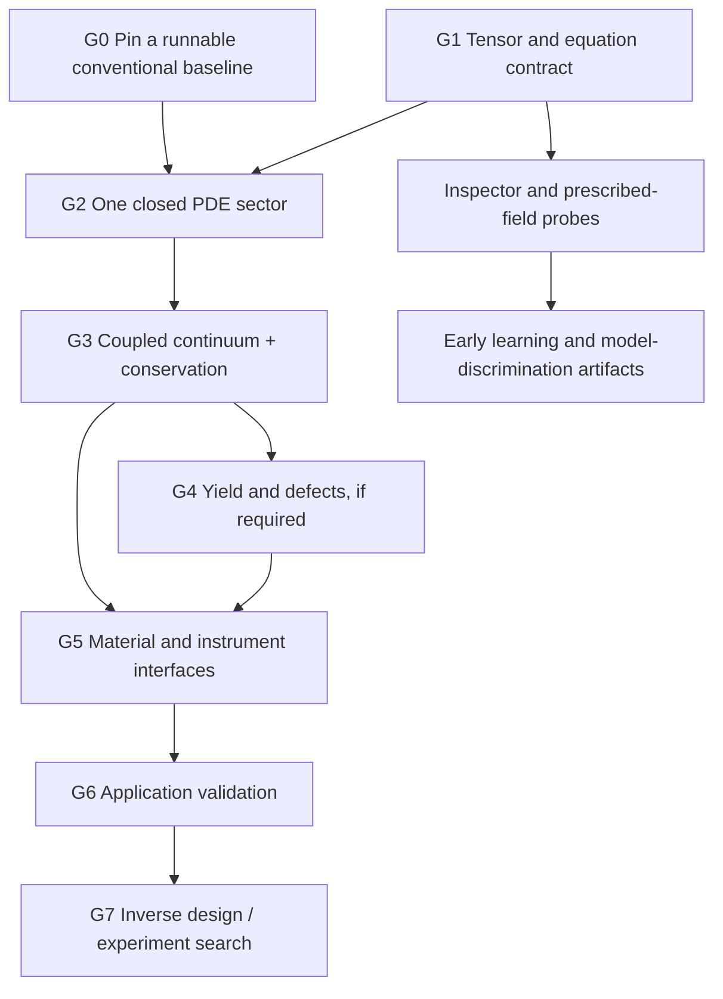

# From the present code to an RCCM simulation workshop

[Atlas](README.md) · [Equation contract](04-equation-contract-and-gaps.md) · [Prototype](05-prototype-audit.md) · [OpenFOAM code map](07-openfoam-code-map.md) · [Possible jobs](03-rccm-possibilities.md)

OpenFOAM can host a sequence of RCCM experiments. The first useful implementation should select one closed sector, name its assumptions, and earn the next layer through tests. “All asymmetric-tensor physics” currently spans mathematical repair, new numerical models, material science, experiment design, and validation. It is not one missing OpenFOAM feature.

This is a proposed implementation route. This audit changed documentation only and did not build or run OpenFOAM, repair the prototype, or alter the canonical TeX. The source checkout and its existing changes are recorded in [the code map](07-openfoam-code-map.md#the-inspected-snapshot).

## The missing pieces, by responsibility

| Gap | What already exists | Missing deliverable | Type of work |
|---|---|---|---|
| A reproducible starting point | Source checkout, standard solvers/tutorials | Selected revision plus any intentional patch, compiler/dependencies, clean baseline run | Build/reproducibility |
| One consistent model | Two rich TeX formulations | Versioned equation/state/units/constraint registry resolving the [F1–F11 findings](04-equation-contract-and-gaps.md#internal-findings-that-block-faithful-implementation) | Mathematical/model specification |
| Tensor semantics | Spatial tensors and generic matrices | 3+1 field schema, frame convention, contractions and transformations | Algebra/API |
| Evolving independent state | Time derivatives, solver lifecycle | Evolution of capacity, slip, rotational variables, sources and any spin state | Physics and numerical implementation |
| Conservative coupling | Finite volumes, fluxes and pressure loops | Consistent mass, momentum, energy and spin equations; exchange terms | Mathematical/numerical |
| Higher derivatives and geometry | Laplacian, matrix tools | Well-posed mixed formulation, extra boundaries, curvature/connection operators where needed | Numerical analysis |
| Yield and topology change | Mesh motion/adaptation, multiphase machinery | Constitutive transition, nucleation/reconnection rules, finite continuation and transfer ledgers | Physical model plus numerics |
| Material behavior | Chemistry/thermal/MD/EM building blocks | Composition/state → constitutive response; measured-unit and interface maps | Material theory/experiment |
| Observable meaning | Sampling, integrals, forces, export | RCCM-specific force, clock, optical and electrical observation operators | Metrology/model interface |
| Design capability | Cases, scripting, limited duct adjoint | Parameterized designs, feasibility constraints, objectives, sensitivities/search, uncertainty | Optimization/workflow |
| Predictive warrant | Proposed identities and selected comparison routes | Known-limit recovery, held-out measurements, independent reproduction | Scientific validation |

## Dependency route

The arrow from G4 to G5 applies to models deriving material response from defects. A hybrid with a supplied effective material law can take the G3→G5 route directly. A conventional nozzle optimizer can proceed from G0 with conventional validation and its own design loop; it does not depend on RCCM.

## G0 — Pin and run one ordinary OpenFOAM case

**Deliverable:** a reproducible baseline for the chosen Foundation revision, plus a selected example matching the first intended task. The checkout is dirty; preserve its existing work and select a separate clean build/worktree or explicitly capture the intended patch. Do not assume that a committed HEAD identifies all locally inspected behavior.

Use the checkout's own tutorial and build conventions. A low-speed cavity/duct, pressure-wave case, or compressible nozzle is a better baseline than beginning with all proposed tensor sectors at once. Record geometry, mesh, schemes, solvers, boundary conditions, compiler and library versions, commands, residuals and measured outputs.

**Acceptance:** the existing case builds/runs; its flux/observable checks meet declared tolerances; a repeat run reproduces the reported quantities. This establishes a toolchain and baseline, not RCCM behavior. The [prototype's missing files and obsolete API calls](05-prototype-audit.md) must be addressed separately before it can join the baseline suite.

## G1 — Make the tensor contract executable without a mesh

**Deliverable:** a small pure library or evaluator for the pressure ledger, declared tensor construction, stress map, transformations and observation conversions. Keep it independent of OpenFOAM initially so algebraic errors can be isolated from discretization.

Specify primitive versus derived fields. The local seven-value representation is useful for a rest-frame inspector, while a generic transformed tensor can require all 16 slots. Do not evolve 16 independent components and separately evolve the seven defining quantities without constraints tying them together. Preserve the ambient/local split and other continuation state separately. [RCCM Data](../../rccm-data.md) supplies the storage-versus-continuation distinction.

**Tests first:**

1. At zero loads, obtain `q=1`, the declared Minkowski baseline, and zero stress deviation.
2. Reconstruct `U=S+A`; verify symmetry, antisymmetry, and index conventions using exact examples.
3. Compare covariant assembly with a transformed local assembly, including nonzero symmetric mixed components after a boost.
4. Audit every term's dimensions, all powers of admittance, and the two baseline-density versions.
5. Resolve positive shear energy versus signed contraction before testing load monotonicity; expose invalid/zero-capacity states as explicit outcomes.
6. Confirm that equal tensor samples can still hide different continuation states.

These tests should encode the **selected repaired contract**, with a separate record of disagreement with the original displayed derivation. They must not silently turn a repair into a claim that the TeX already supplied it.

## G2 — Advance one closed sector

Two branches can be developed independently once their contracts are settled.

| Branch | Smallest case | OpenFOAM pieces to reuse | Required acceptance |
|---|---|---|---|
| Vacuum transverse waves | Constant-coefficient periodic plane wave; then a pulse and boundary reflection | Vector fields, curl, time derivatives, solver lifecycle | Correct orientation and propagation direction, dispersion versus resolution, divergence constraints, energy flux and boundary accounting |
| Fixed-source weak gravity | Smooth manufactured source in a bounded region; then a controlled isolated-source approximation | Scalar fields, Laplacian, elliptic solvers | Reconciled source sign, correct extra boundary data, convergence to analytic/manufactured solution, ordinary Poisson limit with compatible limiting boundary data |

For the fourth-order static equation, one candidate is `χ=∇²Φ`, followed by `χ−rc²∇²χ=4πGρ`. This is a proposed mixed formulation with fixed `rc`; its boundary data must correspond to the original problem. If `rc` depends on state, derive the actual differential operator before discretizing.

The auxiliary field does not automatically permit two independent sequential solves. Prescribed `Φ` and `χ` define one boundary-value problem; prescribed `Φ` and its normal derivative may require coupled boundary enforcement rather than invented `χ` values. As `rc→0`, the differential order drops. Use compatible limiting data or explicitly analyze boundary layers instead of demanding uniform convergence for arbitrary fourth-order boundary conditions.

Use three or more justified resolutions when estimating convergence order, including time refinement for waves. Declare error norms and tolerances before evaluating the result; they must reflect the chosen schemes, geometry, boundaries and floating-point precision. A correct wave speed alone misses the [curl-sign discrepancy](04-equation-contract-and-gaps.md#f8-the-vacuum-wave-pair-is-a-useful-seed-with-a-component-sign-mismatch-to-settle).

**Exit meaning:** a verified numerical implementation of one declared PDE. Adding sources, nonuniform coefficients, matter or yield is a new contract change.

## G3 — Add coupled capacity, motion and rotation

**Deliverable:** a dedicated solver module if independent fields or conservation constraints change substantially. A simple added source may fit `fvModel`; a new universe state is broader than a source term in an existing incompressible solver. [Extension seams](07-openfoam-code-map.md#extension-seams-where-new-behavior-can-enter) identify concrete code locations.

Before porting the prototype's PISO loop, derive which flux is conserved. Incompressible volume flux, a variable inertial-density flux, and the focused document's `ρdyn` continuity are different statements. Derive pressure correction from the chosen continuity and momentum equations, rather than retaining `div(U)=0` by habit.

Add a constitutive law for shear, independent rotational/spin dynamics if required, reciprocal energy/momentum exchange, and state-dependent coefficient updates. For viscoelastic memory, preserve the relaxation state at restart. For spatially varying coefficients, retain derivative/product-rule terms.

**Acceptance:** a bounded periodic or closed-wall experiment accounts for total energy, linear momentum, orbital angular momentum and internal spin, including prescribed input and boundary flux. Perturbations have the predicted stability/dispersion behavior. A source-free equilibrium remains an equilibrium. Results converge under grid/time refinement and agree across serial/parallel partitioning to a declared numerical tolerance.

Remain in a stated domain away from `q=0` while establishing the smooth-field contract. Any temporary regularization is a named approximation whose influence is measured.

## G4 — Specify yield, defects and topology change

**Deliverable:** explicit rules for reaching a threshold, constructing the post-event state, moving interfaces, and exchanging energy/momentum/spin. Identify whether defects are resolved fields, tracked interfaces, particles, or another representation.

Mesh refinement can resolve a defined event. It cannot decide what event the physics permits. A floor such as `q≥0.01` replaces the singular regime; it does not demonstrate the claimed pinch-off mechanism. Likewise ordinary numerical reconnection can erase topological structure through diffusion unless the method and diagnostics are chosen deliberately.

**Acceptance:** one event is reproducible under refinement and cutoff variation; totals before and after match the declared flux/source budget; topology diagnostics distinguish physical events from numerical leakage. The proposed continuation remains finite and its dependence on the regularization is reported.

## G5 — Attach a material and a measuring instrument

Choose one of two explicit routes:

| Route | Inputs | What it establishes |
|---|---|---|
| Hybrid device model | RCCM field equations plus supplied material response, thermal properties and source/circuit laws | Behavior of the declared coupled model; it can become useful without a complete microscopic derivation |
| Emergent material model | Constituent/defect states, interactions and a composition/structure/temperature specification | A candidate derivation of material response, requiring separate microscopic and effective-property tests |

Define interfaces: what is continuous, what jumps, where surface charge/current or traction sits, and how the surroundings supply work and heat. An instrument maps computed fields to an observable with units and a sampling protocol. Keeping these maps explicit allows the same field to drive a force sensor, optical probe or electrical measurement.

**Acceptance examples:** reproduce a specified conventional field/material benchmark, a thermal energy exchange, and an instrument reading with known units. For a superconducting response, include temperature/current/field dependence, flux response and losses under named protocols. For chemistry, preserve species/element inventories and reaction energy while testing withheld concentrations or rates. See [the four superconducting rooms](03-rccm-possibilities.md#superconductors-four-separate-rooms).

## G6 — Validate the intended application

Choose the benchmark that can reject the intended claim. Use matched geometry, drive, material preparation and sensor definition. Separate fitting parameters from predicting withheld data. Record uncertainty from measurements, material properties, discretization and closure choices.

| Target | A useful independent comparison | What a passing result would support |
|---|---|---|
| Nozzle / ordinary flow | Measured pressure, mass flow, thrust or heat transfer under new operating conditions | The selected conventional flow model in that regime |
| Vacuum-wave identification | Polarization, phase, flux and source response under a distinct excitation | The chosen field/observable mapping in the tested regime |
| Gravity / optical response | A stated lens, force or clock measurement with source parameters independently fixed | The particular sourced propagation/motion model |
| Superconducting specimen | Transport and magnetic response on a specified held-out sample or condition | That material model, not arbitrary room-temperature superconductivity |
| Chemical/material prediction | Held-out structure, energy, spectrum, kinetics or transition behavior | The corresponding constituent/effective model |
| New propulsion / converter | Force and energy measurements with source and boundary accounting | The measured mechanism at the tested operating conditions |

Use the current [Condensed source route](../../README.md#refractive-cosmology-version-boundary-and-reading-route) for cosmological comparisons. Historical fits cannot supply missing current equations or count as independent validation of a new implementation.

## G7 — Wrap the solver in design search

**Deliverable:** a loop over parameterized geometry, material arrangement and/or drive. Define the objective and feasible set before searching. A desired velocity field can be an objective, but must be compatible with conservation, available actuation and boundary conditions.

Start with a small parameter sweep to discover sensitivities, nonunique designs and failure regions. Add a gradient-free optimizer or derive an adjoint for the **actual selected equations**. Test gradients against finite differences or another independent derivative on a tractable case. The included duct adjoint does not differentiate an RCCM solver or a compressible nozzle model.

Account for failed solves as explicit outcomes. Re-evaluate promising designs on refined meshes and across operating conditions. Distinguish maximizing device performance from maximizing separation between competing theories; both are useful cells of the [hyperslice map](01-jobs-and-hyperslices.md).

**Acceptance:** a candidate meets the stated objective/constraints under independent reruns, refinement, uncertainty tests and appropriate physical checks. Report the searched design space and local/global-search limits rather than calling the result the universal ideal.

## Representation and scale choices

Use a spatial mesh plus time evolution unless the mathematical contract specifically requires a spacetime discretization. A `4 × 4` tensor does not force a four-dimensional mesh. Separate scalar, vector and spatial-tensor blocks can reuse more OpenFOAM machinery; a custom field type adds registration, boundaries, interpolation, parallel exchange and output work.

Wave speed creates a more serious cost than storing the matrix. For illustration, an explicit resolved-wave step with spacing `Δx=1 μm`, speed `c≈3×10⁸ m/s` and Courant number near one has `Δt≈3.3×10⁻¹⁵ s`. Resolving one millisecond would take about `3×10¹¹` such steps. A one-millimeter cube at that spacing has about `10⁹` cells; seven double-precision scalar components alone require about 56 GB, before mesh, fluxes, solver matrices, history or auxiliary state. These are arithmetic estimates, not OpenFOAM performance measurements.

Implicit stepping can relax some stability limits; it does not automatically resolve oscillations or preserve the desired dispersion at a large step. Useful routes include nondimensional test cases, quasistatic limits, frequency-domain models, local periodic cells, homogenization, reduced models and multirate coupling—each with a derived validity domain. The prototype's `c=1` is dimensional `1 m/s`; a documented nondimensional model must scale every related variable and observable consistently.

## First concrete project options

| If the immediate job is… | Start with… | Why this is the smallest useful slice |
|---|---|---|
| Understand the tensor spatially | G1 inspector plus prescribed field slices | Tests definitions and exposes hidden state without assuming unknown dynamics |
| Learn OpenFOAM through your two examples | G0 wind-tunnel/duct case, then a small geometry sweep | Teaches forward response and inverse search with existing equations |
| Test whether the RCCM wave equations are coherent | G1 + G2 periodic wave fixture | Exercises signs, orientations, flux and constraints before material claims |
| Explore a superconducting device now | Conventional cooling/thermal case plus a separately specified material/circuit model | Addresses a real engineering decision while keeping microscopic discovery explicit |
| Pursue RCCM material discovery | Equation reconciliation → smooth coupled fields → defect/material bridge → held-out specimen tests | Identifies the real dependencies of a predictive materials tool |

The next unresolved input for implementation is a **selected, reconciled equation contract for one sector**. The present mapping task did not require choosing that physics on the author's behalf; it records the alternatives, exact conflicts and acceptance tests so the choice is concrete.
