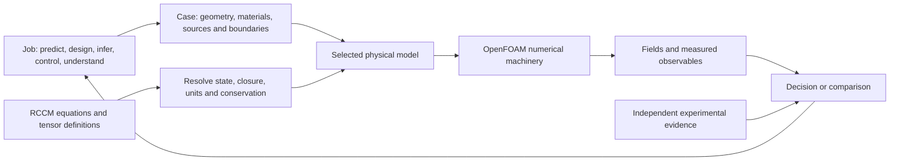

# OpenFOAM × RCCM: jobs, possibilities, and implementation gaps

OpenFOAM is a workshop for solving field equations across a meshed region. Your wind-tunnel idea runs **from shape to behavior**. Your nozzle-design idea runs **from desired behavior back toward candidate shapes**, using repeated simulations and a search method. An RCCM extension would add a particular model of the continuum and its interactions to that workshop.

The code already has ordinary asymmetric spatial tensors, extensive fluid/thermal/chemical machinery, and limited electromagnetic solvers. The largest remaining RCCM task is to specify a consistent evolving state, its material/source laws, and its measured outputs. The existing RCCM prototype encodes a smaller, different velocity-gradient model.

This atlas records a Hyperslice exploration, primary-source research, and source audits completed **2026-09-09**. Established software capabilities, documented use, conditional RCCM possibilities, and gaps have separate evidence labels. The possibility page states its scientific-status boundary once and then explores the proposed world in-model.

## Read by question

| Question | Focused document |
|---|---|
| What is OpenFOAM for, and what jobs can it serve? | [01 — Jobs and hyperslices](01-jobs-and-hyperslices.md): 18 job archetypes, 33 physical territories, 16 challenged razors and four comparison squares |
| What do actual people and organizations use it for? | [02 — Real-world use](02-real-world-use.md): 24 named, sourced examples with dates, outputs and software provenance |
| What becomes possible with a complete RCCM simulator? | [03 — RCCM possibilities](03-rccm-possibilities.md): 34 conditional jobs, five tool levels, superconductors and speculative-device experiment cards |
| What is missing from the physics specification? | [04 — Equation contract and gaps](04-equation-contract-and-gaps.md): state/units registry, 11 formal findings, cross-source differences and exact algebraic probes |
| What does the existing RCCM code actually compute? | [05 — Prototype audit](05-prototype-audit.md): full symbol translation, simplified coefficients, missing package and missing mechanisms |
| What would implementation involve, in what order? | [06 — Implementation roadmap](06-implementation-roadmap.md): eight gates with acceptance tests, architecture choices and computational-scale limits |
| Where are the relevant capabilities in your checkout? | [07 — OpenFOAM code map](07-openfoam-code-map.md): exact source links, distribution/commit/dirty-state fingerprint, extension points and compatibility findings |

For an initial spatial tour, read **01 → 03 → 06**. For engineering due diligence, read **02 → 07 → 05 → 04 → 06**. For superconductors, start with [the four rooms](03-rccm-possibilities.md#superconductors-four-separate-rooms), then the [material contract](04-equation-contract-and-gaps.md#what-chemistry-and-superconductors-additionally-require).

## The terrain in one view

An optimization loop changes the case. A new physics theory changes the model. A visualization changes how results can be inspected. These are distinct extension points, and a useful product can combine them.

## What the investigation established

| Finding | Practical implication | Evidence |
|---|---|---|
| Forward CFD and inverse design are different jobs | A desired flow needs an objective, feasible design variables and a search loop around a forward solver | [Jobs](01-jobs-and-hyperslices.md#two-directions-through-the-workshop), [legacy adjoint](07-openfoam-code-map.md#inverse-design-exists-with-a-narrower-objective-than-arbitrary-field-synthesis) |
| Real users already combine flow with heat, reactions, electromagnetic heating and other physics | RCCM's opportunity must name an added response, coupling or prediction rather than claim all multiphysics is new | [24-case evidence ledger](02-real-world-use.md) |
| Stock spatial tensors can be asymmetric | A 4×4 matrix is chiefly a state/semantics issue; a 3+1 representation can reuse the 3D mesh | [Field architecture](07-openfoam-code-map.md#the-ground-mesh-fields-time-and-operators) |
| Tensor samples do not necessarily contain continuation state | Preserve primitive fields, hidden pressure splits, constitutive memory, constraints and boundary state | [RCCM Data](../../rccm-data.md), [contract](04-equation-contract-and-gaps.md) |
| GfX has a vacuum curl pair and the condensed source has sourced EM equations | The gap is a reconciled, coupled and material-complete implementation, not a blanket absence of wave/Maxwell equations | [Explicit equations](04-equation-contract-and-gaps.md#what-is-explicitly-available) |
| Several displayed equations disagree under explicit algebraic checks | Select and document a repaired sector before discretizing it | [F1–F11](04-equation-contract-and-gaps.md#internal-findings-that-block-faithful-implementation), [exact verification](04-equation-contract-and-gaps.md#exact-verification-record) |
| The prototype's nominal fine-structure coefficient cancels from its stress | That parameter cannot tune the intended coupling in the encoded PDE | [Coefficient simplification](05-prototype-audit.md#the-coefficients-simplify-to-a-different-model) |
| Superconductor cooling and superconducting material prediction require different models | Useful conventional device work can start now; new-material discovery requires a composition/structure-to-response bridge | [Four rooms](03-rccm-possibilities.md#superconductors-four-separate-rooms) |

The formal gaps include a signed shear invariant used as a consumed energy load, inconsistent density/force normalization, a source-sign discrepancy in the variational equation, a first-order curl-sign mismatch, unstable modes in a proposed saturated-wave equation, and a dimensionless quantity used as a screening length. These are individually traced and tested where appropriate in [04](04-equation-contract-and-gaps.md). They do not imply every reduced RCCM experiment must wait; they determine which contract each experiment must choose.

## Evidence and provenance

The canonical formal sources are [RCCM-GfX-2.tex](../../RCCM-GfX-2.tex) and [RCCM-Condensed.tex](../../RCCM-Condensed.tex). The audit read all 15 focused sections and corresponding condensed derivations. Their HTML reading copies were not treated as independent sources. No formal source was edited or regenerated.

| RCCM artifact | SHA-256 of inspected contents |
|---|---|
| `RCCM-GfX-2.tex` | `ba0cca347206c974ddf2d987215a304f3550c6e0ee13feee90f34da6b927d919` |
| `RCCM-Condensed.tex` | `af261c2dcadd047f60dd738b9f69a50db4d1e72d2dfbeecd56cfe3af57bc0ede` |
| `binyamin-sim/asymmetricTensorFoam.c` | `4af40957444e533853ba263e06e31a9c0493981ef0cf413093d09cae059011bf` |

The OpenFOAM source is the **Foundation development tree** at `/Users/tom/Developer/OpenFOAM-dev`, HEAD `d58ef9707b444f5230fc80c0c9b4af29ce1373ac`. It had **103 pre-existing modified tracked files** and zero untracked files at the recorded check. The [code map](07-openfoam-code-map.md#the-inspected-snapshot) records timestamp, patch hash and scope. Source links point to the inspected working files, which can subsequently change. OpenCFD releases and third-party extensions in the use ledger are labeled separately.

“Used today” is supported most directly by dated practitioner activity or a current offering. Recent research supports that particular reported use; historical papers support use at their own dates. The [ledger](02-real-world-use.md) preserves those distinctions, including sources whose full text was inaccessible. Its coverage is broad, not a claim to enumerate every active user.

## Verification boundary

- Exact symbolic assertions checked five formal findings: shear contraction, variational source sign, all three curl/divergence component signs, a Fourier growing mode, and trace/determinant counterexamples. Assumptions and results are recorded in [04](04-equation-contract-and-gaps.md#exact-verification-record).
- The prototype's coefficient sweep and cancellation were evaluated separately from any solver execution. The source branches' density ratio was checked as `9/2`.
- The atlas contains 289 links. All local targets/anchors and 137 source line references passed checks, together with inventory counts, fenced blocks and whitespace. External sources carry their access/evidence limits in the use ledger. The OpenFOAM audit supplies concrete positive code evidence and scoped negative searches. The inspected TeX/prototype hashes and OpenFOAM tracked-patch fingerprint remained unchanged at the final check.
- **No OpenFOAM compile, simulation, numerical convergence study or physical validation was performed.** Those are future gates with concrete acceptance criteria in [06](06-implementation-roadmap.md).

The result is a navigable requirements and evidence map. The earliest useful build is either a conventional wind-tunnel/nozzle learning case or an RCCM tensor inspector and one reconciled PDE fixture, depending on the next job selected.

## Related repository maps

- [Root learning atlas](../../README.md)
- [RCCM data, observation and continuation state](../../rccm-data.md)
- [Room-temperature superconductivity and tau-fluid material gaps](../../LK-99-Room-Temperature-Superconductivity-and-Tau-Fluidics.md)
- [Gravity as a spatial field](../../RCCM-Gravity.md)
- [TauLab's separately scoped experimental engine](../../taulab/README.md)
- [Session record](../../log/2026-09/2026-09-09-log.md)
