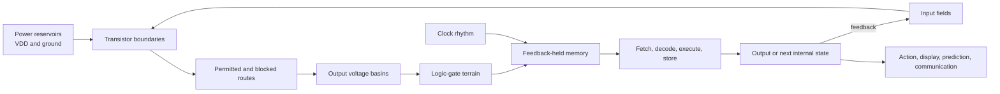
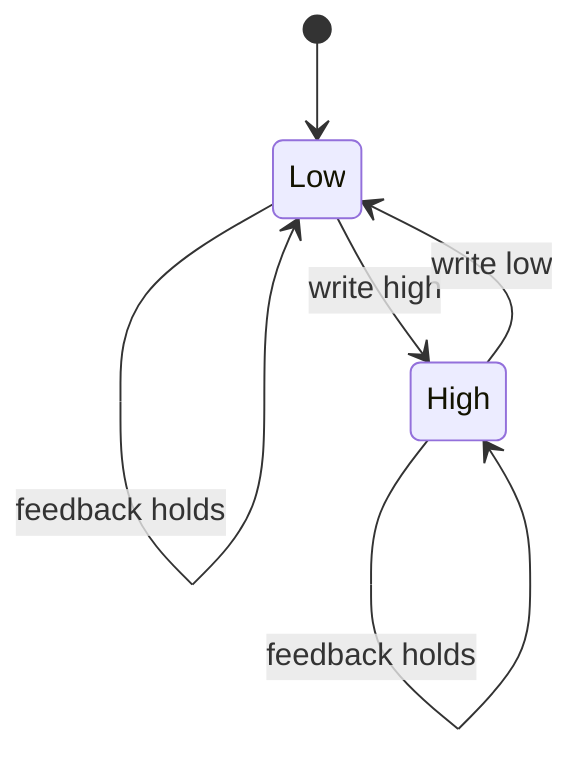

# RCCM Computers

## A spatial mental model for how computers “think”

This guide places a computer inside the RCCM continuum and follows its fields,
boundaries, currents, holds, and returns from semiconductor to software. It
speaks from inside that world so the model can become spatially
inhabitable.[^rccm-stance]

[^rccm-stance]: This is an in-model steelman and teaching map. Questions about
    RCCM’s empirical status belong to the repository’s scientific-audit route;
    this document spends its remaining attention on making the model work
    clearly on its own terms.

## One-sentence model

> A computer is a terrain of field-controlled channels: power supplies hold
> potential differences, transistors reshape the permitted routes, capacitive
> nodes settle into stable state basins, clocks coordinate crossings, feedback
> preserves memory, and a program selects a long itinerary through the
> machine’s possible states.

The shortest route is:

```text
energy reservoirs
-> field-controlled transistor boundaries
-> conducting or blocked routes
-> stable voltage basins
-> logic junctions
-> feedback-held memory
-> clocked state crossings
-> arithmetic, selection, and control
-> observable behavior
```

## The whole field



The terrain itself constrains which state can follow which. That constrained
continuation is the machine’s local act of thought.

## Terrain objects

| Computer object | RCCM placement | Physical work | Design edge |
|---|---|---|---|
| Supply voltage | Difference between high and low potential reservoirs | Maintains the field slope available to drive crossings | Supply droop shallows every downstream slope |
| Electric field | Local slope of the potential terrain | Applies force per charge and reshapes carrier routes | Field direction and electron-carrier motion occupy opposite orientations |
| Current | Conserved flux through a route | Transports charge through the material response | Carrier drift and field propagation occupy different speed scales |
| Resistance | Drag or narrowness of a route | Converts part of the crossing energy into heat | Temperature and device state reshape the drag |
| Capacitance | Compliant field reservoir | Stores displaced electric-field state and charge per voltage | Larger reservoirs require more energy per crossing |
| Inductance | Inertia of changing flux | Stores magnetic-field energy and resists rapid current change | The complete loop and return path set the inertia |
| Semiconductor | Phase terrain with adjustable carrier admittance | Couples band structure, doping, carriers, and electrostatic strain | Temperature, geometry, and doping set the available phase space |
| Transistor | Field-controlled admittance boundary | Gate strain raises or lowers channel conductance | Threshold and timing determine when the crossing holds |
| Logic bit | One of two broad resting basins | Preserves a noise-tolerant state range | The uncertain ridge between basins sets the noise margin |
| Logic gate | Junction of constrained routes | Composes transistor boundaries into a state rule | Delay records the time needed to settle |
| Memory | Basin held by feedback or isolation | Preserves state across later crossings | Leakage determines retention time |
| Clock | Repeated permission wave for state crossing | Coordinates release, settling, and capture | Global clocks and local handshakes make different timing terrains |
| Program | Scheduled route through machine state-space | Configures control boundaries from encoded instructions and data | Every abstract step resolves into physical time and energy |
| Heat | Released, randomized field motion | Carries dissipated energy away from active terrain | Local temperature feeds back into resistance and leakage |

## First hold: a computer is analog underneath and digital on top

A wire carries a continuous electrical state:

```text
voltage
0 V ------------------------------------ VDD
```

The circuit assigns broad regions to symbols:

```text
low basin       uncertain crossing        high basin
[    0    ]     [ noise / transition ]    [    1    ]
```

That separation supplies slack. Small disturbances can move the physical
voltage without changing the interpreted bit.

Digital logic is therefore an interface:

```text
continuous field state
-> thresholded basin
-> symbolic bit
```

The abstraction is real and useful, but its hold comes from analog terrain
underneath it.

## The mental movie

### 1. Prepare a semiconductor terrain

Silicon has allowed electronic energy bands separated by a band gap. Doping
changes the population of mobile carriers:

- n-type regions have electrons as their majority carriers;
- p-type regions have holes—mobile absences in the electron population—as
  their majority carriers.

Spatially:

```text
crystal structure
-> allowed and forbidden carrier states
-> doping reshapes carrier availability
-> applied fields reshape permitted motion
```

A hole is the mobile geometry of missing electron occupancy in the lattice.
Tracking that absence as a positive carrier makes the p-type current terrain
continuous and directional.

### 2. Place one field-controlled crossing

An nMOS transistor places electron-rich source and drain regions on opposite
sides of a p-type channel region. A gate conductor sits above the channel,
separated from it by a dielectric.

```text
gate low                         gate high

source   blocked gap   drain     source ===== channel ===== drain
 n+        p-type        n+       n+      inversion layer     n+
             OFF                                 ON
```

The gate presses its electric field through the dielectric while remaining
electrically isolated from the channel. That field changes the carrier terrain
below. When the channel becomes sufficiently conductive, source and drain gain
a usable route.

The fluid reading is:

```text
control field presses across a sealed boundary
-> local terrain changes
-> route admittance rises or falls
-> the source-drain current route moves between low and high admittance
```

That is why a transistor can let a small control state govern a larger flow
from the power supply.

### 3. Give the output two possible basins

A CMOS inverter combines one pMOS and one nMOS transistor:

```text
high reservoir: VDD
        |
      pMOS       conducts when input is low
        |
      OUTPUT
        |
      nMOS       conducts when input is high
        |
low reservoir: ground
```

| Input basin | High route | Low route | Output basin |
|---|---|---|---|
| low | conducting | blocked | high |
| high | blocked | conducting | low |

The input field changes the available routes, and the output settles into the
basin that remains connected. That physical settling is the gate’s decision.

This is a NOT gate:

```text
0 -> 1
1 -> 0
```

### 4. Join crossings into logic terrain

Series and parallel transistor arrangements form more complicated route
conditions.

For a two-input NAND gate:

```text
both low-route crossings must conduct
before the output can reach the low reservoir
```

| A | B | Low route complete? | Output |
|---:|---:|---|---:|
| 0 | 0 | no | 1 |
| 0 | 1 | no | 1 |
| 1 | 0 | no | 1 |
| 1 | 1 | yes | 0 |

The truth table is the symbolic export. The transistor network is the terrain
that makes the table physically hold.

Because NAND gates can be composed into every Boolean function, a sufficiently
large route network can implement comparison, addition, multiplication,
selection, and control.

### 5. Turn a passing state into memory

Combinational logic has no internal past. Change its inputs and, after a short
settling time, its output changes.

Memory appears when output returns as input:

```text
state A reinforces state A
state B reinforces state B
small disturbances drain back toward the occupied basin
```



A latch or SRAM cell is a two-basin terrain maintained by feedback. Dynamic
RAM uses charge stored on a capacitor and must periodically refresh it.
Flash memory changes charge trapped behind an insulating boundary. Magnetic
storage holds oriented magnetic domains.

“Memory” names the function. Each technology builds a different physical
hold.

### 6. Add a clock

A clock is a repeated timing wave:

```text
hold -> release crossing -> settle -> capture -> hold
```

It divides continuous physical evolution into coordinated state transitions.
A register captures a field of bits at a clock edge and holds them while the
next logic terrain settles.

This supplies a shared return point for coordinated parts of the machine.

A computer may instead use local handshakes: a region announces that its
output has settled, and the next crossing proceeds.

### 7. Build a processor

A simplified processor is a field of specialized holds and crossings:

| Region | Spatial job |
|---|---|
| Program counter | Holds the location of the next instruction |
| Instruction memory/cache | Holds encoded route commands |
| Decoder | Converts instruction bits into control boundaries |
| Registers | Hold the machine’s immediate working state |
| Arithmetic logic unit | Supplies terrain for arithmetic and comparison |
| Load/store paths | Move state between registers and memory |
| Branch unit | Chooses which instruction terrain comes next |
| Clock/control | Coordinates crossings and capture |

One instruction moves through:

```text
fetch
-> decode
-> gather operands
-> open the required arithmetic/control routes
-> let outputs settle
-> capture the mark
-> select the next instruction
```

The processor “knows what operation to perform” only in this operational
sense: instruction bits reshape the control terrain, and the permitted next
state follows.

### 8. Place software above the hardware

Software is a high-level route description compiled into transitions the
machine can perform.

```text
human intention
-> source code
-> compiler transformations
-> machine instructions
-> control fields
-> transistor crossings
-> changed physical state
```

Types, functions, and objects are high-level terrain contracts. They compress
enormous families of lower-level states so each use can traverse an established
route.

For a TypeScript mind:

```ts
type Step<State, Input, Output> = (
  state: Readonly<State>,
  input: Readonly<Input>
) => Readonly<{
  state: State
  output: Output
}>
```

At the software layer, `Step` is a pure state transition. At the hardware
layer, each step is a bounded physical crossing that consumes time and energy.

### 9. Add machine learning

A neural network is another shaped route field.

```text
input values
-> weighted influence
-> summation
-> nonlinear threshold or activation
-> new field of values
-> repeated layers
-> output
```

In the spatial map:

- a **weight** is adjustable influence or route admittance;
- an **activation** is the state admitted after combined pressure crosses a
  response boundary;
- **inference** lets an input move through a terrain whose weights are held;
- **training** changes that terrain so future inputs settle into more useful
  outputs;
- **error feedback** identifies which route weights should change.

On an ordinary digital accelerator, weights are encoded bits and arithmetic
realizes the weighted field. In analog or neuromorphic hardware, conductance
can embody a weight more directly. Both implementations realize the same
functional terrain at different material depths.

## What “thinking” means here

Thinking is the closed state-flow cycle:

```text
receive state
-> compare and transform
-> preserve relevant history
-> select a next route
-> predict or act
-> receive feedback
```

A thought has a field entrance, an internal transformation, a held consequence,
an outward mark, and a return signal that can reshape the next crossing.
Calculators, controllers, CPUs, and machine-learning systems build different
terrains around this same cycle.

## The energy ledger

Every logic node has capacitance. Moving it from low to high stores electric
field energy:

\[
U_C=\frac12CV^2.
\]

In ordinary abrupt CMOS switching, charging and later discharging the node
draws approximately:

\[
E_{\text{cycle}}\approx CV^2.
\]

Across a workload:

\[
P_{\text{dynamic}}\approx
aC_{\text{sw}}V_{\text{DD}}^2f.
\]

There is also:

- leakage across nominally blocked boundaries;
- brief direct-path current during transitions;
- resistive loss in devices and interconnect;
- clock, memory, communication, and conversion cost; and
- cooling and power-delivery loss outside the chip.

The spatial ledger is:

```text
supply energy
-> stored field state
-> transported signal energy
-> useful state crossing
-> recovered energy, if any
-> irreversible heat and leakage
```

Energy efficiency is supplied boundary energy divided by correct useful
crossings. This ledger joins field motion to observable work.

## Cursive routes and smooth thought

In RCCM, curvature reshapes field compression and current density. Smooth
routes can lower local strain where geometry dominates the crossing.

A rounded boundary may reduce:

- local electric-field concentration;
- current-density crowding;
- breakdown or leakage;
- high-frequency reflection; or
- reliability stress.

A free-form route may also shorten a wire or remove a via.

A curve can also increase:

- route length;
- switched capacitance;
- coupling;
- occupied area; or
- manufacturing complexity.

The complete route ledger is:

```text
boundary curvature
-> redistributed fields
-> changed resistance, capacitance, inductance, leakage, and timing
-> measured energy per correct crossing
```

Geometry reaches energy through measurable mediators such as \(R\), \(C\),
\(L\), leakage, timing, temperature, errors, path length, and via count. The
full hypothesis test and physical demonstration are in
[Thinking machines and the cursive-chip verdict](PREP/cursive-semiconductor/07-EXPLANATION-AND-DEMONSTRATION.md).

A different kind of cursiveness occurs through **time**. Slowly ramped,
energy-recovering logic can reduce dissipation by changing the trajectory
through voltage state-space. Smooth physical outlines and smooth temporal
waveforms are different interventions.

## Worked crossing: a computer turns on a cooling fan

Suppose the intended rule is:

```ts
fanOn = temperature > limit
```

The complete field is:

```text
temperature changes
-> sensor changes an electrical signal
-> converter places a number into a register
-> instruction decoder opens comparison routes
-> comparator terrain settles to true or false
-> clock captures the result bit
-> output transistor admits or blocks motor current
-> fan changes the temperature field
-> sensor receives the return
```

| Layer | What happened |
|---|---|
| World | Temperature changed |
| Input boundary | Sensor translated temperature into an electrical state |
| Symbolic terrain | The state was encoded as a number |
| Logic terrain | A comparator tested that number against a held limit |
| Memory hold | A register captured the result |
| Power crossing | A transistor controlled the fan’s larger current |
| Action | Airflow changed |
| Return | The sensor measured the new temperature |

The complete thought is the closed crossing from world, through state
transformation, into action, and back through measurement.

## How RCCM helps

RCCM encourages seven productive questions:

1. **Field:** What continuous state exists before it becomes a symbol?
2. **Terrain:** Where are the reservoirs, slopes, channels, and basins?
3. **Boundary:** What controls whether a crossing is permitted?
4. **Current:** What is moving, and what conservation ledger must close?
5. **Hold:** Where is state preserved against noise and drift?
6. **Bite:** Where do delay, heat, leakage, or error enter?
7. **Return:** What feedback verifies or changes the next state?

This route is especially useful for debugging. If a computation fails, ask:

```text
wrong terrain?
wrong boundary state?
crossing too slow?
basin too shallow?
hold leaking?
clock captured before settling?
return path missing?
```

Those spatial questions export directly into conventional checks for voltage,
connectivity, timing, noise margin, state retention, power integrity, and
feedback.

## Deeper RCCM source route

The computer terrain grows directly from RCCM’s impedance,
strain-conservation, LC, and energy-flux structures:

| RCCM section | Computer-facing contribution |
|---|---|
| [Kinematic Impedance Tensor](RCCM-Condensed.tex#L1877-L2030) | Organizes modal resistance, admittance, propagation, and response |
| [Kinetic–Potential Strain Conservation](RCCM-Condensed.tex#L2652-L2723) | Tracks state moving and state stored inside one closed ledger |
| [EM Kinematics and the LC-Acoustic Isomorphism](RCCM-Condensed.tex#L3135-L3265) | Locates capacitance, inductance, electric and magnetic fields, and propagation in one continuum |
| [Poynting-flux construction](RCCM-Condensed.tex#L3209-L3217) | Traces electromagnetic energy through the surrounding continuum |

At semiconductor grain, this continuum terrain resolves through:

- energy bands and carrier populations;
- doping and fabrication geometry;
- mobility, scattering, recombination, and interface states;
- transistor transfer curves; and
- interconnect resistance, capacitance, and inductance.

At architecture grain, it resolves through cells, clocks, memories,
instructions, and compilers. Each layer preserves the same route grammar:
place a state, shape its available crossings, hold the result, and close the
return ledger.

## Translation anchors

| Computer phrase | RCCM placement | Operational mark |
|---|---|---|
| Voltage | Potential terrain | Measured volts |
| Current | Conserved charge flux | Measured amperes |
| Hole | Mobile missing occupancy | p-type carrier response |
| Transistor | Field-controlled admittance boundary | Current-voltage transfer curve |
| Bit | Noise-tolerant basin | Logic thresholds |
| Memory | Feedback or isolation hold | Retention time |
| Clock | Phase permission | Setup, hold, and cycle timing |
| Software | Route contract | Physical state transitions |
| Neural weight | Influence or admittance coefficient | Numerical weight or device conductance |

## Symbolic export

A general computer can be modeled as a transition system:

\[
(S_t,I_t)\xrightarrow{F} (S_{t+1},O_t),
\]

where:

- \(S_t\) is the held internal state;
- \(I_t\) is the present input;
- \(F\) is the physically implemented transition terrain;
- \(S_{t+1}\) is the next held state; and
- \(O_t\) is the emitted output.

The RCCM-shaped reading is:

```text
held basin + incoming field
-> boundary-conditioned crossing
-> dissipation and delay
-> next basin + outward mark
```

That is the core of how a computer thinks in this guide: a vast, clocked or
handshaken landscape repeatedly turns continuous physical state into stable
symbols, transforms those symbols, and returns the result to the world.

## Mark and return

The durable mark from this guide is:

> A computer is a controlled state-flow landscape. Transistors shape routes;
> logic supplies junction rules; feedback supplies memory; clocks coordinate
> crossings; programs select itineraries; energy and correctness decide
> whether the crossing held.

Return to the map whenever a computer concept becomes placeless:

```text
place the reservoirs
-> draw the controlled boundary
-> locate the state basin
-> trace the crossing
-> close the energy and information ledgers
-> verify the outward mark
```
