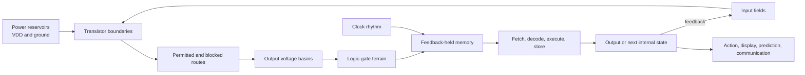
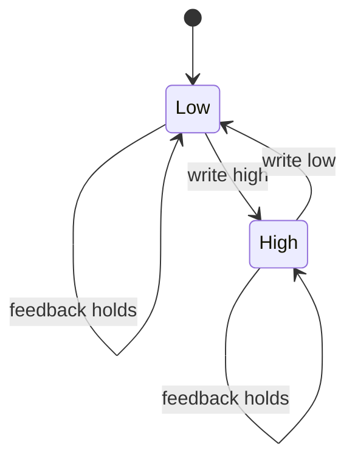

# RCCM Computers

## A spatial mental model for how computers “think”

This is a bridge document.

It uses RCCM’s field, fluid, boundary, pressure, admittance, impedance, and
flow language to make computers spatially inhabitable. It does **not** require
RCCM to be the correct fundamental physics of electromagnetism or
semiconductors. It also does not argue that RCCM is incorrect.

Three layers remain separate throughout:

| Layer | Job | Authority |
|---|---|---|
| **Computer physics** | Describe what semiconductor devices and circuits measurably do | Established semiconductor, electromagnetic, and circuit models |
| **Fluid map** | Turn those relations into terrain, boundaries, routes, storage, and flow | Pedagogical analogy |
| **Formal RCCM proposal** | Supply RCCM’s more specific continuum identifications | Claims of [`RCCM-Condensed.tex`](RCCM-Condensed.tex), not prerequisites for using the map |

When this guide says “a voltage is a pressure terrain,” read:

> A voltage is usefully pictured as a pressure-like scalar terrain for this
> mental model.

It does not mean volts and pascals have the same dimensions or that their
physical identity has been established.

## One-sentence model

> A computer is a terrain of field-controlled channels: power supplies hold
> potential differences, transistors reshape the permitted routes, capacitive
> nodes settle into stable state basins, clocks coordinate crossings, feedback
> preserves memory, and a program selects a long itinerary through the
> machine’s possible states.

The shortest route is:

```text
energy reservoirs
-> field-controlled transistor boundaries
-> conducting or blocked routes
-> stable voltage basins
-> logic junctions
-> feedback-held memory
-> clocked state crossings
-> arithmetic, selection, and control
-> observable behavior
```

## The whole field



Nothing inside this field needs a miniature thinker watching the bits.
The terrain itself constrains which state can follow which.

## Terrain objects

| Computer object | Spatial reading | Physical hold | Where the map can bite |
|---|---|---|---|
| Supply voltage | Difference between high and low reservoirs | Maintained electric potential difference | Voltage is not literally fluid pressure |
| Electric field | Local slope pushing the state toward a route | Force per charge; gradient of potential | Field direction and electron motion need not point the same way |
| Current | Conserved flux through a route | Rate of charge transport | Charge carriers do not move like a fast river from source to destination |
| Resistance | Drag or narrowness of a route | Relation between voltage, current, material, and geometry | It also depends on temperature and device state |
| Capacitance | Compliant reservoir that can hold a displaced state | Stored electric-field energy and charge per voltage | The energy is in the field configuration, not a literal tank |
| Inductance | Inertia of changing flux | Stored magnetic-field energy | A loop’s return path and surrounding field matter |
| Semiconductor | Terrain whose conductance can be reshaped | Band structure, doping, carriers, and electrostatics | It is not merely a mediocre metal |
| Transistor | Field-controlled crossing | Gate voltage changes channel conductance | The gate is not a mechanical flap |
| Logic bit | One of two broad resting basins | Noise-tolerant voltage range | Real voltage remains continuous |
| Logic gate | Junction of constrained routes | Complementary transistor network | Boolean symbols hide timing and analog margins |
| Memory | A basin held by feedback | Stable circuit state or stored charge | Different memory technologies use different holds |
| Clock | Repeated permission wave for state crossing | Oscillating electrical timing reference | Not all computers are globally synchronous |
| Program | Scheduled route through machine state-space | Encoded instructions and data interpreted by hardware | Software does not bypass physical limits |
| Heat | Irrecoverable or deliberately discarded motion | Dissipated electrical energy | Local temperature and total energy are different measurements |

## First hold: a computer is analog underneath and digital on top

A wire does not contain a metaphysical `0` or `1`. It carries a continuous
electrical state:

```text
voltage
0 V ------------------------------------ VDD
```

The circuit assigns broad regions to symbols:

```text
low basin       uncertain crossing        high basin
[    0    ]     [ noise / transition ]    [    1    ]
```

That separation supplies slack. Small disturbances can move the physical
voltage without changing the interpreted bit.

Digital logic is therefore an interface:

```text
continuous field state
-> thresholded basin
-> symbolic bit
```

The abstraction is real and useful, but its hold comes from analog terrain
underneath it.

## The mental movie

### 1. Prepare a semiconductor terrain

Silicon has allowed electronic energy bands separated by a band gap. Doping
changes the population of mobile carriers:

- n-type regions have electrons as their majority carriers;
- p-type regions have holes—mobile absences in the electron population—as
  their majority carriers.

Spatially:

```text
crystal structure
-> allowed and forbidden carrier states
-> doping reshapes carrier availability
-> applied fields reshape permitted motion
```

A hole is not a literal bubble in a liquid. It is a useful positive-carrier
description of how missing electron occupancy moves through the lattice.

### 2. Place one field-controlled crossing

An nMOS transistor places electron-rich source and drain regions on opposite
sides of a p-type channel region. A gate conductor sits above the channel,
separated from it by a dielectric.

```text
gate low                         gate high

source   blocked gap   drain     source ===== channel ===== drain
 n+        p-type        n+       n+      inversion layer     n+
             OFF                                 ON
```

The gate does not need to pass a steady current into the channel. Its electric
field crosses the insulating boundary and changes the carrier terrain below.
When the channel becomes sufficiently conductive, source and drain gain a
usable route.

The fluid reading is:

```text
control field presses across a sealed boundary
-> local terrain changes
-> route admittance rises or falls
-> another current can or cannot cross
```

That is why a transistor can let a small control state govern a larger flow
from the power supply.

### 3. Give the output two possible basins

A CMOS inverter combines one pMOS and one nMOS transistor:

```text
high reservoir: VDD
        |
      pMOS       conducts when input is low
        |
      OUTPUT
        |
      nMOS       conducts when input is high
        |
low reservoir: ground
```

| Input basin | High route | Low route | Output basin |
|---|---|---|---|
| low | conducting | blocked | high |
| high | blocked | conducting | low |

The output does not “decide” in the human sense. The input field changes the
available routes, and the output terrain settles into the basin that remains
connected.

This is a NOT gate:

```text
0 -> 1
1 -> 0
```

### 4. Join crossings into logic terrain

Series and parallel transistor arrangements form more complicated route
conditions.

For a two-input NAND gate:

```text
both low-route crossings must conduct
before the output can reach the low reservoir
```

| A | B | Low route complete? | Output |
|---:|---:|---|---:|
| 0 | 0 | no | 1 |
| 0 | 1 | no | 1 |
| 1 | 0 | no | 1 |
| 1 | 1 | yes | 0 |

The truth table is the symbolic export. The transistor network is the terrain
that makes the table physically hold.

Because NAND gates can be composed into every Boolean function, a sufficiently
large route network can implement comparison, addition, multiplication,
selection, and control.

### 5. Turn a passing state into memory

Combinational logic has no internal past. Change its inputs and, after a short
settling time, its output changes.

Memory appears when output returns as input:

```text
state A reinforces state A
state B reinforces state B
small disturbances drain back toward the occupied basin
```



A latch or SRAM cell is a two-basin terrain maintained by feedback. Dynamic
RAM uses charge stored on a capacitor and must periodically refresh it.
Flash memory changes charge trapped behind an insulating boundary. Magnetic
storage holds oriented magnetic domains.

“Memory” names the function. Each technology builds a different physical
hold.

### 6. Add a clock

A clock is a repeated timing wave:

```text
hold -> release crossing -> settle -> capture -> hold
```

It divides continuous physical evolution into coordinated state transitions.
A register captures a field of bits at a clock edge and holds them while the
next logic terrain settles.

This prevents every part of the machine from changing without a shared return
point.

Not every computer has one global clock. Asynchronous circuits use local
handshakes: a region announces that its output has settled, and the next
crossing proceeds.

### 7. Build a processor

A simplified processor is a field of specialized holds and crossings:

| Region | Spatial job |
|---|---|
| Program counter | Holds the location of the next instruction |
| Instruction memory/cache | Holds encoded route commands |
| Decoder | Converts instruction bits into control boundaries |
| Registers | Hold the machine’s immediate working state |
| Arithmetic logic unit | Supplies terrain for arithmetic and comparison |
| Load/store paths | Move state between registers and memory |
| Branch unit | Chooses which instruction terrain comes next |
| Clock/control | Coordinates crossings and capture |

One instruction moves through:

```text
fetch
-> decode
-> gather operands
-> open the required arithmetic/control routes
-> let outputs settle
-> capture the mark
-> select the next instruction
```

The processor “knows what operation to perform” only in this operational
sense: instruction bits reshape the control terrain, and the permitted next
state follows.

### 8. Place software above the hardware

Software is a high-level route description compiled into transitions the
machine can perform.

```text
human intention
-> source code
-> compiler transformations
-> machine instructions
-> control fields
-> transistor crossings
-> changed physical state
```

Types, functions, and objects do not float free of the hardware. They are
stable interfaces for describing enormous families of lower-level states
without rebuilding the transistor map every time.

For a TypeScript mind:

```ts
type Step<State, Input, Output> = (
  state: Readonly<State>,
  input: Readonly<Input>
) => Readonly<{
  state: State
  output: Output
}>
```

At the software layer, `Step` is a pure state transition. At the hardware
layer, each step is a bounded physical crossing that consumes time and energy.

### 9. Add machine learning

A neural network is another shaped route field.

```text
input values
-> weighted influence
-> summation
-> nonlinear threshold or activation
-> new field of values
-> repeated layers
-> output
```

In the spatial map:

- a **weight** is adjustable influence or route admittance;
- an **activation** is the state admitted after combined pressure crosses a
  response boundary;
- **inference** lets an input move through a terrain whose weights are held;
- **training** changes that terrain so future inputs settle into more useful
  outputs;
- **error feedback** identifies which route weights should change.

On an ordinary digital accelerator, weights are encoded bits and arithmetic
simulates this weighted field. In some analog or neuromorphic hardware,
conductance can embody a weight more directly. Do not silently transfer the
literal-fluid reading from one implementation to the other.

## What “thinking” means here

This guide uses “thinking” operationally:

```text
receive state
-> compare and transform
-> preserve relevant history
-> select a next route
-> predict or act
-> receive feedback
```

That definition covers calculators, controllers, CPUs, and machine-learning
systems at different scales.

It does not by itself answer whether a machine:

- understands;
- has subjective experience;
- possesses agency;
- is conscious; or
- thinks in exactly the same sense as a person.

Those are additional philosophical and empirical questions. Semiconductor
operation alone does not settle them.

## The energy ledger

Every logic node has capacitance. Moving it from low to high stores electric
field energy:

\[
U_C=\frac12CV^2.
\]

In ordinary abrupt CMOS switching, charging and later discharging the node
draws approximately:

\[
E_{\text{cycle}}\approx CV^2.
\]

Across a workload:

\[
P_{\text{dynamic}}\approx
aC_{\text{sw}}V_{\text{DD}}^2f.
\]

There is also:

- leakage across nominally blocked boundaries;
- brief direct-path current during transitions;
- resistive loss in devices and interconnect;
- clock, memory, communication, and conversion cost; and
- cooling and power-delivery loss outside the chip.

The spatial ledger is:

```text
supply energy
-> stored field state
-> transported signal energy
-> useful state crossing
-> recovered energy, if any
-> irreversible heat and leakage
```

Energy efficiency must be measured per correct useful crossing, not from a
cool-looking field picture or lower instantaneous power alone.

## Cursive routes and smooth thought

The fluid map naturally suggests that smooth routes should reduce drag. That
is a useful hypothesis generator, but it can become a false smooth.

A rounded boundary may reduce:

- local electric-field concentration;
- current-density crowding;
- breakdown or leakage;
- high-frequency reflection; or
- reliability stress.

A free-form route may also shorten a wire or remove a via.

But a curve can increase:

- route length;
- switched capacitance;
- coupling;
- occupied area; or
- manufacturing complexity.

Therefore:

```text
smooth appearance
does not imply
lower energy
```

Geometry affects energy only through measurable mediators such as \(R\),
\(C\), \(L\), leakage, timing, temperature, errors, path length, and via count.
The full adversarial treatment is in
[Thinking machines and the cursive-chip verdict](PREP/cursive-semiconductor/07-EXPLANATION-AND-DEMONSTRATION.md).

A different kind of cursiveness occurs through **time**. Slowly ramped,
energy-recovering logic can reduce dissipation by changing the trajectory
through voltage state-space. Smooth physical outlines and smooth temporal
waveforms are different interventions.

## Worked crossing: a computer turns on a cooling fan

Suppose the intended rule is:

```ts
fanOn = temperature > limit
```

The complete field is:

```text
temperature changes
-> sensor changes an electrical signal
-> converter places a number into a register
-> instruction decoder opens comparison routes
-> comparator terrain settles to true or false
-> clock captures the result bit
-> output transistor admits or blocks motor current
-> fan changes the temperature field
-> sensor receives the return
```

| Layer | What happened |
|---|---|
| World | Temperature changed |
| Input boundary | Sensor translated temperature into an electrical state |
| Symbolic terrain | The state was encoded as a number |
| Logic terrain | A comparator tested that number against a held limit |
| Memory hold | A register captured the result |
| Power crossing | A transistor controlled the fan’s larger current |
| Action | Airflow changed |
| Return | The sensor measured the new temperature |

The “thought” is not at one gate. It is the entire closed crossing from world,
through state transformation, into action, and back through measurement.

## How RCCM helps

RCCM encourages seven productive questions:

1. **Field:** What continuous state exists before it becomes a symbol?
2. **Terrain:** Where are the reservoirs, slopes, channels, and basins?
3. **Boundary:** What controls whether a crossing is permitted?
4. **Current:** What is moving, and what conservation ledger must close?
5. **Hold:** Where is state preserved against noise and drift?
6. **Bite:** Where do delay, heat, leakage, or error enter?
7. **Return:** What feedback verifies or changes the next state?

This route is especially useful for debugging. If a computation fails, ask:

```text
wrong terrain?
wrong boundary state?
crossing too slow?
basin too shallow?
hold leaking?
clock captured before settling?
return path missing?
```

Those spatial questions export directly into conventional checks for voltage,
connectivity, timing, noise margin, state retention, power integrity, and
feedback.

## Where formal RCCM enters

The fluid map above can stand on its own. Readers who want the document’s more
specific RCCM formalization can continue into:

| RCCM section | Computer-facing use | Boundary |
|---|---|---|
| [Kinematic Impedance Tensor](RCCM-Condensed.tex#L1877-L2030) | Picture resistance as inverse capacity to respond | The proposed cross-domain identities require independent validation |
| [Kinetic–Potential Strain Conservation](RCCM-Condensed.tex#L2652-L2723) | Separate stored state, moving state, and a closed ledger | It is not a derived CMOS power model |
| [EM Kinematics and the LC-Acoustic Isomorphism](RCCM-Condensed.tex#L3135-L3265) | Place capacitance, inductance, electric/magnetic fields, and propagation in one continuum picture | The TeX’s mechanical identifications are RCCM claims |
| [Poynting-flux construction](RCCM-Condensed.tex#L3209-L3217) | Picture electromagnetic energy transport through the surrounding field | It does not replace semiconductor carrier transport |

The current formal TeX does not supply:

- semiconductor band structure and carrier statistics;
- doping and fabrication-process models;
- mobility, scattering, recombination, or interface traps;
- MOSFET compact models;
- standard-cell libraries and parasitic extraction;
- microarchitecture, instruction semantics, or compiler theory; or
- a theory of consciousness.

Those gaps do not prevent the RCCM map from teaching computer organization.
They prevent the map from being promoted, by analogy alone, into a complete
physical computer model.

## Analogy boundaries

| Tempting shortcut | Safer hold |
|---|---|
| Voltage **is** pressure | Voltage is a scalar potential that can be pictured as pressure-like terrain |
| Current is water racing through a pipe | Current is charge flux; electromagnetic influence can propagate far faster than carrier drift |
| A hole is a fluid bubble | A hole is a quasiparticle description of missing electron occupancy |
| A transistor is a mechanical valve | A transistor is a field-controlled conductance boundary |
| A bit is one electron | A bit is a robust range of collective circuit states |
| Memory is trapped fluid | Memory is any physical state with a durable restoring or isolation hold |
| The clock makes time discrete | The clock samples continuous dynamics into coordinated transitions |
| Software is nonphysical | Software is an abstract route realized by physical states and transitions |
| Neural weights are literal pipe widths | They are functional influence coefficients; only some hardware embodies them as conductance |
| RCCM language proves RCCM physics | Intuitive fit, formal equivalence, and empirical validation are different rungs |

## Symbolic export

A general computer can be modeled as a transition system:

\[
(S_t,I_t)\xrightarrow{F} (S_{t+1},O_t),
\]

where:

- \(S_t\) is the held internal state;
- \(I_t\) is the present input;
- \(F\) is the physically implemented transition terrain;
- \(S_{t+1}\) is the next held state; and
- \(O_t\) is the emitted output.

The RCCM-shaped reading is:

```text
held basin + incoming field
-> boundary-conditioned crossing
-> dissipation and delay
-> next basin + outward mark
```

That is the core of how a computer “thinks” in this guide: not a ghost inside
the chip, but a vast, clocked or handshaken landscape that repeatedly turns
continuous physical state into stable symbols, transforms those symbols, and
returns the result to the world.

## Mark and return

The durable mark from this guide is:

> A computer is a controlled state-flow landscape. Transistors shape routes;
> logic supplies junction rules; feedback supplies memory; clocks coordinate
> crossings; programs select itineraries; energy and correctness decide
> whether the crossing held.

Return to the map whenever a computer concept becomes placeless:

```text
place the reservoirs
-> draw the controlled boundary
-> locate the state basin
-> trace the crossing
-> close the energy and information ledgers
-> verify the outward mark
```
