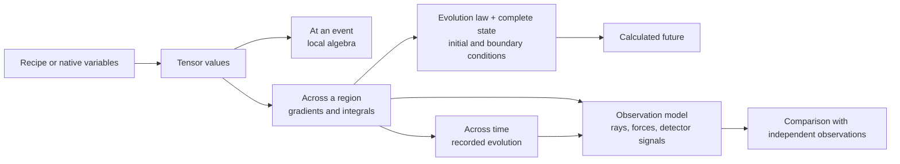

# RCCM Asymmetric Metric Tensor Data

Imagine opening a folder of files labelled “Asymmetric Metric Tensor.” One
file could describe the state at a single event. Another could contain a
cross-section through a vortex, a whole spatial volume, a recorded history,
or a recipe that generates a field wherever you sample it. A further file
could contain only the light paths or detector readings calculated from that
field.

**The useful question is: what part of the world does this file preserve,
and which operations does that preservation make possible?** The extension
comes after that question.[^status]

[^status]: This guide explores the data architecture implied by the two RCCM
    TeX sources. Source equations and their physical interpretations remain
    claims of those documents. The schemas and examples below are proposals
    made here, not an existing RCCM interchange standard or measured dataset.
    The Hyperslice analysis is one adversarial conceptual pass, not an
    independently validated classification study.



A tensor value is a local object. A tensor **field** attaches such an object
to each location in a domain. A dataset stores a representation of some of
that field. A simulation needs additional rules for how the field changes.

For an immediate route through this document:

| Your question | Start here |
|---|---|
| What are the numbers actually about? | [The local object](#the-local-object) |
| How few numbers can describe it? | [Seven numbers, sixteen slots](#seven-numbers-sixteen-slots) |
| What might different files contain? | [Files-you-might-find map](#files-you-might-find-map) |
| What is the minimum for a particular goal? | [Minimum data by goal](#minimum-data-by-goal) |
| Which extension should carry it? | [Containers and file formats](#containers-and-file-formats) |
| What should the file declare? | [A proposed interchange contract](#a-proposed-interchange-contract) |

## The local object

The focused source is [RCCM-GfX-2.tex](RCCM-GfX-2.tex), especially Sections
1–3: Clebsch variables, the nested pressure ledger, and tensor assembly.
The comparison source is [RCCM-Condensed.tex](RCCM-Condensed.tex), especially
“Tensor Evolution & Geometric Bending (The Rosetta Stone),”
`sec:deriv_rosetta_stone`. Their differences are recorded in
[Source boundaries](#source-boundaries).

In the focused document, the local object has three visible parts:

| Part of the local terrain | Stored mathematical object | What it describes inside RCCM |
|---|---|---|
| Remaining pressure capacity | Scalar `q = α_s² = P_static / P_c` | The local budget left after macroscopic, dynamic, and shear loads |
| Sliding along the three spatial axes | Three time–space antisymmetric components | Transverse slip, normalized and multiplied by the coupling coefficient |
| Twisting around the three spatial axes | Three space–space antisymmetric components | Clebsch vorticity, normalized by a relaxation time and coupling coefficient |

The tensor is split into symmetric and antisymmetric sectors:

\[
\widehat U_{\mu\nu}=S_{\mu\nu}+A_{\mu\nu},\qquad
S=\tfrac12(\widehat U+\widehat U^T),\quad
A=\tfrac12(\widehat U-\widehat U^T).
\]

Here `μ` and `ν` each select one of four basis directions. They are the two
slots of a rank-two tensor, not four spatial dimensions. An array shaped
`[time, z, y, x, 4, 4]` still stores a rank-two tensor field; the first four
array axes locate samples.

The same field may be used to describe a wave packet, the surroundings of a
localized defect, a pressure basin, or a galactic model. **The tensor type
does not identify which physical scene was encoded.** The domain, inputs,
boundaries, and provenance identify the scene.

## Seven numbers, sixteen slots

For the explicit Cartesian matrix in GfX Section 3.3, define these storage
names:

\[
q=\alpha_s^2,\qquad
\mathbf e=\alpha\,\mathbf v_\perp/c,\qquad
\mathbf b=\alpha t_p\boldsymbol\Omega.
\]

`e` and `b` here are dimensionless storage names. They do not denote electric
field in V/m or magnetic field in tesla.

In the declared Cartesian frame, with basis order `(ct, x, y, z)`, the matrix
is reconstructed as:

\[
\widehat U=
\begin{pmatrix}
-q&-e_x&-e_y&-e_z\\
e_x&q^{-1}&-b_z&b_y\\
e_y&b_z&q^{-1}&-b_x\\
e_z&-b_y&b_x&q^{-1}
\end{pmatrix}.
\]

**One scalar plus two three-vectors fills all sixteen slots.** This is a
lossless representation of this particular matrix family. It is not a claim
that the theory has seven unconstrained physical degrees of freedom:
pressure budgets, field constraints, and evolution laws can further restrict
which combinations occur.

| Representation | Scalar values per event | Conditions |
|---|---:|---|
| Arbitrary real `4 × 4` tensor | 16 | No symmetry or special matrix form assumed |
| General symmetric `S` plus antisymmetric `A` | `10 + 6 = 16` | Store the upper triangle of `S` and strict upper triangle of `A`, with reconstruction conventions |
| GfX Section 3.3 form | `1 + 3 + 3 = 7` | The displayed form and its frame are declared |
| That form with `A = 0` | 1 | Only `q` varies; all six antisymmetric components are explicitly zero |
| That form with slip zero | 4 | `q` and the three components of `b` |
| Rotation fixed along `z`, slip confined to `xy` | 4 | `q, e_x, e_y, b_z`; excluded components explicitly zero |
| Rotation fixed along `z`, slip fixed along `x` | 3 | `q, e_x, b_z`; axes and exclusions are part of the model |
| Known unperturbed state everywhere | 0 varying values | A recipe declares `q = 1`, `e = b = 0`, and its domain |

Counts exclude coordinates, time, frame, schema, uncertainty, and provenance.
At binary64 precision, seven numeric values occupy 56 bytes and sixteen
occupy 128 bytes before all that overhead. These are storage counts at a
chosen precision, not information-theoretic minima for arbitrary real data.

The finite positive-capacity profile uses `0 < q ≤ 1`. At `q = 0`, `1/q`
does not define a finite matrix. A file must represent an excluded boundary,
a limit, or an explicit regularization. A numerical floor changes the
encoded model and belongs in the metadata.

A change of observer can introduce symmetric off-diagonal components. A
seven-value record in its adapted frame therefore needs the frame transform
to reproduce components in another frame. If that transformation is unknown,
retain the full matrix. Never compress an arbitrary matrix by silently
discarding the components that fail this profile.

### What those seven numbers do not recover

The pressure ledger in GfX Section 2 gives:

\[
q=\frac{P_{ambient}-P_{dyn}-P_{shear}}{P_c}
=\alpha_g^2\alpha_a^2.
\]

Knowing `q` and `P_c` gives `P_static` and the total pressure deficit. It does
not uniquely recover the split among ambient depletion, dynamic load, and
shear load. Similarly, `e` records a product involving `α`, and `b` records
a product involving both `α` and `t_p`.

To recover physical slip and vorticity, provide the normalization parameters:

\[
\mathbf v_\perp=(c/\alpha)\mathbf e,\qquad
\boldsymbol\Omega=\mathbf b/(\alpha t_p),
\]

where the divisors must be nonzero. To reconstruct a particular Clebsch
representation, also provide its potentials or a reconstruction problem,
including gauge and boundary choices. Vorticity alone does not uniquely
specify those potentials or the whole velocity field.

This gives an important distinction:

```text
minimum data to reconstruct U
    can be smaller than
minimum data to reconstruct the physical inputs that produced U
    can be smaller than
minimum state required to advance the chosen dynamics
```
