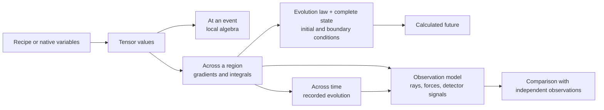
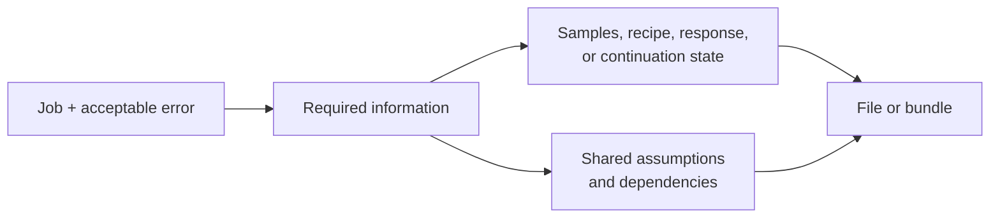

# RCCM Data: What Files Preserve, and What That Makes Possible

Imagine opening a folder of files labelled “Asymmetric Metric Tensor.” One
file could describe the state at a single event. Another could contain a
cross-section through a vortex, a whole spatial volume, a recorded history,
or a recipe that generates a field wherever you sample it. A further file
could contain only the light paths or detector readings calculated from that
field.

**The useful question is: what part of the world does this file preserve,
and which operations does that preservation make possible?** The extension
comes after that question.[^status]

[^status]: This guide explores the data architecture implied by
    `RCCM-GfX-2.tex` and `RCCM-Condensed.tex`. Their physical identifications
    remain claims of those documents. Established file conventions are
    sourced below; RCCM adapters, hypothetical files, and proposed tools are
    design explorations. Mathematical consequences are stated under their
    declared assumptions. This is an adversarial Hyperslice exploration,
    not an independently validated taxonomy or an RCCM interchange standard.

A file can preserve **appearance, state, behavior, instructions, observations,
or the experiment connecting them**. A screenshot, a saved game, and a game
engine with its rules occupy different places in that terrain. Likewise,
recorded sound, a musical score, and an instrument model let you perform
different jobs. RCCM data can inhabit all of these roles, although only some
of the files actually contain tensor components.

## Reading routes

| Your question | Start here |
|---|---|
| What are these numbers actually about? | [Place the field](#place-the-field) |
| How few numbers could describe the tensor? | [Seven numbers, sixteen slots](#seven-numbers-sixteen-slots) |
| What might unfamiliar files contain? | [A folder of possible worlds](#a-folder-of-possible-worlds) |
| Where have other fields already solved similar problems? | [Thirty-six existing conventions and jobs](#thirty-six-existing-conventions-and-jobs) |
| What possibilities appear when we make new cuts? | [Hyperslice the possibility space](#hyperslice-the-possibility-space) |
| What unusual tools could this enable? | [Twelve possibilities from crossed slices](#twelve-possibilities-from-crossed-slices) |
| What would an interactive learning toy preserve? | [Six interactive learning toys](#six-interactive-learning-toys) |
| What is the minimum for my particular goal? | [Minimum data by goal](#minimum-data-by-goal) |
| Which file format should carry it? | [Containers and file formats](#containers-and-file-formats) |
| What information makes a file usable? | [The information surrounding the numbers](#the-information-surrounding-the-numbers) |
| Where do the source documents differ? | [Source boundaries](#source-boundaries) |
| How do I discover more possibilities myself? | [Repeat the exploration](#repeat-the-exploration) |

## Place the field

Place a small measuring frame at one location and one time. Inside RCCM, the
local tensor describes the continuum's remaining pressure capacity, transverse
slip, and rotational strain. Move the frame elsewhere and the values may
change. Keep it in place and advance time: they may change again.

The tensor is the object attached to that event. The **tensor field** is the
assignment across a domain. A dataset preserves some representation of that
assignment. An evolution model adds rules for what happens next.



Different supports preserve different relationships:

| Where the data live | What is available there | A natural job |
|---|---|---|
| One event | A local value, optionally its derivatives | Inspect the local structure |
| A line or trajectory | Samples ordered along a route | Integrate a specified path quantity |
| A surface | Boundary values with orientation and area | Compute a surface flux or prescribe boundary conditions |
| A volume | Interior samples, geometry, and neighborhoods | Compare locations and estimate spatial derivatives |
| A time history | States or readings at declared times | Replay, measure frequencies, compare events |
| An ensemble | Several possible states with a sampling rule or weights | Explore uncertainty and sensitivity |
| A recipe | A rule producing values within a declared domain | Generate samples on demand |

A surface can be the most useful dataset for a surface-flux question. A huge
volume can be irrelevant if it excludes the interface being measured. A recipe
can describe an entire uniform universe using fewer varying values than one
arbitrary local sample. Its compactness comes from the shared rule.

The focused source is [RCCM-GfX-2.tex](RCCM-GfX-2.tex), especially Sections
1–3. Compare the “Tensor Evolution & Geometric Bending” section of
[RCCM-Condensed.tex](RCCM-Condensed.tex), labelled `sec:deriv_rosetta_stone`.
In the focused construction, the tensor decomposes as

\[
\widehat U_{\mu\nu}=S_{\mu\nu}+A_{\mu\nu},\qquad
S=\tfrac12(\widehat U+\widehat U^T),\quad
A=\tfrac12(\widehat U-\widehat U^T).
\]

Here `μ` and `ν` each select one of four basis directions. The tensor has two
index slots. An array shaped `[time, z, y, x, 4, 4]` still stores rank-two
tensors; its first four array axes locate samples. Array rank and physical
tensor rank answer different questions.

The same tensor type can describe a pulse, a vortex neighborhood, a pressure
basin, or a galactic model. The domain, inputs, boundaries, and provenance
identify which scene the file represents.

## Seven numbers, sixteen slots

For the explicit Cartesian matrix in GfX Section 3.3, introduce storage names

\[
q=\alpha_s^2=P_{static}/P_c,\qquad
\mathbf e=\alpha\mathbf v_\perp/c,\qquad
\mathbf b=\alpha t_p\boldsymbol\Omega.
\]

`q` is remaining pressure capacity. `e` stores three normalized slip
components; `b` stores three normalized vorticity components. Both vectors are
dimensionless here. A value labelled `e_x` in this convention is not an electric
field measurement in V/m; `b_z` is not a measurement in tesla.

In the declared adapted Cartesian frame, with basis order `(ct, x, y, z)`,

\[
\widehat U=
\begin{pmatrix}
-q&-e_x&-e_y&-e_z\\
e_x&q^{-1}&-b_z&b_y\\
e_y&b_z&q^{-1}&-b_x\\
e_z&-b_y&b_x&q^{-1}
\end{pmatrix}.
\]

**One scalar plus two three-vectors fills all sixteen slots.** This is a
lossless representation of this matrix family at the chosen numeric precision.
Pressure budgets and field equations can further constrain which combinations
occur. Seven stored coefficients do not establish seven unconstrained physical
degrees of freedom.

| Representation | Values per event | Required declaration |
|---|---:|---|
| Arbitrary real `4 × 4` tensor | 16 | Component order and frame |
| General symmetric `S` plus antisymmetric `A` | `10 + 6 = 16` | Triangle ordering and reconstruction signs |
| GfX Section 3.3 matrix | `1 + 3 + 3 = 7` | The displayed form and its adapted frame |
| That form with `A = 0` | 1 | Only `q` varies |
| That form with slip zero | 4 | `q` and three `b` components |
| Rotation along `z`, slip in the `xy` plane | 4 | `q, e_x, e_y, b_z`; other components zero |
| Rotation along `z`, slip along `x` | 3 | `q, e_x, b_z`; axes fixed |
| Known unperturbed state everywhere | 0 varying values | `q = 1`, `e = b = 0`, and a domain |

These counts exclude coordinates, time, uncertainty, and other metadata.
Splitting a general tensor into `S` and `A` organizes its information without
reducing its sixteen independent entries.

A small algebraic example is `q = 0.8`, `e = (0.001, 0, 0)`, and
`b = (0, 0, 0.002)`:

\[
\widehat U=
\begin{pmatrix}
-0.8&-0.001&0&0\\
0.001&1.25&-0.002&0\\
0&0.002&1.25&0\\
0&0&0&1.25
\end{pmatrix}.
\]

This demonstrates encoding and reconstruction; it supplies no evolution
solution. The finite positive-capacity profile has `0 < q ≤ 1`. At `q = 0`,
`1/q` is undefined as a finite value. An excluded boundary, limiting
construction, or explicit numerical regularization must carry that meaning.

A change of observer can introduce symmetric off-diagonal components. Preserve
the adapted frame and its transformation when exporting seven coefficients to
another frame. For an arbitrary matrix outside this family, keep all components
or another representation that actually reconstructs them.

### What the matrix leaves undetermined

The nested pressure ledger gives

\[
q=\frac{P_{ambient}-P_{dyn}-P_{shear}}{P_c}
=\alpha_g^2\alpha_a^2.
\]

Knowing `q` and `P_c` gives static pressure and total deficit. It does not
separate background depletion, dynamic load, and shear load. For example,
`(α_g, α_a) = (1, 0.8)` and `(0.8, 1)` both produce `q = 0.64`, while
GfX Section 5.1's `ρ_eff = ρ_τ/α_a` gives different effective densities.
This is an algebraic ambiguity in the stored product, even before asking
whether either assignment belongs to a complete solution.

Recovering physical slip and vorticity also requires the normalization:

\[
\mathbf v_\perp=(c/\alpha)\mathbf e,\qquad
\boldsymbol\Omega=\mathbf b/(\alpha t_p),
\]

with nonzero divisors. Recovering particular Clebsch potentials requires still
more information about representation, gauge, and boundaries. A curl does not
uniquely determine the entire velocity field.

```text
reconstruct tensor components
    -> recover selected physical inputs
        -> reconstruct a complete state for a chosen model
            -> evolve it and predict specified observations
```

Each arrow is a possible need for additional information, not an automatic
capability granted by the tensor's name.

## A folder of possible worlds

The following filenames are invented examples. Their descriptions matter more
than their suffixes.

| Example | What it would be of | What it could be for |
|---|---|---|
| `vacuum.json` | A domain and a uniform-background recipe | A baseline scene or algebra test |
| `probe.csv` | One location's readings or reconstructed coefficients over time | Frequency analysis and event comparison |
| `pressure-well.npz` | A sampled `q` field and spatial coordinates | Explore packing, pressure, and gradients |
| `pulse.recipe.json` | A wave family, envelope, polarization, phase, and parameters | Regenerate a prescribed pulse |
| `vortex.h5` | A resolved region around a rotational defect | Inspect circulation and core structure |
| `boundary.xdmf` | An oriented surface and attached fields | Integrate flux or specify a boundary problem |
| `material.zarr` | Repeated cells or an ensemble of field responses | Study homogenization and effective behavior |
| `galaxy.csv` | Radial profiles with a named geometric construction | Evaluate a selected galactic model |
| `experiment.bundle` | Initial state, drives, boundaries, observations, and model identity | Reproduce a virtual experiment |
| `world.checkpoint` | Complete continuation state for a particular engine | Resume and branch a simulated world |

For an object such as a resonator, “the data” could mean its visible shell, its
internal field at one instant, its response to an incoming pulse, or a full
description sufficient to simulate new excitations. Those are four valuable
deliverables. Their minimum contents differ because their jobs differ.

The same applies to a galaxy. A radial table can encode a symmetry-reduced
model of a vast region. It cannot preserve arbitrary three-dimensional
substructure that the reduction discarded. Large physical extent does not
necessarily mean large files; rich independent detail usually does.

## Thirty-six existing conventions and jobs

Each entry follows **stored object and job → minimum useful contents → RCCM
analogue and next requirement**. “Minimum” means the smallest useful example
for that job in an agreed environment, not the formal minimum valid file under
every version of a standard. The RCCM translations are proposed here.

Choose a route by the job you want to do:

| Job | Useful starting examples |
|---|---|
| Show or inspect something | Assets, caches, and result fields: 1, 5, 14 |
| Compose or edit a system | Scenes, parametric designs, and connected models: 2, 10, 17, 19 |
| Run, resume, or branch behavior | Saves, replays, cases, and simulation bundles: 3, 4, 15, 29 |
| Drive or measure an experiment | Toolpaths, recordings, scores, and observations: 11, 21–23, 27 |
| Reuse a response at lower cost | Response tables, kernels, and learned models: 18, 24, 33 |
| Explain, reproduce, or challenge a result | Notebooks, research bundles, and reactive lessons: 34–36 |

### Games and virtual worlds

**1. glTF/GLB asset — place something visible.** glTF carries meshes,
materials, scene relationships, and supported animation data. A useful static
asset needs geometry and its interpretation; richer appearance adds materials.
The RCCM counterpart could be a display mesh extracted from a field. To ask
what happens when it is struck or heated requires underlying state and laws.
A graphics transform matrix and `Û` have different semantics despite both
being `4 × 4`. [glTF specification](https://registry.khronos.org/glTF/specs/2.0/glTF-2.0.html).

**2. USD scene — compose a world from reusable pieces.** USD supports scene
description and composition through assets and layers. A useful assembly needs
asset references, placement, and composition rules. An RCCM scene could place a
source, a field region, and a detector using shared references. Physically
joining those regions additionally requires compatible boundaries and a rule
for resolving interactions; scene composition alone does not provide that
rule. [USD introduction](https://openusd.org/dev/intro.html).

**3. Saved game — continue from where you stopped.** Game saves preserve
selected runtime state and references to existing game content. The minimum
depends on what the engine can reconstruct. An RCCM save similarly needs every
state variable affecting continuation, plus the engine and model identity.
An attractive frame can accompany it as a preview. It cannot stand in for
hidden material memory or evolving fields. [Godot saving guide](https://docs.godotengine.org/en/stable/tutorials/io/saving_games.html).

**4. Replay log — regenerate a sequence of events.** A deterministic replay
convention stores initial state and ordered inputs instead of every resulting
frame. The minimum also includes the executable rules, timing, and relevant
random state. RCCM could preserve “emit this pulse, then open that boundary.”
Branching requires replaying to the intervention point and evolving the changed
inputs. External influences and nondeterminism must be captured or bounded;
there is no universal replay extension.

### Animation, VFX, and procedural assets

**5. Alembic cache — scrub an expensive result.** Alembic preserves baked
geometric results of animation and simulation. A useful cache needs geometry
samples and their times. An RCCM analogue is a sequence of extracted defect
surfaces or tracked structures. It supports playback and downstream rendering.
Changing the source experiment requires its generating model and state, which
the cache need not preserve. [Alembic's scope](https://www.alembic.io/).

**6. OpenVDB volume — keep sparse detail where it matters.** OpenVDB provides
sparse volumetric grids. A useful volume needs active values, a background
value, and a transform locating the grid. RCCM could store deviations around a
vortex while representing a uniform exterior implicitly. Additional channels
and a precise default-state convention are needed to reconstruct the tensor;
an absent region must be distinguishable from an unmeasured one.
[OpenVDB documentation](https://www.openvdb.org/documentation/).

**7. Procedural graph — store how to make the field.** A native node graph or
script preserves operations, parameters, and dependencies. One analytic pulse
generator may need only amplitude, width, direction, and phase under a fixed
formula. The RCCM result can be sampled at different resolutions. To reproduce
the same output later, retain operator versions and all dependencies. To call
the result a solution, establish that the generator satisfies the selected
field equations and constraints.

### CAD and manufacturing

**8. STEP model — exchange engineered geometry and product information.**
STEP representations can preserve geometric entities and associated product
information. A useful geometry exchange needs the relevant shape entities and
units. RCCM could use that geometry to locate cavity walls or device parts.
The next step adds material response, field initialization, contacts, and
boundary conditions. A precise mechanical shape does not uniquely determine
the continuum state around it. [NIST STEP guide](https://www.nist.gov/publications/step-file-analyzer-and-viewer-user-guide-update-6).

**9. STL surface — hand off a triangulated shell.** STL describes surface
facets. A useful shell needs valid triangles and an externally agreed scale.
An RCCM example is an isosurface extracted at a selected capacity threshold.
It enables shape comparison or fabrication-oriented handoff. Interior tensor
values, the threshold used, and reconstruction assumptions are additional
information. Two different fields can produce the same shell.
[STL format description](https://www.loc.gov/preservation/digital/formats/fdd/fdd000506.shtml).

**10. Parametric CAD document — preserve editable design intent.** A feature
history relates dimensions and construction operations. The useful minimum is
an executable dependency chain for the chosen shape. RCCM could preserve
“three cavities spaced by this wavelength” as parameters and relations.
Changing a parameter would regenerate the geometry and initial field recipe.
Predicting resulting performance additionally needs a physical model and
objective measurements. [FreeCAD parametric features](https://www.freecad.org/features.php).

**11. G-code/toolpath — prescribe actions through space.** A machining
program contains ordered motion and machine commands. A useful path needs
coordinates, units, modal context, and a compatible machine configuration.
RCCM could instead prescribe a moving source or boundary actuator. Replaying
commands yields the intended actuation only through a defined actuator model;
predicting its consequences requires the receiving world's state and laws.
[LinuxCNC G-code overview](https://linuxcnc.org/docs/stable/html/gcode/overview.html).

### Structural engineering

**12. Finite-element mesh — declare where calculations live.** A mesh format
such as Gmsh MSH preserves nodes, element connectivity, and associated grouping
information. The useful minimum is enough geometry and topology to locate the
chosen elements. RCCM samples can then attach to nodes, cells, or integration
points. Basis functions, field association, and numerical operators determine
how values between samples and derivatives are reconstructed.
[Gmsh file formats](https://gmsh.info/doc/texinfo/#MSH-file-format).

**13. Analysis deck — define a question for a solver.** A finite-element
problem description combines a mesh, material law, constraints, loads, and
analysis settings. A minimal example might be one loaded element with fixed
boundaries. Its RCCM analogue is a bounded field experiment with named
constitutive assumptions. The next capability is a calculated result with
residuals and refinement evidence. The input deck is an executable question,
not its answer.

**14. Result field — inspect how the object responded.** VTK/XDMF-style data
associate arrays with geometry. A minimal result contains the requested field,
its locations, and the relevant time. RCCM could display capacity, slip,
vorticity, or stress on the same region. Computing a new quantity may need
channels omitted from the export. Standard tensor visualization conventions
also require care with RCCM's four-dimensional asymmetric object.
[VTK XML](https://docs.vtk.org/en/latest/vtk_file_formats/vtkxml_file_format.html),
[XDMF model](https://www.xdmf.org/index.php/XDMF_Model_and_Format).

### Fluid and thermal simulation

**15. OpenFOAM case — give the solver a complete environment.** A case uses
mesh/model information, numerical settings, and time directories containing
fields and boundary conditions. A useful small case needs these cooperating
parts. The RCCM analogue is a case package whose tensor export is one view of
its state. Resuming requires whatever its solver actually evolves; one tensor
file is not a substitute for the case.
[OpenFOAM case structure](https://doc.cfd.direct/openfoam/user-guide-v13/case-file-structure).

**16. CGNS dataset — exchange a structured scientific description.** CGNS
organizes CFD data using agreed conventions rather than leaving every array's
meaning implicit. A useful exchange contains a zone's grid and desired solution
fields with their association. RCCM could borrow this discipline for spatial
zones and field naming. A custom tensor definition still needs explicit
semantics and an adapter; adopting a container does not make the RCCM equations
part of the standard. [CGNS](https://cgns.org/).

### Circuits, waves, and system behavior

**17. SPICE netlist — connect components and excite them.** A netlist records
connections, component descriptions, and simulation instructions. A useful
example needs one complete circuit and its excitation. RCCM could describe
coupled resonant regions through defined ports. Advancing from a connectivity
diagram to a field calculation requires component response laws or resolved
interiors, plus consistent exchange of fluxes between components.
[ngspice documentation](https://ngspice.sourceforge.io/docs.html).

**18. Waveform or response table — reuse what a system does.** Circuit and
wave tools export responses indexed by time, frequency, or operating point.
The minimum for a requested interpolation is the relevant response samples,
units, and interpolation/domain convention. RCCM could store the transmission
of a cavity over frequency. Modeling a new amplitude or regime requires new
response information; reconstructing the cavity's internal field is a separate
inverse problem. [ngspice run and output example](https://ngspice.sourceforge.io/ngspice-control-language-tutorial.html).

**19. Modelica/FMI model — exchange executable behavior.** Modelica provides
an equation-based modeling language; FMI defines interfaces and an FMU package
for exchanging dynamic models. Model Exchange and Co-Simulation allocate
integration responsibilities differently. A useful component needs variables,
parameters, initialization, and the required execution interface. An RCCM
component could expose boundary inputs and measured outputs while retaining
its interior privately. Coupling needs declared units, timing, and conservation
semantics. [Modelica specification](https://specification.modelica.org/maint/3.6/),
[FMI specification](https://fmi-standard.org/docs/main/).

### Robotics and recorded experience

**20. Robot description — place bodies, joints, actuators, and sensors.**
MuJoCo's model description supplies a concrete example of a mechanism with
dynamics and sensing; URDF is another robot-description convention. A useful
mechanism needs its relevant bodies, joints, and physical properties. RCCM
could represent movable boundaries and instruments around a field region.
Commands and an initial state then turn the described apparatus into a
particular experiment. [MuJoCo XML reference](https://mujoco.readthedocs.io/en/stable/XMLreference.html).

**21. MCAP recording — preserve what multiple channels reported.** MCAP
stores timestamped messages with channels and optional schemas. A useful
recording needs decodable messages, clock interpretation, and channel meaning.
RCCM could record source settings, detector readings, and periodic field
snapshots together. Inferring one synchronized physical event requires clock
alignment and sensor models. A message log preserves observations; it need not
preserve every hidden state that generated them. [MCAP specification](https://mcap.dev/spec).

### Audio and signal processing

**22. WAV recording — preserve the resulting signal.** A WAVE file describes
audio samples and their format. A useful signal needs samples, channel layout,
and sample rate. RCCM could export a detector's oscillation as a waveform for
listening or spectral inspection. Recovering propagation direction, the
surrounding field, or its source requires additional measurements and a model.
One channel is a projection of an event, however rich it sounds.
[Microsoft RIFF/WAVE description](https://learn.microsoft.com/en-us/windows/win32/xaudio2/resource-interchange-file-format--riff-).

**23. MIDI score — preserve a performance as events.** Standard MIDI files
store timestamped musical events and timing structure. A useful performance
also needs an agreed instrument mapping. RCCM could store pulse-on, phase-change,
and boundary-motion events in an analogous control score. The score can be
small because the instrument supplies behavior. The same score applied to a
different physical model may produce a different result.
[Standard MIDI files](https://midi.org/standard-midi-files).

**24. Impulse response or instrument preset — preserve a reusable response.**
For a declared linear time-invariant system, an impulse response supports
convolution with new inputs. A preset instead supplies parameters to a known
instrument. RCCM analogues include a waveguide response kernel and a cavity
recipe. A useful minimum is the response over the required interval, or the
preset plus its model. Nonlinearity and changing conditions determine when
that compact representation stops answering the intended questions.

### Geography, Earth science, and astronomy

**25. GeoTIFF map — put raster values in a shared place.** GeoTIFF attaches
georeferencing to raster imagery. A useful map needs pixel values, their
coordinate interpretation, and the measured quantity. RCCM could store a
two-dimensional field slice with a similarly explicit placement. Comparing
two slices requires compatible frames and sampling conventions. Raster
adjacency alone does not establish physical distance or orientation.
[OGC GeoTIFF](https://www.ogc.org/standards/geotiff/).

**26. NetCDF field collection — label dimensions and variables.** NetCDF
supports scientific arrays with dimensions, variables, and attributes. A useful
field collection needs coordinate variables or equivalent geometry, units,
and sampling meaning. RCCM could index capacity by time, depth, latitude, and
longitude. Domain conventions determine the physical interpretation; the
format alone does not select a coordinate system, an averaging procedure, or
an equation of motion. [NetCDF formats](https://docs.unidata.ucar.edu/netcdf-c/current/file_format_specifications.html).

**27. FITS observation — preserve a scientific view of the sky.** FITS
supports images and tables with headers; coordinate and time conventions can
locate their contents. A useful observation needs measured values and the
metadata required by the intended analysis. RCCM could generate synthetic
detector images or store observations used to infer a galactic field. Moving
from image to tensor requires an observation model, uncertainties, and an
identifiable inverse problem. [FITS standard](https://fits.gsfc.nasa.gov/fits_standard.html).

### Materials, molecules, and imaging

**28. CIF crystal description — preserve structured, repeating matter.**
The crystallographic information framework uses defined data items to exchange
crystallographic information. A useful periodic structure needs a cell,
constituents, and the relevant symmetry information. An RCCM analogue stores
one periodic field cell and its continuation rule. Defects, surfaces, and
disorder require additional data; an ideal repeated cell cannot preserve all
of a particular specimen's history. [IUCr CIF](https://www.iucr.org/what-we-do/digital-standards/cif).

**29. Molecular simulation bundle — separate structure, trajectory, and restart.**
GROMACS distinguishes coordinate/topology inputs, run inputs, trajectories, and
checkpoints. A useful trajectory view needs positions and times; continuation
requires the fuller state appropriate to the run. RCCM has the same distinction
between a movie of extracted defects and the continuum fields that produced
it. Adding a force field to molecular coordinates is analogous to adding
evolution rules, not to recovering those rules from a picture.
[GROMACS formats](https://manual.gromacs.org/current/reference-manual/file-formats.html).

**30. DICOM object — preserve an acquisition with its interpretation.**
DICOM defines medical imaging information objects and file interchange.
Useful analysis requires the relevant image or measurement data and acquisition
metadata. RCCM could borrow this separation between physical measurements and
how an instrument acquired them. Additional calibration and reconstruction
information determine whether a comparison concerns the underlying field or
the measurement pipeline. The analogy concerns data organization.
[DICOM file interchange](https://dicom.nema.org/medical/dicom/current/output/html/part10.html).

**31. NIfTI volume — preserve samples and spatial alignment.** NIfTI headers
carry array and spatial-transform information. A useful volume requires
values, voxel geometry, and the meaning of its channels. An RCCM image can
borrow that explicit alignment. A diffusion-tensor image typically represents
a different, symmetric spatial tensor: matching the word “tensor” does not
make it RCCM data. Preserve the physical quantity and reconstruction method
alongside any conversion. [NIfTI format and intent definitions](https://github.com/NIFTI-Imaging/nifti_clib/blob/master/niftilib/nifti1.h).

### Learned models and scientific workspaces

**32. Training dataset — preserve examples of a mapping.** A learning dataset
contains inputs, targets or other training signals, and partition/provenance
information. A useful RCCM example pairs a specified initial field and
intervention with its resulting observations. Training an emulator needs
coverage of the intended domain. Evaluating it independently requires data
not reused to choose its parameters; raw file size does not measure that
independence.

**33. ONNX model or training checkpoint — preserve different computational states.**
ONNX represents computational graphs and associated data for model execution.
A useful inference package also needs input/output semantics and preprocessing.
An RCCM emulator could predict a response from a field description. Continuing
training may require optimizer and random state absent from an inference
export. Physical accuracy additionally needs validation over the intended
regime. [ONNX concepts](https://onnx.ai/onnx/intro/concepts.html).

**34. Jupyter notebook — preserve a calculation in an explanation.** A notebook
stores cells, metadata, and outputs. A useful reproducible calculation also
needs its data and execution environment. An RCCM notebook can connect a source
equation, a generated field, and a diagnostic plot. Saved output supports
reading; rerunning and changing assumptions require executable dependencies
and a coherent execution order. [Notebook file format](https://nbformat.readthedocs.io/en/latest/format_description.html).

**35. RO-Crate/research bundle — preserve relationships among artifacts.**
RO-Crate describes research objects and their context using structured metadata.
A useful experiment bundle identifies inputs, software, outputs, and their
relationships. RCCM could package a model version, initial conditions,
intervention ledger, results, and analysis. Actual reproducibility still
depends on preserving and executing those resources successfully.
[RO-Crate specification](https://www.researchobject.org/ro-crate/specification/1.2/).

**36. Reactive lesson or scenario preset — preserve an explorable question.**
Vega-Lite parameters illustrate declarative interactive state; lesson and
sandbox presets can also reference a model, controls, and viewpoints. A useful
RCCM toy may need only a small recipe and control settings. Connecting multiple
views and an explicit prediction prompt turns a changing picture into a
learning experiment. More elaborate fictional engineering scenarios add
apparatus, goals, and declared rule changes.
[Vega-Lite parameters](https://vega.github.io/vega-lite/docs/parameter.html).

## Hyperslice the possibility space

Start with a hyperblob containing tensor fields, pictures, instruments,
instructions, fictional devices, and unrelated matrices. The target is useful
representations of RCCM states and the work performed around them. Each cut
should reveal a change in what a reader or program can do.

Classify a **particular payload for a particular consumer**. An archive can
contain both sides of a cut. Fix the intended query and acceptable error before
judging completeness. Otherwise “enough information” has no stable meaning.

### Sixteen razors and their attacks

| ID / razor | Two halves | Counterexample or test that sharpens the cut |
|---|---|---|
| R1 — Preserved meaning | Appearance / generating mechanism | A rendered frame and a field can look identical. Change the excitation: which representation determines a new response? |
| R2 — System description | State now / response to inputs | A material sample may include both. Separate its current state from its constitutive or response model. |
| R3 — Direction of the task | Described outcome / desired outcome | Identical arrays can be a measured result or an optimization target. Provenance and role make the cut reproducible. |
| R4 — Temporal record | Result history / command history | Recorded inputs regenerate results only with sufficient initial state and executable rules. A timestamp alone does not make a replay. |
| R5 — Materialization | Stored samples / reconstruction recipe | A hybrid can cache expensive regions and generate the rest. Identify which rule reconstructs each region. |
| R6 — Object boundary | Interior representation / interface representation | A scattering response may predict external behavior without revealing the interior. Change the requested observation to test sufficiency. |
| R7 — Time coverage | One instant / temporal coverage | A static snapshot does not assert stationarity. A time-independent recipe can cover many times with an explicit assumption. |
| R8 — Spatial coverage | One location / extended region | One formula can cover a region. Count spatial support rather than file rows. |
| R9 — Possibilities represented | One realization / ensemble | An average alone is generally neither the full realization nor the distribution. Ask whether alternatives and their weighting can be recovered. |
| R10 — Rules available to change | Fixed model / editable model | A slider changes a parameter; replacing an evolution law changes the model. Record which level is editable. |
| R11 — Experimental role | Observation / intervention | A logged actuator signal can describe a command or its measured effect. Distinguish the two channels. |
| R12 — Recovery fidelity | Lossless reconstruction / approximation | Losslessness is relative to specified stored values or a model family. Recovering rounded samples does not recover exact continuum reals. |
| R13 — Query coverage | Full declared object / sufficient statistic | Total flux can answer one question while discarding the distribution. Name the object and query before assigning a half. |
| R14 — Reference dependence | Absolute values / changes from a baseline | A sparse update is meaningless without its baseline and update semantics. Physical field superposition is a further question. |
| R15 — Local information order | Values only / supplied derivatives | A value with derivatives can support a local operator without neighbors. State which derivatives, frame, and units are included. |
| R16 — Continuation closure | Exported view / complete continuation state | Two exports can match while hidden memory differs. Test whether the named engine can resume without guessing missing state. |

R4, R7, R8, R14, and R15 are usually straightforward to test from an adequate
manifest. R12, R13, and R16 become robust only after fixing a reconstruction
contract, a query, or an engine. R1–R3 and R6 are useful role distinctions but
often describe different parts of one package. This is a practical robustness
ranking, not a measured inter-rater result.

These axes are not all independent. A recipe's reconstruction fidelity depends
on its declared family; continuation depends on both state and rules. The
table therefore does not imply that every one of `2^16` combinations is valid.

### Squares that expose missing categories

| Spatial support × time coverage | One instant | Across time |
|---|---|---|
| One location | Local tensor inspection | A probe recording or local time-dependent recipe |
| Extended region | A field snapshot | A field movie or evolving generative world |

All four cells are useful. A probe recording can resolve oscillations while a
larger single snapshot cannot determine their temporal frequency. A volume
snapshot can reveal spatial structure absent from a single probe.

| Representation × possibilities | One realization | Ensemble |
|---|---|---|
| Materialized | One stored field | Several fields with weights or sampling provenance |
| Generative | One field recipe | A distribution over recipes, parameters, or initial conditions |

The lower-right cell suggests a “possible-world generator”: a compact file
that produces many candidate fields consistent with some measurements. Its
use is uncertainty exploration. A random seed selects a realization; the
generator and distribution describe the ensemble.

| Data role × computational role | A result to inspect | A problem to solve |
|---|---|---|
| Forward description | Predicted detector signal | Initial field, rules, and a detector |
| Inverse intention | Candidate design and achieved response | Desired detector signal, controls, constraints, and an objective |

The bottom-right cell can contain no tensor samples at all. It describes the
job of finding a field or device. That is a valuable RCCM-related file whose
role would be missed by a catalogue organized only around matrix storage.

### Cuts that fail, and useful inversions

“Real versus simulated” fails for measured data used to fit a simulation,
then mixed with synthetic channels. Track provenance per quantity instead.
“Small versus powerful” fails when a compact recipe describes a large world.
“Boundary versus interior” fails as a universal completeness ranking: some
well-posed boundary problems determine interiors, while other problems admit
multiple solutions or require initial and source data.

Invert the apparent preference for compactness. Sixteen stored slots can expose
violations of the seven-coefficient profile; enforcing that profile during
export can erase the very discrepancy an auditor wanted to see. Invert the
preference for detail: a response kernel may be the ideal instrument for a
design task even when the full interior is unavailable. Invert the preference
for valid states: a deliberately inconsistent matrix can be a valuable test
fixture for a reader or validator.

The next hallway appears where storage stops answering the question. It leads
to the consuming operation, observational access, or dynamical closure. Making
the file larger does not automatically supply the missing rule.

## Twelve possibilities from crossed slices

These are proposed artifacts and workflows generated by the cuts. Each starts
with a small, inspectable experiment rather than requiring a complete universe.

### P1. A library of tensor-response materials

**Cuts:** R2 × R6, state versus behavior and interior versus interface.
Select a “material” and send a pulse into it. Store a response table or executable
response law, port definitions, operating conditions, and any internal memory.
The payoff is rapid comparison without resolving every microscopic detail.
The bridge is establishing the response from a resolved model or measurements
and determining where it generalizes. A single local `Û` is a state sample,
not this material law.

### P2. A kit for joining field regions

**Cuts:** R6 × R14, interfaces and referenced changes. Place a resonator beside
a waveguide, then connect their named boundaries. Preserve interior references,
boundary geometry, compatible variables, and coupling rules. The payoff is
composable experiments and reusable assets. The bridge is solving compatibility
and conservation at the join. Copying arrays into adjacent boxes or adding two
tensors does not by itself solve their nonlinear interaction.

### P3. A score for driving the continuum

**Cuts:** R4 × R11, commands and interventions. Arrange source pulses, phase
changes, and moving boundaries on a timeline. Preserve event times, affected
regions, actuator semantics, and the associated experiment. The payoff is
reusing one performance across many candidate devices. The bridge is a source
model that accounts for injected energy, momentum, and boundary work. The score
is an instruction file; its performance produces field data.

### P4. A saved counterfactual branch

**Cuts:** R4 × R16, history and continuation. Pause before an event, duplicate
the continuation state, and change one intervention. Preserve the common
checkpoint, both event histories, and model identities. Compare resulting
observations side by side. The payoff is a controlled “what if?” experiment.
The bridge is repeatable continuation and complete state. Rewind restores a
saved past; it does not claim that dissipative physics has been inverted.

### P5. A target-observation file

**Cuts:** R3 × R6, intention and interfaces. Draw the signal you want a detector
to receive, then search candidate field arrangements. Preserve the target,
detector definition, adjustable parameters, constraints, and error objective.
The payoff is inverse design of a lens, resonator, or source sequence. The
bridge is a usable forward model and a search demonstrating that the requested
response is achievable. A compact target can specify a difficult or impossible
design task.

### P6. A portable virtual measuring instrument

**Cuts:** R6 × R11, accessible interfaces and observation. Drop the same probe
into different worlds. Preserve its location, orientation, sampling schedule,
response operator, calibration, and noise model. The payoff is comparable
measurements across simulations. The bridge is specifying what the instrument
actually couples to. A heatmap of `q`, a clock comparison, and a detector of
transverse response are different instruments, even if they share a viewport.

### P7. Two worlds that look identical

**Cuts:** R1 × R9 × R13, appearance, alternatives, and limited observations.
Open two distinct fields that agree under a chosen detector. Preserve the
pair, observation operator, tolerance, and candidate additional probes. The
payoff is learning which measurements identify which aspects of a world.
The bridge is constructing admissible alternatives under the selected model;
arbitrary matrix differences demonstrate algebraic ambiguity, not automatically
two complete physical solutions.

### P8. A minimal counterexample cartridge

**Cuts:** R12 × R13, fidelity and a narrow question. Load one matrix or tiny
patch that breaks a claimed property. Preserve the input, expected property,
calculation, and observed failure. The payoff is fast debugging and precise
discussion: “this reader swaps these signs” or “this alleged minimum loses
this observable.” The bridge is matching the test to its claim. An encoding
failure, a numerical failure, and a physical falsification require different
evidence.

### P9. A fixture that compares evolution laws

**Cuts:** R10 × R11, editable rules and controlled interventions. Run matched
experiments under two explicitly named model versions. Preserve compatible
initial states, drives, observation definitions, and any translation between
their state variables. The payoff is locating discriminating predictions.
The bridge is fair preparation and parameter provenance. Identical array bytes
can represent different states under different definitions, so “same input”
must be established physically as well as structurally.

### P10. A microscopic cell with a macroscopic view

**Cuts:** R5 × R8 × R13, recipes, extent, and coarse questions. Repeat a small
field cell, then zoom out to an effective response. Preserve the cell,
periodicity, excitation, and averaging or homogenization rule. The payoff is
exploring emergent material behavior without storing a huge specimen. The
bridge is whether repeated-cell assumptions survive defects, interfaces, and
the requested scale. Averaged tensor coefficients alone need not reproduce
averaged nonlinear behavior.

### P11. An interactive approximation with a reference witness

**Cuts:** R12 × R2, approximation and behavior. Drag a control using a cheap
response model while displaying its last reference comparison and error range.
Preserve the approximation, training or fitting provenance, applicable domain,
and reference cases. The payoff is responsive exploration with visible limits.
The bridge is checking newly visited regimes. A witness case supports the
tested conditions; it is not a blanket guarantee for the whole control space.

### P12. A speculative engineering workbook

**Cuts:** R3 × R10 × R16, goals, editable rules, and continuation. Assemble a
lens, containment region, resonator, memory element, or fictional field-drive
device. Preserve geometry, proposed couplings, constraints, sources, state,
and measurable success criteria. The payoff is turning an imaginative mechanism
into explicit experiments. The bridge is closing each assumed coupling and
meeting the stated performance test. Keep rule changes attached to the branch
so discoveries concern the world actually simulated.

## Six interactive learning toys

Bret Victor's [Explorable Explanations](https://worrydream.com/ExplorableExplanations/)
connect manipulable examples with authored explanation and several coordinated
representations. [Up and Down the Ladder of Abstraction](https://worrydream.com/LadderOfAbstraction/)
explores movement between individual situations and broader patterns. The toys
below apply those ideas to this guide. Each should remain understandable before
interaction and reward a specific prediction afterward.

### T1. Local tensor inspector

**Manipulate:** `q`, three slip components, and three vorticity components.
**Linked views:** the matrix, its `S/A` split, oriented slip/rotation marks,
and pressure-capacity bars. **Minimum:** seven coefficients, frame and profile
definitions; add `P_c` only for dimensional pressure. **Predict:** reverse
`b_z`; the `xy/yx` signs exchange while the symmetric sector remains unchanged.
Separate matrix reconstruction checks from checks of a complete physical
state. Saving the toy needs its controls and model reference, not a screen-sized
array of rendered pixels.

### T2. Painted-field gradient probe

**Manipulate:** paint a small `q(x,y)` patch and drag a probe through it.
**Linked views:** a height-like capacity map, local slope arrows, a matrix at
the probe, and an acceleration readout under GfX Section 5.2's static weak-field
approximation. **Minimum:** scalar samples, physical spacing, reconstruction
rule, and the stated reduction. **Predict:** two locations can have equal `q`
but opposite slopes and hence opposite inferred accelerations. The toy leaves
a visible gradient arrow and a dimensional check, rather than treating color
alone as a force.

### T3. Polarization playground

**Manipulate:** amplitude, phase difference, and orientation of two transverse
components of a prescribed wave family. **Linked views:** the moving field,
transverse trajectory, antisymmetric entries, and a time trace at one probe.
**Minimum:** the analytic wave recipe, parameters, units, and phase convention.
For a GfX-inspired free-wave reduction, include its stated slip/vorticity
relation. **Predict:** equal components in phase trace a line; quadrature
components trace a circle. A kinematic polarization example can be complete
before a nonlinear RCCM evolution model is available.

### T4. Branching experiment timeline

**Manipulate:** pause a pulse experiment and change the timing of one source.
**Linked views:** two timelines, field differences, detector differences, and
the recorded intervention budget. **Minimum:** a shared continuation state,
two event lists, and the chosen engine configuration. **Predict:** a difference
before the changed intervention indicates a preparation or replay problem.
The saved lesson preserves the experimental branch and question. A movie of
the answer can be added for viewing without the engine.

### T5. Observability puzzle

**Manipulate:** choose probes to distinguish two hidden tensor configurations.
**Linked views:** predicted readings, remaining candidate states, and the tensor
components each probe constrains. **Minimum:** two candidates, a few observation
operators, and comparison tolerances. **Predict:** quadratic line-element
measurements cannot directly see an antisymmetric contribution, because
`wᵀAw = 0`. A supplied probe that couples to another quantity can break that
specific ambiguity. The lesson teaches what an observation preserves; it need
not presume that all candidate matrices are full physical solutions.

### T6. Microscopic-to-macroscopic zoom

**Manipulate:** repeat a small structured cell, vary its orientation pattern,
and change the averaging window. **Linked views:** local tensors, resolved
responses, and coarse summaries. **Minimum:** a periodic cell or short recipe,
an explicit test excitation, and an averaging rule. **Predict:** opposite
rotational components may average to zero while their squared magnitudes
remain nonzero. The visible mark is a discrepancy between “calculate then
average” and “average then calculate.” Inferring actual material behavior adds
the appropriate dynamics and homogenization argument.

## Minimum data by goal

A stored answer is enough to repeat that answer. The table asks what is needed
to **calculate** it under a declared model. Shared rules count as information
even when installed in the reader rather than repeated in every file.



| Goal | Minimum useful input and assumptions |
|---|---|
| Exhibit one asymmetry | One unequal pair `U_ij, U_ji` in the same declared basis |
| Inspect capacity | One `q`, with its definition |
| Reconstruct the local matrix | Seven coefficients plus the §3.3 profile/frame, or sixteen general components |
| Separate symmetric and antisymmetric sectors | The relevant component pairs; the complete matrix for the complete split |
| Calculate local pressure or stress | `q` for static pressure/diagonals; full `Û` for full stress; `P_c` and the matching baseline |
| Calculate a contraction or spectrum | Required components and an explicit metric/index-raising or fixed-basis matrix convention |
| Compare the source's capacity redshift | Emitter and observer capacities, with GfX §14.3's assumptions: `1+z = √(q_observer/q_emitter)` |
| Draw a field slice | Requested channels, sample locations, and interpolation/display conventions |
| Replay a field movie | Requested channels across time, or a recipe reproducing those views |
| Estimate a spatial force density | Required stress derivatives, or adequate spatial samples/recipe and a derivative rule |
| Calculate weak-field static acceleration | `∇q` and `c` under GfX §5.2, or data sufficient to estimate that gradient |
| Calculate curvature | Metric values and necessary first/second derivatives, plus the chosen connection; torsion requires its defining data or closure |
| Integrate energy | Energy density or its inputs, a specified spatial slice, integration measure, and domain |
| Integrate boundary force or flux | Required boundary fields, oriented normals, surface measure, and the selected flux law |
| Trace a ray or trajectory | Relevant field/derivatives along the accessible region, propagation law, and initial position/direction or velocity |
| Identify circulation or topology | Resolved oriented paths/surfaces, field or phase data, connectivity, and regularity/boundary assumptions |
| Advance a second-order wave problem | Compatible field and time derivative on the initial domain, wave law, parameters, and boundary conditions |
| Advance the proposed fluid dynamics | Evolved primitive fields, constitutive rules, pressure-budget split where used, initial/boundary data, and numerical method |
| Restart exactly | Complete engine state, executable/model identity, timing and relevant random/numerical state; deterministic execution conditions |
| Infer a field from observations | Observations, locations/times, response and noise models, parameterization, and constraints or priors; sufficient identifiability for the query |
| Reuse material behavior | Response law/table, ports, operating range, and any history-dependent internal state |
| Design a device | Target observables, adjustable representation, constraints, objective, and a forward evaluation method |
| Simulate an object or world | State and rules sufficient at the chosen resolution for the chosen observations; boundaries and environmental interactions |

The minimum is relative to the question. A scalar radial profile can support
one symmetric lens model. An arbitrary lens with changing internal structure
needs a richer representation. There is no universal number of samples that
guarantees accurate differentiation, stable evolution, or reconstruction.

### Four tests of alleged sufficiency

**Same value, different slope.** Near the origin, let `q₁(x) = 0.8` and
`q₂(x) = 0.8 + kx`, with `k` in inverse metres and a small enough domain to
keep positive capacity. Their values agree at zero; their gradients differ.
Under GfX §5.2,

\[
\mathbf a=-\rho_\tau^{-1}\nabla P_{static}
=-\tfrac12c^2\nabla q.
\]

Thus one sample cannot determine this acceleration. Its dimensions are
`(m²/s²)(1/m) = m/s²`. Supplied derivatives or a differentiable recipe can
answer the local question without a stored neighborhood.

**Same quadratic observations, different antisymmetric sector.** For real
`w` and antisymmetric `A`, transposing the scalar gives `wᵀAw = -wᵀAw`,
hence zero. Measuring `wᵀÛw` determines only symmetric content. More precision
in that same observation cannot recover the invisible sector.

**Same average, different nonlinear response.** Equal-volume cells with
`q = 0.5` and `q = 1` have mean `q = 0.75`. Their mean spatial diagonal is
`(2+1)/2 = 1.5`; reconstructing from the mean gives `1/0.75 = 4/3`.
Averaging discarded information relevant to this nonlinear operation.

**Same export, different future.** If two engine states share exported `Û`
but differ in an evolved relaxation or cavity variable, their continuation may
differ. A valid restart representation must distinguish all states that the
chosen future calculation distinguishes.

## Containers and file formats

Choose a representation first, then a carrier whose access patterns suit the
job. These formats supply storage machinery; the surrounding convention gives
the RCCM quantities their meaning.

| Carrier | Useful contents and job | Additional convention needed |
|---|---|---|
| JSON/YAML | Small examples, recipes, manifests, controls | Field definitions, numeric conventions, dependency references |
| CSV | Probe histories and simple profiles | Units, row meaning, component order, missingness, geometry |
| Parquet | Large column-oriented sample/observation tables | The same physical semantics and provenance |
| NPY/NPZ | One array or a collection of arrays | Named axes, physical interpretation, frame and coordinates |
| HDF5 | Related arrays, geometry, metadata, and histories | An agreed organization and scientific schema |
| NetCDF | Named scientific variables and dimensions | Coordinate, unit, sampling, and domain conventions |
| Zarr | Chunked multidimensional data accessed in pieces | Chunk strategy, scientific metadata, and missing-region meaning |
| VTK/XDMF | Geometry with attached fields for inspection | Association and explicit encoding of the four-dimensional tensor |
| Executable model bundle | Recipes, operators, or component behavior | Runtime, dependencies, initialization, ports, and model identity |
| Experiment/checkpoint bundle | A reproducible calculation or continuation | Completeness relative to the selected engine and job |

Primary format references: [Parquet](https://parquet.apache.org/docs/overview/),
[NumPy](https://numpy.org/doc/stable/reference/generated/numpy.lib.format.html),
[HDF5](https://support.hdfgroup.org/documentation/hdf5/latest/_intro_h_d_f5.html),
[NetCDF](https://docs.unidata.ucar.edu/netcdf-c/current/file_format_specifications.html),
and [Zarr](https://zarr-specs.readthedocs.io/en/latest/v3/core/index.html).

NPZ collects NPY arrays; it does not supply a scientific schema. A Zarr store
may be a directory or another collection of keyed objects rather than one
monolithic file. A checkpoint is a semantic role, not a universal extension.

**The visualization trap:** legacy VTK documents its `TENSORS` attribute as
real symmetric `3 × 3` data. Preserve RCCM's sixteen entries in an explicitly
named general array, or expose the declared seven-coefficient profile through
separate channels. Generic arrays can carry values that an existing tensor
glyph filter does not interpret correctly. [VTK legacy attributes](https://docs.vtk.org/en/latest/vtk_file_formats/vtk_legacy_file_format.html),
[XML arrays](https://docs.vtk.org/en/latest/vtk_file_formats/vtkxml_file_format.html).

### Illustrative payload sizes

At binary64 precision, one coefficient uses eight bytes. Ignoring geometry,
metadata, compression, and storage overhead:

| Data | Seven coefficients | Sixteen components |
|---|---:|---:|
| One event | 56 bytes | 128 bytes |
| One `64³` snapshot | 14 MiB | 32 MiB |
| One hundred such snapshots | 1,400 MiB | 3,200 MiB |

A single scalar `64³` field is 2 MiB. These are representation costs, not
fundamental information limits. Near `q = 0`, reconstructing `1/q` amplifies
absolute errors in `q`; precision should follow the observable's error budget.

## The information surrounding the numbers

An unfamiliar file becomes usable when it answers these questions:

- **Identity:** Which physical quantity, source/model revision, and representation
  profile does it contain? Is it a measurement, reconstruction, generated state,
  response, target, or instruction?
- **Placement:** Which coordinates, frame, index order, index positions, time
  convention, and units apply? How does the frame vary across samples?
  Are values at points, cell averages, faces, or
  integration points?
- **Recovery:** Which baseline, interpolation, basis functions, constants, or
  external assets are needed? Is a zero known, assumed, or simply missing?
- **Scope:** Which domain, resolution, approximation, uncertainty, and valid
  operating range belong to the representation?
- **Continuation:** Which equations, boundaries, sources, memory variables,
  numerical settings, and random state are required for the proposed next step?

That is a conceptual information contract, not a prescribed schema. A compact
file may reference shared definitions rather than repeat them, provided the
references actually resolve to the intended versions.

## Source boundaries

The focused and condensed TeX files supply related constructions. Preserve
their identities when a dataset crosses between them.

| Boundary | Consequence for data |
|---|---|
| GfX §3.3 has normalized `αv_perp/c` and `αt_pΩ`; the condensed Rosetta matrix uses `E/c` and `B` | SI electromagnetic readings need an explicit normalization/calibration bridge before substitution |
| GfX's local spatial diagonals are all `1/q`; the condensed spherical metric contains `r²` and `r²sin²θ` | Declare coordinate versus local-frame components and their units; the seven-value profile is not a universal coordinate matrix |
| GfX §11 uses macroscopic slip `β_φ = v_rot/c` without the microscopic coupling factor `α` | A galactic profile needs its own construction and normalization, even within the focused source |
| GfX §4.2 gives `ρ_τ = c⁵/(2πℏG²)`; the condensed constants section gives `9c⁵/(4πℏG²)` | The density scales differ by `9/2`; dimensional pressure reconstruction must identify which constants it uses |
| GfX §2 stores `q = α_g²α_a²`; §5.1 uses `α_a` separately | A tensor-only export may omit an input required by the proposed dynamics |
| GfX §4 defines stress algebraically; §§6 and 13 introduce derivative/connection constructions | Computing local stress and computing curvature require different information and assumptions |

The source-specific stress mapping is `T̂ = P_c(Û−η)`, giving
`T̂₀₀ = P_c(1−q)` in the displayed frame. Its pressure units follow from
dimensionless strain multiplied by pressure. Identifying this algebraic object
with a particular physical stress-energy observable is a separate bridge.

A fully covariant tensor transforms by a basis change on both indices.
Ordinary eigenvalues of its all-lowered component matrix therefore should not
be advertised as arbitrary-frame invariants. Specify a fixed-frame matrix
calculation or a mixed-index operator with an explicit index-raising metric.
Likewise, symmetric deviatoric shear and antisymmetric rotation are distinct
sectors; the label “shear” cannot replace a component definition.

The [OpenFOAM sketch](binyamin-sim/asymmetricTensorFoam.c) and
[TauLab implementation](taulab/README.md) have their own implementation
boundaries. The former is incomplete; the latter's documented foundation does
not yet include serialized full-state checkpoints. The hypothetical bundles
in this guide are proposed capabilities, not claims that those tools already
produce them.

## Repeat the exploration

1. Pick a concrete job: “change the incoming pulse and compare the exit signal.”
2. Place the objects, boundary, observations, and allowed interventions.
3. Find an existing convention doing a similar job in another domain.
4. Name two binary razors and populate all four combinations.
5. Describe an empty cell as an artifact someone could load or manipulate.
6. Remove data until the job fails. Record the first lost capability and the
   shared assumptions that still supplied information.
7. Attack the proposed minimum with two different states that it conflates.
8. Invert a value judgment: try redundancy, approximation, missing interiors,
   or deliberate invalidity as a useful feature.
9. Save the resulting example, failed cut, and next discriminating experiment.

Return to the original question: **what does this file preserve, who can use
it, and what can they now do that they could not do before?** That question
can lead from a seven-number sample to a learning toy, a reusable instrument,
a device-design experiment, or a world whose rules can be examined.
