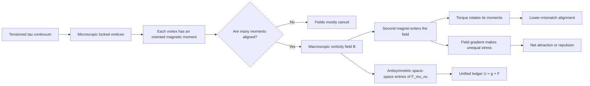

# RCCM Magnets

This document explains magnetic attraction from inside the proposed world of
*Refractive Cosmology and Continuum Mechanics* (RCCM).

Its first job is to make the model spatially inhabitable. Its second is to
connect that picture to RCCM's matrix language. Unless a sentence explicitly
says otherwise, “magnetism is fluid twist” means “RCCM proposes that magnetism
is fluid twist.”

## One-sentence model

> In RCCM, a magnet is a solid whose microscopic locked vortices have become
> coherently oriented; their individual transverse twists add into a
> macroscopic vorticity terrain, and another magnet rotates and moves toward
> the orientation and location that reduce the shared continuum's shear and
> pressure-energy imbalance.

The shortest route is:

```text
particle = locked microscopic circulation
-> circulation has an oriented axis and magnetic moment
-> many moments align inside a solid
-> their transverse tau-fluid twists reinforce
-> a macroscopic magnetic field appears
-> another locked vortex feels torque in that twist
-> a nonuniform twist also creates a net force
-> magnets rotate, attract, or repel
```

## The field



### Terrain objects

| Object | Place in the RCCM model | Source hold |
|---|---|---|
| **Microscopic vortex** | Locked circulation associated with a particle's spin | [Fluid Circulation and Spin, lines 2587–2623](RCCM-Condensed.tex#L2587-L2623) |
| **Magnetic moment** | Oriented rotational response carried by a locked vortex | [Kinematic Charge and Magnetic Moment, lines 3470–3524](RCCM-Condensed.tex#L3470-L3524) |
| **Magnetic field \(\mathbf B\)** | Spatial curl or vorticity of the transverse continuum state | [EM Kinematics, lines 3135–3149](RCCM-Condensed.tex#L3135-L3149) |
| **Magnetic domain** | A region where many microscopic vortex axes reinforce rather than cancel | [“What is Electro Magnetism?”, lines 23–27](<Refractive-Continuum-transcripts/20260408 - What is Electro Magnetism？ [w01mQlSCG10].txt#L23-L27>) |
| **Torque** | Tendency of a locked vortex axis to align with the surrounding twist terrain | [“What is Electro Magnetism?”, lines 21–25](<Refractive-Continuum-transcripts/20260408 - What is Electro Magnetism？ [w01mQlSCG10].txt#L21-L25>) |
| **Magnetic force** | Net motion caused by a spatial gradient in that terrain | [“What is Electro Magnetism?”, lines 21–23](<Refractive-Continuum-transcripts/20260408 - What is Electro Magnetism？ [w01mQlSCG10].txt#L21-L23>) |
| **Faraday tensor \(F_{\mu\nu}\)** | Antisymmetric ledger containing electric and magnetic shear | [Faraday Matrix, lines 3241–3258](RCCM-Condensed.tex#L3241-L3258) |
| **Unified tensor \(U_{\mu\nu}\)** | RCCM's proposed combined ledger \(g_{\mu\nu}+F_{\mu\nu}\) | [Unified Non-Symmetric Field Tensor, lines 3764–3780](RCCM-Condensed.tex#L3764-L3780) |

## First hold: three different movements

Magnetism becomes slippery when three movements are collapsed into one.

| Movement | What changes | What it can do |
|---|---|---|
| **Internal circulation** | Tau fluid loops around a particle boundary | Gives the particle an oriented spin/moment |
| **Rotation of a magnet** | The magnet changes its orientation in space | Lines its moment up with the ambient magnetic terrain |
| **Translation of a magnet** | The magnet's center moves from one place to another | Produces attraction or repulsion |

The first supplies the microscopic source. The second is **torque**. The third
is **force**.

A magnetic field can therefore make a compass needle turn even when it does
not pull the compass bodily across the table. Translation needs something
more: the field must differ from one side of the object to the other.

```text
uniform magnetic terrain
-> equal-strength influence across the dipole
-> rotation can remain
-> net translation can cancel

gradient in magnetic terrain
-> one end or side couples more strongly
-> stresses do not cancel
-> net translation
```

This is the same conceptual hold discovered in the gravity guide:

> A field value describes the local state; a field gradient supplies a
> direction for translational force.

## The mental movie

### 1. Begin with one particle

RCCM models a fundamental matter boundary as a persistent loop of tau-fluid
circulation. The circulating state has an axis:

```text
       axis / moment
            ↑
         ↗     ↖
       ↗   ⟳   ↖
         ↘     ↙
```

The loop does not have to be a literal flat smoke ring. The useful feature is
that its circulation has:

- an amount;
- a handedness;
- an axis; and
- a stable orientation constraint.

RCCM calls the localized circulation quantum spin and associates its coupling
to transverse continuum shear with a magnetic moment. The condensed paper
writes a continuum analogue of the Bohr magneton:

\[
\mu_{B\tau}=\frac{e_\tau\hbar}{2m}
\]

See [The Kinematic Origin of Charge and the Magnetic Anomaly, lines
3470–3524](RCCM-Condensed.tex#L3470-L3524).

### 2. Put many particles inside an ordinary solid

If the microscopic axes point in many directions, their external twists
mostly cancel:

```text
↑  ↙  →  ↖  ↓  ↗  ←
       summed field ≈ small
```

If many axes align, their twists reinforce:

```text
→  →  →  →  →  →  →
       summed field = large
```

That coherent region is the RCCM picture of a magnetic domain. A permanent
magnet is a solid in which enough such domains remain mutually aligned to
maintain a large external twist terrain.

The April electromagnetism transcript describes magnetization as microscopic
electron-vortices precessing into a unified alignment and connects a change in
that alignment to macroscopic mechanical rotation in the Einstein–de Haas
effect. See [lines 23–27](<Refractive-Continuum-transcripts/20260408 - What is Electro Magnetism？ [w01mQlSCG10].txt#L23-L27>).

### 3. The aligned solid shapes the surrounding continuum

The aligned internal rotations impose an organized transverse twist on the
surrounding tau continuum. RCCM names that macroscopic spatial vorticity the
magnetic field:

\[
\mathbf B=\nabla\times\mathbf A_\perp
\]

Spatially:

```text
A_perp = the local transverse state
curl A_perp = how that state twists around the point
B = the axis and strength of that local twist
```

The curl is not a claim that fluid disappears into the magnet. It measures
local turning, not local loss:

\[
\nabla\cdot\mathbf B
=\nabla\cdot(\nabla\times\mathbf A_\perp)
=0
\]

RCCM uses this identity to explain why magnetic field paths do not terminate
at isolated magnetic charges. See [EM Kinematics, lines
3140–3149](RCCM-Condensed.tex#L3140-L3149).

### 4. Place a second microscopic vortex in the terrain

The second locked vortex already has its own circulation axis. The background
twist can meet it in two broad ways:

```text
aligned locally       opposed locally
twist fits twist      twist fights twist
less mismatch         more mismatch
```

The field applies a torque that tends to reduce the mismatch. Conventional
notation packages that orientation energy as:

\[
U=-\boldsymbol\mu\cdot\mathbf B
\]

where:

- \(\boldsymbol\mu\) is the particle or magnet's oriented moment;
- \(\mathbf B\) is the surrounding magnetic terrain; and
- the dot product measures alignment.

The corresponding turning tendency is:

\[
\boldsymbol\tau=\boldsymbol\mu\times\mathbf B
\]

These equations are the conventional symbolic export of the RCCM spatial
story: a locked circulation axis is turned by ambient continuum vorticity.
The April transcript says this in words when it describes microscopic
vortices precessing into unified alignment.

### 5. A gradient converts orientation stress into attraction

Suppose the ambient twist is stronger on the near side of the second magnet
than on its far side. The near-side microscopic vortices couple more strongly.
The distributed forces no longer cancel.

For a fixed magnetic moment, the conventional compact rule is:

\[
\mathbf F=\nabla(\boldsymbol\mu\cdot\mathbf B)
\]

From the RCCM point of view:

```text
spatially uneven tau-fluid twist
-> spatially uneven coupling to locked circulation
-> uneven shear/pressure stress across the boundary
-> net force toward or away from the stronger-coupling region
```

The source transcript calls an inhomogeneous magnetic field a macroscopic
pressure gradient and says the force on a vortex is determined by its magnetic
moment and the gradient of transverse shear. See [“What is Electro
Magnetism?”, lines 19–23](<Refractive-Continuum-transcripts/20260408 - What is Electro Magnetism？ [w01mQlSCG10].txt#L19-L23>).

This is the missing step between:

```text
“the medium is twisting here”
```

and:

```text
“the magnet moves this way”
```

## Why opposite poles attract

### A pole is an end-label, not an isolated substance

RCCM inherits the no-monopole topology encoded by
\(\nabla\cdot\mathbf B=0\). A bar magnet's north and south poles are therefore
not two separately existing magnetic charges. They are the two exposed ends
of one continuous dipolar twist pattern.

```text
outside the magnet:  N ─────────→ S
inside the magnet:   S ─────────→ N
                     closed field route
```

The arrows are field direction, not necessarily parcel trajectories. They
mark the orientation of the local vorticity terrain.

### Opposite facing poles

When north faces south, the two dipole moments are parallel and the gap fields
join co-directionally:

```text
[ S —— N ]   [ S —— N ]
          →→→
      smoother shared route
```

Inside RCCM's mechanical picture:

1. the transverse twists reinforce smoothly in the gap;
2. the shared configuration reduces mismatch or interaction stress;
3. the pressure/energy terrain is lower as the gap shrinks; and
4. the surrounding continuum pushes the magnets toward that configuration.

The attraction is not a rope running from north to south. It is the net result
of distributed continuum stress over both magnet surfaces.

### Like facing poles

When north faces north, the dipole moments are antiparallel and the facing
fields oppose:

```text
[ S —— N ]   [ N —— S ]
          →←
      opposed gap terrain
```

Inside the RCCM picture:

1. the local transverse patterns resist joining smoothly;
2. the mismatch raises stored shear/pressure energy in the gap;
3. distributed stresses favor increasing separation or rotating a magnet; and
4. if rotation is blocked, the remaining response is repulsion.

If rotation is allowed, one magnet often flips. That is the torque route to a
lower-mismatch configuration.

### A polarity trap

RCCM's Coulomb section says **opposite particle winding numbers** create
co-directional flow between charged defects and attraction. See [Coulomb's
Law, lines 3538–3572](RCCM-Condensed.tex#L3538-L3572).

That should not be copied word-for-word onto bar-magnet poles:

| Charged-particle language | Bar-magnet language |
|---|---|
| Charge sign labels a particle's winding chirality | North/south labels the ends of a dipole |
| Opposite charges attract | Opposite facing poles attract |
| A charge may be modeled as a source of transverse phase flux | A magnetic field remains divergence-free |
| The source derives a velocity cross-term | A bar-magnet derivation needs moment orientation and a vorticity gradient |

The mechanisms are related through transverse continuum kinematics, but the
topologies are not identical.

## The Bernoulli and field-energy bridge

RCCM explicitly derives electrostatic attraction from the cross-term that
appears when two transverse velocity fields superpose:

\[
\frac12\rho_\tau
\left|\mathbf v_1+\mathbf v_2\right|^2
=
\frac12\rho_\tau|\mathbf v_1|^2
+\frac12\rho_\tau|\mathbf v_2|^2
+\rho_\tau\,\mathbf v_1\cdot\mathbf v_2
\]

The first two terms are self-energy. The dot product is interaction energy.
RCCM then interprets co-directional gap flow as a static-pressure deficit and
opposed gap flow as stagnation/high static pressure. See [lines
3551–3590](RCCM-Condensed.tex#L3551-L3590).

The analogous magnetic bookkeeping is:

\[
\frac{1}{2\mu}
\left|\mathbf B_1+\mathbf B_2\right|^2
=
\frac{|\mathbf B_1|^2}{2\mu}
+\frac{|\mathbf B_2|^2}{2\mu}
+\frac{\mathbf B_1\cdot\mathbf B_2}{\mu}
\]

Again, the cross-term contains the interaction. Moving or rotating a magnet
changes the overlap integral of that cross-term across the whole field.
Force and torque point toward the configuration that reduces the total
interaction energy subject to the boundary constraints.

Within RCCM, this energy density is read mechanically as tau-continuum
transverse shear and its associated pressure/stress budget.

There is a sign trap here. The local quantity
\(\mathbf B_1\cdot\mathbf B_2\) can be positive in the gap between attracting
opposite poles even though the mechanical dipole potential
\(-\boldsymbol\mu\cdot\mathbf B\) decreases as they approach. A permanent
magnet is not an externally frozen field painted onto space: its internal
source energy and boundary stresses belong in the ledger too. Therefore:

```text
local B-field cross-term
!= complete mechanical interaction potential
```

Use \(-\boldsymbol\mu\cdot\mathbf B\), its spatial gradient, or the integrated
surface stress to determine magnet motion. The squared-field expansion shows
where interaction terms enter; it does not by itself settle the force
direction by inspecting one patch of the gap.

### Direct source versus reconstructed bridge

The source directly supplies:

- magnetic field as continuum vorticity;
- magnetic moment as an oriented property of locked particle circulation;
- domain alignment as aligned microscopic vortices;
- inhomogeneous magnetic field as a pressure/shear gradient;
- force as magnetic moment times a gradient of transverse shear; and
- electromagnetism as the antisymmetric sector of a unified tensor.

The condensed TeX does **not** give a dedicated surface-stress derivation for
two finite bar magnets. The pole-to-pole movie above is therefore a
reconstruction using those stated RCCM identifications plus the conventional
dipole energy and force laws. This is the smallest bridge that closes the
model without pretending the missing derivation is already on the page.

## Yes: it is a different part of the same matrix

Your matrix intuition is basically right.

### Start with a local deformation ledger

Imagine standing at one point in the tau continuum and asking:

> If I move a tiny step along axis \(j\), how does the continuum's component
> along axis \(i\) change?

Those directional changes form a matrix. Swapping \(i\) and \(j\) separates
two spatial behaviors:

\[
L_{ij}=\partial_j u_i
\]

\[
\underbrace{\frac12(L+L^\mathsf T)}_{\text{symmetric}}
\qquad+\qquad
\underbrace{\frac12(L-L^\mathsf T)}_{\text{antisymmetric}}
\]

| Sector | Swap the axes | Spatial feel | RCCM placement |
|---|---|---|---|
| **Symmetric** | Value stays the same | stretch, squeeze, volume/shape strain | gravity/metric terrain |
| **Antisymmetric** | Sign reverses | local rigid turning or vorticity | electromagnetic rotational terrain |

The antisymmetric sector has zero diagonal because a number cannot be both
equal to and the negative of itself unless it is zero:

\[
A_{ii}=-A_{ii}\implies A_{ii}=0
\]

That is why magnetic components naturally occupy paired off-diagonal slots.

RCCM often uses **transverse shear** as an umbrella phrase. The matrix split
gives that phrase two sharper shapes:

| Shape | Matrix signature | Motion |
|---|---|---|
| Symmetric off-diagonal shear | \(D_{ij}=D_{ji}\) | A tiny square becomes a diamond without locally rotating as a whole |
| Antisymmetric rotation | \(W_{ij}=-W_{ji}\) | A tiny square turns while retaining its shape |

The paper's specific identification of magnetism is the second shape:
antisymmetric spatial vorticity. Keeping these shapes separate prevents
“shear” from hiding which matrix object is actually in use.

### RCCM's electromagnetic matrix

RCCM identifies the Faraday tensor with a macroscopic vorticity tensor:

\[
F_{\mu\nu}
=
\partial_\mu u_\nu-\partial_\nu u_\mu
\]

and writes:

\[
F^{\mu\nu}=
\begin{bmatrix}
0 & -E_x/c & -E_y/c & -E_z/c\\
E_x/c & 0 & -B_z & B_y\\
E_y/c & B_z & 0 & -B_x\\
E_z/c & -B_y & B_x & 0
\end{bmatrix}
\]

Read the terrain like this:

| Matrix region | RCCM interpretation |
|---|---|
| Time–space pairs \(F_{0i},F_{i0}\) | Electric field: rate of transverse sliding/strain |
| Space–space pairs \(F_{ij},F_{ji}\) | Magnetic field: spatial curling/vorticity |
| Paired opposite signs | Rotation reverses sign when the ordered plane is reversed |
| Zero diagonal | Pure antisymmetric rotation contains no same-axis component |

The component placement is spatially meaningful:

| Magnetic component | Matrix plane | Mental motion |
|---|---|---|
| \(B_x\) | \(y\)-\(z\) pair | Rotation in the \(y\)-\(z\) plane, around the \(x\)-axis |
| \(B_y\) | \(z\)-\(x\) pair | Rotation in the \(z\)-\(x\) plane, around the \(y\)-axis |
| \(B_z\) | \(x\)-\(y\) pair | Rotation in the \(x\)-\(y\) plane, around the \(z\)-axis |

That is why \(B_z\), for example, appears in the \(xy\) and \(yx\) slots
rather than the \(zz\) slot. The component names the **axis** of rotation; the
matrix pair names the **plane** doing the rotating.

See [The Macroscopic Vorticity Tensor, lines
3241–3258](RCCM-Condensed.tex#L3241-L3258).

### RCCM's combined matrix

The paper then proposes:

\[
U_{\mu\nu}=g_{\mu\nu}+F_{\mu\nu}
\]

\[
U_{\mu\nu}=
\begin{bmatrix}
-\alpha_s^2 & -E_1/c & -E_2/c & -E_3/c\\
E_1/c & \alpha_s^{-2} & -B_3 & B_2\\
E_2/c & B_3 & g_{22} & -B_1\\
E_3/c & -B_2 & B_1 & g_{33}
\end{bmatrix}
\]

The intended map is:

```text
symmetric metric/compliance sector
-> longitudinal and volumetric terrain
-> gravity

antisymmetric time-space sector
-> changing transverse slide
-> electricity

antisymmetric space-space sector
-> transverse spatial curl
-> magnetism
```

See [Tensor Evolution and Geometric Bending, lines
3741–3780](RCCM-Condensed.tex#L3741-L3780) and the later [Unified Spacetime
Tensor transcript, lines 13–21](<Refractive-Continuum-transcripts/20260728 - The Unified Spacetime Tensor [XGbbxJh6vL8].txt#L13-L21>).

So “a different part of the same matrix math” can be made precise:

1. **Decompose by transpose:** symmetric and antisymmetric sectors.
2. **Project by index-pair:** time–space entries yield \(\mathbf E\);
   space–space entries yield \(\mathbf B\).
3. **Transform coordinates:** the numerical entries can change when the
   observer rotates their axes, while the underlying tensorial state remains
   the same object.

It is a decomposition and projection of one ledger, not one physical
substance being converted into unrelated numbers.

### The matrix is a ledger, not the hand doing the pushing

This is the most important guardrail:

```text
matrix slot
!= force mechanism
```

The tensor records which oriented plane is strained or rotating and how that
state transforms when coordinates change. Attraction appears only after the
field:

1. is sourced by matter;
2. varies across space;
3. couples to another matter boundary; and
4. produces an unbalanced stress or an energy gradient.

In TypeScript language, the tensor is a structured value. The equations of
motion are the functions that consume it.

## TypeScript export

```ts
type Vec3 = readonly [x: number, y: number, z: number]
type Mat4 = readonly [
  readonly [number, number, number, number],
  readonly [number, number, number, number],
  readonly [number, number, number, number],
  readonly [number, number, number, number],
]

type Brand<T, Name extends string> = T & {
  readonly __brand: Name
}

type MagneticField = Brand<Vec3, "MagneticField">
type MagneticMoment = Brand<Vec3, "MagneticMoment">
type Force = Brand<Vec3, "Force">
type Torque = Brand<Vec3, "Torque">

declare function curl(
  transverseState: (position: Vec3) => Vec3,
): (position: Vec3) => MagneticField

declare function gradientOfMomentFieldCoupling(
  moment: MagneticMoment,
  field: (position: Vec3) => MagneticField,
): (position: Vec3) => Force

declare function crossMomentWithField(
  moment: MagneticMoment,
  field: MagneticField,
): Torque
```

The type boundaries preserve the terrain:

```text
MagneticField
!= Force

MagneticMoment × MagneticField
-> Torque

gradient(MagneticMoment · MagneticField)
-> Force
```

A compiler should reject “the magnet moves because \(B\) exists” as missing a
coupling and, for translation, missing a gradient.

The matrix decomposition has equally useful invariants:

```ts
const transpose = (m: Mat4): Mat4 => /* swap row and column */ m

const symmetricPart = (m: Mat4): Mat4 =>
  scale(add(m, transpose(m)), 0.5)

const antisymmetricPart = (m: Mat4): Mat4 =>
  scale(subtract(m, transpose(m)), 0.5)

// Property tests:
// transpose(symmetricPart(m)) === symmetricPart(m)
// transpose(antisymmetricPart(m)) === negate(antisymmetricPart(m))
// diagonal(antisymmetricPart(m)) === [0, 0, 0, 0]
// add(symmetricPart(m), antisymmetricPart(m)) === m
```

Here `g` and `F` are not unrelated matrices taped together. They are intended
as orthogonal projections of one local continuum-state ledger:

```ts
type UnifiedTauState = {
  readonly symmetric: GravityMetricSector
  readonly antisymmetric: ElectromagneticSector
}
```

That is the cleanest TypeScript-shaped version of RCCM's unification claim.

## Gravity versus magnetic attraction

| Question | RCCM gravity | RCCM magnetism |
|---|---|---|
| Basic terrain | Static pressure/compliance basin | Oriented transverse twist/vorticity |
| Microscopic source | Stable cavitated circulation and its pressure deficit | Stable circulation axis leaking/coupling into transverse shear |
| Mathematical sector | Symmetric metric/compression sector | Antisymmetric electromagnetic sector |
| Scalar or oriented? | Primarily scalar terrain whose gradient supplies direction | Intrinsically oriented axial/vector terrain |
| What happens to a probe? | All matter is pushed down the pressure gradient | A magnetic moment first torques toward alignment |
| What produces translation? | Pressure gradient across the probe | Gradient of moment–field coupling / unequal shear stress |
| Can it repel? | Ordinary positive mass is presented as universally attractive | Yes; orientation can produce attraction, repulsion, or rotation |

Both are motions caused by stress gradients in one medium. They differ in the
kind of deformation and in what property of matter couples to it.

## Electricity versus magnetism

RCCM puts electricity and magnetism inside the same antisymmetric Faraday
sector but on different coordinate planes:

| Field | RCCM terrain | Matrix location |
|---|---|---|
| Electric \(\mathbf E\) | Temporal rate of transverse sliding/strain | Time–space off-diagonals |
| Magnetic \(\mathbf B\) | Spatial curl of transverse state | Space–space off-diagonals |

They are therefore not two fluids and not two independent substances. They
are two views of how the same transverse deformation varies:

```text
change across time
-> electric component

turning across space
-> magnetic component
```

RCCM derives:

\[
\nabla\times\mathbf E=-\frac{\partial\mathbf B}{\partial t}
\]

by defining
\(\mathbf E=-\partial_t\mathbf A_\perp\) and
\(\mathbf B=\nabla\times\mathbf A_\perp\). See [EM Kinematics, lines
3140–3150](RCCM-Condensed.tex#L3140-L3150).

## Source route

Read in this order:

1. [“What is Electro Magnetism?”, lines
   13–27](<Refractive-Continuum-transcripts/20260408 - What is Electro Magnetism？ [w01mQlSCG10].txt#L13-L27>)  
   The clearest spatial story: locked vortices, Bernoulli pressure, Magnus
   force, magnetic moment, domain alignment, and continuum strain contours.

2. [Fluid Circulation and Spin, lines
   2587–2649](RCCM-Condensed.tex#L2587-L2649)  
   Places the persistent microscopic circulation and its oriented angular
   momentum.

3. [EM Kinematics and the LC-Acoustic Isomorphism, lines
   3135–3258](RCCM-Condensed.tex#L3135-L3258)  
   Defines \(\mathbf B\) as curl, derives two Maxwell identities, and places
   magnetic components in the Faraday matrix.

4. [The Kinematic Origin of Charge and the Magnetic Anomaly, lines
   3470–3533](RCCM-Condensed.tex#L3470-L3533)  
   Connects localized rotation, transverse shear, charge, and magnetic moment.

5. [Coulomb's Law, lines
   3538–3615](RCCM-Condensed.tex#L3538-L3615)  
   Supplies RCCM's explicit pressure cross-term account of attraction and
   repulsion. Use it as the nearby interaction mechanism, while preserving the
   distinction between charge chirality and magnetic dipole polarity.

6. [The Faraday and Unified Tensors, lines
   3741–3780](RCCM-Condensed.tex#L3741-L3780)  
   Shows exactly how RCCM places gravity, electricity, and magnetism in one
   nonsymmetric matrix.

7. [“The Unified Spacetime Tensor,” lines
   13–21](<Refractive-Continuum-transcripts/20260728 - The Unified Spacetime Tensor [XGbbxJh6vL8].txt#L13-L21>)  
   Gives the later “closed mechanical capacity ledger” interpretation.

## Current internal gaps

Assuming RCCM's ontology for the sake of learning does not require inventing
steps the document has not yet supplied. A complete RCCM bar-magnet
derivation would still need to make these bridges explicit:

| Gap | Needed mark |
|---|---|
| Microscopic moments to a finite magnet | A domain/lattice coarse-graining rule that produces \(\mathbf M(\mathbf x)\) |
| Magnetization to external vorticity | Boundary conditions yielding the dipole-shaped \(\mathbf B(\mathbf x)\) |
| Vorticity to surface traction | A tau-fluid stress tensor whose integral gives measured magnetic force and torque |
| Two finite magnets | A volume or surface integral recovering orientation-, shape-, and distance-dependent forces |
| Uniform versus gradient field | An explicit demonstration that torque can remain while net translational force cancels |
| Dissipation and hysteresis | A constitutive account of domain pinning, remanence, coercivity, and heating |

These are not reasons to abandon the picture. They are the exact interfaces
that must be implemented before the picture becomes an executable mechanical
model.

## A play route

### Physical play

Use two bar magnets with their top faces marked by arrows from south to north.

1. Hold them several centimeters apart with arrows parallel.
2. Bring the north end of one toward the south end of the other.
3. Feel attraction while keeping the moment arrows parallel.
4. Reverse one magnet so two north ends face.
5. Feel the repulsion and then loosen your grip enough to feel the torque that
   wants to flip it.
6. Move one magnet sideways and feel how both force and preferred orientation
   change with position.

The mark is not merely “opposites attract.” It is:

```text
configuration
-> local field orientation
-> torque
-> field-strength gradient
-> translation
```

### TypeScript play

The next useful simulation should render:

- two draggable dipoles;
- the vector field \(\mathbf B(\mathbf x)\);
- field-energy density as a heatmap;
- a torque arrow on each dipole;
- a force arrow from the spatial energy gradient;
- a toggle between fixed and freely rotating orientation; and
- the antisymmetric \(4\times4\) matrix at the cursor.

The decisive interaction is:

```text
lock rotation
-> like poles can remain facing
-> repulsive translation is visible

unlock rotation
-> torque flips one dipole
-> attractive alignment becomes reachable
```

That playground would connect the hand-feel of magnets, the field terrain, and
the matrix ledger without asking the matrix to do conceptual work it does not
do.

## Return

When the picture becomes muddy, return to these five holds:

1. **A particle supplies locked circulation.**
2. **A magnet is many circulation axes coherently aligned.**
3. **\(\mathbf B\) names spatial curl, not inward fluid consumption.**
4. **A field can create torque; translational attraction needs a gradient.**
5. **The antisymmetric matrix records oriented shear; the stress/energy
   gradient produces motion.**

Compactly:

```text
spin is the microscopic twist
magnetization is coherent twist
B is the surrounding twist terrain
torque aligns a twist
a gradient moves the aligned twist
the Faraday matrix records the terrain
```
